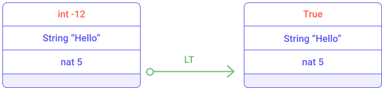
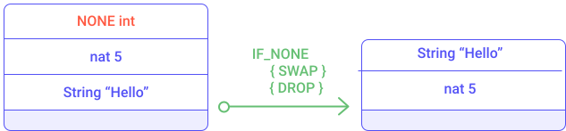
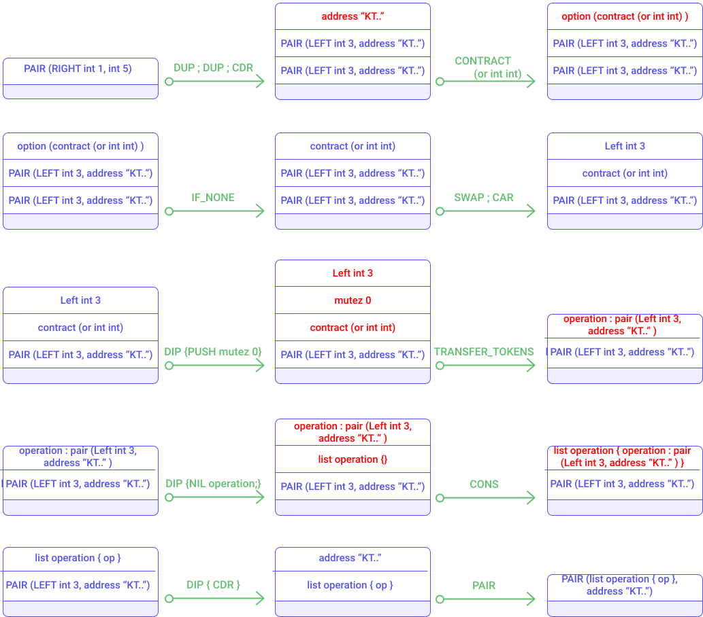

As seen previously, a Tezos smart contract defines a storage, entry points and the code. The code of a smart contract is a sequence of Michelson instructions.

Since the Michelson language is in perpetual evolution, it is recommended to visit the [Michelson Reference page](https://tezos.gitlab.io/007/michelson.html)

The main instructions are described in the next sections.

### Control structures

Michelson is a turing-complete language and thus provides basic control flow instructions.

#### Sequence {}

The Sequence structure is defined by `{` and `}` and contains instructions separated by `;` (semi-colon).

```
{ instruction1 ; instruction2 ; ... ; instruction n}
```

When executing a sequence the interpreter executes sequentially each instructions, one after another in the specified order.

However this sequence may stop.

#### FAILWITH

The `FAILWITH` instruction aborts the execution of the Michelson script by throwing an exception.

It takes a string message as parameter. It is allowed to throw an exception without message by specifying the `UNIT` value.

The `FAIL` keyword has been provided as replacement for `UNIT; FAILWITH`.

Actually the `FAIL` keyword is not an instruction but a syntactic sugar (i.e. a "shortcut" instruction that combines many basic instructions of the language).

A `FAILWITH` instruction represents the way to reject a transaction by stopping the execution of related instructions.

#### IF {} {}

The `IF` instruction allows to create branches of execution (also called conditional branching).

The `IF` instruction takes two sequences as parameters. It expects a boolean at the top element of the stack. It consumes the top element and executes the first given sequence if this boolean-top element is True. Otherwise it executes the second sequence.

The Michelson grammar defines the `IF` instruction as:
```
IF bt bf / True : S  =>  bt / S
IF bt bf / False : S  =>  bf / S
```

Here is an example of an `IF` instruction which inverts the position of two elements of the stack if the condition is _False_, otherwise it throws an exception. We will see in that inverting position of two element is done with the `SWAP` instruction.


*Execution of `IF { FAIL } { SWAP }`*

#### LOOP {}

The `LOOP` instruction is a generic loop, meaning it is a repeatable pattern. It applies a sequence of instructions, many times until a condition is reached. 

The `LOOP` instruction allows to iterate on a composite structure (list, set, map, big_map) and apply a process to all elements sequentially.

The Michelson grammar defines the `LOOP` instruction as:

```
LOOP body / True : S  =>  body ; LOOP body / S
LOOP body / False : S  =>  S
```

#### LOOP_LEFT (loop with accumulator)

Like the `LOOP` instruction, the `LOOP_LEFT` is a generic loop that handles an accumulator usually used for aggregating data during a repetitive process. 

The Michelson grammar defines the `LOOP_LEFT` instruction as:

```
LOOP_LEFT body / (Left a) : S  =>  body ; LOOP_LEFT body / a : S
LOOP_LEFT body / (Right b) : S  =>  b : S
```

LOOP_LEFT requires a `union` of a given parameter and an accumulator. If the left part of the `union` is initialized the process is repeated, otherwise if the right part is initialized then the process is stopped and the accumulator is returned.

Two examples (#4 and #5) in the _Examples_ section describe in detail the `LOOP_LEFT` instruction usage.


#### EXEC

The `EXEC` instruction executes a function from the stack.

The `EXEC` instruction consumes a function and its related input parameters on top of the stack. The `EXEC` instruction produces the expected function output on the top of the stack.

```
EXEC / a : f : S  =>  r : S
    where f / a : []  =>  r : []
```

Here is an example of smart contract that defines a function with the `LAMBDA` instruction and executes the function with the `EXEC` instruction.

```
parameter int ;
storage int ;
code { CAR ;
       LAMBDA int int { PUSH int 1 ; ADD } ;
       SWAP ;
       EXEC ;
       NIL operation ;
       PAIR }
```

Notice that the code of the lambda function is just to increment a given integer by 1.

The execution of this smart contract is described in the "example" section.

#### APPLY

The `APPLY 'a` instruction partially applies a _tuplified_ function from the stack (i.e. arguments are grouped in pairs or nested pairs). It is parameterized by a type `'a`. Values that are not both push-able and storable (i.e. values of type _operation_, _contract_ and _big map_) cannot be captured by _APPLY_ (cannot appear in parameter `'a`).

The instruction produces a new function that is only partially resolved. For example, if a function takes 2 arguments, it is possible to provide one argument and to use the `APPLY` instruction to produce an equivalent partially-resolved function which takes one argument.

The Michelson grammar defines the `APPLY` instruction as:
```  
:: 'a : lambda (pair 'a 'b) 'c : 'C   ->   lambda 'b 'c : 'C
```

```
APPLY / a : f : S  => { PUSH 'a a ; PAIR ; f } : S
```

For example, let's consider a lambda function (called _additionAB_) that takes a pair of _nat_ and returns a _nat_. It computes the addition of two numbers.
``` 
LAMBDA (pair nat nat) nat { ADD }
```

Notice that the function is tuplified.


The `APPLY` instruction allows to form a new lambda function (called _addition2B_) which takes a single _nat_ as argument and returns a _nat_. This function would increment a given _nat_ by two. 

The resulting function _addition2B_ is equivalent to:
```
LAMBDA nat nat { PUSH nat 2 ; ADD }
```

### Stack operations

Some generic operators allow to manipulate elements in a stack; such as moving an element inside the stack, moving, copying and removing elements from the stack. 

#### PUSH instruction

The `PUSH` instruction allows to place an element on top of the stack.

It requires to specify the type of the pushed element.


*Illustration of the `PUSH` instruction*

#### UNIT instruction

The `UNIT` instruction pushes a `Unit` value on top of the stack.

The `Unit` value represents no value.

#### DROP instruction

The `DROP` instruction removes the top element of the stack


*Illustration of the `DROP` instruction*

#### SWAP instruction

The `SWAP` instruction inverts the position of the top two element of the stack.


*Illustration of the `SWAP` instruction*

#### DUP instruction

The `DUP` instruction duplicates the top element of the stack


*Illustration of the `DUP` instruction*

#### DIG instruction

The `DIG` instruction moves the n-th element of the stack on top of the stack.


*Illustration of the `DIG` instruction*


#### DUG instruction

The `DUG` instruction moves the top element of the stack to the n-th element of the stack.


*Illustration of the `DUG` instruction*


#### DIP instruction

The `DIP` instruction takes as parameters:
- _n_: a number of elements to protect
- _code_: a sequence of instructions to execute

It runs the provided sequence of instruction while protecting the _n_ top elements of the stack.

The mMichelson grammar defines `DIP` as:
```
DIP n code / x{1} : ... : x{n} : S  =>  x{1} : ... : x{n} : S'
    where    code / S  =>  S'
```

There is a special case when n = 1. An alias (shortcut) is available for this case, the `DIP code` instruction is equivalent to `DIP 1 code`.

Also notice that `DIP 0 code` is equivalent to `code`


*Illustration of the `DIP` instruction*

#### LAMBDA

The LAMBDA instruction pushes a function on top of the stack.

It requires three parameters:
- the type of the given parameter
- the type returned by the function
- the sequence of instructions associated with the function (code of the function)

```
LAMBDA _ _ code / S  =>  code : S
```
Notice that "_" represents any type. So, a lambda takes and returns arguments that can be of any type.

Here is an example of a smart contract that defines a function with the `LAMBDA` instruction and executes the function with the `EXEC` instruction.

```
parameter int ;
storage int ;
code { CAR ;
       LAMBDA int int { PUSH int 1 ; ADD } ;
       SWAP ;
       EXEC ;
       NIL operation ;
       PAIR }
```

The lambda function is just incrementing a given int.

The execution of this smart contract is described in the example section.

### Generic comparison

#### COMPARE

This instruction compares the top two elements of the stack.

The COMPARE instruction returns -1 if the first element is smaller than the second one. It returns 0 if the two first elements are equal. Otherwise it returns 1.

The Michelson grammar defines `COMPARE` as:
```
COMPARE / x : y : S  =>  -1 : S
    iff x < y
COMPARE / x : y : S  =>  0 : S
    iff x = y
COMPARE / x : y : S  =>  1 : S
    iff x > y
```

Here is an example of comparison between two natural integers:


*Illustration of the `COMPARE` instruction*

#### EQ

The top element is replaced by _True_ if this element is zero, otherwise by _False_. 

```
EQ / 0 : S  =>  True : S
EQ / v : S  =>  False : S
    iff v <> 0
```

Here is an example:


*Illustration of the `EQ` instruction*

#### LT

The top element is replaced by _True_ if this element is lower than zero, otherwise by _False_. 

```
LT / v : S  =>  True : S
    iff  v < 0
LT / v : S  =>  False : S
    iff v >= 0
```

Here is an example:


*Illustration of the `LT` instruction*


#### GE

The top element is replaced by _True_ if this element is greater or equal to zero, otherwise by _False_. 

```
GE / v : S  =>  True : S
    iff  v >= 0
GE / v : S  =>  False : S
    iff v < 0
```

Here is an example:


*Illustration of the `GE` instruction*

### Operations on bool

#### OR

The `OR` instruction consumes the two top elements of the stack and computes a logical _OR_ of the two elements.


*Illustration of the `OR` instruction*

The `OR` instruction requires boolean elements.

#### AND

The `AND` instruction consumes the two top elements of the stack and computes a logical _AND_ of the two elements.


*Illustration of the `AND` instruction*

The `AND` instruction requires boolean elements.

#### XOR

The `XOR` instruction consumes the two top elements of the stack and computes an exclusive logical OR of the two elements.


*Illustration of the `XOR` instruction*

The `XOR` instruction requires boolean elements.

#### NOT

The `NOT` instruction consumes a boolean top element of the stack and push the logical inverse of the given boolean.  

### Operations on numbers

#### ADD

The `ADD` instruction computes additions on nat, int and mutez.


*Illustration of the `ADD` instruction*

#### SUB

The `SUB` instruction computes subtractions on nat, int and mutez.

Notice that subtraction of two natural integers produces an integer.


*Illustration of the `SUB` instruction*

#### MUL

The `MUL` instruction computes multiplications on nat and int.

```
MUL / x : y : S  =>  (x * y) : S
```


*Illustration of the `MUL` instruction*

Notice that the multiplication of two natural integers produces a natural integer.

#### EDIV

The `EDIV` instruction computes divisions on nat and mutez.

If the divisor is equal to zero then it returns an optional type with an assigned value None. Otherwise it apply the Euclidean division and return a optional type with value (Pair quotient remainder)

The michelson grammar defines `EDIV` as:
```
EDIV / x : 0 : S  =>  None
EDIV / x : y : S  =>  Some (Pair (x / y) (x % y)) : S
    iff y <> 0
```


*Illustration of the `EDIV` instruction*


### Operations on strings

Strings are mostly used for naming things without having to rely on external ID databases. They are restricted to the printable subset of 7-bit ASCII, plus some escaped characters (see section on constants). We can use string constants as is, concatenate or splice them, and use them as keys.

#### CONCAT

The `CONCAT` instruction concatenates strings. It consumes the top element and produces a string (concatenation of the top element and the given string parameter) placed at top of the stack.

It takes one parameter which can be a single string or a list of strings. 

```
CONCAT / s : t : S  =>  (s ^ t) : S

CONCAT / {} : S  =>  "" : S
CONCAT / { s ; <ss> } : S  =>  (s ^ r) : S
   where CONCAT / { <ss> } : S  =>  r : S
```

#### SIZE

The `SIZE` instruction consumes a string of the top of the stack and pushes the number of characters contained by the string element.

#### SLICE

The `SLICE` instruction provides a way to retrieve a part of a string.
It takes three parameters:
- an `offset` parameter indicating the beginning of the substring 
- an `length` parameter indicating the size of the substring
- a `string` to slice

It returns an optional string because the given offset may be out of bound.

```
SLICE / offset : length : s : S  =>  Some ss : S
   where ss is the substring of s at the given offset and of the given length
     iff offset and (offset + length) are in bounds
SLICE / offset : length : s : S  =>  None  : S
     iff offset or (offset + length) are out of bounds
```


*Illustration of the `SLICE` instruction*


#### COMPARE with strings

The `COMPARE` instruction allows to compare two strings. It consumes the top two elements of the stack and pushes an integer on top. If the first element is lexically greater than the second then, it returns 1. If the first element is lexically equal to the second element, then it returns 0. If the first element is lexically smaller than the second element, then it returns -1.

```
COMPARE / s : t : S  =>  -1 : S
    iff s < t
COMPARE / s : t : S  =>  0 : S
    iff s = t
COMPARE / s : t : S  =>  1 : S
    iff s > t
```

### Operations on pairs

#### PAIR

The PAIR instruction consumes the top two elements of the stack and creates a pair with these two elements.

```
PAIR / a : b : S  =>  (Pair a b) : S
```


*Illustration of the `PAIR` instruction*

#### CAR

The CAR instruction consumes the top element of the stack (which must be a `PAIR`) and pushes on top the left part of the pair.

```
CAR / (Pair a _) : S  =>  a : S
```


*Illustration of the `CAR` instruction*

#### CDR

The `CDR` instruction consumes the top element of the stack (which must be a `PAIR`) and pushes on top element the right part of the pair.

```
CDR / (Pair _ b) : S  =>  b : S
```


*Illustration of the `CDR` instruction*

#### COMPARE on pairs

The `COMPARE` instruction computes a lexicographic comparison. Like the generic comparison it consumes the top two elements of the stack and returns an integer (-1, 0 ,1). 

The `COMPARE` instruction executes the comparison on both (left and right) part of a _pair_. It starts with comparing left parts and if the result is 0 (i.e. left parts are equal) then the comparison is done on the right part of the pair.

```
> COMPARE / (Pair sa sb) : (Pair ta tb) : S  =>  -1 : S
    iff COMPARE / sa : ta : S => -1 : S
> COMPARE / (Pair sa sb) : (Pair ta tb) : S  =>  1 : S
    iff COMPARE / sa : ta : S => 1 : S
> COMPARE / (Pair sa sb) : (Pair ta tb) : S  =>  r : S
    iff COMPARE / sa : ta : S => 0 : S
        COMPARE / sb : tb : S => r : S
```

### Operations on sets

The `SET` data structure is an ordered list of elements. Therefore a value in a set can only appear just once.

#### EMPTY_SET 'elt

The `EMPTY_SET` instruction builds a new, empty set for elements of a given type.

The 'elt type must be comparable (the COMPARE primitive must be defined over it).

```
EMPTY_SET _ / S  =>  {} : S
```

#### MEM

The `MEM` instruction checks for the presence of an element in a set.

```
MEM / x : {} : S  =>  false : S
MEM / x : { hd ; <tl> } : S  =>  r : S
    iff COMPARE / x : hd : []  =>  1 : []
    where MEM / x : { <tl> } : S  =>  r : S
MEM / x : { hd ; <tl> } : S  =>  true : S
    iff COMPARE / x : hd : []  =>  0 : []
MEM / x : { hd ; <tl> } : S  =>  false : S
    iff COMPARE / x : hd : []  =>  -1 : []
```

Notice that the `MEM` instruction returns a boolean on top of the stack.

#### UPDATE

The `UPDATE` instruction inserts or removes an element in a set, replacing a previous value.

It takes the top two elements of the stack:
- an element whose type corresponds to the _set_ type
- a boolean representing the existence of this element in the _set_

```
UPDATE / x : false : {} : S  =>  {} : S
UPDATE / x : true : {} : S  =>  { x } : S
UPDATE / x : v : { hd ; <tl> } : S  =>  { hd ; <tl'> } : S
    iff COMPARE / x : hd : []  =>  1 : []
    where UPDATE / x : v : { <tl> } : S  =>  { <tl'> } : S
UPDATE / x : false : { hd ; <tl> } : S  =>  { <tl> } : S
    iff COMPARE / x : hd : []  =>  0 : []
UPDATE / x : true : { hd ; <tl> } : S  =>  { hd ; <tl> } : S
    iff COMPARE / x : hd : []  =>  0 : []
UPDATE / x : false : { hd ; <tl> } : S  =>  { hd ; <tl> } : S
    iff COMPARE / x : hd : []  =>  -1 : []
UPDATE / x : true : { hd ; <tl> } : S  =>  { x ; hd ; <tl> } : S
    iff COMPARE / x : hd : []  =>  -1 : []
```

If the boolean parameter is _False_ then the element will be removed.


*Illustration of the `UPDATE` instruction*

If the boolean parameter is _False_ then the element will be inserted.


*Illustration of the `UPDATE` instruction*


The following smart contract illustrates the `UPDATE` instruction usage. This smart contract stores a set of integers and can be invoked by specifying an integer that will be inserted in the set.

```
parameter int ;
storage (set int) ;
code { DUP ; CAR ; DIP { CDR } ;
       PUSH bool True ;
       SWAP ;
       UPDATE ;
       NIL operation ;
       PAIR }
```

You can test the smart contract with the following command:

```
tezos-client run script set_example.tz on storage '{1;2;3; 9}' and input '7'
```

#### ITER body

The `ITER` instruction takes a sequence of instructions (called body) as parameter.

The `ITER` instruction applies a given sequence of instructions to each element of a set. The body sequence has access to the stack.

```
ITER body / {} : S  =>  S
ITER body / { hd ; <tl> } : S  =>  ITER body / { <tl> } : S'
   iff body / hd : S  =>  S'
```

#### SIZE

The `SIZE` instruction consumes a set from the top of the stack and pushes on top the number of elements contained in the set.

### Operations on optional values

An optional value is a data structure that can hold a value (of a given type). The optional value have two states: it is defined as `NONE` if no value is assigned and can be defined as `SOME` if a value has been assigned.

When defining an optional value the type of value must be specified.

#### SOME

The `SOME` instruction packs a value as an optional value.

```
SOME / v : S  =>  (Some v) : S
```

#### NONE

The `NONE` instruction specifies the absence of value. It requires to specify the type of value that can be held.

```
NONE / S  =>  None : S
```

#### IF_NONE

The `IF_NONE bt bf` instruction inspects an optional value.
It requires two sequences of instructions like for an `IF` instruction.
It executes the first sequence if the optional value has no value assigned, otherwise it executes the second sequence of instructions (where a value has been assigned with a `SOME` instruction).

```
IF_NONE bt bf / (None) : S  =>  bt / S
IF_NONE bt bf / (Some a) : S  =>  bf / a : S
```


*Illustration of the `IF_NONE` instruction*


*Illustration of the `IF_NONE` instruction*

### Operations on maps/big_maps

A `map` is an associative array. It stores many pairs of key-value elements, i.e. it binds a key and a value. The type definition of key and value must be defined when instantiating a new `map`.

The `map` data structure can contain a limited amount of data. When using big and complex type as value, it is recommended to use the `big_map` data structure.

#### EMPTY_MAP 'key 'val and EMPTY_BIG_MAP 'key 'val

The `EMPTY_MAP` instruction builds a new empty map. It requires the type definition of the key ('key) and type definition of the value ('val).

The 'key type must be comparable (the COMPARE primitive must be defined over it).

```
EMPTY_MAP _ _ / S  =>  {} : S
```

The `EMPTY_BIG_MAP` instruction builds a new empty `big_map` data structure.

#### MEM

The `MEM` instruction checks for the presence of a binding for a key in a map.

It takes a key as parameter and returns a boolean on top of the stack.

```
MEM / x : {} : S  =>  false : S
MEM / x : { Elt k v ; <tl> } : S  =>  r : S
    iff COMPARE / x : k : []  =>  1 : []
    where MEM / x : { <tl> } : S  =>  r : S
MEM / x : { Elt k v ; <tl> } : S  =>  true : S
    iff COMPARE / x : k : []  =>  0 : []
MEM / x : { Elt k v ; <tl> } : S  =>  false : S
    iff COMPARE / x : k : []  =>  -1 : []
```

#### UPDATE

The `UPDATE` instruction adds or removes an element in a map.

It takes a key and an optional value as parameters.

```
> UPDATE / x : None : {} : S  =>  {} : S
> UPDATE / x : Some y : {} : S  =>  { Elt x y } : S
> UPDATE / x : opt_y : { Elt k v ; <tl> } : S  =>  { Elt k v ; <tl'> } : S
    iff COMPARE / x : k : []  =>  1 : []
          where UPDATE / x : opt_y : { <tl> } : S  =>  { <tl'> } : S
> UPDATE / x : None : { Elt k v ; <tl> } : S  =>  { <tl> } : S
    iff COMPARE / x : k : []  =>  0 : []
> UPDATE / x : Some y : { Elt k v ; <tl> } : S  =>  { Elt k y ; <tl> } : S
    iff COMPARE / x : k : []  =>  0 : []
> UPDATE / x : None : { Elt k v ; <tl> } : S  =>  { Elt k v ; <tl> } : S
    iff COMPARE / x : k : []  =>  -1 : []
> UPDATE / x : Some y : { Elt k v ; <tl> } : S  =>  { Elt x y ; Elt k v ; <tl> } : S
    iff COMPARE / x : k : []  =>  -1 : []
```

If the optional value is defined as `None` then the element is removed from the map. The following smart contract (map_remove_example.tz) illustrates the `UPDATE` usage while removing an element from the map.

```
parameter string ;
storage (map string int) ;
code { DUP ; CAR ; DIP { CDR } ;
       NONE int ;
       SWAP ;
       UPDATE ;
       NIL operation ;
       PAIR }
```

This smart contract can be tested with the following command:

```
tezos-client run script map_remove_example.tz on storage '{ Elt "toto" 1 }' and input '"toto"'
```


*Illustration of the `UPDATE` instruction*

If the optional value is defined as `Some` then the element is insert into the map.The following smart contract (map_insert_example.tz) illustrates the `UPDATE` usage while inserting an element into the map.

```
parameter string ;
storage (map string int) ;
code { DUP ; CAR ; DIP { CDR } ;
       PUSH int 2;
       SOME ;
       SWAP ;
       UPDATE ;
       NIL operation ;
       PAIR }
```

This smart contract can be tested with the following command.

```
tezos-client run script map_insert_example.tz on storage '{ Elt "toto" 1 }' and input '"tutu"'
```


*Illustration of the `UPDATE` instruction*


#### GET

The `GET` instruction allows to access an element in a map. It returns an optional value to be checked with an `IF_SOME` instruction.

```
GET / x : { Elt k v ; <tl> } : S  =>  opt_y : S
    iff COMPARE / x : k : []  =>  1 : []
    where GET / x : { <tl> } : S  =>  opt_y : S
GET / x : { Elt k v ; <tl> } : S  =>  Some v : S
    iff COMPARE / x : k : []  =>  0 : []
GET / x : { Elt k v ; <tl> } : S  =>  None : S
    iff COMPARE / x : k : []  =>  -1 : []
```

The following smart contract illustrates the usage of `GET`. The contract takes a key as parameter and inserts a new element in the map if the key does not exist. It assigns value 0 to the given key. If the element for the given key exists in the map then it increments its associated value.

```
parameter string ;
storage (map string int) ;
code { DUP ;
       CAR ;
       DIP { CDR } ;
       DIP { DUP } ;
       DUP ;
       DIP { SWAP } ;
       GET ;
       IF_NONE { PUSH int 0 ; SOME } { PUSH int 1 ; ADD ; SOME } ;
       SWAP ;
       UPDATE ;
       NIL operation ;
       PAIR }
```

This smart contract can be simulated with the following commands:

```
tezos-client run script map_example.tz on storage '{}' and input '"toto"'
```

```
tezos-client run script map_example.tz on storage '{ Elt "toto" 5 }' and input '"toto"'
```

Notice that `{}` represents an empty map and `{ Elt "toto" 5 }` a map containing one element where "toto" is the key and its associated value is 5.


#### MAP body

The `MAP` instruction applies a sequence of instructions to each element of a map. It takes a sequence of instructions as parameter (called "body"). This "body" sequence has access to the stack.

```
MAP body / {} : S  =>  {} : S
MAP body / { Elt k v ; <tl> } : S  =>  { Elt k v' ; <tl'> } : S''
    where body / Pair k v : S  =>  v' : S'
    and MAP body / { <tl> } : S'  =>  { <tl'> } : S''
```

The following smart contract (map_map_example.tz) illustrates the `MAP` usage. This smart contract stores a `map string nat` and when invoked it goes through all key-value elements of the map and multiplies by 2 the `nat` value.

```
parameter unit ;
storage (map string nat) ;
code {
       CDR ;
       MAP { CDR ; PUSH nat 2 ; MUL }  ;
       NIL operation ;
       PAIR }
```

The smart contract can be simulated with the following command.

```
tezos-client run script map_map_example.tz on storage '{ Elt "toto" 1 ; Elt "tutu" 4 }' and input Unit
```

#### ITER body

The `ITER` instruction applies a sequence of instructions (called body) to each element of a map. The body sequence has access to the stack.

```
ITER body / {} : S  =>  S
ITER body / { Elt k v ; <tl> } : S  =>  ITER body / { <tl> } : S'
   iff body / (Pair k v) : S  =>  S'
```

An example ("Max list") illustrating `ITER` instruction usage is described in the _Examples_ section. Despite being applied on a list of integers, the `ITER` instruction works in the same way with a map (except at each iteration a _pair_ key-value is pushed on the stack instead of a integer as in the example "Max list").

#### SIZE

The `SIZE` instruction computes the number of element inside a map.

It consumes a map on top of the stack and places the number of elements on top of the stack.

### Operations on unions

The `union` data structure specifies two possible type definitions with logical _or_. It can be used to create a new type which can handle two different type definitions.

For example, the following Michelson expression defines the type "int_or_nat" as:

```
or int nat
```

#### LEFT

The `LEFT` instruction packs a value in a union.

It consumes a type definition on the top of the stack and pushes a union with left part is defined as the consumed type definition.

```
LEFT / v : S  =>  (Left v) : S
```

#### RIGHT

The `RIGHT` instruction packs a value in a union.

It consumes a type definition on the top of the stack and pushes a union with right part is defined as the consumed type definition.

```
RIGHT / v : S  =>  (Right v) : S
```

#### IF_LEFT

The `IF_LEFT` instruction inspects a value of union. It requires two sequences of instructions (bt bf) like for an `IF` instruction. 

The `IF_LEFT bt bf` executes the "bt" sequence if the left part of a *union* has been given, otherwise it will execute the "bf" sequence.

The instruction consumes a Michelson expression on top of the stack which specifies which part of the union has been defined.

```
IF_LEFT bt bf / (Left a) : S  =>  bt / a : S
IF_LEFT bt bf / (Right b) : S  =>  bf / b : S
```

The following smart contract (union_example.tz) illustrates the `IF_LEFT` usage. Notice that the parameter is a union `(or string int)` and the storage is an integer. This smart contract increments the storage if an integer is passed as parameter and does nothing if a string is given.

```
parameter (or string int) ;
storage int ;
code { DUP ; CAR ; DIP { CDR } ;
       IF_LEFT { DROP } { ADD } ;
       NIL operation ;
       PAIR }
```

So as to illustrate the invocation of the smart contract we will break down its execution.

The following command simulates the execution of the smart contract when called with an integer.
```
tezos-client run script union_example.tz on storage '5' and input 'Right 1'
```


*Illustration of the `IF_LEFT` instruction*

The following command simulates the execution of the smart contract when called with an integer.

```
tezos-client run script union_example.tz on storage '5' and input 'Left "Hello"'
```


*Illustration of the `IF_LEFT` instruction*

### Operations on lists

#### CONS

The `CONS` instruction adds an element to a list (at the beginning of the list).

```
CONS / a : { <l> } : S  =>  { a ; <l> } : S
```


*Illustration of the `CONS` instruction*

#### NIL

The `NIL 'a` instruction specifies an empty list. The type of list elements must be specified. 

```
NIL / S  =>  {} : S
```


*Illustration of the `NIL` instruction*

#### IF_CONS

The `IF_CONS bt bf` instruction inspects a list. It requires two sequences of instructions (bt anf bf) like the `IF` instruction.

This instruction removes the first element of the list, pushes it on top of the stack and executes the first sequence of instructions (`bt`). If the list is empty then the second list of instruction is executed (`bf`).

```
IF_CONS bt bf / { a ; <rest> } : S  =>  bt / a : { <rest> } : S
IF_CONS bt bf / {} : S  =>  bf / S
```

#### MAP body

The `MAP` instruction applies a sequence of instructions to each element of a list. The `MAP` instruction requires a sequence of instructions (i.e. body) which has access to the stack.

```
MAP body / {} : S  =>  {} : S
MAP body / { a ; <rest> } : S  =>  { b ; <rest'> } : S''
    where body / a : S  =>  b : S'
    and MAP body / { <rest> } : S'  =>  { <rest'> } : S''
```

#### SIZE

The `SIZE` instruction computes the number of elements in the list.
It consumes a list on top of the stack and pushes the number of elements of the list back on top.

:: list 'elt : 'S -> nat : 'S

```
SIZE / { _ ; <rest> } : S  =>  1 + s : S
    where  SIZE / { <rest> } : S  =>  s : S
SIZE / {} : S  =>  0 : S
```

#### ITER body

The `ITER` instruction applies a sequence of instruction to each element of a list. The `ITER` instruction requires a sequence of instruction (called body) which has access to the stack.

```
ITER body / {} : S  =>  S
ITER body / { a ; <rest> } : S  =>  ITER body / { <rest> } : S'
   iff body / a : S  =>  S'
```

Notice that the Michelson language defines the `ITER` instruction as a recursive call.

An example is described in the _Examples_ section.


### Operations on timestamps

Timestamps can be obtained by the `NOW` operation, or retrieved from script parameters or globals.

#### NOW

The `NOW` instruction pushes the timestamp of the block whose validation triggered this execution. This timestamp does not change during the execution of the contract.

#### ADD

The `ADD` instruction increments a timestamp of the given number of seconds.

```
ADD / seconds : nat (t) : S  =>  (seconds + t) : S
ADD / nat (t) : seconds : S  =>  (t + seconds) : S
```

#### SUB

The `SUB` instruction subtracts a number of seconds from a timestamp. It can also be used to subtract two timestamps.

```
SUB / seconds : nat (t) : S  =>  (seconds - t) : S
SUB / seconds(t1) : seconds(t2) : S  =>  (t1 - t2) : S
```

#### COMPARE

The `COMPARE` computes timestamp comparison. It returns an integer as like the `COMPARE` instruction for integer.

It returns 1 if the first timestamp is bigger than the second timestamp; 0 if the two timestamps are equal; and -1 otherwise. 

```
COMPARE / seconds(t1) : seconds(t2) : S  =>  -1 : S
    iff t1 < t2
COMPARE / seconds(t1) : seconds(t2) : S  =>  0 : S
    iff t1 = t2
COMPARE / seconds(t1) : seconds(t2) : S  =>  1 : S
    iff t1 > t2
```

### Operations on mutez

Mutez (micro-Tez) are internally represented by a 64 bit signed integers. There are restrictions to prevent creating a negative amount of mutez. Operations are limited to prevent overflow and mixing them with other numerical types by mistake. They are also mandatory checked for under/overflows.

#### ADD

The `ADD` instruction computes addition on mutez.

```
ADD / x : y : S  =>  [FAILED]   on overflow
ADD / x : y : S  =>  (x + y) : S
```

#### SUB 

The `SUB` instruction computes subtraction on mutez.

```
SUB / x : y : S  =>  [FAILED]
    iff   x < y
SUB / x : y : S  =>  (x - y) : S
```

#### MUL

The `MUL` instruction computes multiplication on mutez. The multiplication allows to multiply mutez with integer.

```
MUL / x : y : S  =>  [FAILED]   on overflow
MUL / x : y : S  =>  (x * y) : S
```

#### EDIV

The `EDIV` instruction computes the euclidean division on mutez. The multiplication allows to divide a mutez by a natural integer.

```
EDIV / x : 0 : S  =>  None
EDIV / x : y : S  =>  Some (Pair (x / y) (x % y)) : S
    iff y <> 0
```

#### COMPARE

The `COMPARE` instruction compares two mutez and returns an integer on top of the stack. It returns 0 if the two elements are equal, 1 if the first element is bigger than the second one; and -1 otherwise. 

```
COMPARE / x : y : S  =>  -1 : S
    iff x < y
COMPARE / x : y : S  =>  0 : S
    iff x = y
COMPARE / x : y : S  =>  1 : S
    iff x > y
```

### Operations on contracts

This section describes instructions specific to smart contracts and interactions between contracts. It includes key features such as emitting transactions and invoking a contract, setting delegation and even creating contracts on the fly.  

#### CONTRACT

The `CONTRACT 'p` instruction casts the address to the given contract type if possible.
It consumes an `address` the top element of the stack and returns an option of contract which corresponds to the given parameter type.

The parameter is `unit` in case of an implicit account.

```
CONTRACT / addr : S  =>  Some addr : S
    iff addr exists and is a contract of parameter type 'p
CONTRACT / addr : S  =>  Some addr : S
    iff 'p = unit and addr is an implicit contract
CONTRACT / addr : S  =>  None : S
    otherwise
```

#### TRANSFER_TOKENS

The `TRANSFER_TOKENS` instruction forges a transaction. In Michelson, the `operation` type represents a transaction. 
Forging a transaction requires to specify: 
- the *parameter* (i.e. the entry point expected by the targeted contract)
- a *quantity of mutez* transferred by this transaction
- a *recipient contract* representing the target of the transaction (i.e. to which contract this transaction will be sent to)

The parameter must be consistent with the one expected by the contract.
If the transaction is sent to an implicit account (i.e. the address of an account) then the parameter must be set to `unit`.

The `TRANSFER_TOKENS` instruction consumes the three top elements of the stack and outputs a transaction on top of the stack.

As seen in previous sections, the invocation of a Tezos smart contract produces a list of operations and a new storage state. In a smart contract, when using a `TRANSFER_TOKENS` instruction to forge a transaction, the produced transaction must be included in the returned list of operations in order to be taken into account.

To illustrate the `TRANSFER_TOKENS` instruction usage, we will consider a simple "Counter" smart contract that can increment or decrement a value. We will create a second smart contract "CounterCaller" which forges a transaction and send it to the "Counter" smart contract using the `TRANSFER_TOKENS` instruction.

The following smart contract is the implementation of the "Counter" smart contract.

```
parameter (or (int %decrement) (int %increment)) ;
storage int ;
code { DUP ;
       CDR ;
       SWAP ;
       CAR ;
       IF_LEFT { SWAP ; SUB } { ADD } ;
       NIL operation ;
       PAIR }
```

The following smart contract is the implementation of the "CounterCaller" smart contract.

```
parameter (or int int);
storage address;
code {
       DUP;
       DUP;
       CDR;
       CONTRACT (or int int);
       IF_NONE
              {DROP; NIL operation }
              {
                     SWAP;
                     CAR;
                     DIP {PUSH mutez 0};
                     TRANSFER_TOKENS;
                     DIP {NIL operation;};
                     CONS;
              };
       DIP { CDR };
       PAIR }
```

Now, let's break down the execution of the "CounterCaller" smart contract.

The following command simulates the invocation of the smart contract.

```
tezos-client run script countercaller.tz on storage '"KT1HUbVyf62ZAp7BRqwQaDueb6kgb7Q86cc3"' and input 'Left 3'
```


*Illustration of the `TRANSFER_TOKENS` instruction*


#### SET_DELEGATE

The `SET_DELEGATE` sets or withdraws the contract’s delegation. It consumes an *option key_hash* specifying the delegate and returns a transaction (operation) on top of the stack.

Using this instruction is the only way to modify the delegation of a smart contract. If the parameter is _None_ then the delegation of the current contract is withdrawn. If the parameter is _Some kh_ where _kh_ is the key hash of a registered delegate (that is not the current delegate of the contract), then this operation sets the delegate of the contract to this registered delegate. The operation fails if _kh_ is the current delegate of the contract or if _kh_ is not a registered delegate.

#### BALANCE

The `BALANCE` instruction pushes to the stack the current amount of mutez held by the executing contract, including any mutez added by the calling transaction.

#### CREATE_CONTRACT

The `CREATE_CONTRACT` instruction forges a new contract. It consumes the top three elements of the stack and pushes a *transaction* (responsible for creating the contract) and the *address* of the newly created contract.

The three consumed elements represent arguments for deploying a contract:
- the smart contract definition as a literal `{ storage 'g ; parameter 'p ; code ... }`, including the storage definition, parameter definition and the code of the smart contract
- an optional `key_hash` value representing the delegate
- a quantity of mutez transferred to the new contract

Accessing the newly created contract (via a `CONTRACT 'p` instruction) will fail until it is actually originated.

### Built-ins

#### ADDRESS

The `ADDRESS` instruction casts the contract to its address. It consumes a contract on top of the stack and pushes back the address of the contract.

```
ADDRESS / addr : S  =>  addr : S
```

#### SOURCE

The `SOURCE` instruction pushes the address of the contract that initiated the current transaction, i.e. the contract that paid the fees and storage cost, and whose manager signed the operation that was sent on the blockchain. Note that since the TRANSFER_TOKENS instructions can be chained, `SOURCE` and `SENDER` are not necessarily the same.

#### SENDER

The `SENDER` instruction pushes the address of the contract that initiated the current internal transaction. It may be the `SOURCE`, but may also be different if the source sent an order to an intermediate smart contract, which then called the current contract.

#### SELF

The `SELF` instruction pushes the current contract on top of the stack. The contract specifies its expected parameter type. 

#### AMOUNT

The `AMOUNT` instruction pushes the amount of mutez of the current transaction on top of the stack.

#### IMPLICIT_ACCOUNT

The `IMPLICIT_ACCOUNT` instruction returns a default contract with the given public/private key pair. Any funds deposited in this contract can immediately be spent by the holder of the private key. This contract cannot execute Michelson code and will always exist on the blockchain.

The instruction pops a *key_hash* from the top of the stack and pushes a `contract unit`.

#### CHAIN_ID

The `CHAIN_ID` instruction pushes the chain identifier on top of the stack.

### Operations on bytes

Bytes are used for serializing data, in order to check signatures and to compute hashes on them. They can also be used to incorporate data from the untyped outside world.

#### PACK

The `PACK` instruction serializes a piece of data to its optimized binary representation.

#### UNPACK

The `UNPACK` instruction de-serializes a piece of data, if valid. It returns an *option* initialized to *None* if the de-serialization is invalid or an *option* initialized to *Some* if valid.

#### CONCAT

The `CONCAT` instruction concatenates two byte sequences. It can also be applied to a list of byte sequences. It consumes a list of byte sequences and pushes the concatenation of all sequences (in the respective order). 

```
CONCAT / s : t : S  =>  (s ^ t) : S
CONCAT / {} : S  =>  0x : S
CONCAT / { s ; <ss> } : S  =>  (s ^ r) : S
    where CONCAT / { <ss> } : S  =>  r : S
```

#### SIZE

The `SIZE` instruction computes the size of a sequence of bytes. It consumes a byte sequence and pushes the number of bytes of this sequence.

#### SLICE

The `SLICE` instruction provides a way to retrieve a part of a byte sequence.
It takes three parameters:
- an `offset` parameter indicating the beginning of the byte sequence 
- an `length` parameter indicating the size of the sub-sequence
- a `byte sequence` to slice

It returns an optional byte sequence because the given offset and length may be out of bound.

```
SLICE / offset : length : s : S  =>  Some ss : S
   where ss is the substring of s at the given offset and of the given length
     iff offset and (offset + length) are in bounds
SLICE / offset : length : s : S  =>  None : S
     iff offset or (offset + length) are out of bounds
```

#### COMPARE

The `COMPARE` instruction computes a lexicographic comparison. As for other COMPARE instructions, it returns 1 if the first sequence is bigger than the second sequence, 0 if the two byte sequences are equal or -1 otherwise.

The COMPARE can be used only on comparable types.

```
COMPARE / s : t : S  =>  -1 : S
    iff s < t
COMPARE / s : t : S  =>  0 : S
    iff s = t
COMPARE / s : t : S  =>  1 : S
    iff s > t
```

### Crypto primitives

#### HASH_KEY 

The `HASH_KEY` instruction computes the *b58check* of a public key.

It consumes a key and pushes back a *key_hash*.

#### BLAKE2B

The `BLAKE2B` instruction computes a cryptographic hash of the value contents using the *Blake2b-256* cryptographic hash function.

It consumes a byte sequence and pushes back the computed *Blake2b-256* hash of this byte sequence.

#### SHA256

The `SHA256` instruction computes a cryptographic hash of the value contents using the *Sha256* cryptographic hash function.

It consumes a byte sequence and pushes back the computed *Sha256* of this byte sequence.

#### SHA512

The `SHA512` instruction computes a cryptographic hash of the value contents using the *Sha512* cryptographic hash function.

It consumes a byte sequence and pushes back the computed *Sha512* of this byte sequence.

#### CHECK_SIGNATURE

The `CHECK_SIGNATURE` instruction checks that a sequence of bytes has been signed with a given key.

It consumes the top two elements *pf* the stack (a key and a signature) and pushes a boolean. 

#### COMPARE

The `COMPARE` instruction compares values of type `key_hash`. 

As for other COMPARE instructions, it returns 1 if the first *key_hash* is bigger than than the second key_hash, 0 if the two *key_hash* are equal, and -1 otherwise.

```
COMPARE / x : y : S  =>  -1 : S
    iff x < y
COMPARE / x : y : S  =>  0 : S
    iff x = y
COMPARE / x : y : S  =>  1 : S
    iff x > y
```

### Macros and syntactic sugar

Since Michelson is a low-level language there are some basic combinations of instructions that are regularly used. In order to ease the implementation and reduce the number of instructions of a smart contract, some macros and syntactic sugar have been introduced.

Syntactic sugar exists for merging the `COMPARE` instruction with comparison combinators, and also for branching.

Syntactic sugar exists for merging the `ASSERT` instruction with specific data types, and also for branching.

#### CMP{EQ|NEQ|LT|GT|LE|GE} macro

This macro combines a `COMPARE` instruction with a basic comparison.
```
CMP(\op) / S  =>  COMPARE ; (\op) / S
```

#### IF{EQ|NEQ|LT|GT|LE|GE} bt bf macro

This macro combines a basic comparison with an `IF` instruction. Like for an `IF` instruction, it requires two sequences of instructions (*bt* and *bf*).

```
IF(\op) bt bf / S  =>  (\op) ; IF bt bf / S
```

#### IFCMP{EQ|NEQ|LT|GT|LE|GE} bt bf macro

This macro combines a `COMPARE` instruction with a basic comparison, and an `IF` instruction.cLike for an `IF` instruction, it requires two sequences of instructions (*bt* and *bf*).

```
IFCMP(\op) / S  =>  COMPARE ; (\op) ; IF bt bf / S
```

#### ASSERT macro

The `ASSERT` macro combines an `IF` instruction and a `FAIL` instruction.
```
ASSERT  =>  IF {} {FAIL}
```

Notice that the first sequence of instructions is empty, meaning that it either fails or does nothing.

#### ASSERT_{EQ|NEQ|LT|LE|GT|GE} macro

The `ASSERT` macro combines an `ASSERT` macro with a basic comparison.

```
ASSERT_(\op)  =>  IF(\op) {} {FAIL}
```


#### ASSERT_CMP{EQ|NEQ|LT|LE|GT|GE} macro

This macro combines an `IFCMP` macro with the `ASSERT` macro.

```
ASSERT_CMP(\op)  =>  IFCMP(\op) {} {FAIL}
```

#### ASSERT_NONE macro

The `ASSERT_NONE` macro combines a `IF_NONE` macro with the `ASSERT` macro.

```
ASSERT_NONE  =>  IF_NONE {} {FAIL}
```

#### ASSERT_SOME macro

The `ASSERT_SOME` macro combines a `IF_NONE` macro with the `ASSERT` macro.

```
ASSERT_SOME @x =>  IF_NONE {FAIL} {RENAME @x}
```

Notice that this macro uses the `IF_NONE` instruction and not the `IF_SOME` instruction.

#### ASSERT_LEFT macro

The `ASSERT_LEFT` macro combines an `IF_LEFT` instruction with the `ASSERT` macro.

```
ASSERT_LEFT @x =>  IF_LEFT {RENAME @x} {FAIL}
```

#### ASSERT_RIGHT macro

The `ASSERT_RIGHT` macro combines an `IF_LEFT` instruction with the `ASSERT` macro. Notice that instruction sequences are inverted compared to the `ASSERT_LEFT` macro.

```
ASSERT_RIGHT @x =>  IF_LEFT {FAIL} {RENAME @x}
```

#### DUP n macro

These macros are simply more syntactically convenient for various common operations.

The `DUP n` macro is a syntactic sugar for duplicating the n-th element of the stack.

```
DUP 1 / S  =>  DUP / S
DUP 2 / S  =>  DIP (DUP) ; SWAP / S
DUP (n+1) / S  =>  DIP n (DUP) ; DIG (n+1) / S
```


#### Nested PAIR macro

Data structures may become complex in case of nested pairs. The 
`P(\left=A|P(\left)(\right))(\right=I|P(\left)(\right))R` macro is a syntactic sugar for building nested pairs.

```
PA(\right)R / S => DIP ((\right)R) ; PAIR / S
P(\left)IR / S => (\left)R ; PAIR / S
P(\left)(\right)R =>  (\left)R ; DIP ((\right)R) ; PAIR / S
```

A good way to quickly figure out which macro to use is to mentally parse the macro as _P_ for the pair constructor, _A_ for the left leaf and _I_ for the right leaf. The macro takes as many elements from the stack as there are leaves and constructs a nested pair with the shape given by its name.

Take the macro *PAPPAIIR* for instance:
```
P A  P P A  I    I R
( l, ( ( l, r ), r ))
```
A typing rule can be inferred:

```
PAPPAIIR
:: 'a : 'b : 'c : 'd : 'S  ->  (pair 'a (pair (pair 'b 'c) 'd))
```

#### Nested UNPAIR macro

Data structures may become complex in case of nested pairs. The `UNP(\left=A|P(\left)(\right))(\right=I|P(\left)(\right))R` is a syntactic sugar for destructing nested pairs. These macros follow the same convention as the previous one.

```
UNPAIR / S => DUP ; CAR ; DIP { CDR } / S
UNPA(\right)R / S => UNPAIR ; DIP (UN(\right)R) / S
UNP(\left)IR / S => UNPAIR ; UN(\left)R / S
UNP(\left)(\right)R => UNPAIR ; DIP (UN(\right)R) ; UN(\left)R / S
```

#### C[AD]+R macro 

The `C[AD]+R` macro is a syntactic sugar for accessing fields in nested pairs.

```
CA(\rest=[AD]+)R / S  =>  CAR ; C(\rest)R / S
CD(\rest=[AD]+)R / S  =>  CDR ; C(\rest)R / S
```

For example, in order to access the "sub" part of the above nested pair, the macro `CADR` can be used, which is equivalent to `{ CAR; CDR }`.


*Illustration of the C[AD]+R macro*

#### IF_SOME macro

The `IF_SOME bt bf` macro inspects an *option* value, like the `IF_NONE` instruction with inverted sequence of instruction.

```
IF_SOME bt bf / S  =>  IF_NONE bf bt / S
```

#### IF_RIGHT macro

The `IF_RIGHT bt bf` macro inspects an *option* value, like the `IF_LEFT` with inverted sequence of instruction.

```
IF_RIGHT bt bf / S  =>  IF_LEFT bf bt / S
```

#### SET_C{A|D}R macro

The `SET_CAR` sets the left field of a pair. It combines the `CDR`, `SWAP` and `PAIR` instructions.

```
SET_CAR  =>  CDR ; SWAP ; PAIR
```

The `SET_CDR` sets the right field of a pair. It combines the `CAR` and `PAIR` instructions.

```
SET_CDR  =>  CAR ; PAIR
```

The `SET_C[AD]+R` macro is a syntactic sugar for setting fields in nested pairs.

```
SET_CA(\rest=[AD]+)R / S   =>
    { DUP ; DIP { CAR ; SET_C(\rest)R } ; CDR ; SWAP ; PAIR } / S
SET_CD(\rest=[AD]+)R / S   =>
    { DUP ; DIP { CDR ; SET_C(\rest)R } ; CAR ; PAIR } / S
```

#### MAP_C{A|D}R macro

The `MAP_CAR code` macro transforms the left field of a pair. It applies the "code" sequence on the left field of a pair.

```
MAP_CAR code  =>  DUP ; CDR ; DIP { CAR ; code } ; SWAP ; PAIR
```

The `MAP_CDR code` macro transforms the right field of a pair. It applies the "code" sequence on the right field of a pair.

```
MAP_CDR code  =>  DUP ; CDR ; code ; SWAP ; CAR ; PAIR
```

The `MAP_C[AD]+R code` is a syntactic sugar for transforming fields in nested pairs.

```
MAP_CA(\rest=[AD]+)R code / S   =>
    { DUP ; DIP { CAR ; MAP_C(\rest)R code } ; CDR ; SWAP ; PAIR } / S
MAP_CD(\rest=[AD]+)R code / S   =>
    { DUP ; DIP { CDR ; MAP_C(\rest)R code } ; CAR ; PAIR } / S
```


### Annotations

The annotation mechanism of Michelson provides ways to better track data on the stack and to give additional type constraints. Annotations are only here to add constraints, i.e. they cannot turn an otherwise rejected program into an accepted one. The notable exception to this rule is for entry points: the semantics of the `CONTRACT` and `SELF` instructions varies depending on their constructor annotations, and some contract origination may fail due to invalid entry point constructor annotations.

Stack visualization tools like the Michelson’s Emacs mode print annotations associated with each type in the program, as propagated by the type checker as well as variable annotations on the types of the elements in the stack. This is especially useful for debugging.

We distinguish three kinds of annotations:

- *type annotations*, written `:type_annot` 

```
(pair :point (int :x_pos) (int :y_pos))
```

- *variable annotations*, written `@var_annot`

```
(prim @v :t %x arg1 arg2 ...)
```

- *field annotations* or constructors annotations, written `%field_annot`

```
(or :t
    (int %A)
    (or
       (bool %B)
       (pair %C
             (nat %n1)
             (nat %n2))))
```

Please visit the reference pages for more detail about annotations in the Michelson language.  
