A Tezos smart contract defines storage, entry points, and the code. The code of a smart contract is a sequence of Michelson instructions.

The main instructions are described in the following sections.

This section begins with an introduction of some critical instructions and stack manipulation before exhaustively describing all instructions of the Michelson language.

### Stack programming

#### Basics

Michelson is stack-based language which means that all data (variables of the program) will be stacked on a single pile. Therefore Michelson language provides stack operators for reorganizing elements of the stack and other kind of operators which consumes top elements of the stack. In this section basic stack manipulation operators will be introduced and illustrated with simple examples. In a second time, the focus will be put on arithmetic operators and conditional branching.

##### Basic stack operators (PUSH DROP SWAP)

The code of a smart contract is defined as a **sequence** of Michelson instructions. The **sequence** structure is defined by `{` and `}` and contains instructions separated by `;` (semi-colon). When executing a sequence the interpreter executes each instruction sequentially, one after the other, in the specified order.

```js
{ instruction1 ; instruction2 ; ... ; instruction n}
```

Let's describe the most basics instructions (PUSH, DROP, SWAP) manipulating the elements of the stack.

The `PUSH` instruction adds an element at the top of the stack. The value and the type of element pushed must be specified.

For example the instruction `PUSH nat 1` add an element `1` as natural integer on top of the stack. The instruction `PUSH string "Hello"` adds an element "Hello" as a string on top of the stack.

The `DROP` instruction removes the top element of the stack.

The following diagram executes the sequence `{ PUSH nat 1; DROP }` which illustrates the `PUSH` and `DROP` usage.


<small className="figure">FIGURE 1: Execution of `PUSH` and `DROP`</small>

The `SWAP` instruction inverts the position of the top two elements of the stack.


<small className="figure">FIGURE 2: Illustration of the `SWAP` instruction</small>

The `DUP` instruction duplicates the top element of the stack. Prevent loss of varaiables since most instructions consume elements of the stack. Later examples will illustrate this.


<small className="figure">FIGURE 3: Illustration of the `DUP` instruction</small>


##### Stack manipulation using arithmetic operators

Once elements are added in the stack, they can be combined using arithmetic operators such as addition (`ADD`) and multiplication  (`MUL`).  Other arithmetic operators are described in the "Operations on numbers" section.

The `ADD` instruction sums the top two element of the stack. and the `MUL` multiply them. The result is pushed on top of the stack.


<small className="figure">FIGURE 3: Illustration of the `ADD` instruction</small>

More complex computation can be done. For example, the mathematical expression `((2 + 3) * 6) + 7` can be written with the following sequence of instructions:

```js
PUSH int 2;
PUSH int 3;
ADD;
PUSH int 6;
MUL;
PUSH int 7;
ADD
```

The following schema illustrates the execution of this sequence of instructions.


<small className="figure">FIGURE 4: Illustration of the arithmetic operators</small>

##### Other basic stack operators (DIG DUG)

Other instructions allows to change the position of elements in the stack such as `DIG` and `DUG`. Other stack operators are described in the "Stack operations" section.

The `DIG n` instruction moves the n-th element of the stack to the top of the stack.


<small className="figure">FIGURE 5: Illustration of the `DIG` instruction</small>

The `DUG n` instruction moves the top element of the stack to the n-th element of the stack.

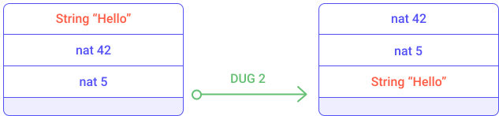
<small className="figure">FIGURE 6: Illustration of the `DUG` instruction</small>

For example, the mathematical expression `((2 + 3) * 6) + 7` can be written also with the following sequence of instructions:

```js
PUSH int 2;
PUSH int 6;
PUSH int 3;
PUSH int 7;
DUG 3;
DIG 2;
ADD;
MUL;
ADD
```

The following schema illustrates the execution of this sequence of instructions.

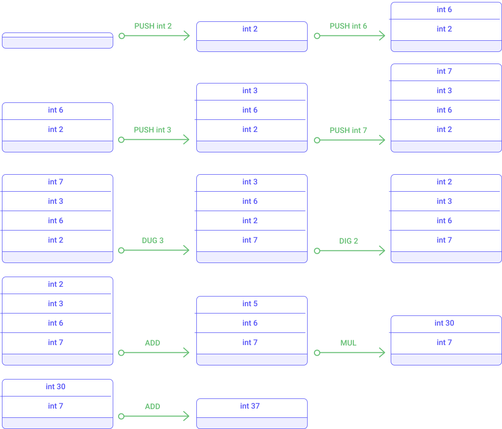
<small className="figure">FIGURE 7: Illustration of the `DUG` and `DIG` instructions</small>

Now that we have seen basic stack operators we are able to reorganize elements of the stack as pleased. These stack operators will be useful to prepare the stack of more complex operators that requires precise elements in a specific order on the top of the stack.


##### Conditional branching

The Michelson language provides the possibility to execute a part of the code depending on some criteria. This is called conditional branching and some instructions are provided for this intent.

For example, the `IF` instruction allows branches of execution to be created.

The `IF {} {}` instruction takes two sequences as arguments. It expects a boolean at the top element of the stack. It consumes the top element and executes the first given sequence if this boolean-top element is *True*. Otherwise it executes the second sequence.

In order to illustrate the conditional branching, let's explain the following sequence of instruction.

```js
IF 
{ PUSH int 1 }
{ PUSH int 2 }
```

This snippet of code is equivalent to the expression `if True then 1 else 2`. It checks the top element of the stack and ensures it is a boolean and consumes it. If the value of this top element is _True_ then the value 1 is pushed onto the stack otherwise value 2 is pushed. 

This other example removes one of the top elements of the stack. If the top element is a boolean _True_ then the next element is ermoved otherwise removes the one after.

```js
IF 
{ DROP }
{ SWAP; DROP }
```

The following diagrams illustrates the modification of the stack while executing the `IF { DROP }` instruction part.


<small className="figure">FIGURE 8: Illustration of the `IF` instruction (true case)</small>

The following diagrams illustrates the modification of the stack while executing the `IF { SWAP; DROP }` instruction part.


<small className="figure">FIGURE 9: Illustration of the `IF` instruction (false case)</small>

Obviously the conditional branching is very useful and can be combined with other instructions that set up this condition such as comparison operators. 

##### Comparison

Elements of the stack can be compared if they belongs to comparable type. For example two integer can be compared but an integer and a string cannot.

The `COMPARE` instruction compares the top two elements of the stack. It consumes the two top elements and returns an integer at the top of the stack. The returned value is -1 if the first element is smaller than the second one; 0 if the two first elements are equal; 1 otherwise.


<small className="figure">FIGURE 9: Illustration of the `COMPARE` instruction</small>

The `EQ` instruction consumes the top element and returns ont top of the stack a boolean. It return _True_ if this value is zero, _False_ otherwise. 

The combination of the `COMPARE` and `EQ` instructions allows to create boolean conditions based on number comparison.
The following sequence verify if two numbers are equal and returns a boolean answer on top of the stack.

```js
COMPARE;
EQ
```


<small className="figure">FIGURE 10: Illustration of number comparison</small>

Other comparison instructions are available to check if a number is lower or equal to zero (`LE` instruction) or greater than zero (`GT` instruction). The list of comparison operators is described in the "Generic comparison" section.

##### Conditional branching based on number comparison

The combination of the `COMPARE` and `LE` and `IF` instructions allows to apply conditional branching by comparing two numbers.

The following sequence of instruction expects two integers on top of the stack and removes the smaller one.

```
DUP;
DUG 2;
SWAP;
DUP;
DUG 2;
DUG 3;
COMPARE;
LE;
IF { DROP } { SWAP; DROP }
```

Notice that the `DUP; DUG 2; SWAP; DUP; DUG 2; DUG 3` sequence duplicates the top two elements of the stack. The `COMPARE; LE` sequence determines which is the biggest number and the `IF { DROP } { SWAP; DROP }` sequence removes the smallest number.


<small className="figure">FIGURE 11: Illustration of conditional branching based on number comparison</small>

##### DIP CMPLE

This principle of duplicating the top two elements of the stack and comparing them to choose one of them is a common pattern. Some syntactic sugar (macros) has been introduced in the Michelson language so as to ease on those common patterns. 

For example the macro `CMPLE` stands for `COMPARE; LE`. A more exhaustive list is available in the "macros" section.

Notice that the duplication of the top two elements of the stack is not an optimal sequence. It is intended to be like this in order to illustrate the `DUG` instruction but some better implementation can be done with the `DIP` instruction.

The `DIP` instruction runs a provided sequence of instructions while protecting the _n_ top elements of the stack.

The `DIP` instruction takes two arguments:
- _n_: a number of elements to protect (by default 1)
- _code_: a sequence of instructions to execute

This instruction can be very useful. For example let's re-write the duplication of the top two elements of the stack with the `DIP` instruction.

The following sequence of instruction expects two integers on top of the stack and removes the smaller one.

```
DIP { DUP };
DUP;
DIP { SWAP };
CMPLE;
IF { DROP } { SWAP; DROP }
```


<small className="figure">FIGURE 11: Illustration of conditional branching based on number comparison</small>

### Working with complex data structures

Since the beginning we ony used primitive types such as _int_, _nat_ and _string_. The storage of the smart contract usually stores more than just one number. Now let's take a look into composite data structures.

A composite structure integrate many fields and can organize them in many ways. 

There are 5 kind of composite data structures: 
- binary tree implemented with nested _PAIR_ structure
- ordered list of elements with type _list_
- set of unique elements with type _set_
- an associative array (a collection of key-value pairs) implemented with the type _map_
- a union (i.e. an exlcusive composite type) implemented with nested _or_ structure.

//TODO

### Control structures

Michelson is a turing-complete language and thus provides basic control flow instructions.

#### Sequence {}

The Sequence structure is defined by `{` and `}` and contains instructions separated by `;` (semi-colon).

```js
{ instruction1 ; instruction2 ; ... ; instruction n}
```

When executing a sequence the interpreter executes each instruction sequentially, one after the other, in the specified order.

However, this sequence may stop by throwing an exception.

#### FAILWITH

The `FAILWITH` instruction aborts the execution of the Michelson script by throwing an exception.

The `FAILWITH` instruction consumes the top element of the stack as argument (usually a string message). The consumed element must be of a pushable type. It is allowed to throw an exception without message by pushing a `UNIT` value on top of the stack.


The `FAIL` keyword has been provided as replacement for `UNIT; FAILWITH`.

Actually, the `FAIL` keyword is not an instruction but a syntactic sugar (i.e. a "shortcut" instruction that combines many of language's basic instructions).

A `FAILWITH` instruction provides a way to reject a transaction by stopping the execution of related instructions.

#### IF {} {}

The `IF` instruction allows branches of execution to be created (also called conditional branching).

The `IF` instruction takes two sequences as arguments. It expects a boolean at the top element of the stack. It consumes the top element and executes the first given sequence if this boolean-top element is *True*. Otherwise it executes the second sequence.

Michelson grammar defines the `IF` instruction as:

```js
IF bt bf / True : S  =>  bt / S
IF bt bf / False : S  =>  bf / S
```

Here is an example of an `IF` instruction that inverts the position of two elements of the stack if the condition is _False_, otherwise it throws an exception. Inverting the positions of two elements is done using the `SWAP` instruction.

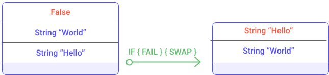
<small className="figure">FIGURE 1: Execution of `IF`</small>

#### LOOP {}

The `LOOP` instruction is a generic loop, meaning it is a repeatable pattern. It applies a sequence of instructions many times until a condition is reached. 

The `LOOP` instruction makes it possible to iterate on a composite structure (list, set, map, big_map) and apply a process to all elements sequentially.

Michelson grammar defines the `LOOP` instruction as:

```js
LOOP body / True : S  =>  body ; LOOP body / S
LOOP body / False : S  =>  S
```

#### LOOP_LEFT (loop with accumulator)

Like the `LOOP` instruction, `LOOP_LEFT {}` is a generic loop that handles an accumulator generally used for aggregating data during a repetitive process. 

Michelson grammar defines the `LOOP_LEFT` instruction as:

```js
LOOP_LEFT body / (Left a) : S  =>  body ; LOOP_LEFT body / a : S
LOOP_LEFT body / (Right b) : S  =>  b : S
```

The `LOOP_LEFT {}` takes a sequence of instructions as argument and requires a `union` (composed of a given data structure and an accumulator) on top of the stack. If the left part of the `union` is initialized the process is repeated. If the right part is initialized then the process is stopped and the accumulator is returned.

Two examples ([#4](https://opentezos.com/michelson/examples#example-4--computing-a-sum-with-loop_left) and [#5](https://opentezos.com/michelson/examples#example-5--computing-a-factorial-with-loop_left)) in the _Examples_ section describe in detail the `LOOP_LEFT` instruction usage.


#### EXEC

The `EXEC` instruction executes a function from the stack.

The `EXEC` instruction consumes a function and its related input arguments on top of the stack. The `EXEC` instruction produces the expected function output on the top of the stack.

```js
EXEC / a : f : S  =>  r : S
    where f / a : []  =>  r : []
```

Here is an example of a smart contract that defines a function with the `LAMBDA` instruction and executes the function with the `EXEC` instruction.

```js
parameter int ;
storage int ;
code { CAR ;
       LAMBDA int int { PUSH int 1 ; ADD } ;
       SWAP ;
       EXEC ;
       NIL operation ;
       PAIR }
```

Notice that the code of the `LAMBDA` function just increments a given integer by 1.

The execution of this smart contract is described in the "example" section.

#### APPLY

The `APPLY 'a` instruction partially applies a _tuplified_ function from the stack (i.e. arguments are grouped in pairs or nested pairs). It is parameterized by a type `'a`. Values that are not both push-able and storable (i.e. values of type _operation_, _contract_, and _big map_) cannot be captured by _APPLY_ (and so cannot appear in argument `'a`).

The instruction produces a new function that is only partially resolved. For example, if a function takes 2 arguments, it is possible to provide one argument and to use the `APPLY` instruction to produce an equivalent partially-resolved function which takes one argument.

Michelson grammar defines the `APPLY` instruction as:

```js  
:: 'a : lambda (pair 'a 'b) 'c : 'C   ->   lambda 'b 'c : 'C
```

```js
APPLY / a : f : S  => { PUSH 'a a ; PAIR ; f } : S
```

For example, let's consider a `lambda` function (called _additionAB_) that takes a pair of _nat_ and returns a _nat_. It computes the addition of two numbers.

```js
LAMBDA (pair nat nat) nat { ADD }
```

Notice that the function is tuplified.

The `APPLY` instruction allows a new `lambda` function to be formed (called _addition2B_) which takes a single _nat_ as argument and returns a _nat_. This function would increment a given _nat_ by two. 

The resulting function _addition2B_ is equivalent to:

```js
LAMBDA nat nat { PUSH nat 2 ; ADD }
```

### Stack operations

Some generic operators allow elements in a stack to be manipulated, such as moving an element into the stack or moving, copying, and removing elements from the stack. 

#### PUSH instruction

The `PUSH` instruction allows an element to be placed on top of the stack.

It requires the type of pushed element be specified.

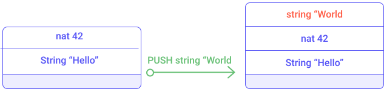
<small className="figure">FIGURE 2: Illustration of the `PUSH` instruction</small>

#### UNIT instruction

The `UNIT` instruction pushes a `Unit` value on top of the stack.

The `Unit` value represents no value.

#### DROP instruction

The `DROP` instruction removes the top element of the stack

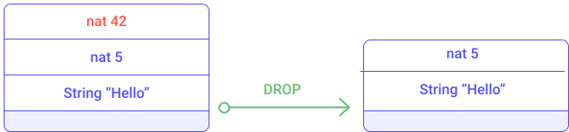
<small className="figure">FIGURE 3: Illustration of the `DROP` instruction</small>

#### SWAP instruction

The `SWAP` instruction inverts the position of the top two elements of the stack.


<small className="figure">FIGURE 4: Illustration of the `SWAP` instruction</small>

#### DUP instruction

The `DUP` instruction duplicates the top element of the stack


<small className="figure">FIGURE 5: Illustration of the `DUP` instruction</small>

#### DIG instruction

The `DIG n` instruction moves the n-th element of the stack to the top of the stack.


<small className="figure">FIGURE 6: Illustration of the `DIG` instruction</small>

#### DUG instruction

The `DUG n` instruction moves the top element of the stack to the n-th element of the stack.


<small className="figure">FIGURE 7: Illustration of the `DUG` instruction</small>

#### DIP instruction

The `DIP` instruction takes two arguments:
- _n_: a number of elements to protect (by default 1)
- _code_: a sequence of instructions to execute

It runs the provided sequence of instructions while protecting the _n_ top elements of the stack.

Michelson grammar defines `DIP` as:

```js
DIP n code / x{1} : ... : x{n} : S  =>  x{1} : ... : x{n} : S'
    where    code / S  =>  S'
```

There is a special case when n = 1. An alias (shortcut) is available for this case, the `DIP code` instruction is equivalent to `DIP 1 code`.

Also notice that `DIP 0 code` is equivalent to `code`

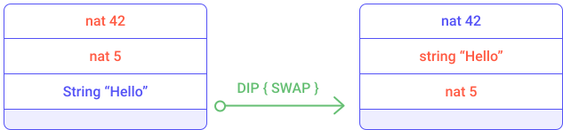
<small className="figure">FIGURE 8: Illustration of the `DIP` instruction</small>

#### LAMBDA

The `LAMBDA` instruction pushes a function on top of the stack.

It requires three arguments:
- the type of the function argument
- the type returned by the function
- the sequence of instructions associated with the function (code of the function)

```js
LAMBDA _ _ code / S  =>  code : S
```

Notice that "_" represents any type. So, a `lambda` takes and returns arguments that can be of any type.

Here is an example of a smart contract that defines a function with the `LAMBDA` instruction and executes the function with the `EXEC` instruction.

```js
parameter int ;
storage int ;
code { CAR ;
       LAMBDA int int { PUSH int 1 ; ADD } ;
       SWAP ;
       EXEC ;
       NIL operation ;
       PAIR }
```

The `lambda` function is just incrementing a given int.

The execution of this smart contract is described in the example section.

### Generic comparison

#### COMPARE

This instruction compares the top two elements of the stack.

The `COMPARE` instruction returns -1 if the first element is smaller than the second one. It returns 0 if the two first elements are equal. Otherwise it returns 1.

Michelson grammar defines `COMPARE` as:

```js
COMPARE / x : y : S  =>  -1 : S
    iff x < y
COMPARE / x : y : S  =>  0 : S
    iff x = y
COMPARE / x : y : S  =>  1 : S
    iff x > y
```

Here is an example of a comparison between two natural integers:


<small className="figure">FIGURE 9: Illustration of the `COMPARE` instruction</small>

#### EQ

The top element is replaced by _True_ if this element is zero, otherwise by _False_. 

```js
EQ / 0 : S  =>  True : S
EQ / v : S  =>  False : S
    iff v <> 0
```

Here is an example:

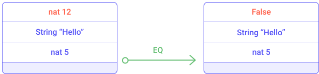
<small className="figure">FIGURE 10: Illustration of the `EQ` instruction</small>

#### LT

The top element is replaced by _True_ if this element is lower than zero, otherwise by _False_. 

```js
LT / v : S  =>  True : S
    iff  v < 0
LT / v : S  =>  False : S
    iff v >= 0
```

Here is an example:

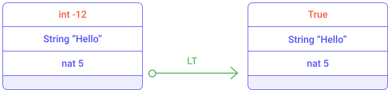
<small className="figure">FIGURE 11: Illustration of the `LT` instruction</small>

#### GE

The top element is replaced by _True_ if this element is greater or equal to zero, otherwise by _False_. 

```js
GE / v : S  =>  True : S
    iff  v >= 0
GE / v : S  =>  False : S
    iff v < 0
```

Here is an example:

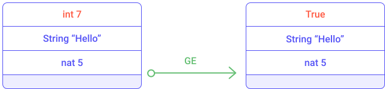
<small className="figure">FIGURE 12: Illustration of the `GE` instruction</small>

### Operations on bool

#### OR

The `OR` instruction consumes the top two elements of the stack and computes a logical _OR_ of both elements.


<small className="figure">FIGURE 13: Illustration of the `OR` instruction</small>

The `OR` instruction requires boolean elements.

#### AND

The `AND` instruction consumes the top two elements of the stack and computes a logical _AND_ of the two elements.


<small className="figure">FIGURE 14: Illustration of the `AND` instruction</small>

The `AND` instruction requires boolean elements.

#### XOR

The `XOR` instruction consumes the top two elements of the stack and computes an exclusive logical _OR_ of the two elements.


<small className="figure">FIGURE 15: Illustration of the `XOR` instruction</small>

The `XOR` instruction requires boolean elements.

#### NOT

The `NOT` instruction consumes a boolean top element of the stack and pushes the logical inverse of the given boolean.  

### Operations on numbers

#### ADD

The `ADD` instruction computes additions on _nat_, _int_ and _mutez_.


<small className="figure">FIGURE 16: Illustration of the `ADD` instruction</small>

#### SUB

The `SUB` instruction computes subtractions on _nat_, _int_ and _mutez_.

Notice that the subtraction of two natural integers produces an integer.


<small className="figure">FIGURE 17: Illustration of the `SUB` instruction</small>

#### MUL

The `MUL` instruction computes multiplications on _nat_ and _int_.

```js
MUL / x : y : S  =>  (x * y) : S
```


<small className="figure">FIGURE 18: Illustration of the `MUL` instruction</small>

Notice that the multiplication of two natural integers produces a natural integer.

#### EDIV

The `EDIV` instruction computes divisions on _nat_ and _mutez_.

The euclidean division computes the quotient and the remainder between two numbers.

If the divisor is equal to zero, then it returns an optional type with the assigned value _None_. Otherwise, it applies the Euclidean division and returns an optional type containing the resulting  value (Pair quotient remainder). 

Michelson grammar defines `EDIV` as:

```js
EDIV / x : 0 : S  =>  None
EDIV / x : y : S  =>  Some (Pair (x / y) (x % y)) : S
    iff y <> 0
```


<small className="figure">FIGURE 19: Illustration of the `EDIV` instruction</small>

### Operations on strings

Strings are mostly used for naming things without having to rely on external ID databases. They are restricted to the printable subset of 7-bit ASCII, plus some escaped characters (see the section on constants). We can use string constants as is, concatenate or splice them, and also use them as keys.

#### CONCAT

The `CONCAT` instruction concatenates strings. It consumes the two top element and produces a string (concatenation of the two top element) that is placed on top of the stack.

//TODO
It takes one parameter which can be either a single string or a list of strings. 

```js
CONCAT / s : t : S  =>  (s ^ t) : S

CONCAT / {} : S  =>  "" : S
CONCAT / { s ; <ss> } : S  =>  (s ^ r) : S
   where CONCAT / { <ss> } : S  =>  r : S
```

#### SIZE

The `SIZE` instruction consumes a string of the top of the stack and pushes the number of characters contained in the string element.

#### SLICE

The `SLICE` instruction provides a way to retrieve a part of a string.
It takes three arguments:
- an `offset` argument indicating the beginning of the substring 
- a `length` argument indicating the size of the substring
- a `string` to slice

It returns an optional string because the given offset may be out of bound.

```js
SLICE / offset : length : s : S  =>  Some ss : S
   where ss is the substring of s at the given offset and of the given length
     iff offset and (offset + length) are in bounds
SLICE / offset : length : s : S  =>  None  : S
     iff offset or (offset + length) are out of bounds
```


<small className="figure">FIGURE 20: Illustration of the `SLICE` instruction</small>

#### COMPARE with strings

The `COMPARE` instruction allows two strings to be comapared. It consumes the top two elements of the stack and pushes an integer to the top. If the first element is lexically greater than the second, then it returns 1. If the first element is lexically equal to the second element, then it returns 0. If the first element is lexically smaller than the second element, then it returns -1.

```js
COMPARE / s : t : S  =>  -1 : S
    iff s < t
COMPARE / s : t : S  =>  0 : S
    iff s = t
COMPARE / s : t : S  =>  1 : S
    iff s > t
```

### Operations on pairs

#### PAIR

The `PAIR` instruction consumes the top two elements of the stack and creates a pair with these two elements.

```js
PAIR / a : b : S  =>  (Pair a b) : S
```

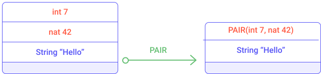
<small className="figure">FIGURE 21: Illustration of the `PAIR` instruction</small>

#### CAR

The `CAR` instruction consumes the top element of the stack (which must be a `PAIR`) and pushes to the top the left part of the pair.

```js
CAR / (Pair a _) : S  =>  a : S
```


<small className="figure">FIGURE 22: Illustration of the `CAR` instruction</small>

#### CDR

The `CDR` instruction consumes the top element of the stack (which must be a `PAIR`) and pushes to the top the right part of the pair.

```js
CDR / (Pair _ b) : S  =>  b : S
```

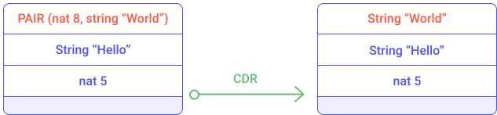
<small className="figure">FIGURE 23: Illustration of the `CDR` instruction</small>

#### COMPARE on pairs

The `COMPARE` instruction computes a lexicographic comparison. Like the generic comparison it consumes the top two elements of the stack and returns an integer (-1, 0 ,1). 

The `COMPARE` instruction executes the comparison on both (left and right) part of a _pair_. It starts with comparing left parts and if the result is 0 (i.e. left parts are equal) then the comparison is done on the right part of the pair.

```js
> COMPARE / (Pair sa sb) : (Pair ta tb) : S  =>  -1 : S
    iff COMPARE / sa : ta : S => -1 : S
> COMPARE / (Pair sa sb) : (Pair ta tb) : S  =>  1 : S
    iff COMPARE / sa : ta : S => 1 : S
> COMPARE / (Pair sa sb) : (Pair ta tb) : S  =>  r : S
    iff COMPARE / sa : ta : S => 0 : S
        COMPARE / sb : tb : S => r : S
```

### Operations on sets

The `SET` data structure is an ordered list of elements. Therefore a value in a set can appear only once.

#### EMPTY_SET 'elt

The `EMPTY_SET` instruction builds a new, empty set for elements of a given type.

The 'elt type must be comparable (the COMPARE primitive must be defined over it).

```js
EMPTY_SET _ / S  =>  {} : S
```

#### MEM

The `MEM` instruction checks for the presence of an element in a set.

```js
MEM / x : {} : S  =>  false : S
MEM / x : { hd ; <tl> } : S  =>  r : S
    iff COMPARE / x : hd : []  =>  1 : []
    where MEM / x : { <tl> } : S  =>  r : S
MEM / x : { hd ; <tl> } : S  =>  true : S
    iff COMPARE / x : hd : []  =>  0 : []
MEM / x : { hd ; <tl> } : S  =>  false : S
    iff COMPARE / x : hd : []  =>  -1 : []
```

Notice that the `MEM` instruction returns a boolean on top of the stack.

#### UPDATE

The `UPDATE` instruction inserts or removes an element in a set, replacing a previous value.

It takes the top two elements of the stack:
- an element whose type corresponds to the _set_ type
- a boolean representing the existence of this element in the _set_

```js
UPDATE / x : false : {} : S  =>  {} : S
UPDATE / x : true : {} : S  =>  { x } : S
UPDATE / x : v : { hd ; <tl> } : S  =>  { hd ; <tl'> } : S
    iff COMPARE / x : hd : []  =>  1 : []
    where UPDATE / x : v : { <tl> } : S  =>  { <tl'> } : S
UPDATE / x : false : { hd ; <tl> } : S  =>  { <tl> } : S
    iff COMPARE / x : hd : []  =>  0 : []
UPDATE / x : true : { hd ; <tl> } : S  =>  { hd ; <tl> } : S
    iff COMPARE / x : hd : []  =>  0 : []
UPDATE / x : false : { hd ; <tl> } : S  =>  { hd ; <tl> } : S
    iff COMPARE / x : hd : []  =>  -1 : []
UPDATE / x : true : { hd ; <tl> } : S  =>  { x ; hd ; <tl> } : S
    iff COMPARE / x : hd : []  =>  -1 : []
```

If the boolean argument is _False_ then the element will be removed.


<small className="figure">FIGURE 24: Illustration of the `UPDATE` instruction</small>

If the boolean argument is _True_ then the element will be inserted.


<small className="figure">FIGURE 25: Illustration of the `UPDATE` instruction</small>

The following smart contract illustrates the `UPDATE` instruction usage. This smart contract stores a set of integers and can be invoked by specifying an integer that will be inserted in the set.

```js
parameter int ;
storage (set int) ;
code { DUP ; CAR ; DIP { CDR } ;
       PUSH bool True ;
       SWAP ;
       UPDATE ;
       NIL operation ;
       PAIR }
```

You can test the smart contract with the following command:

```js
tezos-client run script set_example.tz on storage '{1;2;3; 9}' and input '7'
```

#### ITER body

The `ITER` instruction takes a sequence of instructions (called "body") as argument.

The `ITER` instruction applies a given sequence of instructions to each element of a set. The "body" sequence has access to the stack.

```js
ITER body / {} : S  =>  S
ITER body / { hd ; <tl> } : S  =>  ITER body / { <tl> } : S'
   iff body / hd : S  =>  S'
```

#### SIZE

The `SIZE` instruction consumes a set from the top of the stack and pushes to the top the number of elements contained in the set.

### Operations on optional values

An optional value is a data structure that can hold a value (of a given type). The optional value has two states: it is defined as `NONE` if no value is assigned and can be defined as `SOME` if a value has been assigned.

When defining an optional value, the type of value must be specified.

#### SOME

The `SOME` instruction packs a value as an optional value.

```js
SOME / v : S  =>  (Some v) : S
```

#### NONE

The `NONE` instruction specifies the absence of value. It requires that the type of value that can be held be specified.

```js
NONE / S  =>  None : S
```

#### IF_NONE

The `IF_NONE bt bf` instruction inspects an optional value.
It requires two sequences of instructions, as with an `IF` instruction.
It executes the first sequence if the optional value has no value assigned, otherwise it executes the second sequence of instructions (where a value has been assigned with a `SOME` instruction).

If the `IF_NONE` instruction encounters a NONE value it consumes it and then start executing the first sequence.  
If the `IF_NONE` instruction encounters a SOME value it does not consumes it and then start executing the second sequence.

```js
IF_NONE bt bf / (None) : S  =>  bt / S
IF_NONE bt bf / (Some a) : S  =>  bf / a : S
```


<small className="figure">FIGURE 25: Illustration of the `IF_NONE` instruction</small>


<small className="figure">FIGURE 26: Illustration of the `IF_NONE` instruction</small>

### Operations on maps/big_maps

A `map` is an associative array. It stores many pairs of key-value elements, i.e. it binds a key and a value. Key and value type must be defined when instantiating a new `map`.

The `map` data structure can only contain a limited amount of data. When using big and complex types as values, it is recommended to use the `big_map` data structure.

#### EMPTY_MAP 'key 'val and EMPTY_BIG_MAP 'key 'val

The `EMPTY_MAP` instruction builds a new empty map. It requires the type definition of the key (_'key_) and type definition of the value (_'val_).

The _'key_ type must be comparable (the COMPARE primitive must be defined over it).

```js
EMPTY_MAP _ _ / S  =>  {} : S
```

The `EMPTY_BIG_MAP` instruction builds a new empty `big_map` data structure.

#### MEM

The `MEM` instruction checks for the presence of a binding for a key in a map.

It takes a key as argument and returns a boolean on top of the stack.

```js
MEM / x : {} : S  =>  false : S
MEM / x : { Elt k v ; <tl> } : S  =>  r : S
    iff COMPARE / x : k : []  =>  1 : []
    where MEM / x : { <tl> } : S  =>  r : S
MEM / x : { Elt k v ; <tl> } : S  =>  true : S
    iff COMPARE / x : k : []  =>  0 : []
MEM / x : { Elt k v ; <tl> } : S  =>  false : S
    iff COMPARE / x : k : []  =>  -1 : []
```

#### UPDATE

The `UPDATE` instruction adds or removes an element in a map.

The `UPDATE` instruction expects a key, an optional value and a map on top of the stack. It consumes the key and the optional value and modifies the map accordingly.

```js
> UPDATE / x : None : {} : S  =>  {} : S
> UPDATE / x : Some y : {} : S  =>  { Elt x y } : S
> UPDATE / x : opt_y : { Elt k v ; <tl> } : S  =>  { Elt k v ; <tl'> } : S
    iff COMPARE / x : k : []  =>  1 : []
          where UPDATE / x : opt_y : { <tl> } : S  =>  { <tl'> } : S
> UPDATE / x : None : { Elt k v ; <tl> } : S  =>  { <tl> } : S
    iff COMPARE / x : k : []  =>  0 : []
> UPDATE / x : Some y : { Elt k v ; <tl> } : S  =>  { Elt k y ; <tl> } : S
    iff COMPARE / x : k : []  =>  0 : []
> UPDATE / x : None : { Elt k v ; <tl> } : S  =>  { Elt k v ; <tl> } : S
    iff COMPARE / x : k : []  =>  -1 : []
> UPDATE / x : Some y : { Elt k v ; <tl> } : S  =>  { Elt x y ; Elt k v ; <tl> } : S
    iff COMPARE / x : k : []  =>  -1 : []
```

If the optional value is defined as `None`, then the element is removed from the map. The following smart contract (map_remove_example.tz) illustrates the `UPDATE` usage while removing an element from the map.

```js
parameter string ;
storage (map string int) ;
code { DUP ; CAR ; DIP { CDR } ;
       NONE int ;
       SWAP ;
       UPDATE ;
       NIL operation ;
       PAIR }
```

This smart contract can be tested with the following command:

```js
tezos-client run script map_remove_example.tz on storage '{ Elt "toto" 1 }' and input '"toto"'
```

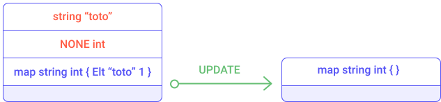
<small className="figure">FIGURE 27: Illustration of the `UPDATE` instruction</small>

If the optional value is defined as `Some` then the element is insert into the map. The following smart contract (map_insert_example.tz) illustrates the `UPDATE` usage while inserting an element into the map.

```js
parameter string ;
storage (map string int) ;
code { DUP ; CAR ; DIP { CDR } ;
       PUSH int 2;
       SOME ;
       SWAP ;
       UPDATE ;
       NIL operation ;
       PAIR }
```

This smart contract can be tested with the following command.

```js
tezos-client run script map_insert_example.tz on storage '{ Elt "toto" 1 }' and input '"tutu"'
```


<small className="figure">FIGURE 28: Illustration of the `UPDATE` instruction</small>

#### GET

The `GET` instruction allows to access to an element inside a map. It returns an optional value to be checked with an `IF_SOME` instruction.

```js
GET / x : { Elt k v ; <tl> } : S  =>  opt_y : S
    iff COMPARE / x : k : []  =>  1 : []
    where GET / x : { <tl> } : S  =>  opt_y : S
GET / x : { Elt k v ; <tl> } : S  =>  Some v : S
    iff COMPARE / x : k : []  =>  0 : []
GET / x : { Elt k v ; <tl> } : S  =>  None : S
    iff COMPARE / x : k : []  =>  -1 : []
```

The following smart contract illustrates the usage of `GET`. The storage of this contract defines a map. This smart contract takes a key as the parameter and inserts a new element in the map if the key does not exist. In this case it assigns value 0 to the given key. Otherwise if the map possesses an element for the given key then it increments its associated value.

```js
parameter string ;
storage (map string int) ;
code { DUP ;
       CAR ;
       DIP { CDR } ;
       DIP { DUP } ;
       DUP ;
       DIP { SWAP } ;
       GET ;
       IF_NONE { PUSH int 0 ; SOME } { PUSH int 1 ; ADD ; SOME } ;
       SWAP ;
       UPDATE ;
       NIL operation ;
       PAIR }
```

This smart contract can be simulated with the following commands:

```js
tezos-client run script map_example.tz on storage '{}' and input '"toto"'
```

```js
tezos-client run script map_example.tz on storage '{ Elt "toto" 5 }' and input '"toto"'
```

Notice that `{}` represents an empty map and `{ Elt "toto" 5 }` a map containing one element where "toto" is the key and its associated value is 5.

#### MAP body

The `MAP` instruction applies a sequence of instructions to each element of a map. It takes a sequence of instructions as argument (called "body"). This "body" sequence has access to the stack.

```js
MAP body / {} : S  =>  {} : S
MAP body / { Elt k v ; <tl> } : S  =>  { Elt k v' ; <tl'> } : S''
    where body / Pair k v : S  =>  v' : S'
    and MAP body / { <tl> } : S'  =>  { <tl'> } : S''
```

The following smart contract (map_map_example.tz) illustrates the `MAP` usage. This smart contract stores a `map string nat` and when invoked it goes through all key-value elements of the map and multiplies by 2 the `nat` value.

```js
parameter unit ;
storage (map string nat) ;
code {
       CDR ;
       MAP { CDR ; PUSH nat 2 ; MUL }  ;
       NIL operation ;
       PAIR }
```

The smart contract can be simulated with the following command.

```js
tezos-client run script map_map_example.tz on storage '{ Elt "toto" 1 ; Elt "tutu" 4 }' and input Unit
```

#### ITER body

The `ITER` instruction applies a sequence of instructions (called "body") to each element of a map. The "body" sequence has access to the stack.

```js
ITER body / {} : S  =>  S
ITER body / { Elt k v ; <tl> } : S  =>  ITER body / { <tl> } : S'
   iff body / (Pair k v) : S  =>  S'
```

An example ("Max list") illustrating `ITER` instruction usage is described in the _Examples_ section. Despite being applied to a list of integers, the `ITER` instruction works in the same way with a map (except at each iteration a _pair_ key-value is pushed on the stack instead of an integer, as in the example "Max list").

#### SIZE

The `SIZE` instruction computes the number of elements inside a map.

It consumes a map on top of the stack and places the number of elements on top of the stack.

Notice that the `SIZE` instruction cannot be applied to `big_map` type. 

### Operations on unions

The `union` data structure specifies two possible type definitions with logical _or_. It can be used to create a new type which can handle two different type definitions.

For example, the following Michelson expression defines the type "int_or_nat" as:

```js
or int nat
```

#### LEFT

The `LEFT p` instruction takes the top-element of the stack and produces a *union*. 
The top-element is placed in the right branch of the `or` structure and the left branch is typed with the given `p` argument.

It consumes a type definition on top of the stack and pushes a union where the left part is defined as the consumed type definition.

```js
LEFT / v : S  =>  (Left v) : S
```

Illustration of `LEFT` usage can be seen in the examples section.

#### RIGHT

The `RIGHT p` instruction takes the top-element of the stack and produces a *union*. 
The top-element is placed in the left branch of the `or` structure and the right branch is typed with the given `p` argument.

It consumes a type definition on top of the stack and pushes a union where the right part is defined as the consumed type definition.

```js
RIGHT / v : S  =>  (Right v) : S
```

Illustration of `RIGHT` usage can be seen in the examples section.

#### IF_LEFT

The `IF_LEFT` instruction inspects a value of *union*. It requires two sequences of instructions (bt bf), like with an `IF` instruction. 

The `IF_LEFT bt bf` executes the "bt" sequence if the left part of a *union* has been given, otherwise it will execute the "bf" sequence.

The instruction consumes a Michelson expression on top of the stack which specifies which part of the *union* has been defined.

```js
IF_LEFT bt bf / (Left a) : S  =>  bt / a : S
IF_LEFT bt bf / (Right b) : S  =>  bf / b : S
```

The following smart contract (union_example.tz) illustrates the `IF_LEFT` usage. Notice that the parameter is a *union* `(or string int)` and the storage is an integer. This smart contract increments the storage if an integer is passed as parameter (i.e. if the smart contract is invoked with an integer) and does nothing if a string is given.

```js
parameter (or string int) ;
storage int ;
code { DUP ; CAR ; DIP { CDR } ;
       IF_LEFT { DROP } { ADD } ;
       NIL operation ;
       PAIR }
```

To illustrate the invocation of the smart contract, we will break down its execution.

The following command simulates the execution of the smart contract when called with an integer.

```js
tezos-client run script union_example.tz on storage '5' and input 'Right 1'
```


<small className="figure">FIGURE 30: Illustration of the `IF_LEFT` instruction</small>

The following command simulates the execution of the smart contract when called with a string.

```js
tezos-client run script union_example.tz on storage '5' and input 'Left "Hello"'
```


<small className="figure">FIGURE 31: Illustration of the `IF_LEFT` instruction</small>

### Operations on lists

#### CONS

The `CONS` instruction adds an element to a list (at the beginning of the list).

```js
CONS / a : { <l> } : S  =>  { a ; <l> } : S
```


<small className="figure">FIGURE 32: Illustration of the `CONS` instruction</small>

#### NIL

The `NIL 'a` instruction specifies an empty list. The type of list elements must be specified. 

```js
NIL / S  =>  {} : S
```


<small className="figure">FIGURE 33: Illustration of the `NIL` instruction</small>

#### IF_CONS

The `IF_CONS bt bf` instruction inspects a list. It requires two sequences of instructions (bt anf bf), as with the `IF` instruction.

This instruction removes the first element of the list, pushes it on top of the stack and executes the first sequence of instructions (`bt`). If the list is empty, then the second list of instructions is executed (`bf`).

```js
IF_CONS bt bf / { a ; <rest> } : S  =>  bt / a : { <rest> } : S
IF_CONS bt bf / {} : S  =>  bf / S
```

#### MAP body

The `MAP` instruction applies a sequence of instructions to each element of a list. The `MAP` instruction requires a sequence of instructions (i.e. "body") which has access to the stack.

```js
MAP body / {} : S  =>  {} : S
MAP body / { a ; <rest> } : S  =>  { b ; <rest'> } : S''
    where body / a : S  =>  b : S'
    and MAP body / { <rest> } : S'  =>  { <rest'> } : S''
```

#### SIZE

The `SIZE` instruction computes the number of elements in the list.
It consumes a list on top of the stack and pushes the number of elements of the list back on top.

:: list 'elt : 'S -> nat : 'S

```js
SIZE / { _ ; <rest> } : S  =>  1 + s : S
    where  SIZE / { <rest> } : S  =>  s : S
SIZE / {} : S  =>  0 : S
```

#### ITER body

The `ITER` instruction applies a sequence of instructions to each element of a list. The `ITER` instruction requires a sequence of instructions (called "body") which has access to the stack.

```js
ITER body / {} : S  =>  S
ITER body / { a ; <rest> } : S  =>  ITER body / { <rest> } : S'
   iff body / a : S  =>  S'
```

Notice that the Michelson language defines the `ITER` instruction as a recursive call.

An example is described in the _Examples_ section.

### Operations on timestamps

Timestamps can be obtained by the `NOW` operation, or retrieved from script parameters or globals.

#### NOW

The `NOW` instruction pushes the timestamp of the block whose validation triggered this execution. This timestamp does not change during the execution of the contract.

#### ADD

The `ADD` instruction increments a timestamp of the given number of seconds. The number of seconds must be expressed as a type `int`. Addition of timestamp does not accept a number of seconds as `nat`.

```js
ADD / seconds : nat (t) : S  =>  (seconds + t) : S
ADD / nat (t) : seconds : S  =>  (t + seconds) : S
```

#### SUB

The `SUB` instruction subtracts a number of seconds from a timestamp. It can also be used to subtract two timestamps.

```js
SUB / seconds : nat (t) : S  =>  (seconds - t) : S
SUB / seconds(t1) : seconds(t2) : S  =>  (t1 - t2) : S
```

#### COMPARE

The `COMPARE` computes timestamp comparison. It returns an integer, as with the `COMPARE` instruction for an integer.

It returns 1 if the first timestamp is bigger than the second timestamp, 0 if both timestamps are equal, and -1 otherwise. 

```js
COMPARE / seconds(t1) : seconds(t2) : S  =>  -1 : S
    iff t1 < t2
COMPARE / seconds(t1) : seconds(t2) : S  =>  0 : S
    iff t1 = t2
COMPARE / seconds(t1) : seconds(t2) : S  =>  1 : S
    iff t1 > t2
```

### Operations on mutez

Mutez (micro-Tez) are internally represented by a 64-bit, signed integer. There are restrictions to prevent creating a negative amount of mutez. Operations are limited in order to prevent overflow and to avoid mixing with other numerical types by mistake. They are also mandatorily checked for under/overflows.

#### ADD

The `ADD` instruction computes additions on mutez.

```js
ADD / x : y : S  =>  [FAILED]   on overflow
ADD / x : y : S  =>  (x + y) : S
```

#### SUB 

The `SUB` instruction computes subtractions on mutez.

```js
SUB / x : y : S  =>  [FAILED]
    iff   x < y
SUB / x : y : S  =>  (x - y) : S
```

#### MUL

The `MUL` instruction computes multiplications on mutez. The multiplication allows mutez to be multiplied with natural integers.

```
:: mutez : nat : 'S   ->   mutez : 'S
:: nat : mutez : 'S   ->   mutez : 'S
```

Multiplication of 2 `mutez` operands is not allowed. 

```js
MUL / x : y : S  =>  [FAILED]   on overflow
MUL / x : y : S  =>  (x * y) : S
```

#### EDIV

The `EDIV` instruction computes the euclidean division on mutez. The euclidean division allows a mutez to be divided by a natural integer.

```
:: mutez : nat : 'S   ->   option (pair mutez mutez) : 'S
:: mutez : mutez : 'S   ->   option (pair nat mutez) : 'S
```

It is also possible to divide 2 mutez, in this case it returns a `nat` as a quotient and a mutez standing for the rest of the euclidean division.


```js
EDIV / x : 0 : S  =>  None
EDIV / x : y : S  =>  Some (Pair (x / y) (x % y)) : S
    iff y <> 0
```

#### COMPARE

The `COMPARE` instruction compares two mutez and returns an integer on top of the stack. It returns 0 if both elements are equal, 1 if the first element is bigger than the second, and -1 otherwise. 

```js
COMPARE / x : y : S  =>  -1 : S
    iff x < y
COMPARE / x : y : S  =>  0 : S
    iff x = y
COMPARE / x : y : S  =>  1 : S
    iff x > y
```

### Operations on contracts

This section describes instructions specific to smart contracts and interactions between contracts. It includes key features such as emitting transactions and invoking a contract, setting delegations, and even creating contracts on the fly.  

#### CONTRACT

The `CONTRACT 'p` instruction casts the address to the given contract type if possible.
It consumes an `address` to the top element of the stack and returns a contract option which corresponds to the given parameter type.

The parameter is `unit` in case of an implicit account.

The `CONTRACT 'p` instruction considers the default entrypoint if it exists, otherwise the full parameter is returned. 

```js
CONTRACT / addr : S  =>  Some addr : S
    iff addr exists and is a contract of parameter type 'p
CONTRACT / addr : S  =>  Some addr : S
    iff 'p = unit and addr is an implicit contract
CONTRACT / addr : S  =>  None : S
    otherwise
```

#### TRANSFER_TOKENS

The `TRANSFER_TOKENS` instruction forges a transaction. In Michelson, the `operation` type represents a transaction. 
Forging a transaction requires the following to be specified: 
- the *parameter* (i.e. the entry point expected by the targeted contract)
- a *quantity of mutez* transferred by this transaction
- a *recipient contract* representing the target of the transaction (i.e. to which contract this transaction will be sent)

The parameter must be consistent with the one expected by the contract.
If the transaction is sent to an implicit account (i.e. the address of an account) then the parameter must be set to `unit`.

The `TRANSFER_TOKENS` instruction consumes the three top elements of the stack and outputs a transaction on top of the stack.

As seen in previous sections, the invocation of a Tezos smart contract produces a list of operations and a new storage state. In a smart contract, when using a `TRANSFER_TOKENS` instruction to forge a transaction the produced transaction must be included in the returned list of operations in order to be taken into account.

To illustrate the usage of the `TRANSFER_TOKENS` instruction, we will consider a simple "Counter" smart contract that can increment or decrement a value. We will create a second smart contract, "CounterCaller", which forges a transaction and sends it to the "Counter" smart contract using the `TRANSFER_TOKENS` instruction.

The following smart contract demonstrates the implementation of the "Counter" smart contract.

```js
parameter (or (int %decrement) (int %increment)) ;
storage int ;
code { DUP ;
       CDR ;
       SWAP ;
       CAR ;
       IF_LEFT { SWAP ; SUB } { ADD } ;
       NIL operation ;
       PAIR }
```

The following smart contract demonstrates the implementation of the "CounterCaller" smart contract.

```js
parameter (or int int);
storage address;
code {
       DUP;
       DUP;
       CDR;
       CONTRACT (or int int);
       IF_NONE
              {DROP; NIL operation }
              {
                     SWAP;
                     CAR;
                     DIP {PUSH mutez 0};
                     TRANSFER_TOKENS;
                     DIP {NIL operation;};
                     CONS;
              };
       DIP { CDR };
       PAIR }
```

Now, let's break down the execution of the "CounterCaller" smart contract:

The following command simulates the invocation of the smart contract.

```js
tezos-client run script countercaller.tz on storage '"KT1HUbVyf62ZAp7BRqwQaDueb6kgb7Q86cc3"' and input 'Left 3'
```


<small className="figure">FIGURE 34: Illustration of the `TRANSFER_TOKENS` instruction</small>

#### SET_DELEGATE

The `SET_DELEGATE` sets or withdraws the contract’s delegation. It consumes an *option key_hash* specifying the delegate and returns a transaction (operation) on top of the stack.

Using this instruction is the only way to modify the delegation of a smart contract. If the top element is _None_, then the delegation of the current contract is withdrawn. If the top element is _Some kh_, where _kh_ is the key hash of a registered delegate (that is not the current delegate of the contract), then this operation sets the delegate of the contract to this registered delegate. The operation fails if _kh_ is the current delegate of the contract or if _kh_ is not a registered delegate.

#### BALANCE

The `BALANCE` instruction pushes the current amount of mutez held by the executing contract to the stack, including any mutez added by the calling transaction.

#### CREATE_CONTRACT

The `CREATE_CONTRACT` instruction forges a new contract. It consumes the top three elements of the stack and pushes a *transaction* (responsible for creating the contract) and the *address* of the newly created contract.

The three consumed elements represent arguments for deploying a contract:
- the smart contract definition as a literal `{ storage 'g ; parameter 'p ; code ... }`, including the storage definition, parameter definition and the code of the smart contract
- an optional `key_hash` value representing the delegate
- a quantity of mutez transferred to the new contract

Accessing the newly created contract (via a `CONTRACT 'p` instruction) will fail until it is actually originated.

### Built-ins

#### ADDRESS

The `ADDRESS` instruction casts the contract to its address. It consumes a contract on top of the stack and pushes back the address of the contract.

```js
ADDRESS / addr : S  =>  addr : S
```

#### SOURCE

The `SOURCE` instruction pushes the address of the contract that initiated the current transaction, i.e. the contract that paid the fees and storage cost, and whose manager signed the operation that was sent on the blockchain. Note that since the TRANSFER_TOKENS instructions can be chained, `SOURCE` and `SENDER` are not necessarily the same.

#### SENDER

The `SENDER` instruction pushes the address of the contract that initiated the current internal transaction. It may be the `SOURCE`, but may also be different if the source sent an order to an intermediate smart contract, which then called the current contract.

#### SELF

The `SELF` instruction pushes the default entry point of a contract on top of the stack. This default entry point specifies the expected parameter type. 

The `SELF 'p` instruction allows to take a entry point name 'p as argument. In this case, it pushed the specified entrypoint on top of the stack. 

#### AMOUNT

The `AMOUNT` instruction pushes the amount of mutez of the current transaction on top of the stack.

#### IMPLICIT_ACCOUNT

The `IMPLICIT_ACCOUNT` instruction returns a default contract with the given public/private key pair. Any funds deposited in this contract can immediately be spent by the holder of the private key. This contract cannot execute Michelson code and will always exist on the blockchain.

The instruction pops a *key_hash* from the top of the stack and pushes a `contract unit`.

#### CHAIN_ID

The `CHAIN_ID` instruction pushes the chain identifier on top of the stack.

### Operations on bytes

Bytes are used for serializing data in order to check signatures and to compute hashes on them. They can also be used to incorporate data from the untyped outside world.

#### PACK

The `PACK` instruction serializes a piece of data to its optimized binary representation.

#### UNPACK

The `UNPACK` instruction de-serializes a piece of data, if valid. It returns an *option* initialized to *None* if the de-serialization is invalid, or an *option* initialized to *Some* if valid.

#### CONCAT

The `CONCAT` instruction concatenates two byte sequences. It can also be applied to a list of byte sequences. It consumes a list of byte sequences and pushes the concatenation of all sequences (in the respective order). 

```js
CONCAT / s : t : S  =>  (s ^ t) : S
CONCAT / {} : S  =>  0x : S
CONCAT / { s ; <ss> } : S  =>  (s ^ r) : S
    where CONCAT / { <ss> } : S  =>  r : S
```

#### SIZE

The `SIZE` instruction computes the size of a sequence of bytes. It consumes a byte sequence and pushes the number of bytes of this sequence.

#### SLICE

The `SLICE` instruction provides a way to retrieve a part of a byte sequence.
It takes expects following elements on top of the stack:
- an `offset`, indicating the beginning of the byte sequence 
- a `length`, indicating the size of the sub-sequence
- a `byte sequence` to slice

It returns an optional byte sequence because the given offset and length may be out of bound.

```js
SLICE / offset : length : s : S  =>  Some ss : S
   where ss is the substring of s at the given offset and of the given length
     iff offset and (offset + length) are in bounds
SLICE / offset : length : s : S  =>  None : S
     iff offset or (offset + length) are out of bounds
```

#### COMPARE

The `COMPARE` instruction computes a lexicographic comparison. As with other `COMPARE` instructions, it returns 1 if the first sequence is bigger than the second sequence, 0 if both byte sequences are equal, or -1 otherwise.

The `COMPARE` instruction can be used only on comparable types.

```js
COMPARE / s : t : S  =>  -1 : S
    iff s < t
COMPARE / s : t : S  =>  0 : S
    iff s = t
COMPARE / s : t : S  =>  1 : S
    iff s > t
```

### Crypto primitives

#### HASH_KEY 

The `HASH_KEY` instruction computes the *b58check* of a public key.

It consumes a key and pushes back a *key_hash*.

#### BLAKE2B

The `BLAKE2B` instruction computes a cryptographic hash of the value contents using the *Blake2b-256* cryptographic hash function.

It consumes a byte sequence and pushes back the computed *Blake2b-256* hash of this byte sequence.

#### SHA256

The `SHA256` instruction computes a cryptographic hash of the value contents using the *Sha256* cryptographic hash function.

It consumes a byte sequence and pushes back the computed *Sha256* of this byte sequence.

#### SHA512

The `SHA512` instruction computes a cryptographic hash of the value contents using the *Sha512* cryptographic hash function.

It consumes a byte sequence and pushes back the computed *Sha512* of this byte sequence.

#### CHECK_SIGNATURE

The `CHECK_SIGNATURE` instruction checks that a sequence of bytes has been signed with a given key.

It consumes the top three elements of the stack (a byte sequence, a key and a signature) and pushes a boolean. 

#### COMPARE

The `COMPARE` instruction compares values of type `key_hash`. 

As for other `COMPARE` instructions, it returns 1 if the first *key_hash* is bigger than than the second key_hash, 0 if the both *key_hash* values are equal, and -1 otherwise.

```js
COMPARE / x : y : S  =>  -1 : S
    iff x < y
COMPARE / x : y : S  =>  0 : S
    iff x = y
COMPARE / x : y : S  =>  1 : S
    iff x > y
```

### Macros and syntactic sugar

Since Michelson is a low-level language, there are some basic combinations of instructions that are regularly used. In order to ease the implementation and reduce the number of instructions of a smart contract, some macros and syntactic sugars have been introduced.

Syntactic sugar exists for merging the `COMPARE` instruction with comparison combinators, and also for branching.

Syntactic sugar exists for merging the `ASSERT` instruction with specific data types, and also for branching.

#### CMP{EQ|NEQ|LT|GT|LE|GE} macro

This macro combines a `COMPARE` instruction with a basic comparison.

```js
CMP(\op) / S  =>  COMPARE ; (\op) / S
```

#### IF{EQ|NEQ|LT|GT|LE|GE} bt bf macro

This macro combines a basic comparison with an `IF` instruction. As with an `IF` instruction, it requires two sequences of instructions (*bt* and *bf*).

```js
IF(\op) bt bf / S  =>  (\op) ; IF bt bf / S
```

#### IFCMP{EQ|NEQ|LT|GT|LE|GE} bt bf macro

This macro combines a `COMPARE` instruction with a basic comparison and an `IF` instruction. As with an `IF` instruction, it requires two sequences of instructions (*bt* and *bf*).

```js
IFCMP(\op) / S  =>  COMPARE ; (\op) ; IF bt bf / S
```

#### ASSERT macro

The `ASSERT` macro combines an `IF` instruction and a `FAIL` instruction.

```js
ASSERT  =>  IF {} {FAIL}
```

Notice that the first sequence of instructions is empty, meaning that it either fails or does nothing.

#### ASSERT_{EQ|NEQ|LT|LE|GT|GE} macro

The `ASSERT` macro combines an `ASSERT` macro with a basic comparison.

```js
ASSERT_(\op)  =>  IF(\op) {} {FAIL}
```


#### ASSERT_CMP{EQ|NEQ|LT|LE|GT|GE} macro

This macro combines an `IFCMP` macro with the `ASSERT` macro.

```js
ASSERT_CMP(\op)  =>  IFCMP(\op) {} {FAIL}
```

#### ASSERT_NONE macro

The `ASSERT_NONE` macro combines an `IF_NONE` macro with the `ASSERT` macro.

```js
ASSERT_NONE  =>  IF_NONE {} {FAIL}
```

#### ASSERT_SOME macro

The `ASSERT_SOME` macro combines an `IF_NONE` macro with the `ASSERT` macro.

```js
ASSERT_SOME @x =>  IF_NONE {FAIL} {RENAME @x}
```

Notice that this macro uses the `IF_NONE` instruction and not the `IF_SOME` instruction.

#### ASSERT_LEFT macro

The `ASSERT_LEFT` macro combines an `IF_LEFT` instruction with the `ASSERT` macro.

```js
ASSERT_LEFT @x =>  IF_LEFT {RENAME @x} {FAIL}
```

#### ASSERT_RIGHT macro

The `ASSERT_RIGHT` macro combines an `IF_LEFT` instruction with the `ASSERT` macro. Notice that instruction sequences are inverted compared to the `ASSERT_LEFT` macro.

```js
ASSERT_RIGHT @x =>  IF_LEFT {FAIL} {RENAME @x}
```

#### DUP n macro

These macros are simply more syntactically convenient for various common operations.

The `DUP n` macro is a syntactic sugar for duplicating the n-th element of the stack.

```js
DUP 1 / S  =>  DUP / S
DUP 2 / S  =>  DIP (DUP) ; SWAP / S
DUP (n+1) / S  =>  DIP n (DUP) ; DIG (n+1) / S
```


#### Nested PAIR macro

Data structures may become complex in case of nested pairs. The 
`P(\left=A|P(\left)(\right))(\right=I|P(\left)(\right))R` macro is a syntactic sugar for building nested pairs.

```js
PA(\right)R / S => DIP ((\right)R) ; PAIR / S
P(\left)IR / S => (\left)R ; PAIR / S
P(\left)(\right)R =>  (\left)R ; DIP ((\right)R) ; PAIR / S
```

A good way to quickly figure out which macro to use is to mentally parse the macro as _P_ for the pair constructor, _A_ for the left leaf and _I_ for the right leaf. The macro takes as many elements from the stack as there are leaves and constructs a nested pair with the shape given by its name.

Take the macro *PAPPAIIR* for instance:

```js
P A  P P A  I    I R
( l, ( ( l, r ), r ))
```
A typing rule can be inferred:

```js
PAPPAIIR
:: 'a : 'b : 'c : 'd : 'S  ->  (pair 'a (pair (pair 'b 'c) 'd))
```

#### Nested UNPAIR macro

Data structures may become complex in case of nested pairs. The `UNP(\left=A|P(\left)(\right))(\right=I|P(\left)(\right))R` is a syntactic sugar for destructing nested pairs. These macros follow the same convention as the previous one.

```js
UNPAIR / S => DUP ; CAR ; DIP { CDR } / S
UNPA(\right)R / S => UNPAIR ; DIP (UN(\right)R) / S
UNP(\left)IR / S => UNPAIR ; UN(\left)R / S
UNP(\left)(\right)R => UNPAIR ; DIP (UN(\right)R) ; UN(\left)R / S
```

#### C[AD]+R macro 

The `C[AD]+R` macro is a syntactic sugar for accessing fields in nested pairs.

```js
CA(\rest=[AD]+)R / S  =>  CAR ; C(\rest)R / S
CD(\rest=[AD]+)R / S  =>  CDR ; C(\rest)R / S
```

For example, in order to access the "sub" part of the above nested pair, the macro `CADR` can be used, which is equivalent to `{ CAR; CDR }`.


<small className="figure">FIGURE 35: Illustration of the C[AD]+R macro</small>

#### IF_SOME macro

The `IF_SOME bt bf` macro inspects an *option* value, like the `IF_NONE` instruction with inverted sequences of instruction.

```js
IF_SOME bt bf / S  =>  IF_NONE bf bt / S
```

#### IF_RIGHT macro

The `IF_RIGHT bt bf` macro inspects an *option* value, like the `IF_LEFT` with inverted sequences of instruction.

```js
IF_RIGHT bt bf / S  =>  IF_LEFT bf bt / S
```

#### SET_C{A|D}R macro

The `SET_CAR` sets the left field of a pair. It combines the `CDR`, `SWAP` and `PAIR` instructions.

```js
SET_CAR  =>  CDR ; SWAP ; PAIR
```

The `SET_CDR` sets the right field of a pair. It combines the `CAR` and `PAIR` instructions.

```js
SET_CDR  =>  CAR ; PAIR
```

The `SET_C[AD]+R` macro is a syntactic sugar for setting fields in nested pairs.

```js
SET_CA(\rest=[AD]+)R / S   =>
    { DUP ; DIP { CAR ; SET_C(\rest)R } ; CDR ; SWAP ; PAIR } / S
SET_CD(\rest=[AD]+)R / S   =>
    { DUP ; DIP { CDR ; SET_C(\rest)R } ; CAR ; PAIR } / S
```

#### MAP_C{A|D}R macro

The `MAP_CAR code` macro transforms the left field of a pair. It applies the "code" sequence on the left field of a pair.

```js
MAP_CAR code  =>  DUP ; CDR ; DIP { CAR ; code } ; SWAP ; PAIR
```

The `MAP_CDR code` macro transforms the right field of a pair. It applies the "code" sequence on the right field of a pair.

```js
MAP_CDR code  =>  DUP ; CDR ; code ; SWAP ; CAR ; PAIR
```

The `MAP_C[AD]+R code` is a syntactic sugar for transforming fields in nested pairs.

```js
MAP_CA(\rest=[AD]+)R code / S   =>
    { DUP ; DIP { CAR ; MAP_C(\rest)R code } ; CDR ; SWAP ; PAIR } / S
MAP_CD(\rest=[AD]+)R code / S   =>
    { DUP ; DIP { CDR ; MAP_C(\rest)R code } ; CAR ; PAIR } / S
```


### Annotations

Michelson's annotation mechanism provides ways to better track data on the stack and give additional type constraints. Annotations are only here to add constraints, i.e. they cannot turn an otherwise rejected program into an accepted one. The notable exception to this rule is for entry points: the semantics of the `CONTRACT` and `SELF` instructions vary depending on their constructor annotations, and some contract origination may fail due to invalid entry point constructor annotations.

Stack visualization tools, like the Michelson Emacs mode, print annotations associated with each type in the program, as propagated by the type checker as well as variable annotations on the types of elements in the stack. This is especially useful for debugging.

We distinguish three kinds of annotations:

- *type annotations*, written `:type_annot` 

```js
(pair :point (int :x_pos) (int :y_pos))
```

- *variable annotations*, written `@var_annot`

```js
(prim @v :t %x arg1 arg2 ...)
```

- *field annotations* or constructors annotations, written `%field_annot`

```js
(or :t
    (int %A)
    (or
       (bool %B)
       (pair %C
             (nat %n1)
             (nat %n2))))
```

Please visit the [reference pages](https://tezos.gitlab.io/007/michelson.html) for more detail about annotations in the Michelson language.  
