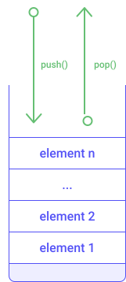
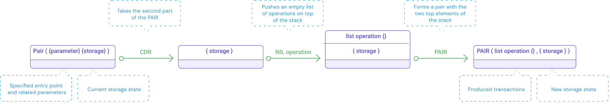

## Smart contracts in Michelson
Michelson is a domain-specific language and is designed to implement smart contracts. On Tezos, smart contracts are made of three parts:
- the **parameter** of the smart contract which describes the possible invocations of the smart contract (also called **entrypoints**) and their related arguments.
- the **storage**, i.e., the type definition of the persistent data structure associated with the smart contract.
- the **code** of the smart contract, i.e., a sequence of instructions to be executed when invoking the smart contract.

A smart contract is defined by these three parts (parameter, storage, code). An empty smart contract looks like this:

```js
parameter unit;
storage unit;
code { CDR ;
       NIL operation ;
       PAIR };
```

Let us now dig deeper into each part.

### Parameter (Entrypoints)
The **parameter** of the smart contract describes all possible invocations of the smart contract. An **entrypoint** is an invocable function of the smart contract and usually takes arguments. Each entrypoint has specific arguments and is composed of:

- the type definition of the expected argument of the entrypoint 
- the annotation (name) of the entrypoint

The example below shows a simple smart contract implementing a counter (it is not meant to be understood yet but illustrates the three parts of the smart contract).

```js
{ parameter (or (or (nat %add) (nat %sub)) (unit %default)) ;
  storage int ;
  code { AMOUNT ; PUSH mutez 0 ; ASSERT_CMPEQ ; UNPAIR ;
         IF_LEFT
           { IF_LEFT { ADD } { SWAP ; SUB } }
           { DROP ; DROP ; PUSH int 0 } ;
         NIL operation ; PAIR } }
```

Notice that the parameter describing possible invocations is defined as:

```js
(or (or (nat %add) (nat %sub)) (unit %default))
```

It has three possible invocations (add, sub, and default) specified in a single logical structure composed of _or_ operators. Since _or_ needs two operands, you have to nest them to include three or more invocations.


<small className="figure">FIGURE 1: Representation of a nested _or_ structure  to specify three entrypoints</small>

### Storage
The **storage** is a persistent memory space associated with the smart contract when it is deployed. The data structure of the storage is defined in the smart contract during the deployment phase.

Notice that, in our _Counter_ contract above, the type definition that describes the storage is:

```js
  storage int ;
```

In our case, it is only storing one integer number.

### Code
The **code** of the smart contract is a sequence of Michelson instructions separated by semi-colons `;`.

We will look into this in more details in [instructions](/michelson/instructions-reference) and [tutorial](/michelson/tutorial) chapters, but before that, let's have a quick overview of the Michelson language.

## Michelson overview
The Michelson language is the reference language for Tezos smart contracts. It is a low-level **stack-based** language (definition below). It is also **Turing-complete**, meaning it has all the basic operations to read/write/compare values in-memory, has infinite memory (up to the maximun gas use), and has conditional operators (e.g., _if_ and _switch_).

The Michelson language introduces data types for structuring data and instructions on these data types for manipulating data.

### Stack-based language
Generally speaking, a _stack_ data structure is a linear collection of elements that can be added or removed with `PUSH` and `POP` instructions. In the Michelson language, elements can be pushed to the top of the stack or removed from the top of the stack. This kind of stack is called LIFO (Last In First Out).


<small className="figure">FIGURE 2: Illustration of a stack</small>

In the [next chapter](/michelson/tutorial), we will look into basic stack manipulations powered by the Michelson language.

### Static typing
The Michelson language is strongly typed. All data inserted into the stack must be typed, and operators manipulating these data must respect the typing rules.

The Michelson language introduces primitive types for modeling data and composite types allowing for complex data structure definitions. It also introduces particular types for smart contract modeling.

The Michelson language provides basic type support on numbers, sequence of characters, logical expressions, and timestamps:
- `nat` represents a natural integer (e.g. 0, 3, 15)
- `int` represents a integer (e.g. -10, 2, 3)
- `string` represents a sequence of characters (e.g. "Hello")
- `bool` represents a boolean value (e.g. True, False)
- `bytes` represents a sequence of bytes (octet)
- `unit` represents a non-specified type.
- `timestamp` represents a duration (e.g. NOW, 1571659294, "2019-09-26T10:59:51Z"; i.e. a string following the RFC3339 standard)

Michelson also provides composite types for grouping properties:
- `set` represents an unordered collection of elements. It preserves the uniqueness of elements inside the collection (e.g. { 2; 4; 5; 7})
- `list` represents an ordered collection of elements of the same type (e.g. { 2; 4; 5; 3; 5 })
- `map` represents an associative array formed of key-value elements (e.g. { Elt "Hello" 1 }) 
- `big_map` is another representation of an associative array but can handle larger amounts of data
- `pair` represents a tuple of two elements (e.g., pair "World" 1).
- `option` is a predefined variant type used to express whether there is a value of some type or _none_.
- `or` is a variant type that can handle elements of different types.

Finally, Michelson provides specific types for smart contract modeling:
- `address` represents an identifier for a user account or a deployed smart contract (e.g., _tz1faswCTDciRzE4oJ9jn2Vm2dvjeyA9fUzU_)
- `mutez` represents the smallest quantity of the Tezos crypto-currency (1 tez = 1,000,000 mutez)
- `key` is a byte sequence representing a public key (e.g., _edpkuBknW28nW72KG6RoH..._ )
- `key_hash` represents a hashed key using a standard hashing function such as SHA512 (e.g., a string in base58 encoded form _tz1KqTpEZ7Yob7QbPE4Hy..._)
- `signature` is a byte sequence representing a message signed by a public key (e.g., _spsig1PPUFZucuAQybs5w..._)
- `chain_id` represents the network identifer (e.g., _0x7a06a770_, _NetXynUjJNZm7wi_)
- `operation` represents a transaction
- `contract` represents a contract interface used for contract interaction

We'll see examples of usage in the next chapters.

### Atomic computation
The Michelson language provides basic operations on these types:  
- numbers: addition, subtraction, multiplication, euclidean division, comparison
- string: split, concatenation, comparison
- crypto: standard hash function
- collection: standard collection manipulation (create, insert, remove, access, modification) 
- currency: standard operations on Tez crypto-currency
- smart contract: contract interactions, transfer, invocation of smart contracts, delegation

These instructions introduce basic programming concepts such as:
- conditional branching: The `IF` instruction family
- repetitive processing: `LOOP`, `ITER`, `MAP` instructions
- _Lambda_ functions: `LAMBDA` instruction
- structuring data: `PAIR`, `UNPAIR`, `CAR`, `CDR`, `LEFT`, `RIGHT` instructions, and `list`, `map`, `set` composite types
- contract communication: `CONTRACT`, `TRANSFER_TOKENS` instructions

### Gas model
A cost of execution (called **gas**) is associated with each Michelson instruction. This is the money that must be paid in order to execute the instructions. A maximun gas limit prevents the execution of infinite loop. 

Adding more memory space to the smart contract storage also has a cost (for each allocated byte).

When invoking a smart contract, one must specify the maximun amount of gas that can be spent to execute the code.

## Deployment - Address and balance
To be accessible to anyone on the Tezos network, a smart contract must be deployed. This deployment phase is called **origination**.

Tezos smart contracts have built-in internal information available once the smart contract has been deployed:
- its **address** of the smart contract, that is a unique identifier.
- its **balance**, representing the quantity of Tez owned by the smart contract.

## Invocation and transaction return (list of operations, storage)
The **invocation** of a smart contract is an explicit call for executing the smart contract code. It requires a call parameter which is a tuple of two elements (`PAIR`) containing:
- the value of the entrypoint
- the value of the storage (current storage state)

The invocation of the smart contract is expected to produce a tuple of two elements (`PAIR`) containing:
- a list of operations (which are the new transactions generated by this invocation, if any).
- the new storage state.

The list of operations represents all of the impacts your contract will have on the rest of the Tezos blockchain. The new storage state represents the impact your invocation will have on the contract storage.

The diagram below describes the execution of an "empty smart contract" (as seen in the previous section). Although this contract does not modify anything, it still has respect the input and output formats. 


<small className="figure">FIGURE 3: Execution of `CDR ; NIL operation ; PAIR`</small>

Notice that this script performs no modification on the blockchain. The storage is given as a parameter and returned modified.

## Explicit failure
When invoking a smart contract, the execution of the sequence of instructions may successfully finish. In this case, the transaction is considered finalized. If the execution of the sequence of instructions stops before the end, the transaction is considered to be rejected. The following chapters will introduce the Michelson instruction `FAIL` which is responsible for throwing an error in case of failed execution.