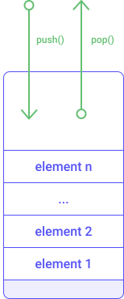

## Smart contracts in Michelson

Michelson is a domain-specific language and is designed for implementing smart contracts. Tezos smart contracts contain three main pieces of information:
- the **parameter** of the smart contract which describes the possible invocations of the smart contract (often called **entrypoints**) and related arguments.
- the type definition of the persistent data structure associated with the smart contract (referred to as **storage**).
- a sequence of instructions to be executed when invoking the smart contract (this is the **code** of the smart contract).

Basically, a smart contract is defined by those three pieces of information (parameter, storage, code) and an empty smart contract looks like this:

```js
parameter unit;
storage unit;
code { CDR ;
       NIL operation ;
       PAIR };
```

These three instructions will be described later in the "invocation" sub-section of this chapter and in the "Instructions" section.

### Entrypoint

The **parameter** of the smart contract describes all possible invocations of the smart contract.
An entrypoint is an invocable function of the smart contract which takes arguments. These arguments are specific to the entrypoint.

Each entrypoint is composed of:
- the type definition of the expected argument of the entrypoint 
- the annotation (name) of the entrypoint

> The following example is not meant to be understood yet but intends to illustrate the three parts of the smart contract. This example will be crystal clear after reading the [tutorial](/michelson/tutorial) section.

The example below (Counter contract) shows a simple smart contract implementing a counter: 

```js
{ parameter (or (or (nat %add) (nat %sub)) (unit %default)) ;
  storage int ;
  code { AMOUNT ; PUSH mutez 0 ; ASSERT_CMPEQ ; UNPAIR ;
         IF_LEFT
           { IF_LEFT { ADD } { SWAP ; SUB } }
           { DROP ; DROP ; PUSH int 0 } ;
         NIL operation ; PAIR } }
```

Notice that in the Counter contract the parameter describing possible invocations is defined as:

```js
(or (or (nat %add) (nat %sub)) (unit %default))
```

The three possible invocations (add, sub, and default) are specified in a single logical structure composed of logical _or_ operators. 
Since _or_ is a two-operand operator, we need a nested _or_ structure to represent 3 or more elements.


<small className="figure">FIGURE 1: Representation of the _or_ structure and how to specify the corresponding entrypoints (the identification of related entrypoints)</small>

We will delve into this more deeply in the code portion of the "union" section.

### Storage

The **storage** is a persistent memory space associated with the smart contract when it is deployed. The data structure of the storage is defined in the smart contract during the deployment phase.

Notice that in the Counter contract (above) the type definition that describe the storage is:

```js
  storage int ;
```

### Code

The **code** of the smart contract is a sequence of Michelson instructions separated by semi-colons `;`.

We will delve into this more deeply in "instructions" and "tutorial" sections, but before that let's have a quick overview of the Michelson language.

## Michelson overview

The Michelson language is the reference language for Tezos smart contracts. It is a low-level **stack-based** language and is also a **Turing-complete** language. This means it has basic operations allowing to read/write/compare values in-memory, has infinite memory, and allows conditional operators (e.g. _if_, _switch_ instructions).

The Michelson language introduces data types for structuring data and instructions on these data types for manipulating data.

### Stack-based language

Generally speaking, a _stack_ data structure is a linear collection of elements which can be added or removed respectively with the `PUSH` and `POP` instruction. In the Michelson language, elements can be pushed to the top of the pile or removed from the top of the pile. This kind of stack is called LIFO (Last In First Out).


<small className="figure">FIGURE 2: Illustration of a stack</small>

The [Tutorial](/michelson/tutorial) section describes basic stack manipulations allowed by the Michelson language.


### Static typing

The Michelson language is a strongly typed language. It means that all data inserted into the stack must be typed and operators manipulating these data must respect the typing rules.

The Michelson language introduces primitive types for modelling data and composite types allowing for complex data structure definitions. It also introduces very specific types for smart contract modelling.

The Michelson language provides basic type support on numbers, sequence of characters, logical expressions, and timestamps:
- `nat` represents a natural integer (e.g. 0, 3, 15)
- `int` represents a integer (e.g. -10, 2, 3)
- `string` represents a sequence of characters (e.g. "Hello")
- `bool` represents a boolean value (e.g. True, False)
- `bytes` represents a sequence of bytes (octet)
- `unit` represents a non-specified type.
- `timestamp` represents a duration (e.g. NOW, 1571659294, "2019-09-26T10:59:51Z"; i.e. a string following the RFC3339 standard)

Michelson also provides composite types for grouping properties:
- `set` represents an unordered collection of elements. It preserves the uniqueness of elements inside the collection (e.g. { 2; 4; 5; 7})
- `list` represents an ordered collection of elements of the same type (e.g. { 2; 4; 5; 3; 5 })
- `map` represents an associative array formed of key-value elements (e.g. { Elt "Hello" 1 }) 
- `big_map` is another representation of an associative array but can handle larger amounts of data
- `pair` represents a tuple of two elements (e.g. Pair "World" 1).
- `option` is a predefined variant type that is used to express whether there is a value of some type or _none_.
- `or` is a variant type that can handle elements of different types.

Michelson also provides specific types for smart contract modelling:
- `address` represents an identifier for a user account or a deployed smart contract (e.g. "tz1faswCTDciRzE4oJ9jn2Vm2dvjeyA9fUzU")
- `mutez` represents the smallest quantity of the Tezos crypto-currency (1 tez = 1,000,000 mutez)
- `key` is a byte sequence representing a public key (e.g. "edpkuBknW28nW72KG6RoH..." )
- `key_hash` represents a hashed key using a standard hashing function such as SHA512 (e.g. "tz1KqTpEZ7Yob7QbPE4Hy..."; i.e. a string in base58 encoded form)
- `signature` is a byte sequence representing a message signed by a public key (e.g. "spsig1PPUFZucuAQybs5w...)
- `chain_id` represents the network identifer (e.g. 0x7a06a770, "NetXynUjJNZm7wi")
- `operation` represents a transaction
- `contract` represents a contract interface used for contract interaction

The usage of these types is illustrated in the "Tutorial" and "Instructions" sections.

### Atomic computation

The Michelson language provides basic operations on these types:  
- numbers: addition, subtraction, multiplication, euclidean division, comparison
- string: split, concatenation, comparison
- crypto: standard hash function
- collection: standard collection manipulation (create, insert, remove, access, modification) 
- currency: standard operations on XTZ crypto-currency
- smart contract: contract interactions, transfer, invocation of smart contracts, delegation

A description of some of these operators is provided in the "Tutorial" section.

An exhaustive list of instructions for each type is described in the "Instructions" section.

These instructions introduce basic programming concepts such as:
- conditional branching: The`IF` instruction family.
- repetitive processing: `LOOP`, `ITER`, `MAP` instructions.
- "Lambda" functions: `LAMBDA` instruction.
- structuring data: `PAIR`, `UNPAIR`, `CAR`, `CDR`, `LEFT`, `RIGHT` instructions, and `list`, `map`, `set` composite types.
- contract communication: `CONTRACT`, `TRANSFER_TOKENS` instructions.

### Gas model

A cost in "gas" (i.e. the money that must be paid in order to execute the instructions) is associated with the execution of a Michelson instruction. This "gas" modelling prevents the execution from creating an infinite loop. 

It also represents and rewards the work that bakers have to endure to validate a transaction.

Adding more memory space to the storage of a smart contract also has a cost (for each allocated byte).

When invoking a smart contract, one must specify an amount of gas that will be spent for the execution of the code.

## Deployment - Address and balance

In order to be accessible to anyone on the Tezos network, a smart contract must be deployed. This deployment phase is called **origination**.

Tezos smart contracts have built-in internal information available once the smart contract has been deployed:
- the **address** of the smart contract is a unique identifier.
- the **balance** represents the quantity of XTZ associated with a smart contract. The smallest divisible part of a tez is a mutez (1 tez = 1,000,000 mutez).


## Invocation and transaction return (list of operations, storage)

The **invocation** of a smart contract is an explicit call for executing the code of the smart contract. It requires a call parameter which is a tuple of two elements (`PAIR`) containing:
- a value of the entrypoint
- the value of the storage (current storage state)

The invocation of the smart contract is expected to produce a tuple of two elements (`PAIR`) containing:
- a list of operations (which are new transactions generated by this invocation).
- the new storage state.

This list of operations represents all of the impacts your contract will have on the rest of the Tezos blockchain.
The new storage state represents the impact your invocation will have on the contract storage.

The diagram below describes the execution of the "empty smart contract" (seen in the previous section). Although this contract does not modify anything, it still has to fulfil the mentioned expectations (input and output format). 


<small className="figure">FIGURE 3: Execution of `CDR ; NIL operation ; PAIR`</small>

Notice that this script performs no modifications. Storage is given as a parameter and returned.

## Explicit failure

When invoking a smart contract, the execution of the sequence of instructions may finish. In this case, the transaction is considered finalized. If the execution of the sequence of instructions stops before the end, the transaction is considered to be rejected. The following sections will introduce the Michelson instruction`FAIL` which is responsible for throwing an error (for stopping the execution). 

Now, let's deep dive into the Michelson language with the "tutorial" section.
