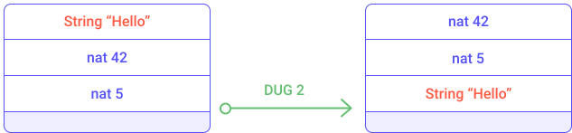
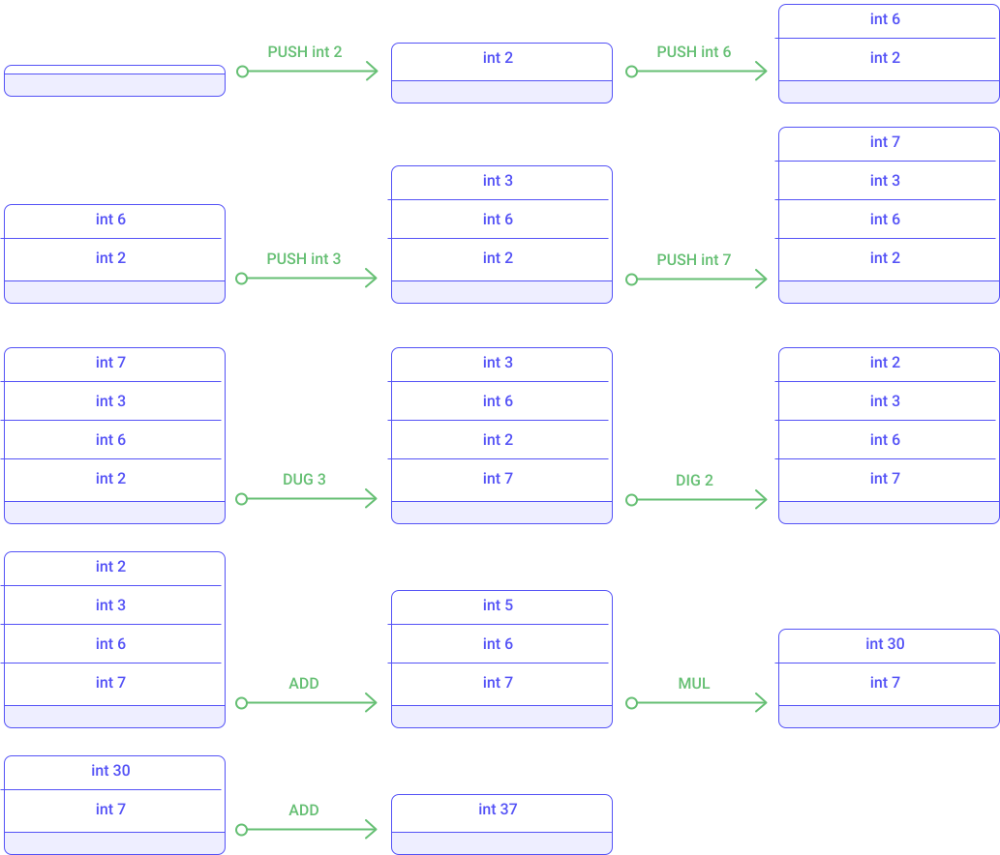
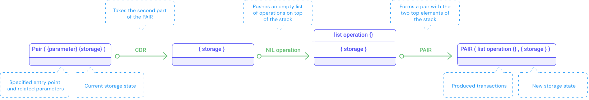
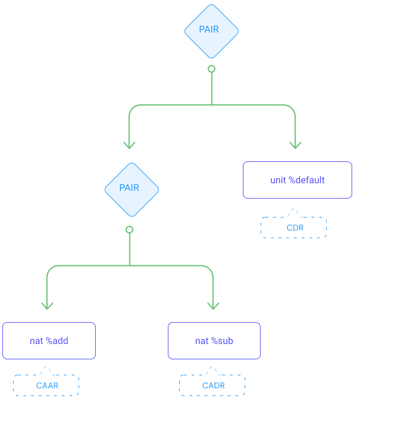
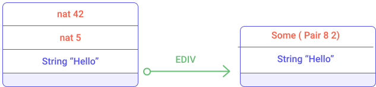
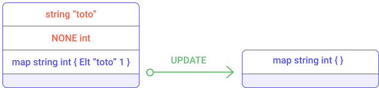
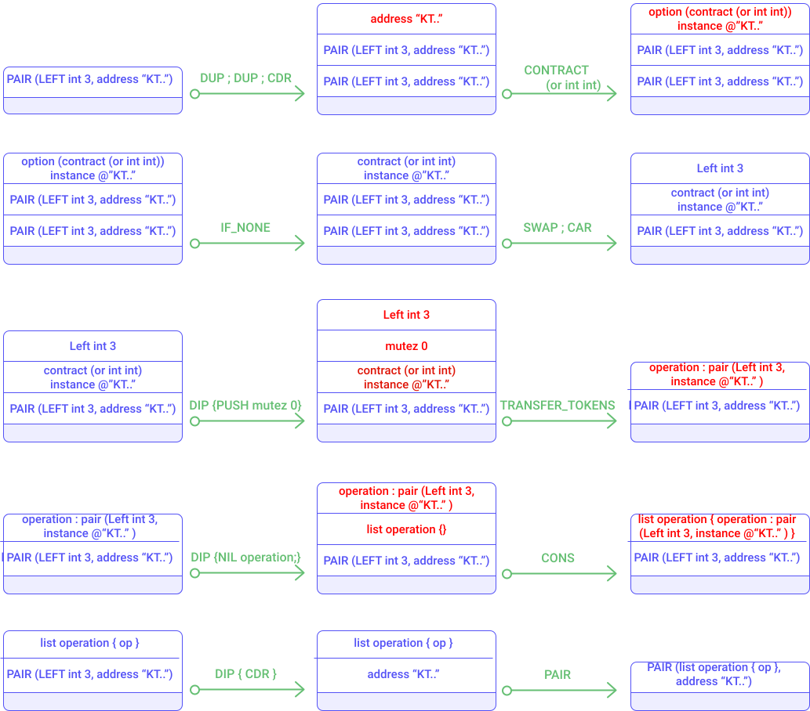

import NotificationBar from '../../src/components/docs/NotificationBar';

This section introduces the main concepts of the Michelson language. It begins with the basics of **stack manipulation** then focuses on primitive types and more complex **data structures**. Finally the chapter focuses on specific features related to smart contracts concepts.

### Stack programming
#### Basics
Michelson is a stack-based language, which means that all the data (manipulated by the program) is stacked on a single pile. The Michelson language provides stack operators to reorganize elements of the stack and other kinds of operators which consume the top elements of the stack. In this section, we will introduce basic stack-manipulation operators and illustrates them with simple examples. Then, in a second time, we will focus on the arithmetic operators and conditional branching.

##### Type checking
In order to operate Michelson instructions, certain type of elements are required to be in the stack and in a specific order. If these expectations are not met, the type checking of the Michelson script would fail and the execution of the smart contract would stop.

##### Basic stack operators (PUSH DROP SWAP)
The code of a smart contract is defined as a **sequence** of Michelson instructions. The **sequence** structure is defined by `{` and `}`, and contains instructions separated by `;` (semi-colon). When executing a sequence, the interpreter executes each instruction sequentially, one after the other, in the specified order.

```js
{ instruction1 ; 
  instruction2 ; 
  ... ; 
  instruction n }
```

<NotificationBar>
  <p>
  
The Michelson language must respect a precise indentation. Each instruction that introduces a new block must indent its content. It is recommended to have a single instruction per line. For instance, the `IF` instruction introduces two sequences of instructions (the `then` clause and `else` clause) which must be indented as shown below.

  </p>
</NotificationBar>

```
code { instruction1;
       instruction2;
       IF
              { then_clause }
              { else_clause };
       instruction4;
}
```

Let's describe the basic instructions (PUSH, DROP, SWAP) that manipulates stack elements.

The `PUSH` instruction adds an element at the top of the stack. The value and the type of the element pushed must be specified.

For example, the instruction `PUSH nat 1` adds an element `1` as a natural integer (i.e., a positive integer) on top of the stack. The instruction `PUSH string "Hello"` adds an element "Hello" as a string on top of the stack.

The `DROP` instruction removes the top element of the stack.

The following diagram executes the sequence `{ PUSH nat 1; DROP }` which illustrates the `PUSH` and `DROP` usage.


<small className="figure">FIGURE 1: Execution of `PUSH` and `DROP`</small>

The `SWAP` instruction inverts the position of the top two elements of the stack.


<small className="figure">FIGURE 2: Illustration of the `SWAP` instruction</small>

The `DUP` instruction duplicates the top element of the stack and prevents the loss of variables since most instructions consume and remove elements from the stack. Later examples will illustrate this further.


<small className="figure">FIGURE 3: Illustration of the `DUP` instruction</small>

##### Stack manipulation using arithmetic operators
Once elements are added to the stack, they can be combined using arithmetic operators such as addition (`ADD`) and multiplication (`MUL`). Other arithmetic operators are described in the **Instructions/Operations on numbers** section.

The `ADD` instruction sums the top two elements of the stack and `MUL` multiplies them. The result is then pushed on top of the stack.


<small className="figure">FIGURE 4: Illustration of the `ADD` instruction</small>

More complex computation can be done. For instance, the mathematical expression `((2 + 3) * 6) + 7` is equivalent to the following sequence:

```js
PUSH int 2;
PUSH int 3;
ADD;
PUSH int 6;
MUL;
PUSH int 7;
ADD
```

The following diagram illustrates the execution of the sequence.


<small className="figure">FIGURE 5: Illustration of the arithmetic operators</small>

##### Other basic stack operators (DIG DUG)
Other instructions allow you to change the position of elements in the stack such as `DIG` and `DUG`. Other stack operators are described in the "Stack operations" section.

The `DIG n` instruction moves the n-th element of the stack to the top of the stack.


<small className="figure">FIGURE 6: Illustration of the `DIG` instruction</small>

The `DUG n` instruction moves the top element of the stack to the n-th element of the stack.


<small className="figure">FIGURE 7: Illustration of the `DUG` instruction</small>

For example, the mathematical expression `((2 + 3) * 6) + 7` is equivalent to the following sequence of instructions:

```js
PUSH int 2;
PUSH int 6;
PUSH int 3;
PUSH int 7;
DUG 3;
DIG 2;
ADD;
MUL;
ADD
```

The following schema illustrates the execution of this sequence of instructions.


<small className="figure">FIGURE 8: Illustration of the `DUG` and `DIG` instructions</small>

Now that we have seen the basic of stack operators, we are able to re-organize elements of the stack. These stack operators will be useful to prepare the stack for more complex operators that require precise elements in a specific order on the top of the stack.

##### Conditional branching
The Michelson language provides the possibility to execute a part of the code, depending on some criteria. This is called conditional branching, and some instructions exist for this intent.

The `IF {} {}` instruction allows branches of execution to be created. It takes two sequences as arguments. It expects a boolean at the top of the stack. It consumes the top element and executes the first given sequence if this boolean top element is *True*. Otherwise it executes the second sequence.

In order to illustrate the conditional branching, let's explain the following sequence of instructions.

```js
IF 
{ PUSH int 1 }
{ PUSH int 2 }
```

This snippet of code is equivalent to the expression `if True then 1 else 2`. It checks the top element of the stack and ensures it is a boolean and consumes it. If the value of this top element is _True_ then the value 1 is pushed onto the stack otherwise value 2 is pushed. 

This other example removes one of the top elements of the stack. If the top element is a boolean _True_ then the next element is removed or the one after is removes.

```js
IF 
{ DROP }
{ SWAP; DROP }
```

The following diagrams illustrates the modification of the stack while executing the `IF { DROP }` instruction part.


<small className="figure">FIGURE 9: Illustration of the `IF` instruction (true case)</small>

The following diagrams illustrates the modification of the stack while executing the `IF { SWAP; DROP }` instruction part.


<small className="figure">FIGURE 10: Illustration of the `IF` instruction (false case)</small>

The conditional branching can be combined with other instructions, such as the comparison. 

##### Comparison
Elements of the stack can be compared if they belong to the same class of types (called **comparable**). For example, two integers can be compared but an integer and a string cannot, because they don't belong to the same class of comparable types.

Since primitive types are different by design, each primitive type is comparable to itself (e.g. there is no meaning in comparing a string to a number). Basically, numbers (_nat_, _int_, _mutez_, _timestamp_) are compared numerically, sequence of characters (_string_, _bytes_, _key_hash_, _key_, _signature_, _chain_id_ values) are compared lexicographically.  

For _pair_ values such as `(Pair d1 d2)`, the comparison is done component-wise, starting with the left component.
For _option_ values, the `None` value is considered less than `Some` value, and comparing `Some x` and `Some y` is done by comparing `x` and `y`.
These two types (_option_ and _pair_) will be introduced later in this tutorial.

The `COMPARE` instruction compares the top two elements of the stack. It consumes the two top elements and returns an integer at the top of the stack. The outcome value is `-1` if the first element is smaller than the second one; `0` if the two first elements are equal; `1` otherwise.


<small className="figure">FIGURE 11: Illustration of the `COMPARE` instruction</small>

The `EQ` instruction consumes the top element and returns a boolean on top of the stack. It returns _True_ if this value is zero, _False_ otherwise. 

The combination of the `COMPARE` and `EQ` instructions allows you to create boolean conditions based on a number comparison. The following sequence verifies if two numbers are equal and returns a boolean answer on top of the stack.

```js
COMPARE;
EQ
```


<small className="figure">FIGURE 12: Illustration of number comparison</small>

Other comparison instructions are available to check if a number is lower or equal to zero (`LE` instruction) or greater than zero (`GT` instruction). The list of comparison operators is described in the **Generic comparison** section.

##### Conditional branching based on number comparison
The combination of the `COMPARE`, `LE` and `IF` instructions allows you to apply conditional branching by comparing two numbers. The following sequence of instructions assumes that two integers are on top of the stack and removes the smaller one.

```
DUP;
DUG 2;
SWAP;
DUP;
DUG 2;
DUG 3;
COMPARE;
LE;
IF { DROP } { SWAP; DROP }
```

Notice that the `DUP; DUG 2; SWAP; DUP; DUG 2; DUG 3` sequence duplicates the top two elements of the stack. The `COMPARE; LE` sequence determines which is the biggest number and the `IF { DROP } { SWAP; DROP }` sequence removes the smallest number.


<small className="figure">FIGURE 13: Illustration of conditional branching based on number comparison</small>

##### More stack operator (`DIP`, `CMPLE`)
This principle of duplicating the top two elements of the stack and comparing them to choose one of them is a common pattern. Some syntactic sugar (i.e. a "shortcut" instruction that combines many of the language's basic instructions) and macros have been introduced in the Michelson language to ease these common patterns. 

For example, the macro `CMPLE` stands for `COMPARE; LE`. A more exhaustive list is available in the **macros** section.

Notice that the duplication of the top two elements of the stack is not an optimal sequence. It is intended to be like this in order to illustrate the `DUG` instruction, but some better implementation can be done with the `DIP` instruction.

The `DIP` instruction runs a provided sequence of instructions while protecting the _n_ top elements of the stack.

The `DIP` instruction takes two arguments:
- _n_: a number of elements to protect (by default 1)
- _code_: a sequence of instructions to execute

This instruction can be very useful. For example, let's re-write the duplication of the top two elements of the stack with the `DIP` instruction.

The following sequence of instructions expects two integers on top of the stack and removes the smaller one.

```
DIP { DUP };
DUP;
DIP { SWAP };
CMPLE;
IF { DROP } { SWAP; DROP }
```


<small className="figure">FIGURE 14: Illustration of conditional branching based on number comparison</small>

### Primitive types support
The Michelson language supports only few primitive data types:
- `nat` represents a natural integer (e.g. 0, 3, 15)
- `int` represents a integer (e.g. -10, 2, 3)
- `string` represents a sequence of characters (e.g. "Hello")
- `bool` represents a boolean value (e.g. True, False)
- `bytes` represents a sequence of bytes (octet)
- `unit` represents a non-specified type.
- `timestamp` represents a duration (e.g. NOW, 1571659294, "2019-09-26T10:59:51Z"; i.e. a string following the RFC3339 standard)

Notice that there is no floating-point type supported (such as _float_).

<NotificationBar>
  <p>
  
It is worth mentioning that there is no limit to the value of numbers (_nat_, _int_) or length of strings (_string_, _bytes_) other than the storage limit and gas limit (specified in the Tezos protocol). Therefore there is no risk of overflow errors.

  </p>
</NotificationBar>

Other Tezos specific types such as `tez` and `address` will be listed and explained later.

The Michelson language also allows for the manipulation of these types, but before going on primitive type, let's introduce the _unit_ type, the _optional_ (i.e. the _option_ type) and the _pair_ type.

#### Default `UNIT` type 
The `UNIT` instruction pushes a `Unit` value of type _unit_ on top of the stack. The _unit_ type stands in many contexts for nothing:
- an empty structure in case of storage. 
- an empty entry point in case of a parameter.
- an empty argument in a function. 

The `Unit` value represents the value of a _unit_ type.


#### Stopping the execution of the smart contract with `FAILWITH`

The `FAILWITH` instruction aborts the execution of the Michelson script which implies the cancellation of all storage modifications and other smart contract invocations.

The `FAILWITH` instruction consumes the top element of the stack as arguments (usually a string message). The consumed element must be a push-able type. It is allowed to stop the execution of a Michelson script without a message by pushing a `UNIT` value on top of the stack.


The `FAIL` keyword has been provided as a replacement for `UNIT; FAILWITH`.

Actually, the `FAIL` keyword is not an instruction but a syntactic sugar.

A `FAILWITH` instruction provides a way to reject a transaction by stopping the execution of related instructions.


#### Optional

An optional value is a data structure that can hold a value (of a given type) which can be not assigned yet. The optional value has two states: it is defined as `NONE` if no value is assigned and can be defined as `SOME` if a value has been assigned.

When defining an optional value, the type of value must be specified (e.g. `option int`).

The `IF_SOME` instruction allows to check and retrieve the value if it has been assigned.

The `SOME` instruction packs a value as an optional value (i.e. allows to create an _option_ type with an assigned value).

The `NONE` instruction specifies the absence of value. It requires that the type of value that can be held be specified.

This _option_ type is very useful for all process that may fail such as:
- Euclidean division (division by zero) 
- slicing a string (out of bound error)
- accessing an element in a collection (non-existence of the element)
- invoking an other contract (entrypoint name and type verification)

Rather than causing an error, the examples above make use of optional values to specify a special case to handle.

A Michelson smart contract is expected to explicitly handle all possible cases; especially the case where the process produces an option with no value.

All these cases will be detailed in their respective sections.

##### Using optional

The `IF_NONE bt bf` instruction inspects an optional value.
It requires two sequences of instructions, like with an `IF` instruction.
It executes the first sequence if the optional value has no value assigned, otherwise it executes the second sequence of instructions (where a value has been assigned with a `SOME` instruction).

If the `IF_NONE` instruction encounters a NONE value it consumes it and then start executing the first sequence.  
If the `IF_NONE` instruction encounters a SOME value it does not consumes it and then starts executing the second sequence.


<small className="figure">FIGURE 15: Illustration of the `IF_NONE` instruction</small>


<small className="figure">FIGURE 16: Illustration of the `IF_NONE` instruction</small>

Michelson also introduces the `IF_SOME bt bf` instruction which retrieves the value behind an optional and executes the first sequence if it encounters a SOME value. It executes the second sequence if it encounters a NONE value.


#### PAIR

The Michelson language introduces the _pair_ type which defines a data structure containing multiple fields. 

A _pair_ type is a tuple of 2 elements.

A  _pair_ type can contain values of any type, from primitive types (`nat`, `string`, `int`) to advanced composite types such as `list`, `map`, `set`, `lambda` function or `union`.

##### creating and destructuring pairs

The `PAIR` instruction takes the top two elements of the stack and pushes back on top of the stack a pair containing these two elements.

The `UNPAIR` instruction takes the top element of the stack and ensures it is a _pair_ type. It pushes back on top of the stack the two elements of the _pair_.


<small className="figure">FIGURE 18: Illustration of the _PAIR_ and _UNPAIR_ instructions</small>

Notice that the `UNPAIR` instruction expects a _pair_ element on top of the stack. 

Similarly, the `PAIR` instruction expects two elements in the stack. 

##### Accessing to elements of a _PAIR_

The `CAR` instruction consumes the top element of the stack (which must be a `PAIR`) and pushes back on the top of the stack the left part of the pair.


<small className="figure">FIGURE 19: Illustration of the `CAR` instruction</small>

The `CDR` instruction consumes the top element of the stack (which must be a `PAIR`) and pushes back on top of the stack the right part of the pair.


<small className="figure">FIGURE 20: Illustration of the `CDR` instruction</small>

These `CDR` and `CAR` instructions are useful to retrieve a part of a _PAIR_. As seen in the "Smart contract" section, when invoking a smart contract, the initial stack is defined by a _PAIR_ containing the parameter of the invoked entrypoint and the current storage value.

Now that we introduced basic instructions (like `CDR` and `PAIR`) we can explain the empty contract seen in the "Smart contract" section.

```js
parameter unit;
storage unit;
code { CDR ;
       NIL operation ;
       PAIR };
```


<small className="figure">FIGURE 21: Execution of `CDR ; NIL operation ; PAIR`</small>

Notice that the `CDR` instruction retrieves the right part of the initial _PAIR_. The `NIL operation` pushed an empty list of operations on top of the stack. The _PAIR_ instructions forms a _pair_ type with the empty list of operations and the initial storage.

The next section will explain the list operators (`NIL operation`).

##### Nested pairs
Michelson language doesn't directly support tuples of more than 2 elements, but we can instead create **nested pairs**. For example, the following nested _pair_ `PAIR (PAIR nat 5, string "Hello") int 37` contains a natural integer 5, a string "Hello" and an integer 37.


<small className="figure">FIGURE 17: Illustration of the C[AD]+R macro</small>

The creation of a _nested pair_ consists of a succession of `PAIR` instructions (which reorganizes elements in the stack). This may become a fastidious exercise with large _nested pairs_. The Michelson language supports these nested pairs by providing the `PAPPAIIR` macros for creating _nested pair_ in a single instruction.

Similarly, the Michelson language provides the `UNPAPPAIIR` macro for destructuring _nested pairs_.

Similarly, the Michelson language provides the `C[AD]+R` macro for accessing a specific field inside a _nested pair_. For example, the `CAAR` macro stands for `{ CAR; CAR }` and `CADAR` macro stands for `{ CAR; CDR; CAR }`.


<small className="figure">FIGURE 22: Illustration of the C[AD]+R macro</small>

These macros are described in the "Instructions" section (in the "macros" sub-section).

Here is an example of a smart contract that stores a natural integer in its storage and receives a nested pair (containing a _nat_ , a _string_ and an _int_) as the parameter. It only takes the nat part of the nested pair and adds it to the storage.

```
parameter (pair (pair (nat) (string)) (int));
storage nat;
code { UNPAIR;
       CAAR;
       ADD;
       NIL operation ;
       PAIR }
```

Notice that the `UNPAIR` separates the entry point and the storage.

Notice that the `CAAR` extracts a single field from the _nested pair_. The `CAAR` macro only retrieves the _nat_ field of the parameter; it is equivalent to `{ CAR; CAR }`.

This smart contract can be simulated with the CLI command:
```
tezos-client run script instruction_caar.tz on storage '9' and input 'Pair (Pair 2 "toto") -23'
```

Notice that defining a Michelson expression containing a _pair_ in CLI expects a `Pair` keyword (which is different from _pair_ type or `PAIR` instruction).

<NotificationBar>
  <p>
  
Annotation usage is recommended when creating complex types and nested _pairs_ (see [Annotation](/michelson/instructions-reference#annotation) section)

  </p>
</NotificationBar>

#### Numbers
Now let's focus on primitive types such as numbers.

There are two number types in Michelson. The _nat_ type represents natural integers and the _int_ type represents integers.

##### Standard arithmetic operations
Standard arithmetic operations are supported by the Michelson language on _nat_ and _int_ types.

The `ADD` instruction computes additions on _nat_ and _int_. It consumes the top two elements of the stack and pushes back the addition of the two elements on top of the stack.


<small className="figure">FIGURE 23: Illustration of the `ADD` instruction</small>

The `SUB` instruction computes subtractions on _nat_ and _int_. It consumes the top two elements of the stack and pushes back the difference of the two elements on top of the stack.

Notice that the subtraction of two natural integers (or of a natural integer and an integer) produces an integer (since the expression `2 - 4` produces a number smaller than 0).


<small className="figure">FIGURE 24: Illustration of the `SUB` instruction</small>

The `MUL` instruction computes multiplications on _nat_ and _int_. It consumes the top two elements of the stack and pushes back the product of these two elements on top of the stack.

Notice that the multiplication of a natural integer and an integer produces an integer.


<small className="figure">FIGURE 25: Illustration of the `MUL` instruction</small>

The `EDIV` instruction computes Euclidean divisions on _nat_. The Euclidean division computes the quotient and the remainder between two numbers.

If the divisor is equal to zero, it returns an _option_ type with the assigned value _None_. Otherwise, it applies the Euclidean division and returns an _option_ type containing the result (i.e. a _pair_ composed with the quotient and the remainder). 


<small className="figure">FIGURE 26: Illustration of the `EDIV` instruction</small>

##### Conversions `int` <-> `nat`
The Michelson language also provides instructions to cast an integer into a natural integer with the `ABS` instruction. Respectively the `INT` instruction casts a natural integer into an integer.

The `ABS` instruction consumes an integer on top of the stack and pushes back the absolute value of this integer as a _nat_ value. 


<small className="figure">FIGURE 27: Illustration of the `ABS` instruction</small>

The following smart contract illustrates the `ABS` usage. It receives an integer as an input parameter, computes the absolute value and adds it to the storage.

```
parameter int;
storage nat;
code { UNPAIR;
       ABS;
       ADD;
       NIL operation ;
       PAIR }
```

The smart contract can be simulated with the CLI command:
```
tezos-client run script instruction_abs.tz on storage '9' and input '-2'
```
The resulting storage has a value of 11.

#### String
The `string` type represents a sequence of characters and a _string_ value is composed of a sequence of ASCII printable characters (accents are not included).

A _string_ value can be split and two _string_ values can be concatenated or linked together. A _string_ can be compared to an other _string_.

Like for numbers, a _string_ can be pushed on top of the stack with the `PUSH` instruction.
```js
PUSH string "Hello World"
```

The `SIZE` instruction consumes a string of the top of the stack and pushes the number of characters contained in the string element.

The `CONCAT` instruction concatenates strings. It consumes the two top elements and produces a string (concatenation of the two top elements) that is placed on top of the stack. The `CONCAT` instruction also works with a list of strings. 

For example, the following smart contract concatenates a given string at the end of the storage.

```
parameter string;
storage string;
code { UNPAIR ;
       SWAP ;
       CONCAT;
       NIL operation ;
       PAIR }
```

This smart contract can be simulated with the CLI command:
```
tezos-client run script instruction_string_example.tz on storage '"one"' and input '"two"'
```

The `SLICE` instruction provides a way to retrieve a part of a string.
It requires these three elements at the top of the stack and in this order:
- an `offset` argument indicating the beginning of the substring 
- a `length` argument indicating the size of the substring
- a `string` to slice

It returns an optional string because the given offset may be out of bound. 


<small className="figure">FIGURE 28: Illustration of the `SLICE` instruction</small>

For example, the following smart contract retrieves the first 5 characters of a given string and store them in the storage.

```
parameter string;
storage string;
code { CAR;
       PUSH nat 5;
       PUSH nat 0;
       SLICE;
       IF_SOME {} { FAIL };
       NIL operation ;
       PAIR }
```

This smart contract can be simulated with the CLI command:
```
tezos-client run script instruction_string_example2.tz on storage '""' and input '"Hello World"'
```

The `COMPARE` instruction allows two strings to be compared. It consumes the top two elements of the stack and pushes an integer to the top. If the first element is lexically greater than the second, then it returns 1. If the first element is lexically equal to the second element, then it returns 0. If the first element is lexically smaller than the second element, then it returns -1.

#### Boolean logic
Like most languages, the Michelson language supports boolean logic with a _bool_ type and standard boolean operators `OR` `AND` `XOR` `NOT`.

These boolean operators are useful mixed with `IF` instruction for creating complex conditions.

The `OR` instruction consumes the top two boolean elements of the stack and pushes back on top of the stack a logical _OR_ of both elements.


<small className="figure">FIGURE 29: Illustration of the `OR` instruction</small>

The `AND` instruction consumes the top two boolean elements of the stack and computes a logical _AND_ of the two elements.


<small className="figure">FIGURE 30: Illustration of the `AND` instruction</small>

The `XOR` instruction consumes the top two boolean elements of the stack and computes an exclusive logical _OR_ of the two elements.


<small className="figure">FIGURE 31: Illustration of the `XOR` instruction</small>

The `NOT` instruction consumes a boolean top element of the stack and pushes the logical opposite of the given boolean. 

#### Timestamp

The Michelson language supports the `timestamp` type. Like in most languages, a timestamp represents a number of seconds passed since the beginning of year 1970. 
Timestamps can be used in a smart contract to authorize actions on a certain period of time.  

Timestamps can be obtained by the `NOW` operation, or retrieved from script parameters or globals.

The `NOW` instruction pushes on top of the stack the timestamp of the block whose validation triggered this execution. This timestamp does not change during the execution of the contract.

This small contract registers when it is invoked, by saving the `NOW` timestamp in the storage.

```
parameter unit;
storage timestamp;
code { DROP;
       NOW;
       NIL operation;
       PAIR }
```
The `DROP` instruction empties the single data on the stack. The `NOW` instruction pushes on top of the stack the timestamp of the block. And finally, `NIL operation; PAIR` instructions encapsulate the returned timestamp (i.e. the new storage state) with an empty list of operations.

This second small contract registers when it is invoked, by storing in a list of timestamps the `NOW` timestamp of its transaction.

```
parameter unit;
storage (list timestamp);
code { CDR;
       NOW;
       CONS;
       NIL operation ;
       PAIR }
```

The `CDR` instruction retrieves the storage part. The `NOW` instruction pushes on top of the stack the timestamp of the block. And finally the `CONS` operator adds an element in a _list_.

This smart contract can be simulated with the CLI command:
```
tezos-client run script instruction_timestamp.tz on storage '{ "2021-04-01T12:43:31Z" }' and input 'Unit'
```

Notice that the storage (i.e. a list of timestamps) is initialized with a _timestamp_ value in string format `"2021-04-01T12:43:31Z"`.

##### Standard timestamp operations
The `ADD` instruction increments a timestamp of the given number of seconds. The number of seconds must be expressed as an `int`.

The `SUB` instruction subtracts a number of seconds from a timestamp. It can also be used to subtract two timestamps and obtain an _int_ that represents the difference as a number of seconds.

For example, this smart contract when invoked computes the delay between two timestamps, and keeps it in the storage.

```
parameter (pair timestamp timestamp);
storage int;
code { CAR;
       UNPAIR;
       SUB;
       NIL operation ;
       PAIR }
```

The `CAR` instruction retrieves the parameter value. The `UNPAIR` instruction pushes on top of the stack the two given timestamps. And finally the `SUB` operator computes the difference between the two timestamps.

This smart contract can be simulated with the CLI command:

```
tezos-client run script instruction_timestamp2.tz on storage '0' and input 'Pair "2021-04-01T12:43:31Z" "2021-04-01T12:42:31Z"'
```

##### Comparing timestamps
The `COMPARE` computes timestamp comparison. It returns an integer, as with the `COMPARE` instruction for an integer.

It returns `1` if the first timestamp is bigger than the second timestamp, `0` if both timestamps are equal, and `-1` otherwise. 

#### Bytes
Bytes are used for serializing data in order to check signatures and to compute hashes on them. They can also be used to incorporate data from the untyped outside world.

The Michelson language provides _bytes_ supports with common operators like for _string_ type. It also provides standard serialization and de-serialization. 

A _bytes_ values is composed by a sequence of hexadecimals prefixed by a `0x` (e.g. `0xa47ef2`).

##### Serialization
The `PACK` instruction serializes any value of packable type to its optimized binary representation. All types are packable with the exception of _operation_ and _big_map_ types.
It consumes the top element of the stack and push back the corresponding _bytes_ value on top of the stack.


The `UNPACK` instruction de-serializes a piece of data, if valid. It returns an *option* initialized to *None* if the de-serialization is invalid, or an *option* initialized to *Some* if valid.

##### Standard operators
The `CONCAT` instruction concatenates two byte sequences. It can also be applied to a list of byte sequences. It consumes a list of byte sequences and pushes the concatenation of all sequences (in the respective order). The _list_ data structure will be explained later in this tutorial.

The `SIZE` instruction computes the size of a sequence of bytes. It consumes a byte sequence and pushes the number of bytes of the sequence.

The `SLICE` instruction provides a way to retrieve a part of a byte sequence.
It expects the following elements on top of the stack:
- an `offset`, indicating the beginning of the byte sequence 
- a `length`, indicating the size of the sub-sequence
- a `byte sequence` to slice

It returns an optional byte sequence because the given offset and length may be out of bound.

The following smart contract illustrates the slicing of bytes. It expects a _bytes_ value as parameter and saves in the storage the first 3 bytes. Otherwise if the offset or length elements do not fit the given _bytes_ value then it fails.

```
parameter bytes;
storage bytes;
code { CAR ;
       PUSH nat 3;
       PUSH nat 1;
       SLICE ;
       IF_NONE { FAIL } {};
       NIL operation ;
       PAIR }
```

This smart contract can be simulated with the CLI command:

```
tezos-client run script instruction_bytes_slice.tz on storage '0x00' and input '0x12a47ef2'
```

This command would produce a new storage value `0xa47ef2`.

The following command will fail (out-of-bound access) due to a too short _bytes_ value.  

```
tezos-client run script instruction_bytes_slice.tz on storage '0x00' and input '0x12a47e'
```

##### Comparing bytes
The `COMPARE` instruction computes a lexicographic comparison. As with other `COMPARE` instructions, it returns 1 if the first sequence is bigger than the second sequence, 0 if both byte sequences are equal, or -1 otherwise.

The following smart contract concatenates the given bytes with the ones in the storage only if the parameter value is 0x12. Otherwise it fails.

```
parameter bytes;
storage bytes;
code { UNPAIR;
       DUP;
       PUSH bytes 0x12;
       COMPARE;
       EQ;
       IF { CONCAT } { FAIL };
       NIL operation ;
       PAIR }
```

This smart contract can be simulated with the CLI command:
```
tezos-client run script instruction_bytes.tz on storage '0xa2' and input '0x12'
```

### Working with complex data structures
Since the beginning we have used simple data structures such as primitive types (_int_, _nat_, _string_, _pair_ and _option_) but more complex types can be designed. 

The storage of the smart contract can store a single type which can combine composite types and _pairs_ to create a complex data structure. Let's take a deeper dive into composite data types.

A composite structure integrates many fields and can organize them in many ways. 

There are 5 kinds of composite data structures: 

- **ordered list** of elements with type _list_
- **set** of unique elements with type _set_
- an **associative array** (a collection of key-value pairs) implemented with the type _map_
- a **union** (i.e. an exclusive composite type) implemented with nested _or_ structure.
- an **optional** implements a type holding a value which handles an uninitialized state if a value hasn't been assigned.  (seen in the previous section)
- **records** containing multiple fields implemented with nested _PAIR_ structure (seen in the previous section). Notice that _records_ is not a reserved word of the language but just symbolizes the concept represented by nested pairs.

#### LIST
The `list` type represents an ordered collection of elements of the same type. A _list_ can contain multiple occurrences of the same value. For example, here is a list of integers `{ 2; 4; 5; 3; 5 }`.

##### Building a list
The `NIL` instruction pushes an empty list on the top of the stack. When creating a _list_ the type of list elements must be specified. For example, `NIL operation` pushes an empty list of operations on the top of the stack. Similarly `NIL int` pushes an empty list of integers on top of the stack.


<small className="figure">FIGURE 32: Illustration of the `NIL` instruction</small>

##### Adding an element in the list
The `CONS` instruction allows you to add an element at the beginning of a list. It expects an element and a list on top of the stack, consumes them and pushes back the updated _list_ on top of the stack.


<small className="figure">FIGURE 33: Illustration of the `CONS` instruction</small>

To illustrate the _list_ type usage take a look at the following smart contract.

```
parameter int ;
storage (list int);
code { UNPAIR ;
       CONS;
       NIL operation ;
       PAIR }
```

The unique entry point of smart contract expects an integer as input (`parameter int`).
Notice that the storage of this smart contract is defined as a list of integers declared with `(list int)`.
This smart contract concatenates the given integer at the beginning of the integer list and returns the updated list as the new state of the storage.

This smart contract can be simulated by running the following CLI command:

```
tezos-client run script max_list.tz on storage '{1;2;5;3}' and input '12'
```

Notice that in the CLI command the integer list is specified by `{1;2;5;3}`. 

##### Removing the top element of the list
The `IF_CONS bt bf` instruction inspects a list. It requires two sequences of instructions (bt anf bf), as with the `IF` instruction.

This instruction removes the first element of the list, pushes it on top of the stack and executes the first sequence of instructions (`bt`). If the list is empty, then the second list of instructions is executed (`bf`).

This `IF_CONS` instruction allows you to inspect the first element of the list (and verifies the list is not empty). It also allows to relocate elements of a list or to filter elements of a list. 

As illustration purpose, the following smart contract stores a list of integer. When invoked, the smart contract modifies the storage by multiplying by 2 the first element of the list (and if the list is empty then it add element `1` in the list. 

```
parameter unit ;
storage (list int);
code { CDR ;
       IF_CONS { PUSH int 2; MUL; CONS } { NIL int; PUSH int 1; CONS };
       NIL operation ;
       PAIR }
```

Notice that the entry point expects a value of type `unit` (i.e. no value expected).

The smart contract can be simulated with the following CLI command:

```
tezos-client run script instruction_ifcons3.tz on storage '{1;2;5;3}' and input 'Unit'
```

and

```
tezos-client run script instruction_ifcons3.tz on storage '{}' and input 'Unit'
```

Notice that the given parameter value is `Unit` of type `unit`.

##### Using list (MAP, ITER, SIZE)
Other list operators are available to apply a process on a list.

The `SIZE` instruction computes the number of elements in the list.
It consumes a list on the top of the stack and pushes the number of elements of the list back on top of the stack.

The `MAP {}` instruction updates a _list_ data structure by applying a sequence of instructions to each element of the list. It takes a _list_ element on top of the stack, applies the given sequence of instruction for each element and in the end, it produces a new list on top of the stack. 

The given sequence of instructions (i.e. called "body") has access to the stack, thus complex algorithms can be implemented. 

The following smart contract illustrates the `MAP` usage. This smart contract holds a list of integer in its storage and when invoked it increments each integer of the list by 1.

```
parameter unit ;
storage (list int);
code { CDR ;
       MAP { PUSH int 1; ADD };
       NIL operation ;
       PAIR }
```

This smart contract can be simulated with the following CLI command:
```
tezos-client run script instruction_list_map.tz on storage '{1;2;5;3}' and input 'Unit'
```

The `ITER {}` instruction iterates on all elements of a _list_ and applies a sequence of instructions to each element. The `ITER` instruction requires a sequence of instructions (called "body") that has access to the stack.

For example, the following smart contract computes the sum of a list of integers (given as parameter). The resulting sum is stored in the storage.

```
parameter (list int);
storage int;
code { CAR ; DIP { PUSH int 0 };
       ITER { ADD };
       NIL operation ;
       PAIR }
```

Notice that `DIP { PUSH int 0 }` instruction pushes the value `0` on the second element of the stack. It represents the initial value of resulting sum (before the computation).

The `ITER { ADD }` instruction sums the current element of the list with the resulting sum. At the end of the loop, the list of integer has been folded into a single integer representing the sum of all integers of the given list.

This smart contract can be simulated with the following CLI command:

```
tezos-client run script instruction_list_sum.tz on storage '999' and input '{2;1;3;6;1;5;2}'
```

An other example is described in the _Examples_ section (Example 2), about the computation of the maximum of a list.

#### SET
The `set` type represents an unordered collection of elements. It preserves the uniqueness of elements inside the collection. For example, here is a set of integers `{ 2; 4; 5 }`.

##### Creation and uniqueness checking
The `EMPTY_SET 'elt` instruction builds a new empty set for elements of a given type 'elt. The 'elt type must be a comparable type (i.e. the COMPARE primitive must be defined over it).

The `MEM` instruction checks for the existence of an element in a set. It consumes an element and a set and pushes back a boolean on top of the stack which represents the existence of the element in the `set`.

##### Modify elements of the set
The `UPDATE` instruction allows to add an element in a `set` or to remove an element from a set.

It takes the top three elements of the stack:
- an element whose type corresponds to the _set_ type
- a boolean representing the existence of this element in the _set_
- a set to update

If the boolean argument is _False_ then the element will be removed.


<small className="figure">FIGURE 34: Illustration of the `UPDATE` instruction</small>

If the boolean argument is _True_ then the element will be inserted.


<small className="figure">FIGURE 35: Illustration of the `UPDATE` instruction</small>

An attempt to add a value which already exists in the set will let the _set_ unchanged. Similarly an attempt to remove a value which does not exist in the set will let the _set_ unchanged.

The following smart contract illustrates the `UPDATE` instruction usage. This smart contract stores a set of integers and can be invoked by specifying an integer that will be inserted in the set.

```js
parameter int ;
storage (set int) ;
code { DUP ; CAR ; DIP { CDR } ;
       PUSH bool True ;
       SWAP ;
       UPDATE ;
       NIL operation ;
       PAIR }
```

You can test the smart contract with the following command:

```js
tezos-client run script set_example.tz on storage '{1; 2; 3; 9}' and input '7'
```

The following diagram illustrates the execution of this command


<small className="figure">FIGURE 36: Illustration of the `UPDATE` instruction on a _set_ type</small>

##### Apply process on a set
The `ITER` instruction iterates on all elements of a _set_ and applies a sequence of instructions to each element. The `ITER` instruction requires a sequence of instructions (called "body") that has access to the stack.

The `ITER` usage on `set` is similar to its usage on `list`.

The `SIZE` instruction consumes a set from the top of the stack and pushes to the top the number of elements contained in the set.

#### MAP
A `map` is an associative array. It stores many pairs of key-value elements, i.e. it binds a key and a value. Type definitions of key and value must be defined when instantiating a new `map`.

The `map` data structure can only contain a limited amount of data. Another associative array called `big_map` is introduced in the Michelson language to optimize the storage of large amount of data. 

These big_maps should be used if you intend to store large amounts of data in a map. Using big_maps can reduce gas costs significantly compared to standard maps, as as data is lazily deserialized. 

The behavior of `GET`, `UPDATE` and `MEM` instructions is the same on big_maps as on standard maps. Note however that single operations on big_maps have higher gas costs than those over standard maps (because, under the hood, they have to load and deserialize data on demand). 

##### Building a map
The `EMPTY_MAP 'key 'val` instruction builds a new empty map. It requires the type definition of the key (_'key_) and types definition of the value (_'val_).

The _'key_ type must be comparable (the COMPARE primitive must be defined over it).

For example, this smart contract always returns an empty _map_ (typed map string int) and an empty list of _operations_.

```
parameter unit;
storage (map string int);
code { DROP;
       EMPTY_MAP string int;
       NIL operation ;
       PAIR }
```

This script can be simulated with the following command line:

```
tezos-client run script instruction_empty_map.tz on storage '{ Elt "toto" 1 }' and input 'Unit'
```

Notice that:

- The `EMPTY_BIG_MAP` instruction builds a new empty `big_map` data structure.

- The Michelson syntax for defining a non-empty _map_ value is:
  
``` 
{ Elt <key1> <value1>; Elt <key2> <value2> }
```

##### Checking existence of a binding for the key
The `MEM` instruction checks for the existence of a binding for a key in a map.

It expects a key and a map on top of the stack and pushes back a boolean on top of the stack which represents the existence of the element in the `map`.

##### Modifying a map
The `UPDATE` instruction adds, removes or updates an element in a map.

The `UPDATE` instruction expects a key, an optional value and a map on top of the stack. It consumes the key and the optional value and modifies the map accordingly.

If the optional value is defined as `None`, then the element is removed from the map.
If the optional value is defined as `Some` value, then the element corresponding to the given key is updated with the given value.  

 The following smart contract (map_remove_example.tz) illustrates the `UPDATE` usage while removing an element from the map.

```js
parameter string ;
storage (map string int) ;
code { DUP ; CAR ; DIP { CDR } ;
       NONE int ;
       SWAP ;
       UPDATE ;
       NIL operation ;
       PAIR }
```

This smart contract can be tested with the following command:

```js
tezos-client run script map_remove_example.tz on storage '{ Elt "toto" 1 }' and input '"toto"'
```


<small className="figure">FIGURE 37: Illustration of the `UPDATE` instruction</small>

If the optional value is defined as `Some` then the element is inserted into the map. The following smart contract (map_insert_example.tz) illustrates the `UPDATE` usage while inserting an element into the map.

```js
parameter string ;
storage (map string int) ;
code { DUP ; CAR ; DIP { CDR } ;
       PUSH int 2;
       SOME ;
       SWAP ;
       UPDATE ;
       NIL operation ;
       PAIR }
```

This smart contract can be tested with the following command.

```js
tezos-client run script map_insert_example.tz on storage '{ Elt "toto" 1 }' and input '"tutu"'
```


<small className="figure">FIGURE 38: Illustration of the `UPDATE` instruction</small>

#### Accessing element of a map
The `GET` instruction allows access to an element inside a map. It returns an optional value to be checked with an `IF_SOME` instruction.

The following smart contract illustrates the usage of `GET`. The storage of this contract defines a map. This smart contract takes a key as the parameter and inserts a new element in the map if the key does not exist. In this case, it assigns the value 0 to the given key. Or if the map possesses an element for the given key then it increments its associated value.

```js
parameter string ;
storage (map string int) ;
code { DUP ;
       CAR ;
       DIP { CDR } ;
       DIP { DUP } ;
       DUP ;
       DIP { SWAP } ;
       GET ;
       IF_NONE { PUSH int 0 ; SOME } { PUSH int 1 ; ADD ; SOME } ;
       SWAP ;
       UPDATE ;
       NIL operation ;
       PAIR }
```

This smart contract can be simulated with the following commands:

```js
tezos-client run script map_example.tz on storage '{}' and input '"toto"'
```

```js
tezos-client run script map_example.tz on storage '{ Elt "toto" 5 }' and input '"toto"'
```

Notice that `{}` represents an empty map and `{ Elt "toto" 5 }` a map containing one element where "toto" is the key and its associated value is 5.

The following diagram illustrates the execution of this command.


<small className="figure">FIGURE 39: Illustration of the `GET` and `UPDATE`  instructions</small>

##### Applying some process on a map
The `SIZE` instruction computes the number of elements inside a map. It consumes a map on top of the stack and places the number of elements on top of the stack.

The `SIZE` instruction cannot be applied to the `big_map` type. 

The `MAP` instruction updates a _map_ data structure by applying a sequence of instructions to each element of a `map`. It takes a sequence of instructions as its argument (called "body") which has access to the stack.

The `MAP` instruction takes a _map_ on top of the stack, applies the given sequence of instruction for each element and in the end, it produces a new _map_ on top of the stack. 

The following smart contract (map_map_example.tz) illustrates the `MAP` usage. This smart contract stores a `map string nat` and when invoked it goes through all key-value elements of the map and multiplies by 2 the `nat` value.

```js
parameter unit ;
storage (map string nat) ;
code {
       CDR ;
       MAP { CDR ; PUSH nat 2 ; MUL }  ;
       NIL operation ;
       PAIR }
```

The smart contract can be simulated with the following command.

```js
tezos-client run script map_map_example.tz on storage '{ Elt "toto" 1 ; Elt "tutu" 4 }' and input Unit
```

##### Iterating on a map
The `ITER body` instruction iterates on all elements of a _map_ and applies a sequence of instructions (called "body") to each element. So, the "body" sequence expects an element of the stack (i.e. a _pair_ key-value) on top of the stack. The "body" sequence has access to the underlying stack.

An example ("Max list") illustrating `ITER` instruction usage is described in the _Examples_ section. Despite being applied to a list of integers, the `ITER` instruction works in the same way with a map (except at each iteration a _pair_ key-value is pushed on the stack instead of an integer, as in the example "Max list").

#### Union
The `union` data structure specifies two possible type definitions with logical _or_. It can be used to create a new type that can handle two different types exclusively.

For example, the following Michelson expression defines the type "int_or_nat" as:

```js
or int nat
```

The logical _or_ operator has 2 branches a left part and a right part. It is possible to form nested _or_ structure in order to combine more than 2 types. For example, the type `string_or_int_or_nat` would be defined by 
```
or (or (int) (nat)) (string)
```

_Unions_ are often used to define the **parameter** of the smart contract. As said in previous sections, the smart contract accepts a single parameter. This **parameter** can be a _union_ and thus offer multiple choices (i.e. multiple entry points).

For example, `parameter (or (or (nat %add) (nat %sub)) (unit %default))` defines the parameter of a smart contract as a union of three entry points (add, sub, default). Each entrypoint specifies the expected argument type (e.g. "add" entry point expects an integer).

Notice that when using a nested _or_ structure for the parameter of the smart contract, each entry point requires an annotation ("%add", "%sub") which is not the case for regular _union_ such as `string_or_int_or_nat`.

##### LEFT & RIGHT
When using _union_ type it is necessary to respect the strict typing of the Michelson language.
For example, let's consider the type _int_or_nat_ defined as `or int nat`. A single integer value cannot be held in an _int_or_nat_ type. It has to be "cast" in a logical _or_ structure. The `LEFT` and `RIGHT` operators are provided by the Michelson language to form logical _or_ structures based on a single value. Obviously, the type of the given value can be deduced but the other possible type of the _or_ must be specified. 

The `LEFT p` instruction takes the top-element of the stack and produces a *union*. 
The top element is placed in the right branch of the `or` structure and the left branch is typed with the given `p` argument.

It consumes a type definition on top of the stack and pushes a union where the left part is defined as the consumed type definition.


<small className="figure">FIGURE 40: Illustration of the `LEFT` instruction</small>

Usage of the `LEFT` instruction is illustrated in the example section.

The `RIGHT p` instruction takes the top-element of the stack and produces a *union*. 
The top-element is placed in the left branch of the `or` structure and the right branch is typed with the given `p` argument.

It consumes a type definition on top of the stack and pushes a union where the right part is defined as the consumed type definition.


<small className="figure">FIGURE 41: Illustration of the `RIGHT` instruction</small>

Usage of the `RIGHT` instruction is illustrated in the example section.

Now that the creation of a _union_ is described, let's see how to inspect a _union_.

##### Inspecting a _union_ with `IF_LEFT`
The `IF_LEFT` instruction inspects a value of *union*. It requires two sequences of instructions (bt bf), like with an `IF` instruction. 

The `IF_LEFT bt bf` executes the "bt" sequence if the left part of a *union* has been given, otherwise it will execute the "bf" sequence.

The `IF_LEFT` instruction consumes a Michelson expression on top of the stack which specifies which part of the *union* has been defined and pushes on top of the stack the element underneath the _union_.


The following smart contract (union_example.tz) illustrates the `IF_LEFT` usage. Notice that the parameter is a *union* `(or string int)` and the storage is an integer. This smart contract increments the storage if an integer is passed as a parameter (i.e. if the smart contract is invoked with an integer) and does nothing if a string is given.

```js
parameter (or string int) ;
storage int ;
code { DUP ; CAR ; DIP { CDR } ;
       IF_LEFT { DROP } { ADD } ;
       NIL operation ;
       PAIR }
```

To illustrate the invocation of the smart contract, we will break down its execution.

The following command simulates the execution of the smart contract when called with an integer.

```js
tezos-client run script union_example.tz on storage '5' and input 'Right 1'
```


<small className="figure">FIGURE 42: Illustration of the `IF_LEFT` instruction</small>

Notice that the `IF_LEFT` instruction consumes the _union_ value `RIGHT int 1` and pushed back the element behind the _right_ branch `int 1`, and finally selects the `{ ADD }` sequence.

The following command simulates the execution of the smart contract when called with a string.

```js
tezos-client run script union_example.tz on storage '5' and input 'Left "Hello"'
```


<small className="figure">FIGURE 43: Illustration of the `IF_LEFT` instruction</small>

Notice that the `IF_LEFT` instruction consumes the _union_ value `LEFT string "Hello"` and pushed back the element behind the _left_ branch `string "Hello"`, and finally selects the `{ DROP }` sequence.

### Contract specific types and operations
Now let's focus on the specific types related to Tezos smart contract such as crypto-currency (mutez), address identifying an account or a contract, delegation.

#### Mutez
Mutez (micro-Tez) are internally represented by a 64-bit, signed integer. 

There are restrictions to prevent creating a negative amount of mutez. Operations are limited in order to prevent overflow and to avoid mixing with other numerical types by mistake. 

Operations `ADD` and `MUL` must be checked for overflows (i.e. the `ADD` and `MUL` instructions will fail in case of overflow).

Operations `SUB` must be checked for underflow (i.e. the `SUB` instruction will fail if the result is negative).

So, keep in mind that taking under/overflows into account is mandatory while manipulating _mutez_ type.

##### Standard currency operations
Standard operations on currency are supported by the Michelson language. These operators are more restricted than for integers.

The `ADD` instruction computes additions on mutez. It consumes two _mutez_ elements on top of the stack and pushes back the addition of the two quantities on top of the stack.
This operation may fail in case of overflow.

The `SUB` instruction computes subtractions on mutez. It consumes two _mutez_ elements on top of the stack and pushes back the difference of the two quantities on top of the stack.
A _mutez_ value cannot be negative so this subtraction may fail if the first value is smaller than the second one.

The `MUL` instruction computes multiplications on mutez. It consumes a _mutez_ and a _nat_ elements on top of the stack and pushes back the product of the two quantities on top of the stack.
The multiplication allows mutez to be multiplied with natural integers.
Multiplication of 2 `mutez` operands is not allowed. 

The `EDIV` instruction computes the Euclidean division on mutez. It consumes a _mutez_ and a _nat_ elements on top of the stack and pushes back a `pair` with the quotient and the reminder (of the two elements) on top of the stack.

The Euclidean division allows a mutez to be divided by a natural integer. It is also possible to divide 2 mutez, in this case, it returns a _pair_ composed with a `nat` as a quotient and a mutez as the rest of the Euclidean division.

The `COMPARE` instruction compares two mutez and returns an integer on top of the stack. It returns 0 if both elements are equal, 1 if the first element is bigger than the second, and -1 otherwise. 
 
#### Contract communication
This section describes instructions specific to smart contracts and interactions between contracts. It includes key features such as emitting transactions and invoking a contract, setting delegations, and even creating contracts on the fly. 

This section introduces the _address_ type identifying an account or a deployed smart contract; and other built-in instructions related to transactions.

##### `address` type
The _address_ type represents an identifier for a user account or a deployed smart contract (e.g. "tz1n2Vm2dvjey...", "KT1faswCTD..." ).

For example, an _address_ value can be pushed on top of the stack with the `PUSH` instruction (e.g. `PUSH address "tz1n2Vm2dvjey..."`).

The _address_ type is a comparable type (i.e. _address_ values can be compared between each other). Addresses of implicit accounts are considered strictly less than addresses of originated accounts. Addresses of the same type are compared lexicographically.

Built-ins macros such as SOURCE or SENDER push an _address_ value on top of the stack. (see "Built-ins" section) 

##### Entrypoint verification with `CONTRACT`
Smart contract communicates among each other with transactions. When invoking a smart contract, the execution must insure that the invocation parameter matches the parameter of the targeted smart contract. For example, if a smart contract (possessing 2 entrypoints) can only "Increment" and "Decrement" one can not ask it to "Multiply". In the same manner, the arguments of entrypoints must be respected.

All this verification is done based on entry point definition and expectation. The `CONTRACT` stands for this concept. Actually the `CONTRACT 'p` instruction permits to specify what kind of entry points one expects to invoke (i.e. the type definition of invoked entrypoint).

The `CONTRACT 'p` instruction casts the address to the given contract type if possible.
It consumes an `address` to the top element of the stack and returns a contract instance that corresponds to the given parameter type. 
The element returned on top of the stack is typed _option contract_ and its value represents a valid instance of contract at the given address.

The parameter is `unit` in case of an implicit account.

The `CONTRACT 'p` instruction considers the default entrypoint if it exists, otherwise the full parameter is returned. 

##### Transaction with `TRANSFER_TOKENS`
Communication between contracts (and accounts) are done via transactions. The Michelson language supports the creation of transactions.

The `TRANSFER_TOKENS` instruction forges a transaction. In Michelson, the `operation` type represents a transaction. 
Forging a transaction requires the following to be specified: 
- the *parameter* (i.e. the entrypoint expected by the targeted contract)
- a *quantity of mutez* transferred by this transaction
- a *recipient contract* representing the target of the transaction (i.e. to which contract this transaction will be sent)

The parameter must be consistent with the one expected by the contract.
If the transaction is sent to an implicit account (i.e. the address of an account) then the parameter must be set to `unit`.

The `TRANSFER_TOKENS` instruction consumes the three top elements of the stack and outputs a transaction on top of the stack.

As seen in previous sections, the invocation of a Tezos smart contract produces a list of operations and a new storage state. In a smart contract, when using a `TRANSFER_TOKENS` instruction to forge a transaction the produced transaction must be included in the returned list of operations in order to be taken into account.

To illustrate the usage of the `TRANSFER_TOKENS` instruction, we will consider a simple "Counter" smart contract that can increment or decrement a value. We will create a second smart contract, "CounterCaller", which forges a transaction and sends it to the "Counter" smart contract using the `TRANSFER_TOKENS` instruction.

The following smart contract demonstrates the implementation of the "Counter" smart contract.

```js
parameter (or (int %decrement) (int %increment)) ;
storage int ;
code { DUP ;
       CDR ;
       SWAP ;
       CAR ;
       IF_LEFT { SWAP ; SUB } { ADD } ;
       NIL operation ;
       PAIR }
```

The following smart contract demonstrates the implementation of the "CounterCaller" smart contract.

```js
parameter (or int int);
storage address;
code {
       DUP;
       DUP;
       CDR;
       CONTRACT (or int int);
       IF_NONE
              {DROP; NIL operation }
              {
                     SWAP;
                     CAR;
                     DIP {PUSH mutez 0};
                     TRANSFER_TOKENS;
                     DIP {NIL operation;};
                     CONS;
              };
       DIP { CDR };
       PAIR }
```

Now, let's break down the execution of the "CounterCaller" smart contract:

The following command simulates the invocation of the smart contract.

```js
tezos-client run script countercaller.tz on storage '"KT1HUbVyf62ZAp7BRqwQaDueb6kgb7Q86cc3"' and input 'Left 3'
```


<small className="figure">FIGURE 44: Illustration of the `TRANSFER_TOKENS` instruction</small>

Notice that the `CONTRACT (or int int)` instruction produces an optional instance of contract. This instance,once the optional is resolved, is typed `contract (or int int)` and its value contains the `address` of a valid deployed smart contract (`instance @"KT.."` in the schema).

##### Delegation with `SET_DELEGATE`
Delegation is when you delegate your staking/baking rights to another person (called baker), rather than setting your own Tezos node. Its a quite useful feature as it allows you to participate in staking and receive Tezos staking rewards without the necessity of maintaining a node (see Chapter Baking).

The `SET_DELEGATE` sets or withdraws the contract's delegation. It consumes an *option key_hash* specifying the delegate and returns a transaction (operation) on top of the stack.

Using this instruction is the only way to modify the delegation of a smart contract. If the top element is _None_, then the delegation of the current contract is withdrawn. If the top element is _Some kh_, where _kh_ is the key hash of a registered delegate (that is not the current delegate of the contract), then this operation sets the delegate of the contract to this registered delegate. The operation fails if _kh_ is the current delegate of the contract or if _kh_ is not a registered delegate.

##### Inspecting the balance of the contract
The `BALANCE` instruction pushes the current amount of mutez held by the executing contract to the stack, including any mutez added by the calling transaction.

##### Creating contract dynamically with `CREATE_CONTRACT`
The `CREATE_CONTRACT` instruction forges a new contract. It consumes the top three elements of the stack and pushes back a *transaction* (responsible for creating the contract) and the *address* of the newly created contract.

The `CREATE_CONTRACT` instruction expects as an argument the smart contract definition as a literal `{ storage 'g ; parameter 'p ; code ... }`, including the storage definition, parameter definition and the code of the smart contract.

The `CREATE_CONTRACT` instruction expects three elements on top of the stack (these elements represent arguments for deploying a contract):
- the initial storage value for the new contract.
- an optional `key_hash` value representing the delegate
- a quantity of mutez transferred to the new contract

Accessing the newly created contract (via a `CONTRACT 'p` instruction) will fail until it is actually originated.

So as to illustrate the dynamic creation of contracts, let's make a smart contract that creates the "Counter" contract seen previously in `TRANSFER_TOKENS`.

The implementation of the "Counter" smart contract is:
```js
parameter (or (int %decrement) (int %increment)) ;
storage int ;
code { DUP ;
       CDR ;
       SWAP ;
       CAR ;
       IF_LEFT { SWAP ; SUB } { ADD } ;
       NIL operation ;
       PAIR }
```

Now let's see the implementation of a "Factory" contract that creates and deploys a "Counter" contract.

```
parameter unit;
storage unit;
code { DROP;
       PUSH int 9;
       PUSH mutez 0;
       NONE key_hash;
       CREATE_CONTRACT { parameter (or (int %decrement) (int %increment)) ; storage int ; code { DUP ; CDR ; SWAP ; CAR ; IF_LEFT { SWAP ; SUB } { ADD } ; NIL operation ; PAIR } };
       DIP { NIL operation };
       CONS;
       DIP { DROP; UNIT };
       PAIR }
```

The `DROP` instruction removes entrypoint and storage elements from the stack since they are not used.

The first expected element for `CREATE_CONTRACT` is the delegate of the smart contract. Here we specify there is none (`NONE key_hash;`). Notice that the `NONE` instruction must be typed.
The second expected element for `CREATE_CONTRACT` is the quantity of mutez transferred to the new contract. Here we specify 0 with `PUSH mutez 0;`.
The third expected element for `CREATE_CONTRACT` is the initial storage value for the new contract. Here the `PUSH int 9;` set the default counter value to 9.

The `CREATE_CONTRACT` instruction produces on top of the stack an _operation_ and the _address_ of the contract.
The `DIP { NIL operation }; CONS` sequence adds this operation into a list of operation (which will constitute the return of the smart contract).
The `DIP { DROP }` sequence deletes the address of the (because we don't use it here). 
The `UNIT` instruction specifies an empty storage as described in the storage definition (`storage unit;`)
The `PAIR` instruction forms the _pair_ returned by the smart contract (including the list of operation and the storage).

This smart contract can be simulated with the CLI command:

```
tezos-client run script factory.tz on storage 'Unit' and input 'Unit'
```

This CLI command produces the following output:

```
storage
  Unit
emitted operations
  Internal origination:
    From: KT1BEqzn5Wx8uJrZNvuS9DVHmLvG9td3fDLi
    Credit: 0
    Script:
      { parameter (or (int %decrement) (int %increment)) ;
        storage int ;
        code { DUP ;
               CDR ;
               SWAP ;
               CAR ;
               IF_LEFT { SWAP ; SUB } { ADD } ;
               NIL operation ;
               PAIR } }
      Initial storage: 9
      No delegate for this contract
```

##### Built-ins
The `ADDRESS` instruction casts the contract to its address. It consumes a contract on top of the stack and pushes back the address of the contract.

The `SELF` instruction pushes the default entry point of a contract on top of the stack. This default entry point specifies the expected parameter type. 
The `SELF 'p` instruction allows you to take a entry point name 'p as argument. In this case, it pushed the specified entrypoint on top of the stack. 

The `SOURCE` instruction pushes the address of the contract that initiated the current transaction, i.e. the contract that paid the fees and storage cost, and whose manager signed the operation that was sent on the blockchain. Note that since the TRANSFER_TOKENS instructions can be chained, `SOURCE` and `SENDER` are not necessarily the same.

The `SENDER` instruction pushes the address of the contract that initiated the current internal transaction. It may be the `SOURCE`, but may also be different if the source sent an order to an intermediate smart contract, which then called the current contract.

The `SOURCE` and `SENDER` built-ins represent the identity that invoked the smart contract. 

To illustrates the `SENDER` macro, here is a smart contract handling a set of address as storage. When invoked this smart contract saves the identifier of the invoker (i.e. its _address_) inside the storage.

```
parameter unit;
storage (set address);
code { CDR;
       SENDER;
       DIP { PUSH bool True };
       UPDATE;
       NIL operation ;
       PAIR }
```

The `CDR` extracts the storage value. The `SENDER` instruction push on top of the stack the address of the invoker. The `DIP { PUSH bool True }` pushes a True boolean value on the second position of the stack. Finally, the `UPDATE` consumes the 3 top elements (the address , the boolean and the set) and produces an updated _set_ containing the sender address. 

This smart contract can be simulated with CLI command:

```
tezos-client run script instruction_sender.tz on storage '{}' and input 'Unit'
```

An other useful built-in is the `AMOUNT` instruction which is key when currencies are being exchanged. The `AMOUNT` instruction pushes the amount of mutez of the current transaction on top of the stack.

The following smart contract illustrates the `AMOUNT` usage. When invoked it concatenates a given string to the string of the storage only if no money has been transferred with this transaction. In fact, it verifies that the _amount_ is equal to zero.

```
parameter string;
storage string;
code { AMOUNT;
       PUSH mutez 0;
       COMPARE;
       EQ;
       IF { UNPAIR; CONCAT } { FAIL };
       NIL operation ;
       PAIR }

``` 

 The `AMOUNT` instruction pushes the amount of mutez of the current transaction on top of the stack. The `PUSH mutez 0; COMPARE; EQ` sequence verifies that the amount is equal to zero. If it is the case then the parameter string and the storage string are concatenated (with sequence`{ UNPAIR; CONCAT }`) otherwise the transaction stops with a `FAIL` instruction.


This contract can be simulated with the CLI command:
```
tezos-client run script instruction_amount.tz on storage '"Hello"' and input '"World"' --amount 0
```

Notice that the `tezos-client run script` command provides an optional argument `--amount 0` for specifying the amount of mutez sent with this transaction.

### Lambda functions
The Michelson language supports anonymous functions, also called **lambda**. Lambda functions are strongly typed and when called it executes a sequence of instructions.

Lambda functions are useful for factoring code, thus preventing code duplication. 

An important limitation is that Lambda functions can't manipulate the stack of the calling contract, but instead have their own stack.
Though, data can be passed as arguments to the lambda function.

Lambda functions can also be defined inside the storage. A smart contract would be able to apply on-demand the stored lambda; and would also be able to change the code of the lambda. BE CAREFUL! In this case, it means the smart contract is not immutable. This kind of design requires a strong administration layer (with multi-signature patterns); and proofs on those smart contracts might become irrelevant.

The `LAMBDA` instruction defines a lambda function and the `EXEC` instruction allows to execute its code.

A function can be partially applied (i.e. partially resolved) with the `APPLY` instruction. 

#### Lambda definition with `LAMBDA`
The `LAMBDA` instruction pushes an anonymous function on top of the stack. The function is an element like others being pushed on the stack excepts that only a few instructions may be applied on this kind of element. A lambda can be executed with the `EXEC` instruction if lambda arguments have been provided on the stack. A lambda can be partially resolved (i.e. producing a new lambda function) with the `APPLY` instruction. 

The `LAMBDA` instruction requires three arguments:
- the type of the function argument
- the type returned by the function
- the sequence of instructions associated with the function (code of the function)

Michelson grammar defines the `LAMBDA` instruction as:
```js
LAMBDA _ _ code / S  =>  code : S
```

Notice that "_" represents any type. So, a `lambda` takes and returns arguments that can be of any type.

Here is an example of a smart contract that defines a function with the `LAMBDA` instruction and executes the function with the `EXEC` instruction.

```js
parameter int ;
storage int ;
code { CAR ;
       LAMBDA int int { PUSH int 1 ; ADD } ;
       SWAP ;
       EXEC ;
       NIL operation ;
       PAIR }
```

The `lambda` function is just incrementing a given int.

The execution of this smart contract is described in the example section.

#### Lambda execution with `EXEC`
The `EXEC` instruction executes a function from the stack.

The `EXEC` instruction consumes a function and its related input arguments on top of the stack. The `EXEC` instruction produces the expected function output on the top of the stack.

Here is an example of a smart contract that defines a function with the `LAMBDA` instruction and executes the function with the `EXEC` instruction.

```js
parameter int ;
storage int ;
code { CAR ;
       LAMBDA int int { PUSH int 1 ; ADD } ;
       SWAP ;
       EXEC ;
       NIL operation ;
       PAIR }
```

Notice that the code of the `LAMBDA` function just increments a given integer by 1.

The execution of this smart contract is described in the "example" section.

#### Partially resolving functions with `APPLY`
The `APPLY 'a` instruction partially applies a _tuplified_ function from the stack (i.e. arguments are grouped in pairs or nested pairs). It is parameterized by a type `'a`. Values that are not both push-able and storable (i.e. values of type _operation_, _contract_, and _big map_) cannot be captured by _APPLY_ (and so cannot appear in argument `'a`).

The instruction produces a new function that is only partially resolved. For example, if a function takes 2 arguments, it is possible to provide one argument and to use the `APPLY` instruction to produce an equivalent partially-resolved function which takes one argument.

Michelson grammar defines the `APPLY` instruction as:

```js  
:: 'a : lambda (pair 'a 'b) 'c : 'C   ->   lambda 'b 'c : 'C
```

```js
APPLY / a : f : S  => { PUSH 'a a ; PAIR ; f } : S
```

For example, let's consider a `lambda` function (called _additionAB_) that takes a pair of _nat_ and returns a _nat_. It computes the addition of two numbers.

```js
LAMBDA (pair nat nat) nat { ADD }
```

Notice that the function is 'tuplified'.

The `APPLY` instruction allows a new `lambda` function to be formed (called _addition2B_) which takes a single _nat_ as argument and returns a _nat_. This function would increment a given _nat_ by two. 

The resulting function _addition2B_ is equivalent to:

```js
LAMBDA nat nat { PUSH nat 2 ; ADD }
```


### Iterative processing
The Michelson language supports repetitive processing. As seen the previous sections, the collection types (set, list, map) supports the `ITER` instruction allowing to parse each element of the collection and applying a sequence of instruction to each element.

The example ([#2](https://opentezos.com/michelson/examples#example-2--maximum-of-a-list-with-iter-and-cmple) in the "Examples" section illustrates the `ITER` instruction usage on _list_ type.

There are also two other instructions allowing repetitive processing: the `LOOP` and the `LOOP_LEFT` instructions.
The `LOOP` instructions have access to the stack and the repetitiveness of the process is controlled by boolean on the stack. It is very similar to _while_ operators in other languages.

The `LOOP_LEFT` instruction is a bit more complex and allows to handle a repetitive process with an accumulator. An accumulator is an element used for aggregating data during a repetitive process. The `LOOP_LEFT` is based on _union_ type for storing the accumulator and controlling the repetition.

#### LOOP {}
The `LOOP` instruction is a generic loop, i.e. it repeatedly applies a sequence of instructions (called "body") many times until a condition is reached. The condition is tested before each application of the sequence.

The `LOOP` instruction consumes a boolean value on top of the stack. If the value is true then the 'body" sequence is applied; otherwise the repetitive process is stopped. 

<NotificationBar>
  <p>
  
This "body" sequence of instructions must recompute and push the boolean condition on top of the stack in order to make the process repeatable).

  </p>
</NotificationBar>

The `LOOP` instruction makes it possible to iterate on a composite structure (list, set, map, big_map) and apply a process to all elements sequentially.

The example ([#1](https://opentezos.com/michelson/examples#example-1--modulo-with-loop-and-if) in the "Examples" section illustrates the `LOOP` instruction usage by implementing a modulo function.


#### LOOP_LEFT (loop with accumulator)
Like the `LOOP` instruction, `LOOP_LEFT {}` is a generic loop that handles accumulators generally used for aggregating data during a repetitive process. 

The `LOOP_LEFT {}` takes a sequence of instructions as an argument and requires a `union` (composed of a given data structure and an accumulator) on top of the stack. 

If the left part of the `union` is initialized the process is repeated (i.e. the value of the _union_ defines the left branch `LEFT <datatype> <value>`). 
If the right part is initialized (i.e. the value of the _union_ defines the right branch `RIGHT <datatype> <value>`) then the process is stopped and the accumulator is returned.

Two examples ([#4](https://opentezos.com/michelson/examples#example-4--computing-a-sum-with-loop_left) and [#5](https://opentezos.com/michelson/examples#example-5--computing-a-factorial-with-loop_left)) in the _Examples_ section describe in detail the `LOOP_LEFT` instruction usage.


### More detail in the "Instructions" section
This "Tutorial" part ends, with hope that you have had a satisfying introduction to the Michelson language.

More detail about macros and syntactic sugar are available int the "Instructions" section.

For more advanced Michelson programmers, there are other concepts such as cryptographic features and annotations that are described in the "Instructions" section. 

As the Michelson language is part of the protocol it is destined to change and thus many other features may be supported in the future, bringing new possibilities like anonymity (with sapling techniques) or allowing for the stamping of atomic information (with tickets). 

