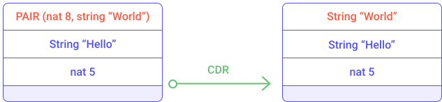

This section intends to introduce main concepts of the Michelson language. It begins with basics of **stack manipulation** then focus on primitive types and more complex **data structures** that can be modeled; and finally focus on specific features related to smart contracts concept.


### Stack programming

#### Basics

Michelson is stack-based language which means that all data (variables of the program) will be stacked on a single pile. Therefore Michelson language provides stack operators for reorganizing elements of the stack and other kind of operators which consumes top elements of the stack. In this section basic stack manipulation operators will be introduced and illustrated with simple examples. In a second time, the focus will be put on arithmetic operators and conditional branching.

##### Basic stack operators (PUSH DROP SWAP)

The code of a smart contract is defined as a **sequence** of Michelson instructions. The **sequence** structure is defined by `{` and `}` and contains instructions separated by `;` (semi-colon). When executing a sequence the interpreter executes each instruction sequentially, one after the other, in the specified order.

```js
{ instruction1 ; instruction2 ; ... ; instruction n}
```

Let's describe the most basics instructions (PUSH, DROP, SWAP) manipulating the elements of the stack.

The `PUSH` instruction adds an element at the top of the stack. The value and the type of element pushed must be specified.

For example the instruction `PUSH nat 1` add an element `1` as natural integer on top of the stack. The instruction `PUSH string "Hello"` adds an element "Hello" as a string on top of the stack.

The `DROP` instruction removes the top element of the stack.

The following diagram executes the sequence `{ PUSH nat 1; DROP }` which illustrates the `PUSH` and `DROP` usage.


<small className="figure">FIGURE 1: Execution of `PUSH` and `DROP`</small>

The `SWAP` instruction inverts the position of the top two elements of the stack.


<small className="figure">FIGURE 2: Illustration of the `SWAP` instruction</small>

The `DUP` instruction duplicates the top element of the stack. Prevent loss of varaiables since most instructions consume elements of the stack. Later examples will illustrate this.


<small className="figure">FIGURE 3: Illustration of the `DUP` instruction</small>


##### Stack manipulation using arithmetic operators

Once elements are added in the stack, they can be combined using arithmetic operators such as addition (`ADD`) and multiplication  (`MUL`).  Other arithmetic operators are described in the "Operations on numbers" section.

The `ADD` instruction sums the top two element of the stack. and the `MUL` multiply them. The result is pushed on top of the stack.


<small className="figure">FIGURE 3: Illustration of the `ADD` instruction</small>

More complex computation can be done. For example, the mathematical expression `((2 + 3) * 6) + 7` can be written with the following sequence of instructions:

```js
PUSH int 2;
PUSH int 3;
ADD;
PUSH int 6;
MUL;
PUSH int 7;
ADD
```

The following schema illustrates the execution of this sequence of instructions.


<small className="figure">FIGURE 4: Illustration of the arithmetic operators</small>

##### Other basic stack operators (DIG DUG)

Other instructions allows to change the position of elements in the stack such as `DIG` and `DUG`. Other stack operators are described in the "Stack operations" section.

The `DIG n` instruction moves the n-th element of the stack to the top of the stack.


<small className="figure">FIGURE 5: Illustration of the `DIG` instruction</small>

The `DUG n` instruction moves the top element of the stack to the n-th element of the stack.


<small className="figure">FIGURE 6: Illustration of the `DUG` instruction</small>

For example, the mathematical expression `((2 + 3) * 6) + 7` can be written also with the following sequence of instructions:

```js
PUSH int 2;
PUSH int 6;
PUSH int 3;
PUSH int 7;
DUG 3;
DIG 2;
ADD;
MUL;
ADD
```

The following schema illustrates the execution of this sequence of instructions.


<small className="figure">FIGURE 7: Illustration of the `DUG` and `DIG` instructions</small>

Now that we have seen basic stack operators we are able to reorganize elements of the stack as pleased. These stack operators will be useful to prepare the stack of more complex operators that requires precise elements in a specific order on the top of the stack.


##### Conditional branching

The Michelson language provides the possibility to execute a part of the code depending on some criteria. This is called conditional branching and some instructions are provided for this intent.

For example, the `IF` instruction allows branches of execution to be created.

The `IF {} {}` instruction takes two sequences as arguments. It expects a boolean at the top element of the stack. It consumes the top element and executes the first given sequence if this boolean-top element is *True*. Otherwise it executes the second sequence.

In order to illustrate the conditional branching, let's explain the following sequence of instruction.

```js
IF 
{ PUSH int 1 }
{ PUSH int 2 }
```

This snippet of code is equivalent to the expression `if True then 1 else 2`. It checks the top element of the stack and ensures it is a boolean and consumes it. If the value of this top element is _True_ then the value 1 is pushed onto the stack otherwise value 2 is pushed. 

This other example removes one of the top elements of the stack. If the top element is a boolean _True_ then the next element is removed otherwise removes the one after.

```js
IF 
{ DROP }
{ SWAP; DROP }
```

The following diagrams illustrates the modification of the stack while executing the `IF { DROP }` instruction part.


<small className="figure">FIGURE 8: Illustration of the `IF` instruction (true case)</small>

The following diagrams illustrates the modification of the stack while executing the `IF { SWAP; DROP }` instruction part.


<small className="figure">FIGURE 9: Illustration of the `IF` instruction (false case)</small>

Obviously the conditional branching is very useful and can be combined with other instructions that set up this condition such as comparison operators. 

##### Comparison

Elements of the stack can be compared if they belongs to comparable type. For example two integer can be compared but an integer and a string cannot.

The `COMPARE` instruction compares the top two elements of the stack. It consumes the two top elements and returns an integer at the top of the stack. The returned value is -1 if the first element is smaller than the second one; 0 if the two first elements are equal; 1 otherwise.


<small className="figure">FIGURE 9: Illustration of the `COMPARE` instruction</small>

The `EQ` instruction consumes the top element and returns ont top of the stack a boolean. It return _True_ if this value is zero, _False_ otherwise. 

The combination of the `COMPARE` and `EQ` instructions allows to create boolean conditions based on number comparison.
The following sequence verify if two numbers are equal and returns a boolean answer on top of the stack.

```js
COMPARE;
EQ
```


<small className="figure">FIGURE 10: Illustration of number comparison</small>

Other comparison instructions are available to check if a number is lower or equal to zero (`LE` instruction) or greater than zero (`GT` instruction). The list of comparison operators is described in the "Generic comparison" section.

##### Conditional branching based on number comparison

The combination of the `COMPARE` and `LE` and `IF` instructions allows to apply conditional branching by comparing two numbers.

The following sequence of instruction expects two integers on top of the stack and removes the smaller one.

```
DUP;
DUG 2;
SWAP;
DUP;
DUG 2;
DUG 3;
COMPARE;
LE;
IF { DROP } { SWAP; DROP }
```

Notice that the `DUP; DUG 2; SWAP; DUP; DUG 2; DUG 3` sequence duplicates the top two elements of the stack. The `COMPARE; LE` sequence determines which is the biggest number and the `IF { DROP } { SWAP; DROP }` sequence removes the smallest number.


<small className="figure">FIGURE 11: Illustration of conditional branching based on number comparison</small>

##### More stack operator (`DIP`, `CMPLE`)

This principle of duplicating the top two elements of the stack and comparing them to choose one of them is a common pattern. Some syntactic sugar (macros) has been introduced in the Michelson language so as to ease on those common patterns. 

For example the macro `CMPLE` stands for `COMPARE; LE`. A more exhaustive list is available in the "macros" section.

Notice that the duplication of the top two elements of the stack is not an optimal sequence. It is intended to be like this in order to illustrate the `DUG` instruction but some better implementation can be done with the `DIP` instruction.

The `DIP` instruction runs a provided sequence of instructions while protecting the _n_ top elements of the stack.

The `DIP` instruction takes two arguments:
- _n_: a number of elements to protect (by default 1)
- _code_: a sequence of instructions to execute

This instruction can be very useful. For example let's re-write the duplication of the top two elements of the stack with the `DIP` instruction.

The following sequence of instruction expects two integers on top of the stack and removes the smaller one.

```
DIP { DUP };
DUP;
DIP { SWAP };
CMPLE;
IF { DROP } { SWAP; DROP }
```


<small className="figure">FIGURE 11: Illustration of conditional branching based on number comparison</small>

### Primitive types support

The Michelson language supports only few primitive data types:
- `nat` represents a natural integer (e.g. 0, 3, 15)
- `int` represents a integer (e.g. -10, 2, 3)
- `string` represents a sequence of characters (e.g. "Hello")
- `bool` represents a boolean value (e.g. True, False)
- `bytes` represents a sequence of bytes (octet)
- `unit` represents a non-specified type.
- `timestamp` represents a duration (e.g. NOW, 1571659294, "2019-09-26T10:59:51Z"; i.e. a string following the RFC3339 standard)

Notice that there is no floating point type supported (such as _float_).

Obviously The Michelson language also provides operators allowing the manipulation of these types.

But before going on primitive type , let's introduce the optional (i.e. the _option_ type) and the _pair_ type.

#### Optional

An optional value is a data structure that can hold a value (of a given type). The optional value has two states: it is defined as `NONE` if no value is assigned and can be defined as `SOME` if a value has been assigned.

When defining an optional value, the type of value must be specified.

The `SOME` instruction packs a value as an optional value.

The `NONE` instruction specifies the absence of value. It requires that the type of value that can be held be specified.

This _option_ type is very useful for all process that may fail such as:
- euclidean division (division by zero) 
- slicing a string (out of bound error)
- accessing a element in a collection (non-existence of the element)
- invoking an other contract (entrypoint name and type verification)

All these cases will be detailed in their respective sections.

##### Using optional

The `IF_NONE bt bf` instruction inspects an optional value.
It requires two sequences of instructions, as with an `IF` instruction.
It executes the first sequence if the optional value has no value assigned, otherwise it executes the second sequence of instructions (where a value has been assigned with a `SOME` instruction).

If the `IF_NONE` instruction encounters a NONE value it consumes it and then start executing the first sequence.  
If the `IF_NONE` instruction encounters a SOME value it does not consumes it and then start executing the second sequence.


<small className="figure">FIGURE 25: Illustration of the `IF_NONE` instruction</small>


<small className="figure">FIGURE 26: Illustration of the `IF_NONE` instruction</small>

The Michelson also introduces the `IF_SOME bt bf` instruction which retrieves the value behind an optional and executes the first sequence if it encounters a SOME value. It executes the second sequence if it encounters a NONE value.


#### PAIR

The Michelson language introduces the _pair_ type which defines a data structure containing multiple fields. 

A _pair_ type is a tuple of 2 elements. It is possible to create nested _pair_ in order to create tuple of more than 2 elements. For example, the following nested _pair_ `PAIR (PAIR nat 5, string "Hello") int 37` contains a natural integer 5, a string "Hello" and an integer 37.


<small className="figure">FIGURE 35: Illustration of the C[AD]+R macro</small>

The _pair_ type can embed primitive types (nat, string, int) but also other composite types such as list, map, set, lambda function or union.

##### creating and destructuring pairs

The `PAIR` instruction takes the top two elements of the stack and pushes back on top of the stack a pair containing these two elements.

The `UNPAIR` instruction takes the top element of the stack and ensures it is a _pair_ type. It pushes back on top of the stack the two elements of the _pair_.


<small className="figure">FIGURE 35: Illustration of the _PAIR_ and _UNPAIR_ instructions</small>

##### Accessing to elements of a _PAIR_

The `CAR` instruction consumes the top element of the stack (which must be a `PAIR`) and pushes back on top of the stack the left part of the pair.


<small className="figure">FIGURE 22: Illustration of the `CAR` instruction</small>

The `CDR` instruction consumes the top element of the stack (which must be a `PAIR`) and pushes back on top of the stack the right part of the pair.


<small className="figure">FIGURE 23: Illustration of the `CDR` instruction</small>

These `CDR` and `CAR` instructions are useful to retrieve a part of a _PAIR_. As seen in the "Smart contract" section, when invoking a smart contract, the initial stack is defined by a _PAIR_ containing the parameter of the invoked entrypoint and the current storage value.

Now that we introduced basic instructions (like `CDR` and `PAIR`) we can explain the empty contract seen in the "Smart contract" section.

```js
parameter unit;
storage unit;
code { CDR ;
       NIL operation ;
       PAIR };
```


<small className="figure">FIGURE 3: Execution of `CDR ; NIL operation ; PAIR`</small>

Notice that the `CDR` instruction retrieves the right part of the initial _PAIR_. The `NIL operation` pushed an empty list of operations on top of the stack. The _PAIR_ instructions forms a _pair_ type with the empty list of operations and the initial storage.

The next section will explain the list operators (`NIL operation`).


#### Numbers
Now let's focus on primitive type such as numbers.

There are two number types in Michelson. The _nat_ type represents natural integers and _int_ type represents integers.

##### Standard arithmetic operations

Standard arithmetic operations are supported by the Michelson language on _nat_ and _int_ types.

The `ADD` instruction computes additions on _nat_ and _int_. It consumes the top two element of the stack and pushes back the addition of the two element on top of the stack.


<small className="figure">FIGURE 16: Illustration of the `ADD` instruction</small>


The `SUB` instruction computes subtractions on _nat_ and _int_. It consumes the top two element of the stack and pushes back the difference of the two element on top of the stack.

Notice that the subtraction of two natural integers produces an integer, (since expression `2 - 4` produces an number smaller than 0).


<small className="figure">FIGURE 17: Illustration of the `SUB` instruction</small>

The `MUL` instruction computes multiplications on _nat_ and _int_. It consumes the top two element of the stack and pushes back the product of the two element on top of the stack.

Notice similarly that the multiplication of a natural integer and an integer produces an integer.


<small className="figure">FIGURE 18: Illustration of the `MUL` instruction</small>

The `EDIV` instruction computes euclidean divisions on _nat_. The euclidean division computes the quotient and the remainder between two numbers.

If the divisor is equal to zero, then it returns an optional type with the assigned value _None_. Otherwise, it applies the Euclidean division and returns an optional type containing the resulting  value (Pair quotient remainder). 


<small className="figure">FIGURE 19: Illustration of the `EDIV` instruction</small>

##### Conversions `int` <-> `nat`

The Michelson language provides also instructions to cast an integer into a natural integer with the `ABS` instruction. Respectively the `INT` instruction casts a natural integer into an integer.

The `ABS` instruction consumes an integer on top of the stack and pushes back the absolute value of this integer as a _nat_ value. 


<small className="figure">FIGURE 19: Illustration of the `ABS` instruction</small>

The following smart contract illustrates the `ABS` usage. It receives an integer as input parameter and computes the absolute value and adds it to the storage.

```
parameter int;
storage nat;
code { UNPAIR;
       ABS;
       ADD;
       NIL operation ;
       PAIR }
```

The smart contract can be simulated with the CLI command:
```
tezos-client run script instruction_abs.tz on storage '9' and input '-2'
```
The resulting storage has value 11.


#### String

The `string` type represents a sequence of characters useful for modeling non-numerous data. A _string_ value can be split and two _string_ values can be concatenated. A _string_ can be compared to an other _string_.

Like for numbers, a _string_ can be pushed on top of the stack with the `PUSH` instruction.
```js
PUSH string "Hello World"
```

The `SIZE` instruction consumes a string of the top of the stack and pushes the number of characters contained in the string element.


The `CONCAT` instruction concatenates strings. It consumes the two top element and produces a string (concatenation of the two top element) that is placed on top of the stack. The `CONCAT` instruction also works with a list of strings. 

For example, the following smart contract concatenates a given string at the end of the storage.

```
parameter string;
storage string;
code { UNPAIR ;
       SWAP ;
       CONCAT;
       NIL operation ;
       PAIR }
```

This smart contract can be simulated with the CLI command:
```
tezos-client run script instruction_string_example.tz on storage '"one"' and input '"two"'
```


The `SLICE` instruction provides a way to retrieve a part of a string.
It expects on top of the stack three elements:
- an `offset` argument indicating the beginning of the substring 
- a `length` argument indicating the size of the substring
- a `string` to slice

It returns an optional string because the given offset may be out of bound. 


<small className="figure">FIGURE 20: Illustration of the `SLICE` instruction</small>


For example, the following smart contract retrieves the first 5 characters of a given string and store them in the storage.

```
parameter string;
storage string;
code { CAR;
       PUSH nat 5;
       PUSH nat 0;
       SLICE;
       IF_SOME {} { FAIL };
       NIL operation ;
       PAIR }
```

This smart contract can be simulated with the CLI command:
```
tezos-client run script instruction_string_example2.tz on storage '""' and input '"Hello World"'
```


The `COMPARE` instruction allows two strings to be compared. It consumes the top two elements of the stack and pushes an integer to the top. If the first element is lexically greater than the second, then it returns 1. If the first element is lexically equal to the second element, then it returns 0. If the first element is lexically smaller than the second element, then it returns -1.

#### Boolean logic

Like most of languages , the Michelson language supports boolean logic with a _bool_ type and standard boolean operators `OR` `AND` `XOR` `NOT`.

These boolean operators are useful mixed with `IF` instruction for creating complex conditions.

The `OR` instruction consumes the top two boolean elements of the stack and pushes back on top of the stack a logical _OR_ of both elements.


<small className="figure">FIGURE 13: Illustration of the `OR` instruction</small>

The `AND` instruction consumes the top two boolean elements of the stack and computes a logical _AND_ of the two elements.


<small className="figure">FIGURE 14: Illustration of the `AND` instruction</small>


The `XOR` instruction consumes the top two boolean elements of the stack and computes an exclusive logical _OR_ of the two elements.


<small className="figure">FIGURE 15: Illustration of the `XOR` instruction</small>

The `NOT` instruction consumes a boolean top element of the stack and pushes the logical opposite of the given boolean. 

#### timestamp

The Michelson language supports `timestamp` type. Like in most languages a timestamp represents a numbers of seconds passed since the beginning of year 1970. 
Timestamps can be used in smart contract to authorize actions on a certain period of time.  

Timestamps can be obtained by the `NOW` operation, or retrieved from script parameters or globals.

The `NOW` instruction pushes on top of the stack the timestamp of the block whose validation triggered this execution. This timestamp does not change during the execution of the contract.

##### Standard timestamp operations

The `ADD` instruction increments a timestamp of the given number of seconds. The number of seconds must be expressed as a type `int`. Addition of timestamp does not accept a number of seconds as `nat`.

The `SUB` instruction subtracts a number of seconds from a timestamp. It can also be used to subtract two timestamps.


##### Comparing timestamps

The `COMPARE` computes timestamp comparison. It returns an integer, as with the `COMPARE` instruction for an integer.

It returns 1 if the first timestamp is bigger than the second timestamp, 0 if both timestamps are equal, and -1 otherwise. 

//TODO example

#### Bytes

Bytes are used for serializing data in order to check signatures and to compute hashes on them. They can also be used to incorporate data from the untyped outside world.

The Michelson language provides _bytes_ supports with common operators like for _string_ type. It also provides standard serialization and de-serialization. 

##### Serialization

The `PACK` instruction serializes a piece of data to its optimized binary representation.


The `UNPACK` instruction de-serializes a piece of data, if valid. It returns an *option* initialized to *None* if the de-serialization is invalid, or an *option* initialized to *Some* if valid.


##### Standard operators

The `CONCAT` instruction concatenates two byte sequences. It can also be applied to a list of byte sequences. It consumes a list of byte sequences and pushes the concatenation of all sequences (in the respective order). 


The `SIZE` instruction computes the size of a sequence of bytes. It consumes a byte sequence and pushes the number of bytes of this sequence.


The `SLICE` instruction provides a way to retrieve a part of a byte sequence.
It expects following elements on top of the stack:
- an `offset`, indicating the beginning of the byte sequence 
- a `length`, indicating the size of the sub-sequence
- a `byte sequence` to slice

It returns an optional byte sequence because the given offset and length may be out of bound.


##### Comparing bytes

The `COMPARE` instruction computes a lexicographic comparison. As with other `COMPARE` instructions, it returns 1 if the first sequence is bigger than the second sequence, 0 if both byte sequences are equal, or -1 otherwise.

The `COMPARE` instruction can be used only on comparable types.

//TODO example


### Working with complex data structures

Since the beginning we ony used primitive types such as _int_, _nat_ and _string_. The storage of the smart contract usually stores more than just one number. Now let's take a look into composite data structures.

A composite structure integrate many fields and can organize them in many ways. 

There are 5 kind of composite data structures: 
- **binary tree** implemented with nested _PAIR_ structure (seen in the previous section)
- **ordered list** of elements with type _list_
- **set** of unique elements with type _set_
- an **associative array** (a collection of key-value pairs) implemented with the type _map_
- a **union** (i.e. an exclusive composite type) implemented with nested _or_ structure.
- a **optional** implements a type holding a value which handle an uninitialized state if a value hasn't been assigned.  (seen in the previous section)


#### LIST

The `list` type represents an ordered collection of elements of the same type. A _list_ can contain multiple occurrences of the same value. For example, here is a list of integers `{ 2; 4; 5; 3; 5 }`.

##### Building a list

The `NIL 'a` instruction pushes an empty list on top of the stack. When creating a _list_ the type of list elements must be specified. For example, `NIL operation` pushes an empty list of operations on top of the stack. Similarly `NIL int` pushes an empty list of integers on top of the stack.


<small className="figure">FIGURE 33: Illustration of the `NIL` instruction</small>

##### Adding an element in the list

The `CONS` instruction allows to add an element at the beginning of a list. It expects an element and a list on top of the stack, consumes them and pushes back the updated _list_ on top of the stack.


<small className="figure">FIGURE 32: Illustration of the `CONS` instruction</small>

So as to illustrate the _list_ type usage take a look at the following smart contract.

```
parameter int ;
storage (list int);
code { UNPAIR ;
       CONS;
       NIL operation ;
       PAIR }
```

The unique entrypoint of smart contract expects an integer as input (`parameter int`).
Notice that the storage of this smart contract is a list of integer declared with `(list int)`.
This smart contract concatenates the given integer at the beginning of the integer list and returns the updated list aas the new state of the storage.

This smart contract can be simulated by running the following CLI command:
```
tezos-client run script max_list.tz on storage '{1;2;5;3}' and input '12'
```

Notice that in the CLI command the integer list is specified by `{1;2;5;3}`. 

##### Removing the top element of the list

The `IF_CONS bt bf` instruction inspects a list. It requires two sequences of instructions (bt anf bf), as with the `IF` instruction.

This instruction removes the first element of the list, pushes it on top of the stack and executes the first sequence of instructions (`bt`). If the list is empty, then the second list of instructions is executed (`bf`).

This `IF_CONS` instruction allows to remove the first element of the list. The following smart contract illustrates this usage.

```
parameter unit;
storage (list int);
code { CDR ;
       IF_CONS { DROP } { FAIL };
       NIL operation ;
       PAIR }
```

Notice that the entrypoint expects a value of type `unit` (i.e. no value expected).

The smart contract can be simulated with the following CLI command:
```
tezos-client run script instruction_ifcons2.tz on storage '{1;2;5;3}' and input 'Unit'
```

Notice that the given parameter value is `Unit` of type `unit`.

##### Using list (MAP, ITER, SIZE)

Other list operators are available to apply a process on a list.

The `SIZE` instruction computes the number of elements in the list.
It consumes a list on top of the stack and pushes the number of elements of the list back on top of the stack.


The `MAP {}` instruction applies a sequence of instructions to each element of a list. The `MAP` instruction requires a sequence of instructions (i.e. called "body") which has access to the stack. 

The following smart contract illustrates the `MAP` usage. This smart contract holds a list of integer in his storage and when invoked it increments each integer of the list by 1.

```
parameter unit ;
storage (list int);
code { CDR ;
       MAP { PUSH int 1; ADD };
       NIL operation ;
       PAIR }
```

This smart contract can be simulated with the following CLI command:
```
tezos-client run script instruction_list_map.tz on storage '{1;2;5;3}' and input 'Unit'
```

The `ITER {}` instruction applies a sequence of instructions to each element of a list. The `ITER` instruction requires a sequence of instructions (called "body") which has access to the stack.

An example is described in the _Examples_ section (Example 2).


#### SET

The `set` type represents an unordered collection of elements. It preserves the uniqueness of elements inside the collection. For example, here is a set of integers `{ 2; 4; 5 }`.

##### Creation and uniqueness checking

The `EMPTY_SET 'elt` instruction builds a new empty set for elements of a given type 'elt. The 'elt type must be a comparable type (i.e. the COMPARE primitive must be defined over it).


The `MEM` instruction checks for the existence of an element in a set. It consumes an element and a set and pushes back a boolean on top of the stack.

##### Modify elements of the set

The `UPDATE` instruction inserts or removes an element in a set, replacing a previous value.

It takes the top two elements of the stack:
- an element whose type corresponds to the _set_ type
- a boolean representing the existence of this element in the _set_

If the boolean argument is _False_ then the element will be removed.


<small className="figure">FIGURE 24: Illustration of the `UPDATE` instruction</small>

If the boolean argument is _True_ then the element will be inserted.


<small className="figure">FIGURE 25: Illustration of the `UPDATE` instruction</small>

The following smart contract illustrates the `UPDATE` instruction usage. This smart contract stores a set of integers and can be invoked by specifying an integer that will be inserted in the set.

```js
parameter int ;
storage (set int) ;
code { DUP ; CAR ; DIP { CDR } ;
       PUSH bool True ;
       SWAP ;
       UPDATE ;
       NIL operation ;
       PAIR }
```

You can test the smart contract with the following command:

```js
tezos-client run script set_example.tz on storage '{1; 2; 3; 9}' and input '7'
```

##### Apply process on a set

The `ITER` instruction takes a sequence of instructions (called "body") as argument. It applies a given sequence of instructions to each element of a set. The "body" sequence has access to the stack.


The `SIZE` instruction consumes a set from the top of the stack and pushes to the top the number of elements contained in the set.


#### MAP

A `map` is an associative array. It stores many pairs of key-value elements, i.e. it binds a key and a value. Type definitions of key and value must be defined when instantiating a new `map`.

The `map` data structure can only contain a limited amount of data. When using big and complex types as values, it is recommended to use the `big_map` data structure.

##### Building a map

The `EMPTY_MAP 'key 'val` instruction builds a new empty map. It requires the type definition of the key (_'key_) and type definition of the value (_'val_).

The _'key_ type must be comparable (the COMPARE primitive must be defined over it).

The `EMPTY_BIG_MAP` instruction builds a new empty `big_map` data structure.

##### Checking existence of a binding for key

The `MEM` instruction checks for the existence of a binding for a key in a map.

It expects a key and a map on top of the stack and and pushes back a boolean on top of the stack.


##### Modifying a map

The `UPDATE` instruction adds or removes an element in a map.

The `UPDATE` instruction expects a key, an optional value and a map on top of the stack. It consumes the key and the optional value and modifies the map accordingly.

If the optional value is defined as `None`, then the element is removed from the map. The following smart contract (map_remove_example.tz) illustrates the `UPDATE` usage while removing an element from the map.

```js
parameter string ;
storage (map string int) ;
code { DUP ; CAR ; DIP { CDR } ;
       NONE int ;
       SWAP ;
       UPDATE ;
       NIL operation ;
       PAIR }
```

This smart contract can be tested with the following command:

```js
tezos-client run script map_remove_example.tz on storage '{ Elt "toto" 1 }' and input '"toto"'
```


<small className="figure">FIGURE 27: Illustration of the `UPDATE` instruction</small>

If the optional value is defined as `Some` then the element is insert into the map. The following smart contract (map_insert_example.tz) illustrates the `UPDATE` usage while inserting an element into the map.

```js
parameter string ;
storage (map string int) ;
code { DUP ; CAR ; DIP { CDR } ;
       PUSH int 2;
       SOME ;
       SWAP ;
       UPDATE ;
       NIL operation ;
       PAIR }
```

This smart contract can be tested with the following command.

```js
tezos-client run script map_insert_example.tz on storage '{ Elt "toto" 1 }' and input '"tutu"'
```


<small className="figure">FIGURE 28: Illustration of the `UPDATE` instruction</small>

#### Accessing element of a map

The `GET` instruction allows to access to an element inside a map. It returns an optional value to be checked with an `IF_SOME` instruction.

The following smart contract illustrates the usage of `GET`. The storage of this contract defines a map. This smart contract takes a key as the parameter and inserts a new element in the map if the key does not exist. In this case it assigns value 0 to the given key. Otherwise if the map possesses an element for the given key then it increments its associated value.

```js
parameter string ;
storage (map string int) ;
code { DUP ;
       CAR ;
       DIP { CDR } ;
       DIP { DUP } ;
       DUP ;
       DIP { SWAP } ;
       GET ;
       IF_NONE { PUSH int 0 ; SOME } { PUSH int 1 ; ADD ; SOME } ;
       SWAP ;
       UPDATE ;
       NIL operation ;
       PAIR }
```

This smart contract can be simulated with the following commands:

```js
tezos-client run script map_example.tz on storage '{}' and input '"toto"'
```

```js
tezos-client run script map_example.tz on storage '{ Elt "toto" 5 }' and input '"toto"'
```

Notice that `{}` represents an empty map and `{ Elt "toto" 5 }` a map containing one element where "toto" is the key and its associated value is 5.

##### Applying some process on a map

The `SIZE` instruction computes the number of elements inside a map. It consumes a map on top of the stack and places the number of elements on top of the stack.

The `SIZE` instruction cannot be applied to `big_map` type. 


The `MAP` instruction applies a sequence of instructions to each element of a map. It takes a sequence of instructions as argument (called "body"). This "body" sequence has access to the stack.

```js
MAP body / {} : S  =>  {} : S
MAP body / { Elt k v ; <tl> } : S  =>  { Elt k v' ; <tl'> } : S''
    where body / Pair k v : S  =>  v' : S'
    and MAP body / { <tl> } : S'  =>  { <tl'> } : S''
```

The following smart contract (map_map_example.tz) illustrates the `MAP` usage. This smart contract stores a `map string nat` and when invoked it goes through all key-value elements of the map and multiplies by 2 the `nat` value.

```js
parameter unit ;
storage (map string nat) ;
code {
       CDR ;
       MAP { CDR ; PUSH nat 2 ; MUL }  ;
       NIL operation ;
       PAIR }
```

The smart contract can be simulated with the following command.

```js
tezos-client run script map_map_example.tz on storage '{ Elt "toto" 1 ; Elt "tutu" 4 }' and input Unit
```

##### Iterating on a map

The `ITER body` instruction applies a sequence of instructions (called "body") to each element of a map. The "body" sequence has access to the stack.

```js
ITER body / {} : S  =>  S
ITER body / { Elt k v ; <tl> } : S  =>  ITER body / { <tl> } : S'
   iff body / (Pair k v) : S  =>  S'
```

An example ("Max list") illustrating `ITER` instruction usage is described in the _Examples_ section. Despite being applied to a list of integers, the `ITER` instruction works in the same way with a map (except at each iteration a _pair_ key-value is pushed on the stack instead of an integer, as in the example "Max list").

#### Union

The `union` data structure specifies two possible type definitions with logical _or_. It can be used to create a new type which can handle two different types exclusively.

For example, the following Michelson expression defines the type "int_or_nat" as:

```js
or int nat
```

The logical _or_ operator has 2 branches a left part and a right part. It is possible to form nested _or_ structure in order to combine more than 2 types. For example, the type `string_or_int_or_nat` would be defined by 
```
or (or (int) (nat)) (string)
```

The **parameter** of the smart contract is a _union_ of all possible entrypoints of the smart contract. For example, `parameter (or (or (nat %add) (nat %sub)) (unit %default))` defines the parameter of a smart contract as a union of three entrypoints (add, sub, default). Each entrypoint specifies the expected argument type (e.g. "add" entrypoint expects an integer).

Notice that when using a nested _or_ structure for the parameter of the smart contract, each entrypoint requires an annotation ("%add", "%sub") which is not the case for regular _union_ such as `string_or_int_or_nat`.


##### LEFT & RIGHT

When using _union_ type it is necessary to respect the strict typing of the Michelson language.
For example, let's consider the type _int_or_nat_ defined as `or int nat`. A single integer value cannot be held in a _int_or_nat_ type. It has to be "cast" in a logical _or_ structure. The `LEFT` and `RIGHT` operators are provided by the Michelson language to form logical _or_ structures based on a single value. Obviously the type of the given value can be deduced but the other possible type of the _or_ must be specified. 


The `LEFT p` instruction takes the top-element of the stack and produces a *union*. 
The top-element is placed in the right branch of the `or` structure and the left branch is typed with the given `p` argument.

It consumes a type definition on top of the stack and pushes a union where the left part is defined as the consumed type definition.


<small className="figure">FIGURE 28: Illustration of the `LEFT` instruction</small>

Illustration of `LEFT` usage can be seen in the examples section.


The `RIGHT p` instruction takes the top-element of the stack and produces a *union*. 
The top-element is placed in the left branch of the `or` structure and the right branch is typed with the given `p` argument.

It consumes a type definition on top of the stack and pushes a union where the right part is defined as the consumed type definition.


<small className="figure">FIGURE 28: Illustration of the `RIGHT` instruction</small>

Illustration of `RIGHT` usage can be seen in the examples section.

Now that the creation of a _union_ is described, let's see how to inspect a _union_.

##### Inspecting a _union_ with `IF_LEFT`

The `IF_LEFT` instruction inspects a value of *union*. It requires two sequences of instructions (bt bf), like with an `IF` instruction. 

The `IF_LEFT bt bf` executes the "bt" sequence if the left part of a *union* has been given, otherwise it will execute the "bf" sequence.

The instruction consumes a Michelson expression on top of the stack which specifies which part of the *union* has been defined.

```js
IF_LEFT bt bf / (Left a) : S  =>  bt / a : S
IF_LEFT bt bf / (Right b) : S  =>  bf / b : S
```

The following smart contract (union_example.tz) illustrates the `IF_LEFT` usage. Notice that the parameter is a *union* `(or string int)` and the storage is an integer. This smart contract increments the storage if an integer is passed as parameter (i.e. if the smart contract is invoked with an integer) and does nothing if a string is given.

```js
parameter (or string int) ;
storage int ;
code { DUP ; CAR ; DIP { CDR } ;
       IF_LEFT { DROP } { ADD } ;
       NIL operation ;
       PAIR }
```

To illustrate the invocation of the smart contract, we will break down its execution.

The following command simulates the execution of the smart contract when called with an integer.

```js
tezos-client run script union_example.tz on storage '5' and input 'Right 1'
```


<small className="figure">FIGURE 30: Illustration of the `IF_LEFT` instruction</small>

The following command simulates the execution of the smart contract when called with a string.

```js
tezos-client run script union_example.tz on storage '5' and input 'Left "Hello"'
```


<small className="figure">FIGURE 31: Illustration of the `IF_LEFT` instruction</small>


### Contract specific types and operations

Now let's focus on the specific types related to Tezos smart contract such as crypto-currency (mutez), address identifying an account or a contract, delegation.

#### Mutez

Mutez (micro-Tez) are internally represented by a 64-bit, signed integer. There are restrictions to prevent creating a negative amount of mutez. Operations are limited in order to prevent overflow and to avoid mixing with other numerical types by mistake. They are also mandatorily checked for under/overflows.


##### Standard currency operations

Standard operations on currency are supported by the Michelson language. These operators are more restricted than for integers.

The `ADD` instruction computes additions on mutez. It consumes two _mutez_ element on top of the stack and pushes back the addition of the two quantity on top of the stack.
This operation may fail in case of overflow.

The `SUB` instruction computes subtractions on mutez. It consumes two _mutez_ element on top of the stack and pushes back the difference of the two quantity on top of the stack.
A _mutez_ value cannot be negative so this subtraction may fail if the first value is smaller than the second one.


The `MUL` instruction computes multiplications on mutez. It consumes a _mutez_and a _nat_ element on top of the stack and pushes back the product of the two quantity on top of the stack.
The multiplication allows mutez to be multiplied with natural integers.
Multiplication of 2 `mutez` operands is not allowed. 


The `EDIV` instruction computes the euclidean division on mutez. It consumes a _mutez_and a _nat_ element on top of the stack and pushes back a `pair` with the quotient and the reminder (of the two elements) on top of the stack.
The euclidean division allows a mutez to be divided by a natural integer. It is also possible to divide 2 mutez, in this case it returns a `nat` as a quotient and a mutez standing for the rest of the euclidean division.


The `COMPARE` instruction compares two mutez and returns an integer on top of the stack. It returns 0 if both elements are equal, 1 if the first element is bigger than the second, and -1 otherwise. 


 
#### Contract communication

This section describes instructions specific to smart contracts and interactions between contracts. It includes key features such as emitting transactions and invoking a contract, setting delegations, and even creating contracts on the fly. 

This section introduces the _address_ type identifying an account or a deployed smart contract; and other built-in instructions related to transactions.


##### Entrypoint verification with `CONTRACT`

Smart contract communicates among each other with transactions. When invoking a smart contract, the execution must insure that the invocation parameter matches the parameter of the targeted smart contract. For example, if a smart contract (possessing 2 entrypoints) can only "Increment" and "Decrement" one can not ask him to "Multiply". In the same manner, the arguments of entrypoint must be respected.

All this verification is done based on entrypoint definition and expectation. The `CONTRACT` stands for this concept. Actually the `CONTRACT 'p` instruction permits to specify what kind of entrypoints one expects to invoke (i.e. the type definition of invoked entrypoint).


The `CONTRACT 'p` instruction casts the address to the given contract type if possible.
It consumes an `address` to the top element of the stack and returns a contract option which corresponds to the given parameter type.

The parameter is `unit` in case of an implicit account.

The `CONTRACT 'p` instruction considers the default entrypoint if it exists, otherwise the full parameter is returned. 


##### Transaction with `TRANSFER_TOKENS`

Communication between contracts (and accounts) are done via transactions. The Michelson language supports the creation of transactions.

The `TRANSFER_TOKENS` instruction forges a transaction. In Michelson, the `operation` type represents a transaction. 
Forging a transaction requires the following to be specified: 
- the *parameter* (i.e. the entry point expected by the targeted contract)
- a *quantity of mutez* transferred by this transaction
- a *recipient contract* representing the target of the transaction (i.e. to which contract this transaction will be sent)

The parameter must be consistent with the one expected by the contract.
If the transaction is sent to an implicit account (i.e. the address of an account) then the parameter must be set to `unit`.

The `TRANSFER_TOKENS` instruction consumes the three top elements of the stack and outputs a transaction on top of the stack.

As seen in previous sections, the invocation of a Tezos smart contract produces a list of operations and a new storage state. In a smart contract, when using a `TRANSFER_TOKENS` instruction to forge a transaction the produced transaction must be included in the returned list of operations in order to be taken into account.

To illustrate the usage of the `TRANSFER_TOKENS` instruction, we will consider a simple "Counter" smart contract that can increment or decrement a value. We will create a second smart contract, "CounterCaller", which forges a transaction and sends it to the "Counter" smart contract using the `TRANSFER_TOKENS` instruction.

The following smart contract demonstrates the implementation of the "Counter" smart contract.

```js
parameter (or (int %decrement) (int %increment)) ;
storage int ;
code { DUP ;
       CDR ;
       SWAP ;
       CAR ;
       IF_LEFT { SWAP ; SUB } { ADD } ;
       NIL operation ;
       PAIR }
```

The following smart contract demonstrates the implementation of the "CounterCaller" smart contract.

```js
parameter (or int int);
storage address;
code {
       DUP;
       DUP;
       CDR;
       CONTRACT (or int int);
       IF_NONE
              {DROP; NIL operation }
              {
                     SWAP;
                     CAR;
                     DIP {PUSH mutez 0};
                     TRANSFER_TOKENS;
                     DIP {NIL operation;};
                     CONS;
              };
       DIP { CDR };
       PAIR }
```

Now, let's break down the execution of the "CounterCaller" smart contract:

The following command simulates the invocation of the smart contract.

```js
tezos-client run script countercaller.tz on storage '"KT1HUbVyf62ZAp7BRqwQaDueb6kgb7Q86cc3"' and input 'Left 3'
```


<small className="figure">FIGURE 34: Illustration of the `TRANSFER_TOKENS` instruction</small>

##### Delegation with `SET_DELEGATE`

The `SET_DELEGATE` sets or withdraws the contracts delegation. It consumes an *option key_hash* specifying the delegate and returns a transaction (operation) on top of the stack.

Using this instruction is the only way to modify the delegation of a smart contract. If the top element is _None_, then the delegation of the current contract is withdrawn. If the top element is _Some kh_, where _kh_ is the key hash of a registered delegate (that is not the current delegate of the contract), then this operation sets the delegate of the contract to this registered delegate. The operation fails if _kh_ is the current delegate of the contract or if _kh_ is not a registered delegate.

##### Inspecting the balance of the contract

The `BALANCE` instruction pushes the current amount of mutez held by the executing contract to the stack, including any mutez added by the calling transaction.

##### Creating contract dynamically with `CREATE_CONTRACT`

The `CREATE_CONTRACT` instruction forges a new contract. It consumes the top three elements of the stack and pushes a *transaction* (responsible for creating the contract) and the *address* of the newly created contract.

The three consumed elements represent arguments for deploying a contract:
- the smart contract definition as a literal `{ storage 'g ; parameter 'p ; code ... }`, including the storage definition, parameter definition and the code of the smart contract
- an optional `key_hash` value representing the delegate
- a quantity of mutez transferred to the new contract

Accessing the newly created contract (via a `CONTRACT 'p` instruction) will fail until it is actually originated.

// TODO example

##### Built-ins

The `ADDRESS` instruction casts the contract to its address. It consumes a contract on top of the stack and pushes back the address of the contract.


The `SOURCE` instruction pushes the address of the contract that initiated the current transaction, i.e. the contract that paid the fees and storage cost, and whose manager signed the operation that was sent on the blockchain. Note that since the TRANSFER_TOKENS instructions can be chained, `SOURCE` and `SENDER` are not necessarily the same.

The `SENDER` instruction pushes the address of the contract that initiated the current internal transaction. It may be the `SOURCE`, but may also be different if the source sent an order to an intermediate smart contract, which then called the current contract.

The `SOURCE` and `SENDER` built-ins represent the identity who invoked the smart contract. 


The `SELF` instruction pushes the default entry point of a contract on top of the stack. This default entry point specifies the expected parameter type. 
The `SELF 'p` instruction allows to take a entry point name 'p as argument. In this case, it pushed the specified entrypoint on top of the stack. 


An other useful built-in is the `AMOUNT` instruction which is key when currencies are being exchanged. The `AMOUNT` instruction pushes the amount of mutez of the current transaction on top of the stack.

//TODO example


//TODO

### Lambda
#### Lambda definition (LAMBDA)
#### Lambda execution (EXEC)

### Iterative processing
#### ITER on LIST SET MAP
#### LOOP
#### LOOP_LEFT


### More detail in the "Instructions" section

This "Tutorial" part ends, hoping you had satisfying introduction to the Michelson language.

More detail about macros and syntactic sugar are available int the "Instructions" section.

For more advanced Michelson programmers, there are other concepts such as cryptographic features and annotations which are described in the "Instructions" section. 

The Michelson language being part of the protocol is destined to change and thus many other features will be supported in the future bringing new possibilities like anonymity (with sappling techniques) or allowing stamping atomic information (with tickets). 
