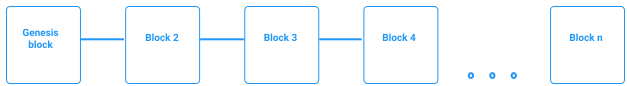

## Generating a new genesis public key and fetching binaries

The genesis public key is the public key associated to the genesis bloc, the first bloc of your private blockchain.

The **genesis block** is the first block in any blockchain-based protocol. It is the basis on which additional blocks are added to form a chain of blocks, hence the term blockchain.


<small className="figure">FIGURE 1: Genesis block</small>

It differs from other blocks in that it has no predecessor block. Since it has no predecessor, some small parameters had to be specified for its creation.

To fetch Tezos binaries and create a new genesis public key, run the following:

```shell
docker run -v ubuntu-tezos-volume:/base-dir -i \
  -t ubuntu-tezos fetch-binaries --base-chain carthagenet
```

Only 'babylonnet' and 'carthagenet' are supported as a `--base-chain` argument.

If you have been provided a genesis public key, instead run:

```shell
docker run -v ubuntu-tezos-volume:/base-dir -i -t ubuntu-tezos fetch-binaries \
  --genesis-key <provided key> --base-chain carthagenet
```

## Running the first baker

Baking is the act of signing and publishing blocks to the Tezos blockchain. Therefore bakers are the people participating in the consensus by **creating** new blocks.
Check out the [Baking](/baking) module to go further.

The script `start-baker.sh` will do the following tasks:
1. generate a [node identity](/deploy-a-node/set-up-a-node#node-identity)
2. create a baker account
3. start the bootstrap-node baker to bake the chain

This example will walk you through running two bakers, each running in its own Docker container. To run the first, enter the following:

```shell
docker run --expose 8733 -p 8732:8732 -p 8733:8733 -v ubuntu-tezos-volume:/base-dir \
  -i -t ubuntu-tezos start-baker --net-addr-port 8733
```

- `--expose` parameter makes a port available outside of Docker.
- `-p` parameter maps host ports to Docker ports.
- Port `8732` is used as a node rpc port and exposed by the docker image by default. 
  >[RPC](/tezos-basics/cli-and-rpc#tezos-rpc-remote-procedure-call) is a client-server protocol where the requesting program is the client and the program providing the service is the server.   
  Tezos nodes provide a JSON/RPC interface to interact with the Tezos network. Although it uses RPC and is JSON-based, it does not follow the JSON-RPC protocol.

After running this command you should see the following warning:

```shell
Warning:
  Failed to acquire the protocol version from the node
  Rpc request failed:
     - meth: GET
     - uri: http://localhost:8732/chains/main/blocks/head/protocols
     - error: Unable to connect to the node: "Unix.Unix_error(Unix.ECONNREFUSED, "connect", "")"
```

These warnings can be ignored for now, as all the required components have not yet been started.

This script will print the baker's IP address and public key, both of which will be used in the following steps. First, you should see the IP address:

```shell
Container IP: 172.17.0.2
```

You will also see some output containing the hash, the public key and the secret key:

```shell
Hash: tz1SJNRNLwACDSLDLk249vFnZjZyV9MVNKEg
Public Key: edpkvRTXYRCxCbWs4GF1shMxCab9nF3iNimPqqb2esiP5WyjAhT1dz
Secret Key: unencrypted:edsk3mXNLyaNXdFv6Qjcxmfed3eJ7kSzJwgCjSNh4KTTpwRRLPMSpY
```

At this point, you should also see 'Too few connections (0)' being printed repeatedly on the terminal. **Leave this terminal running and open another**.

## Running the second baker

In this second terminal, enter:

```shell
cd private-tezos-blockchain
docker run -v ubuntu-tezos-volume-1:/base-dir -i \
  -t ubuntu-tezos fetch-binaries --base-chain carthagenet
```

Then run the 2nd baker:

```
docker run --expose 8734 -p 8734:8734 -v ubuntu-tezos-volume-1:/base-dir \
  -i -t ubuntu-tezos start-baker --net-addr-port 8734 --peer 172.17.0.2:8733
```

If the nodes can communicate, you will see the following lines in both terminals:

```shell
p2p.maintenance: Too few connections (1)
```

This means that each node now has **one** peer.

Each terminal displays a different hash, private key and public key. 
**Note them somewhere** because we will need them in the next chapter.


