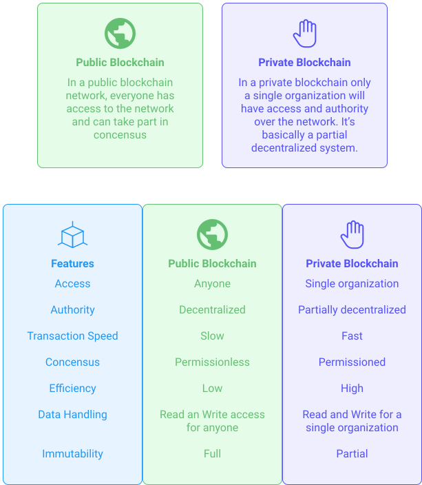

Tezos is a public blockchain network that includes innovative features such as on-chain governance and proof of stake. Smart contracts on Tezos are compiled to Michelson, a stack-based, functional language that lends itself to formal verification.

A private blockchain is an invitation-only blockchain. The blockchain is governed by a single entity. The participating parties require permission to read, write, or audit the blockchain.

<small className="figure">FIGURE 1: Public vs Private</small>

A private chain of Tezos provides a controlled environment for development, testing, or consortium-governed networks popular in enterprise settings.

In a blockchain that is private, each user does not have equal rights within it. Users are granted permissions to access certain types of data and complete specific functions. Everything else remains closed. The mechanism of access depends on the rules set forth by the network creator. Existing participants could grant access to future entrants, a single authority could grant licenses, or an organization within the ecosystem could make the decisions.

This module will use the scripts available on the [Github Serokell](https://github.com/serokell/private-tezos-blockchain) repository for the configuration and deployment of a private Tezos blockchain on a Testnet network.

To run a private blockchain using those scripts, you should do the following:

1. Set up your workspace environment
2. Generate genesis block and bootstrap bakers
3. Start and use the Blockchain

You can also add a VPN Configuration

## References

- [1] https://github.com/serokell/private-tezos-blockchain
- [2] https://101blockchains.com/public-vs-private-blockchain/

