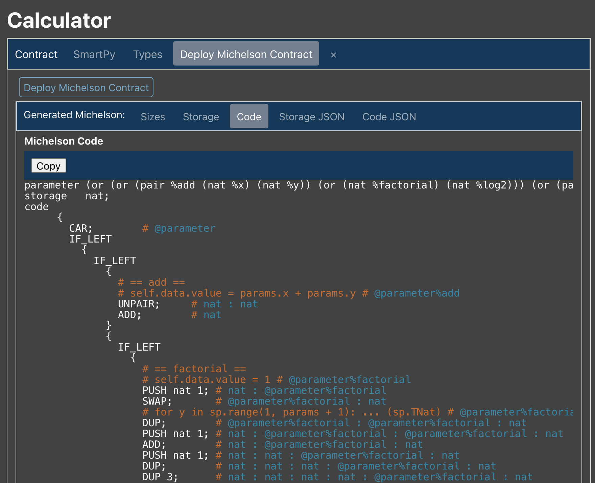

This chapter aims at preparing your working environment to be ready to code,
test and compile your smart contracts.

You can code locally on your favorite ide and/or use the [online editor](https://smartpy.io/ide)
which is designed with interesting features to facilitate the developer's work.

## Online Editor

The SmartPy online editor is not just a simple text editor for smart contracts.
It comes with a built-in simulation suite that provides powerful testing tools for developers.


<small className="figure">FIGURE 1: Smartpy.io Online Editor </small>

To familiarize yourself with SmartPy you can choose among the numerous existing examples
of smart contracts by going to the **Templates** tab.


<small className="figure">FIGURE 2: Smartpy.io Online Editor Templates </small>

On the left screen of the online dditor you can:

- Write your code on the left screen
- Run and test your code


<small className="figure">FIGURE 3: Smartpy.io Online Editor Code Area </small>

Once your run your code, you can visualize the result on the right screen, which contains:

- Your python code
- Your generated Michelson contract and storage (also available in JSON format)
- A summary of your test scenario and the generated Michelson parameter code
- You can deploy your Michelson contract


<small className="figure">FIGURE 4: Smartpy.io Online Editor Result Test Area </small>


<small className="figure">FIGURE 5: Smartpy.io Online Editor Result Michelson Contract Code </small>

## Write, test and, compile from your IDE

In the next chapter we will use the online editor so only the basic commands for using SmartPy on a local IDE are provided.

### Prerequisite

- Python 3
- Text editor

### Creation of a virtual environment

A virtual environment is a self-contained Python installation, separated from the global Python installation.
It contains its own modules. Hence, it is most useful when a specific module version is needed without affecting the other modules.
Run this command to create a virtual environment:

```shell
$ python3 -m venv /path/to/env
```

### Activating the environment

By default, your OS uses the python interpreter from /usr/bin/python.
Once that a virtual environment is created, it has to be activated in order to be used by the OS.

You can activate your virtual environment by running:

```shell
$ source /path/to/env/bin/activate
```

The name of the environment should appear at the beginning of the commandline
It can be deactivated by running:

```shell
(venv) $ deactivate
```

### Installation of SmartPy library

After having activated your virtual environment, you can install SmartPy by running:

```shell
(venv) $ pip install smartpy
```

Verification of the installation:

```shell
(venv) python -c "import smartpy"
```

If the command returns nothing, then the installation is successful.

### Installation of the command line interface

```shell
sh <(curl -s https://smartpy.io/cli/install.sh)
```

#### Compiling SmartPy Contracts or Expressions

_SmartPy.sh compile_

```shell
~/smartpy-cli/SmartPy.sh compile <script.py> <output-directory>
```

This includes many outputs including:

- generated Michelson code for contract and storage
- generated JSON code for contract and storage

#### Executing a SmartPy Script with its tests

_SmartPy.sh test_

```shell
~/smartpy-cli/SmartPy.sh test <script.py> <output-directory>
```

This includes many outputs: types, generated Michelson code, pretty-printed scenario, etc.

## Reference

[1] https://smartpy.io/reference.html#_command_line_interface

[2] https://smartpy.io/ide
