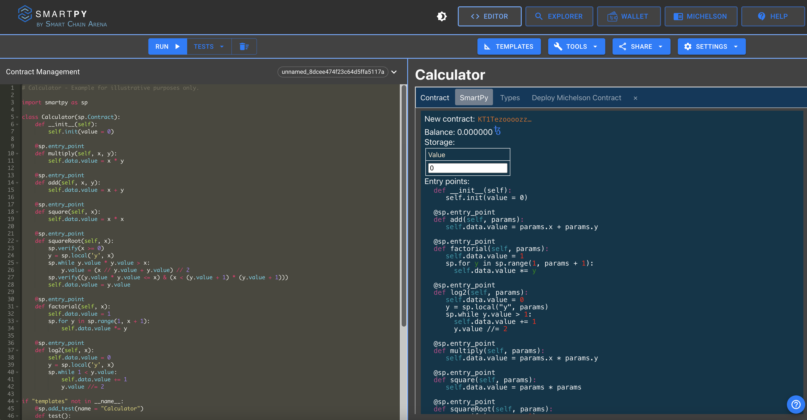
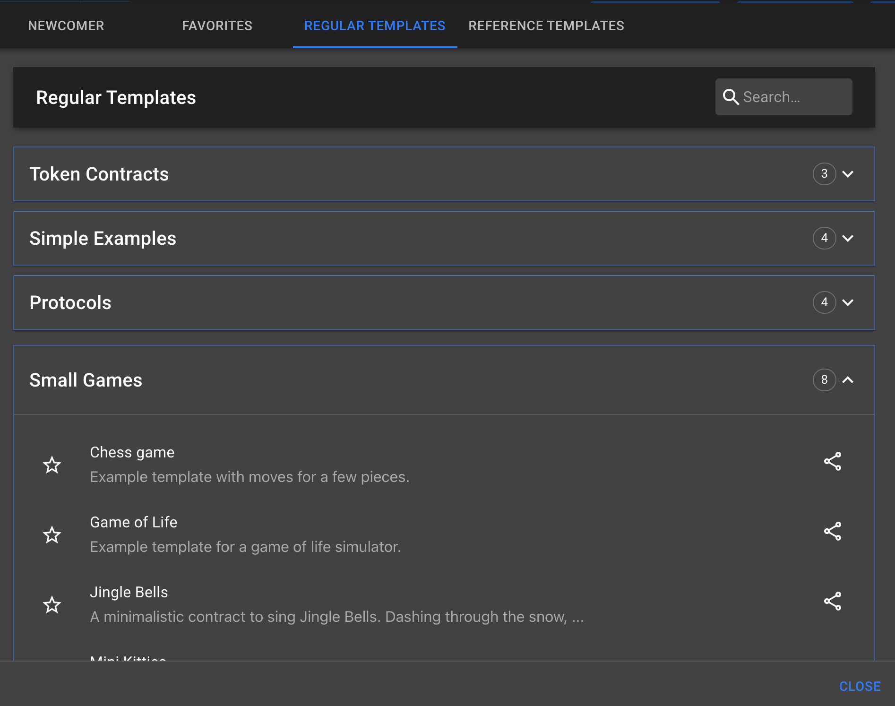
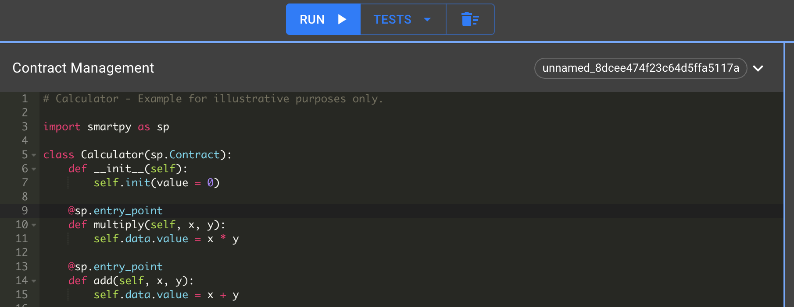
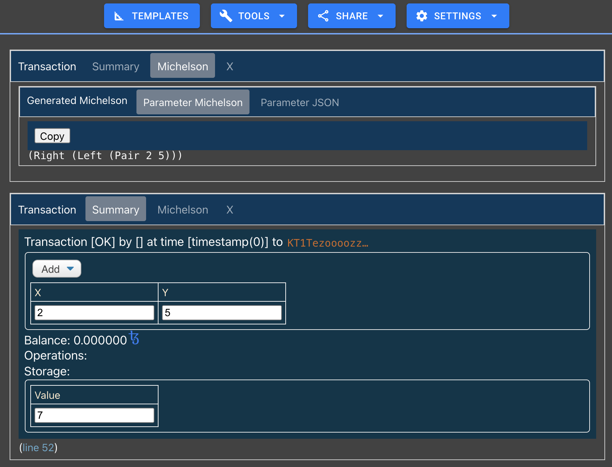

This chapter aims to prepare you and your working environment to be ready to code, test, and compile your smart contracts.

You can code locally on your favourite _IDE_ or use the [official SmartPy online editor](https://smartpy.io/ide), with added interesting features to facilitate development.

##  Write, test, and compile from the Online Editor

The _SmartPy_ online editor is not just a simple text editor for smart contracts. It comes with a built-in simulation suite, that provides powerful testing tools for developers.


<small className="figure">FIGURE 1: Smartpy.io Online Editor </small>

To familiarize yourself with _SmartPy_, you can choose among numerous existing examples of smart contracts, by going to the **Templates** tab.


<small className="figure">FIGURE 2: Smartpy.io Online Editor Templates </small>

On the left screen of the online editor, you can:
- Write your code
- Run and test your code


<small className="figure">FIGURE 3: Smartpy.io Online Editor Code Area </small>

Once you run your code, you can visualize the result on the right screen, which contains:

- Your inlined python code
- Your generated _Michelson_ contract and storage (also available in _JSON_ format)
- A summary of your test scenario and the generated Michelson parameter code
- An interface to deploy your Michelson contract on a testnet or the mainnet


<small className="figure">FIGURE 4: Smartpy.io Online Editor Result Test Area </small>


<small className="figure">FIGURE 5: Smartpy.io Online Editor Result Michelson Contract Code </small>

## Write, test and, compile from your local IDE

In the following chapters, we will use the online editor. But in this section, we will still provide the basics for using _SmartPy_ on a local IDE.

### Prerequisite

- [Python 3](https://www.python.org/downloads/)
- A code editor, e.g. [VSCode](https://code.visualstudio.com/)

### Create a virtual environment

A virtual environment is a self-contained Python installation, separated from the global Python installation. It contains its own modules. Hence, it is most useful when a specific module version is needed without affecting the other modules. Run this command to create a virtual environment:

```shell
$ python3 -m venv /path/to/env
```

### Activate the environment

By default, your OS uses the python interpreter from `/usr/bin/python`. Once a virtual environment is created, it has to be activated in order to be used by the OS. You can activate your virtual environment by running:

```shell
$ source /path/to/env/bin/activate
```

The name of the environment should appear at the beginning of the command line. It can be deactivated by running:

```shell
(venv) $ deactivate
```

### Install the SmartPy library

After having activated your virtual environment, you can install _SmartPy_ by running:

```shell
(venv) $ pip install smartpy
```

Verify the installation by running:

```shell
(venv) python -c "import smartpy"
```

If the command returns nothing, then the installation has been successful.

### Install the command line interface

To install the _SmartPy_ CLI, run:

```shell
sh <(curl -s https://smartpy.io/cli/install.sh)
```

#### Compile SmartPy Contracts or Expressions

Use the `SmartPy.sh` script to compile a _SmartPy_ smart contract:

```shell
~/smartpy-cli/SmartPy.sh compile <contract.py> <output-directory>
```

Compilation produces multiple possible outputs including:
- _Michelson_ code for contract and storage
- _JSON_ code for contract and storage 

> It is referring to Michelson source code in JSON representation.

#### Execute the tests of your SmartPy Script

Use the `SmartPy.sh` script to run the tests:

```shell
~/smartpy-cli/SmartPy.sh test <contract.py> <output-directory>
```

This leads to multiple outputs: types of storage values and entrypoint parameters, generated Michelson code, pretty-printed scenario, etc.

## Conclusion
Installing an environment for programming with SmartPy is easy to do. You need Python and the necessary libraries. Or you can simply start coding from the online editor.

## References
[1] https://smartpy.io/reference.html#_command_line_interface

[2] https://smartpy.io/ide
