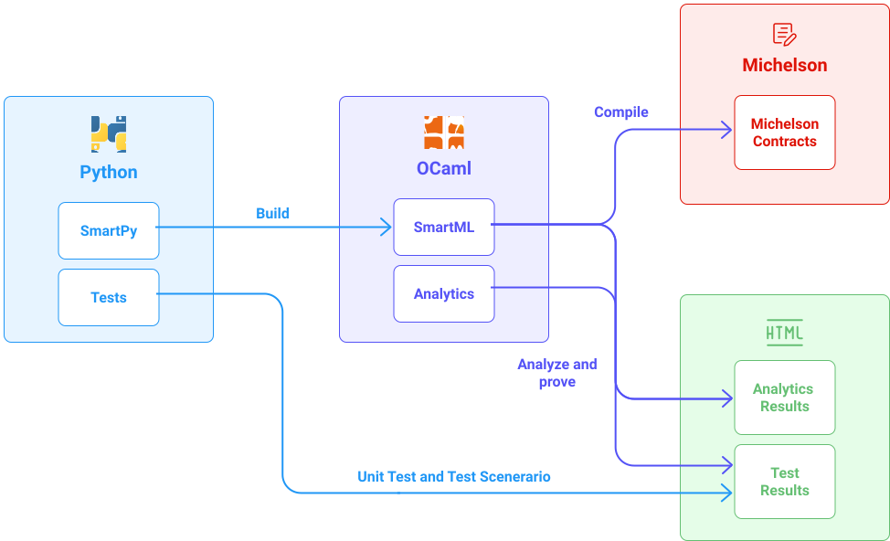

The goal of this module is to allow developers to write smart contracts with _SmartPy_. In the form of a pedagogical course illustrated by an example of a smart contract, the developer will acquire the essentials to write, test, and analyze his smart contract.

Tezos smart contracts are written in [Michelson](https://opentezos.com/michelson), which is a stack-based language. It is the lowest level of a Tezos smart contract: The Michelson code is what will be deployed on a Tezos network. However, if reading or writing Michelson code is still accessible for small smart contracts, it can become pretty tedious to use, for more complex smart contracts:

- there are no variables nor functions
- no syntactic sugar
  > In computer science, [syntactic sugar](https://en.wikipedia.org/wiki/Syntactic_sugar)  is a syntax within a programming language that is designed to make things easier to read or to express.
- the Michelson code cannot be broken down into several files
- stack-based languages are not commonly used when it comes to web development.

**SmartPy solves these issues.**

It is a high-level smart contracts library and comes with related tools in the form of [SmartPy.io](https://smartpy.io/) to greatly ease the accessibility, understandability, and provability of smart contracts on Tezos. A few advantages are:

- It is based on a popular programming language: _Python_
- It has a set of high-level primitives, called _SmartML_, written in _OCaml_ for a new smart contracts virtual machine that can be compiled into Michelson. These primitives also exist on their own and can be executed, simulated and analyzed.
  > **OCaml** is an industrial-level programming language, that supports functional, imperative, and object-oriented styles.
  > Smart contracts in SmartML are abstract syntax trees, as typically done in OCaml, with values, expressions, commands, etc.
- It has a compiler that translates _SmartML_ contracts into _Michelson_.
- Analytics tools are elements of SmartPy that provide some automatic procedures to analyze and prove properties of smart contracts. Then the [user interface](https://smartpy.io/ide) brings simulation, debugging, tests, and analytics capabilities straight to developers.


<small className="figure">FIGURE 1: From SmartPy to Michelson, Tests, and Analytics </small>

Once built, SmartPy contracts become _SmartML_ contracts and are handled in an OCaml library called _SmartEngine_.

The Python interpreter then evaluates Python code containing SmartPy definitions. It creates a very simple expression, called an S-expression, that is parsed and typed while some properties are verified in the SmartEngine backend.

The S-expression sent between SmartPy and SmartML has the following form, which is not supposed to be human-readable.

```
(storage (record (claimed (bool False)) (deck (array "int" (int 1)
(int 2) (int 3) (int 4) (int 5))) (nextPlayer (int 1)) (size (int
5)) (winner (int 0))) messages ((claim ((check (eq (sum (attrData
"deck")) (int 0))) (set (attrData "claimed") (bool True)) (set
(attrData "winner") (attrData "nextPlayer")))) (remove ((define
"cell" (unknown 1)) (define "k" (unknown 2)) (check (ge (getParam
cell (unknown 1)) (int 0))) (check (lt (getParam cell (unknown 1))
(attrData "size"))) (check (ge (getParam k (unknown 2)) (int 1)))
(check (le (getParam k (unknown 2)) (int 2))) (check (le (getParam
k (unknown 2)) (getItem (attrData "deck") (getParam cell (unknown
1))))) (set (getItem (attrData "deck") (getParam cell (unknown 1)))
(sub (getItem (attrData "deck") (getParam cell (unknown 1)))
(getParam k (unknown 2)))) (set (attrData "nextPlayer") (sub (int 3)
(attrData "nextPlayer")))))))
```

The point behind this design is to be able to apply the same methodology of building this kind of simple S-expression for other languages and have something like a SmartJS instead of SmartPy, etc.

It can then be easily compiled into a single Michelson code file.  
This Michelson file is the smart contract that will be deployed on a Tezos network.

## What is a smart contract?

What is a smart contract is and what role _SmartPy_ plays in it.

Fig. 1 helps to contextualize the role of _SmartPy_ in the Tezos ecosystem.

_SmartPy_ is a development tool allowing for the production of smart contracts (scripts in Michelson), which can be deployed on the blockchain.


<small className="figure">FIGURE 2: _SmartPy_ contextualisation </small>

A Tezos smart contract is a piece of **code** written in Michelson language (a low-level stack-based Turing-complete language).

It defines all **entrypoints** (invocable functions) of the smart contract and its **storage**.


<small className="figure">FIGURE 3: Smart contract</small>

### Storage
The storage is an allocated memory space associated with a smart contract. It is the permanent data store for the smart contract.

### Entrypoints
The entrypoints are the invocable functions of a smart contract. Executing an entrypoint takes some parameters and the current state of the storage, and returns a new modified storage and some operations.

<NotificationBar>
  <p>

**Operations** are an ordered list of transactions. An operation can trigger a tez transfer or an entry point of another targeted contract. If the execution of an entry point produces operations then they are sent and executed following the order of the list of operations.

  </p>
</NotificationBar>


In the rest of the module, we will see how to install SmartPy on his machine. But mainly, we will see how to use [the online editor](https://smartpy.io/ide) to start directly to code, test, and run his smart contract with SmartPy. The whole will be illustrated with an example of a raffle smart contract.

## References

[1] https://tzstats.com/blog/next-gen-blockchain-indexing-for-tezos/https://smartpy.io/

[2] https://smartpy-io.medium.com/introducing-smartpy-and-smartpy-io-d4013bee7d4e
