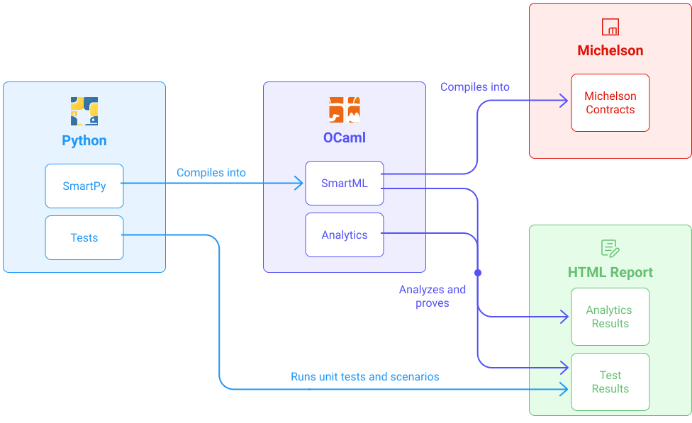

This module aims to teach developers to write smart contracts with _SmartPy_. It will take the form of a course, illustrated through an example of a smart contract, to help the developer acquire the essentials to write, test, and analyze his smart contract.

Tezos smart contracts are written in [Michelson](https://opentezos.com/michelson), which is a stack-based language, that forms the lowest level of a Tezos smart contract. The Michelson code is what will be deployed on the Tezos network. However, while reading or writing a Michelson code is accessible for small smart contracts, it can become pretty tedious and complicated to use, for more complex smart contracts, as:

- there are no variables nor functions
- no syntactic sugar
  > In computer science, [syntactic sugar](https://en.wikipedia.org/wiki/Syntactic_sugar)  is a syntax within a programming language that is designed to make things easier to read or express.
- the Michelson code cannot be broken down into several files
- stack-based languages are not commonly used when it comes to web development.

**SmartPy offers an alternative.**

SmartPy is a Smart Contract library. It comes with numerous tools in the form of [SmartPy.io](https://smartpy.io/). It greatly eases the accessibility, understandability, and provability of smart contracts on Tezos. A few of the main advantages are:

- It is based on a popular programming language: _Python_
- It has a set of high-level primitives, called _SmartML_, written in _OCaml_ that can be compiled into Michelson. These primitives also exist on their own and can be executed, simulated and analyzed.
  > **OCaml** is an industrial-level programming language, that supports functional, imperative, and object-oriented styles.
  > Smart contracts in SmartML are abstract syntax trees, as it is normally done in OCaml, with values, expressions, commands, etc.
- It has a compiler that translates _SmartML_ contracts into _Michelson_.
- Analytics tools are elements of SmartPy that provide some automatic procedures to analyze and prove the properties of smart contracts, such as the [user interface](https://smartpy.io/ide), which brings simulation, debugging, tests, and analytics capabilities straight to developers.

<small className="figure">FIGURE 1: From SmartPy to Michelson, Tests, and Analytics </small>

Once built, SmartPy contracts become _SmartML_ contracts and are handled in an OCaml library called _SmartEngine_.

The Python interpreter then evaluates Python code containing SmartPy definitions.

It can then be easily analyzed or compiled into a single Michelson code file.

This Michelson file is the smart contract that will be deployed on a Tezos network.

> This design aims to apply the same methodology for other languages and potentially offer alternatives to SmartPy such as SmartJS.

## A few definitions

## What is a smart contract?

Fig. 1 helps to contextualize the role of _SmartPy_ in the Tezos ecosystem.

_SmartPy_ is a development tool allowing for the production of smart contracts (scripts in Michelson), which can be deployed on the blockchain.

<small className="figure">FIGURE 2: SmartPy contextualisation </small>

A Tezos smart contract is a piece of **code** written in Michelson language (a low-level stack-based Turing-complete language).

It defines all **entrypoints** (invocable functions) of the smart contract and its **storage**.

<small className="figure">FIGURE 3: Smart contract</small>

### Storage
The storage is an allocated memory space associated with a smart contract. It is the permanent data store for the smart contract.

### Entrypoints
The entrypoints are the invocable functions of a smart contract. Executing an entrypoint takes some parameters and the current-state of the storage. This action will return a new modified storage and some operations.

<NotificationBar>
  

An **operation** can trigger a tez transfer or the entry point of another targeted contract. If the execution of an entry point produces operations then they are sent and executed in the order stated by the list of operations.

  

</NotificationBar>

In the rest of the module, we will see how to install SmartPy. But mainly, we will see how to use [the online editor](https://smartpy.io/ide) to directly start to code, test, and run a smart contract with SmartPy. We will illustrate this through an example of a raffle smart contract.

## References
[1] https://smartpy.io/

[2] https://smartpy-io.medium.com/introducing-smartpy-and-smartpy-io-d4013bee7d4e
