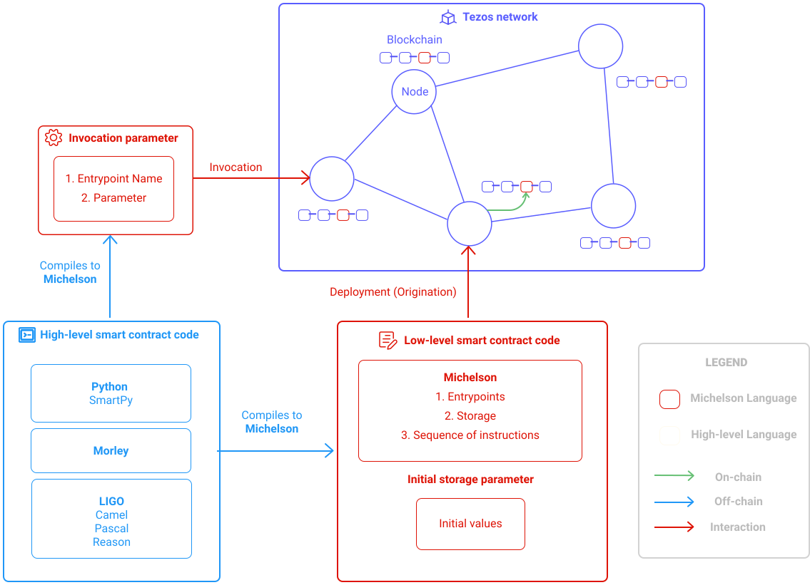

In this chapter, the use of the SmartPy library will be taught, based on the development of a raffle smart contract. 
The most important aspects of the framework will be covered. 
This chapter focuses on the way to develop a smart contract, each new notion required will be introduced. 
For a full reference of SmartPy, see: [Reference Manual](https://smartpy.io/reference.html)

## What is a smart contract ?

First, let's define what a smart contract is and what role SmartPy plays in it.

The following schema helps to contextualize the role of SmartPy in the Tezos ecosystem.

SmartPy is active in the left part as a development tool allowing for the production of smart contracts (scripts in Michelson), which can be deployed on the blockchain.


<small className="figure">FIGURE 1: SmartPy contextualisation </small>

A Tezos smart contract is a piece of **code** written in Michelson language (a low-level stack-based Turing-complete language).

It also defines all **entrypoints** (invocable functions) of the smart contract.

It also defines the **storage** of the smart contract.


<small className="figure">FIGURE 2: Smart contract</small>

### Storage

The storage is an allocated memory space associated with a smart contract. 
It is the permanent data store for the smart contract.

### Entrypoints

Entrypoints are invocable function for a smart contract.
Executing an entrypoint takes some parameters and a current state of the storage and returns a new state of storage and some operations.

> **An operation** results from the invocation of a smart contract and represents the side effects on the Tezos network.
> The storage resulting from the invocation of a smart contract represents the side effects on the data related to the invoked contract.
> If the execution of an entrypoint produces operations (an ordered list of transactions)
> then they are sent and executed according to the order of the operations on the list.


## Raffle contract

// TODO: what is a raffle ? add a schema

// TODO: past full code here


## Get Started

The writing of this smart contract will be done entirely on the [online editor](https://smartpy.io/ide) proposed by SmartPy. 
It is of course possible to do the same thing on your ide and use the command lines (described in the previous chapter) 
to compile/test your contract.

### Create your contract

Now, let's create a new contract in the online editor that we will name _Raffle Contract_.


<small className="figure">FIGURE 1: Online Editor Create Contract</small>

### Template

Let's start with this template.

```python
# Raffle Contract - Example for illustrative purposes only.

import smartpy as sp

class Raffle(sp.Contract):
    def __init__(self):
        self.init()

    @sp.entry_point
    def open_raffle(self):
        pass

if "templates" not in __name__:
    @sp.add_test(name = "Raffle")
    def test():
        r = Raffle()
        scenario = sp.test_scenario()
        scenario.h1("Raffle")
        scenario += r

    sp.add_compilation_target("Raffle_comp", Raffle())
```

- **A SmartPy contract** consists of a state together with one or several entry points.
  It is a class definition that inherits from `sp.Contract`.

- **The SmartPy storage** is defined into the constructor `__init__`
  which makes a call to `self.init()` that initializes fields and set up the storage.

- **Entrypoints** are methods of a contract class that can be called from the outside.
  Entrypoints need to be marked with the `@sp.entry_point` decorator.

- **Tests and Scenarios** are good tools to make sure our smart contract is working properly. 
  - A new test is a method marked with the `sp.add_test` decorator
  - A new scenario is instantiated by `sp.test_scenario`
  - Scenarios describe a sequence of actions: originating contracts, computing expressions, calling entry points, etc.
  - In the online Editor of SmartPy.io, the scenario is computed and then displayed as an html document.

We will explain in detail the use of all these concepts later.

Our code doesn't do much for now, but it can already be compiled by pressing the _run_ button and if there is no error 
then you can visualize the generated michelson code in the _Deploy Michelson Contract_ tab.

```shell
parameter (unit %open_raffle);
storage   unit;
code
  {
    CDR;        # @storage
    # == open_raffle == # @storage
    NIL operation; # list operation : @storage
    PAIR;       # pair (list operation) @storage
  };
```

## open_raffle entrypoint

```python
# Raffle Contract - Example for illustrative purposes only.

import smartpy as sp


class Raffle(sp.Contract):
    def __init__(self, address):
        self.init(admin=address,
                  close_date=sp.timestamp(0),
                  jackpot=sp.tez(0),
                  raffle_is_open=False,
                  hash_winning_ticket=sp.bytes('0x')
                  )

    @sp.entry_point
    def open_raffle(self, jackpot_amount, close_date, hash_winning_ticket):
        sp.verify_equal(sp.source, self.data.admin, message="Administrator not recognized.")
        sp.verify(~ self.data.raffle_is_open, message="A raffle is already open.")
        sp.verify(sp.amount >= jackpot_amount, message="The administrator does not own enough tz.")
        today = sp.now
        in_7_day = today.add_days(7)
        sp.verify(close_date > in_7_day, message="The raffle must remain open for at least 7 days.")
        self.data.close_date = close_date
        self.data.jackpot = jackpot_amount
        self.data.hash_winning_ticket = hash_winning_ticket
        self.data.raffle_is_open = True


if "templates" not in __name__:
    alice = sp.test_account("Alice")
    admin = sp.test_account("Administrator")


    @sp.add_test(name="Raffle")
    def test():
        r = Raffle(admin.address)
        scenario = sp.test_scenario()
        scenario.h1("Raffle")
        scenario += r

        scenario.h2("Test open_raffle entrypoint")
        close_date = sp.timestamp_from_utc_now().add_days(8)
        jackpot_amount = sp.tez(10)
        number_winning_ticket = sp.nat(345)
        bytes_winning_ticket = sp.pack(number_winning_ticket)
        hash_winning_ticket = sp.sha256(bytes_winning_ticket)

        scenario.h3("The unauthorized user Alice unsuccessfully call open_raffle")
        scenario += r.open_raffle(close_date=close_date, jackpot_amount=jackpot_amount,
                                  hash_winning_ticket=hash_winning_ticket) \
            .run(source=alice.address, amount=sp.tez(10), now=sp.timestamp_from_utc_now(),
                 valid=False)

        scenario.h3("Admin unsuccessfully call open_raffle with wrong close_date")
        close_date = sp.timestamp_from_utc_now().add_days(4)
        scenario += r.open_raffle(close_date=close_date, jackpot_amount=jackpot_amount,
                                  hash_winning_ticket=hash_winning_ticket) \
            .run(source=admin.address, amount=sp.tez(10), now=sp.timestamp_from_utc_now(),
                 valid=False)

        scenario.h3("Admin unsuccessfully call open_raffle by sending not enough tez to the contract")
        close_date = sp.timestamp_from_utc_now().add_days(8)
        scenario += r.open_raffle(close_date=close_date, jackpot_amount=jackpot_amount,
                                  hash_winning_ticket=hash_winning_ticket) \
            .run(source=admin.address, amount=sp.tez(5), now=sp.timestamp_from_utc_now(),
                 valid=False)

        scenario.h3("Admin successfully call open_raffle")
        scenario += r.open_raffle(close_date=close_date, jackpot_amount=jackpot_amount,
                                  hash_winning_ticket=hash_winning_ticket) \
            .run(source=admin.address, amount=sp.tez(10), now=sp.timestamp_from_utc_now())
        scenario.verify(r.data.close_date == close_date)
        scenario.verify(r.data.jackpot == jackpot_amount)
        scenario.verify(r.data.raffle_is_open)

        scenario.h3("Admin unsuccessfully call open_raffle because a raffle is already open")
        scenario += r.open_raffle(close_date=close_date, jackpot_amount=jackpot_amount,
                                  hash_winning_ticket=hash_winning_ticket) \
            .run(source=admin.address, amount=sp.tez(10), now=sp.timestamp_from_utc_now(),
                 valid=False)


    sp.add_compilation_target("Raffle_comp", Raffle(admin.address))
```

## References

[1] https://smartpy.io/reference.html

[2]