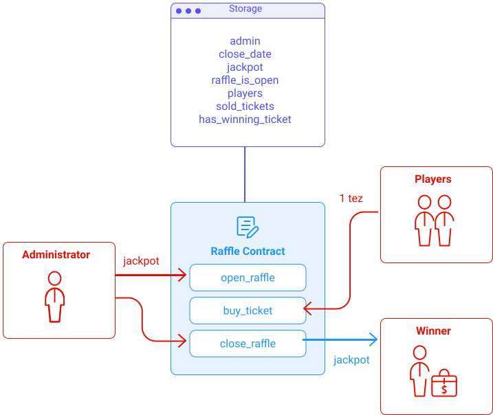

import NotificationBar from '../../src/components/docs/NotificationBar';

In this chapter, we will use _SmartPy_ to develop a smart contract based Raffle and cover the most important aspects of the framework. We will use this opportunity to introduce new notions as they appear. For a complete reference of _SmartPy_, please refer to the [Reference Manual](https://smartpy.io/reference.html).

## About SmartPy

SmartPy is a **Python library**. SmartPy scripts are regular Python scripts that use SmartPy constructions. This mechanism is useful because it brings very powerful **meta-programming** capabilities.

**Meta-programming** is when we can write a program that writes a program, i.e., constructs a contract. Indeed, the functions of the SmartPy Library are used to construct a smart contract.

Smart contracts are executed once they are deployed in the Tezos blockchain (although they can be simulated). 

Like most languages, SmartPy has expressions. For example:
- `self.data.x` represents the contract storage field `x`
- `2` represents the number `2
- `self.data.x + 2` represents their sum

Inside a contract, when we write

```python
​y = self.data.x + 2
```
we declare `y` as an alias the SmartPy expression `self.data.x + 2`.

Note that the actual addition is not carried out until the contract has been deployed and the [entrypoint](#a-few-concepts-first) is called.

As you will see throughout this tutorial, SmartPy is a library that will be imported in the following way:

```python
import smartpy as sp
```

And the functions of SmartPy will be called with the prefix `sp.`. For example:

```python
sp.verify(self.data.x > 2)
```

Here, `sp.verify()`checks that the field `x` is larger than `2` and raises an error if it is not. This is performed at run time, i.e., in the blockchain, once translated into Michelson.


## About the raffle contract
A raffle is a game of chance that distributes a winning prize.

The organizer is in charge of defining a jackpot and selling tickets that will either be winners or losers. In the case of our example, we will only have one winning ticket.

Fig.3 represents our smart contract.


<small className="figure">FIGURE 3: Raffle contract</small>

Three entrypoints allow interaction with the contract:

- **open_raffle** can only be called by the administrator. During this call, he sends the tez amount of the jackpot to the contract, defines a closing date, indicates the number/identity of the winning ticket (in an encrypted way), and declares the raffle open.
- **buy_ticket** allows anyone to buy a ticket for 1 tez and take part in the raffle.
- **close_raffle** can only be called by the administrator. It closes the raffle and sends the jackpot to the winner.

> Note that this is a simplified conception of what a raffle is. Here the jackpot is fixed by the administrator, but it is possible to make a contract where the jackpot depends on the number of sold tickets.

### Get started
This section illustrates the coding of the smart contract in the [online editor](https://smartpy.io/ide) proposed by _SmartPy_. You can however also use your favourite IDE instead, as described previously.

#### Create your contract
To start, create a new contract in the online editor and name it _Raffle Contract_.


<small className="figure">FIGURE 4: Online Editor Create Contract</small>

#### Template

Copy/paste the template below to get started:

```python
# Raffle Contract - Example for illustrative purposes only.

import smartpy as sp

class Raffle(sp.Contract):
    def __init__(self):
        self.init()

    @sp.entry_point
    def open_raffle(self):
        pass

    @sp.add_test(name = "Raffle")
    def test():
        r = Raffle()
        scenario = sp.test_scenario()
        scenario.h1("Raffle")
        scenario += r
```

#### A few concepts first

**A _SmartPy_ contract** is a class definition that inherits from the `sp.Contract`.
> **A class** is a code template for creating objects. Objects have member variables and have a behaviour associated with them. In python a class is created by the keyword `class`.  
> **Inheritance** allows us to define a class that can inherit all the methods and properties of another class.

- **The _SmartPy_ storage** is defined into the constructor `__init__` which makes a call to `self.init()` that initializes the fields and sets up the storage.

- **Entrypoints** are a method of a contract class that can be called on from the outside. Entrypoints need to be marked with the `@sp.entry_point` decorator.
    > **Decorators** are functions that modify the functionality of other functions. They are introduced by `@` and are placed before the function.

**Test Scenarios** are good tools to make sure our smart contracts are working correctly.
- A new test is a method marked with the `sp.add_test` decorator.
- A new scenario is instantiated by `sp.test_scenario`.
- Scenarios describe a sequence of actions: originating contracts, computing expressions or calling entry points, etc.
- In the online editor of SmartPy.io, the scenario is computed and then displayed as an HTML document on the output panel.

> Note that there is a difference between **Test Case** which is a set of actions executed to verify particular features or functionality and **Test Scenario** which includes an end to end functionality to be tested.

We will explain in more details the use of all these concepts in the next sections.

Our code doesn't do much for now, but it can already be compiled by pressing the _run_ button. If there is no error, you should be able to visualize the generated Michelson code in the _Deploy Michelson Contract_ tab.

```js
parameter (unit %open_raffle);
storage   unit;
code
  {
    CDR;        # @storage
    # == open_raffle == # @storage
    NIL operation; # list operation : @storage
    PAIR;       # pair (list operation) @storage
  };
```

### open_raffle entrypoint
`open_raffle` is the entrypoint that only the administrator can call. If the invocation is successful, then the raffle will open, and the smart contract's storage will be updated with the chosen amount and the hash of the winning ticket number.

#### Link to referential manual
- [Init](https://smartpy.io/reference.html#_contracts)
- [Entrypoints](https://smartpy.io/reference.html#_entry_points)
- [Checking a Condition](https://smartpy.io/reference.html#_checking_a_condition)
- [Timestamps](https://smartpy.io/reference.html#_timestamps)
- [Test and Scenario](https://smartpy.io/reference.html#_tests_and_scenarios)
- [Typing](https://smartpy.io/reference.html#_typing)

#### Code

Here is the first version of this contract. We will go through its different parts one at a time.

```python
# Raffle Contract - Example for illustrative purposes only.

import smartpy as sp


class Raffle(sp.Contract):
    def __init__(self, address):
        self.init(admin=address,
                  close_date=sp.timestamp(0),
                  jackpot=sp.tez(0),
                  raffle_is_open=False,
                  hash_winning_ticket=sp.bytes('0x')
                  )

    @sp.entry_point
    def open_raffle(self, jackpot_amount, close_date, hash_winning_ticket):
        sp.verify_equal(sp.source, self.data.admin, message="Administrator not recognized.")
        sp.verify(~ self.data.raffle_is_open, message="A raffle is already open.")
        sp.verify(sp.amount >= jackpot_amount, message="The administrator does not own enough tz.")
        today = sp.now
        in_7_day = today.add_days(7)
        sp.verify(close_date > in_7_day, message="The raffle must remain open for at least 7 days.")
        self.data.close_date = close_date
        self.data.jackpot = jackpot_amount
        self.data.hash_winning_ticket = hash_winning_ticket
        self.data.raffle_is_open = True

    @sp.add_test(name="Raffle")
    def test():
        alice = sp.test_account("Alice")
        admin = sp.test_account("Administrator")
        r = Raffle(admin.address)
        scenario = sp.test_scenario()
        scenario.h1("Raffle")
        scenario += r

        scenario.h2("Test open_raffle entrypoint")
        close_date = sp.timestamp_from_utc_now().add_days(8)
        jackpot_amount = sp.tez(10)
        number_winning_ticket = sp.nat(345)
        bytes_winning_ticket = sp.pack(number_winning_ticket)
        hash_winning_ticket = sp.sha256(bytes_winning_ticket)

        scenario.h3("The unauthorized user Alice unsuccessfully call open_raffle")
        scenario += r.open_raffle(close_date=close_date, jackpot_amount=jackpot_amount,
                                  hash_winning_ticket=hash_winning_ticket) \
            .run(source=alice.address, amount=sp.tez(10), now=sp.timestamp_from_utc_now(),
                 valid=False)

        scenario.h3("Admin unsuccessfully call open_raffle with wrong close_date")
        close_date = sp.timestamp_from_utc_now().add_days(4)
        scenario += r.open_raffle(close_date=close_date, jackpot_amount=jackpot_amount,
                                  hash_winning_ticket=hash_winning_ticket) \
            .run(source=admin.address, amount=sp.tez(10), now=sp.timestamp_from_utc_now(),
                 valid=False)

        scenario.h3("Admin unsuccessfully call open_raffle by sending not enough tez to the contract")
        close_date = sp.timestamp_from_utc_now().add_days(8)
        scenario += r.open_raffle(close_date=close_date, jackpot_amount=jackpot_amount,
                                  hash_winning_ticket=hash_winning_ticket) \
            .run(source=admin.address, amount=sp.tez(5), now=sp.timestamp_from_utc_now(),
                 valid=False)

        scenario.h3("Admin successfully call open_raffle")
        scenario += r.open_raffle(close_date=close_date, jackpot_amount=jackpot_amount,
                                  hash_winning_ticket=hash_winning_ticket) \
            .run(source=admin.address, amount=sp.tez(10), now=sp.timestamp_from_utc_now())
        scenario.verify(r.data.close_date == close_date)
        scenario.verify(r.data.jackpot == jackpot_amount)
        scenario.verify(r.data.raffle_is_open)

        scenario.h3("Admin unsuccessfully call open_raffle because a raffle is already open")
        scenario += r.open_raffle(close_date=close_date, jackpot_amount=jackpot_amount,
                                  hash_winning_ticket=hash_winning_ticket) \
            .run(source=admin.address, amount=sp.tez(10), now=sp.timestamp_from_utc_now(),
                 valid=False)

```

#### Storage definition

```python
def __init__(self, address):
    self.init(admin=address,
              close_date=sp.timestamp(0),
              jackpot=sp.tez(0),
              raffle_is_open=False,
              hash_winning_ticket=sp.bytes('0x')
              )
```

The definition of the storage is done in the constructor `__init__` and the different fields of the storage are stated as follows:  
`self.init( field1=value1, field2=value2, field3=value3)`

where:

- `field1`, `field2`, `field3` are the names of the variables and are accessible via `self.data` (e.g. `self.data.field1`)
- `value1`, `value2`, `value3` are initial values or variables passed as constructors like `__init__(self, value1)` as we did above for the `admin=address` field.

<NotificationBar>
  <p>


SmartPy types are all of the form `sp.T<TypeName>`. Check out [Typing](https://smartpy.io/reference.html#_primitive_data_types_overview).
For examples:
```
sp.TUnit
sp.TBool
sp.TInt
sp.TNat
sp.TString
...
```

Types are usually automatically inferred and not explicitly needed. However, it is still possible to add constraints on types, e.g. check out [Setting a type of constraint in SmartPy](https://smartpy.io/reference.html#_setting_a_type_constraint_in_smartpy).

They are then compiled into their corresponding Michelson type.

  </p>
</NotificationBar>


For the storage of the raffle contract, we have defined five fields for the moment:

- **admin** is the only authorized `address` to call the two entrypoints *open_raffle* and *close_raffle*.
- **close_date** is a `timestamp` to indicate the closing date of the raffle. The raffle must remain open for at least seven days.
- **jackpot** is the amount in `tez` that will be distributed to the winner.
- **raffle_is_open** is a `boolean` to indicate if the raffle is open or not.
- **hash_winning_ticket** is the hash of the winning ticket indicated by the admin. It is of type `bytes`.
  

<NotificationBar>
  <p>
  
  It's not possible to generate a truly random number from a smart contract, so an easy alternative is to use a hash that the admin will reveal the value later. 
  
  This example is for educational purposes and is not intended to be deployed on the real Tezos network.

  </p>
</NotificationBar>


#### Entrypoint implementation

```python
@sp.entry_point
def open_raffle(self, jackpot_amount, close_date, hash_winning_ticket):
    sp.verify_equal(sp.source, self.data.admin, message="Administrator not recognized.")
    sp.verify(~ self.data.raffle_is_open, message="A raffle is already open.")
    sp.verify(sp.amount >= jackpot_amount, message="The administrator does not own enough tz.")
    today = sp.now
    in_7_day = today.add_days(7)
    sp.verify(close_date > in_7_day, message="The raffle must remain open for at least 7 days.")
    self.data.close_date = close_date
    self.data.jackpot = jackpot_amount
    self.data.hash_winning_ticket = hash_winning_ticket
    self.data.raffle_is_open = True
```

An entrypoint is a method of the contract class and is always preceded by the keyword `@sp.entry_point`. It can take several parameters. In our case, the first entrypoint we use, is called `open_raffle` and does the following:

- With `sp.verify()` or `sp.verify_equal()`, we check that a statement is true or if it returns an error message (more info at [Checking a Condition](https://smartpy.io/reference.html#_checking_a_condition)). Here we check four statements :
  
  1. The address that calls the entrypoint must be the administrator one indicated in the storage. We compare here `sp.source` and `self.data.admin`.
     > `sp.sender` is the address that calls the current entrypoint.  
     > `sp.source` is the address that initiates the current transaction. It may or may not be equal to `sp.sender`, but in our case, it is.

  2. No raffle must be open. For this, we use the boolean `raffle_is_open` defined in the storage.
     > Note that `~` is the symbol used for logical negation.

  3. The amount `sp.amount` sent to the contract by the administrator during the transaction must be at least greater than the value specified in the `jackpot_amount` argument.

  4. The closing date `close_date` passed as a parameter must be at least seven days in the future (more info on [Timestamps](https://smartpy.io/reference.html#_timestamps)).

- Once all the conditions are passed we update the storage as follows:

```python
self.data.close_date = close_date
self.data.jackpot = jackpot_amount
self.data.hash_winning_ticket = hash_winning_ticket
self.data.raffle_is_open = True
```

#### Test Scenario

In a scenario, we simulate the origination and a number of calls to entry point, that can be made from different accounts. The execution of the test generates html code that can help visualize it.

The purpose of the test scenario is to ensure that the smart contract functions properly by triggering the conditions and checking the changes made to the storage.

On _SmartPy_, a test is a method of the contract class, preceded by `@sp.add_test`.

Inside this method, you need to instantiate your contract class and your scenarios, to which you will add the contract instance and all the related calls that you want to test. For instance:

```python
@sp.add_test(name="Raffle")
def test():
    alice = sp.test_account("Alice")
    admin = sp.test_account("Administrator")
    r = Raffle(admin.address)
    scenario = sp.test_scenario()
    scenario.h1("Raffle")
    scenario += r
```

Note that you can also organize your scenarios by adding titles with `scenario.h1("My title")`, `scenario.h2("My subtitle")`, etc.

An interesting capacity is to define test accounts for our scenarios:

```python
alice = sp.test_account("Alice")
admin = sp.test_account("Administrator")
```

Test accounts can be defined through calling `sp.test_account(seed)`, where _seed_ is a string.
A test account contains a few fields: `account.address`, `account.public_key_hash`, `account.public_key`, and `account.secret_key`.

You can then simulate the calls to the entrypoints by specifying the different arguments as follows:

```python
scenario.h3("The unauthorized user Alice unsuccessfully call open_raffle")
scenario += r.open_raffle(close_date=close_date, jackpot_amount=jackpot_amount,
                          hash_winning_ticket=hash_winning_ticket) \
    .run(source=alice.address, amount=sp.tez(10), now=sp.timestamp_from_utc_now(),
         valid=False)
```

The run method accepts optional parameters that can help to setup a relevant context for the entrypoint call. You can specify the `source` of the transaction, the `amount` of tez sent, the transaction date using `now` etc.

> Note that the option `valid=False` allows you to indicate that the transaction is expected to fail here because Alice is not the administrator.

The result is displayed in an HTML document in the output panel of the online editor.

#### Run and watch the output

Let's run our code:


<small className="figure">FIGURE 4: Online Editor Contract Summary</small>

You can see a summary of our smart contract with the following information:
- Address of the contract
- Balance in tez
- Storage
- Entry points

By clicking on the _Types_ tab, we have access to the types of the storage elements and the parameters of the entrypoints.


<small className="figure">FIGURE 5: Online Editor Types</small>

> As with Python, most of the time, it is not necessary to specify the type of an object in _SmartPy_.  
> But because the target language of SmartPy, Michelson, requires types.  
> Each _SmartPy_ expression, however, needs a type. This is why _SmartPy_ uses type inference to determine the type of each expression.  
> See doc [Typing](https://smartpy.io/reference.html#_typing).

By clicking on the _Deploy Michelson Contract_ tab, we have access to the codes compiled in Michelson for the storage (_Storage_ tab) and the smart contract (_Code_ tab).

The michelson code of our smart contract is for now, the following:

```js
parameter (pair %open_raffle (timestamp %close_date) (pair (bytes %hash_winning_ticket) (mutez %jackpot_amount)));
storage   (pair (pair (address %admin) (timestamp %close_date)) (pair (bytes %hash_winning_ticket) (pair (mutez %jackpot) (bool %raffle_is_open))));
code
  {
    UNPAIR;     # @parameter : @storage
    SWAP;       # @storage : @parameter
    # == open_raffle ==
    # sp.verify(sp.pack(sp.set_type_expr(sp.source, sp.TAddress)) == sp.pack(sp.set_type_expr(self.data.admin, sp.TAddress)), message = 'Administrator not recognized.') # @storage : @parameter
    DUP;        # @storage : @storage : @parameter
    DUG 2;      # @storage : @parameter : @storage
    CAR;        # pair (address %admin) (timestamp %close_date) : @parameter : @storage
    CAR;        # address : @parameter : @storage
    PACK;       # bytes : @parameter : @storage
    SOURCE;     # @source : bytes : @parameter : @storage
    PACK;       # bytes : bytes : @parameter : @storage
    COMPARE;    # int : @parameter : @storage
    EQ;         # bool : @parameter : @storage
    IF
      {}
      {
        PUSH string "Administrator not recognized."; # string : @parameter : @storage
        FAILWITH;   # FAILED
      }; # @parameter : @storage
    SWAP;       # @storage : @parameter
    # sp.verify(~ self.data.raffle_is_open, message = 'A raffle is already open.') # @storage : @parameter
    DUP;        # @storage : @storage : @parameter
    DUG 2;      # @storage : @parameter : @storage
    GET 6;      # bool : @parameter : @storage
    IF
      {
        PUSH string "A raffle is already open."; # string : @parameter : @storage
        FAILWITH;   # FAILED
      }
      {}; # @parameter : @storage
    # sp.verify(sp.amount >= params.jackpot_amount, message = 'The administrator does not own enough tz.') # @parameter : @storage
    DUP;        # @parameter : @parameter : @storage
    GET 4;      # mutez : @parameter : @storage
    AMOUNT;     # @amount : mutez : @parameter : @storage
    COMPARE;    # int : @parameter : @storage
    GE;         # bool : @parameter : @storage
    IF
      {}
      {
        PUSH string "The administrator does not own enough tz."; # string : @parameter : @storage
        FAILWITH;   # FAILED
      }; # @parameter : @storage
    # sp.verify(params.close_date > sp.add_seconds(sp.now, 604800), message = 'The raffle must remain open for at least 7 days.') # @parameter : @storage
    NOW;        # @now : @parameter : @storage
    PUSH int 604800; # int : @now : @parameter : @storage
    ADD;        # timestamp : @parameter : @storage
    SWAP;       # @parameter : timestamp : @storage
    DUP;        # @parameter : @parameter : timestamp : @storage
    DUG 2;      # @parameter : timestamp : @parameter : @storage
    CAR;        # timestamp : timestamp : @parameter : @storage
    COMPARE;    # int : @parameter : @storage
    GT;         # bool : @parameter : @storage
    IF
      {}
      {
        PUSH string "The raffle must remain open for at least 7 days."; # string : @parameter : @storage
        FAILWITH;   # FAILED
      }; # @parameter : @storage
    SWAP;       # @storage : @parameter
    # self.data.close_date = params.close_date # @storage : @parameter
    UNPAIR;     # pair (address %admin) (timestamp %close_date) : pair (bytes %hash_winning_ticket) (pair (mutez %jackpot) (bool %raffle_is_open)) : @parameter
    CAR;        # address : pair (bytes %hash_winning_ticket) (pair (mutez %jackpot) (bool %raffle_is_open)) : @parameter
    DUP 3;      # @parameter : address : pair (bytes %hash_winning_ticket) (pair (mutez %jackpot) (bool %raffle_is_open)) : @parameter
    CAR;        # timestamp : address : pair (bytes %hash_winning_ticket) (pair (mutez %jackpot) (bool %raffle_is_open)) : @parameter
    SWAP;       # address : timestamp : pair (bytes %hash_winning_ticket) (pair (mutez %jackpot) (bool %raffle_is_open)) : @parameter
    PAIR;       # pair address timestamp : pair (bytes %hash_winning_ticket) (pair (mutez %jackpot) (bool %raffle_is_open)) : @parameter
    PAIR;       # pair (pair address timestamp) (pair (bytes %hash_winning_ticket) (pair (mutez %jackpot) (bool %raffle_is_open))) : @parameter
    SWAP;       # @parameter : pair (pair address timestamp) (pair (bytes %hash_winning_ticket) (pair (mutez %jackpot) (bool %raffle_is_open)))
    # self.data.jackpot = params.jackpot_amount # @parameter : pair (pair address timestamp) (pair (bytes %hash_winning_ticket) (pair (mutez %jackpot) (bool %raffle_is_open)))
    DUP;        # @parameter : @parameter : pair (pair address timestamp) (pair (bytes %hash_winning_ticket) (pair (mutez %jackpot) (bool %raffle_is_open)))
    DUG 2;      # @parameter : pair (pair address timestamp) (pair (bytes %hash_winning_ticket) (pair (mutez %jackpot) (bool %raffle_is_open))) : @parameter
    GET 4;      # mutez : pair (pair address timestamp) (pair (bytes %hash_winning_ticket) (pair (mutez %jackpot) (bool %raffle_is_open))) : @parameter
    UPDATE 5;   # pair (pair address timestamp) (pair (bytes %hash_winning_ticket) (pair (mutez %jackpot) (bool %raffle_is_open))) : @parameter
    SWAP;       # @parameter : pair (pair address timestamp) (pair (bytes %hash_winning_ticket) (pair (mutez %jackpot) (bool %raffle_is_open)))
    # self.data.hash_winning_ticket = params.hash_winning_ticket # @parameter : pair (pair address timestamp) (pair (bytes %hash_winning_ticket) (pair (mutez %jackpot) (bool %raffle_is_open)))
    GET 3;      # bytes : pair (pair address timestamp) (pair (bytes %hash_winning_ticket) (pair (mutez %jackpot) (bool %raffle_is_open)))
    UPDATE 3;   # pair (pair address timestamp) (pair (bytes %hash_winning_ticket) (pair (mutez %jackpot) (bool %raffle_is_open)))
    # self.data.raffle_is_open = True # pair (pair address timestamp) (pair (bytes %hash_winning_ticket) (pair (mutez %jackpot) (bool %raffle_is_open)))
    PUSH bool True; # bool : pair (pair address timestamp) (pair (bytes %hash_winning_ticket) (pair (mutez %jackpot) (bool %raffle_is_open)))
    UPDATE 6;   # pair (pair address timestamp) (pair (bytes %hash_winning_ticket) (pair (mutez %jackpot) (bool %raffle_is_open)))
    NIL operation; # list operation : pair (pair address timestamp) (pair (bytes %hash_winning_ticket) (pair (mutez %jackpot) (bool %raffle_is_open)))
    PAIR;       # pair (list operation) (pair (pair address timestamp) (pair (bytes %hash_winning_ticket) (pair (mutez %jackpot) (bool %raffle_is_open))))
  };
```

By scrolling down a little, we have access to the results of the test scenario, with within each step a summary of the contract.


<small className="figure">FIGURE 4: Online Editor Scenario Output</small>

### buy_ticket entrypoint

`buy_ticket` is an entrypoint that can be called on by everyone who wants to participate in the raffle.
If the invocation is successful, the address of the sender will be added to the storage, and the player will be eligible to win the jackpot

#### Link to referential manual

- [Sets](https://smartpy.io/reference.html#_sets)
- [Maps](https://smartpy.io/reference.html#_maps_and_big_maps)

#### Code

Here is the second version of this contract with the addition of a new entrypoint. We will go through the additonal parts one at a time.

```python
# Raffle Contract - Example for illustrative purposes only.

import smartpy as sp


class Raffle(sp.Contract):
    def __init__(self, address):
        self.init(admin=address,
                  close_date=sp.timestamp(0),
                  jackpot=sp.tez(0),
                  raffle_is_open=False,
                  players=sp.set(),
                  sold_tickets=sp.map(),
                  hash_winning_ticket=sp.bytes('0x')
                  )

    @sp.entry_point
    def open_raffle(self, jackpot_amount, close_date, hash_winning_ticket):
        sp.verify_equal(sp.source, self.data.admin, message="Administrator not recognized.")
        sp.verify(~ self.data.raffle_is_open, message="A raffle is already open.")
        sp.verify(sp.amount >= jackpot_amount, message="The administrator does not own enough tz.")
        today = sp.now
        in_7_day = today.add_days(7)
        sp.verify(close_date > in_7_day, message="The raffle must remain open for at least 7 days.")
        self.data.close_date = close_date
        self.data.jackpot = jackpot_amount
        self.data.hash_winning_ticket = hash_winning_ticket
        self.data.raffle_is_open = True

    @sp.entry_point
    def buy_ticket(self):
        ticket_price = sp.tez(1)
        current_player = sp.sender
        sp.verify(self.data.raffle_is_open, message="The raffle is closed.")
        sp.verify(sp.amount == ticket_price,
                  message="The sender did not send the right tez amount (Ticket price = 1tz).")
        sp.verify(~ self.data.players.contains(current_player), message="Each player can participate only once.")
        self.data.players.add(current_player)
        ticket_id = abs(sp.len(self.data.players) - 1)
        self.data.sold_tickets[ticket_id] = current_player


    @sp.add_test(name="Raffle")
    def test():
        alice = sp.test_account("Alice")
        jack = sp.test_account("Jack")
        admin = sp.test_account("Administrator")
    
        r = Raffle(admin.address)
        scenario = sp.test_scenario()
        scenario.h1("Raffle")
        scenario += r

        scenario.h2("Test open_raffle entrypoint")
        close_date = sp.timestamp_from_utc_now().add_days(8)
        jackpot_amount = sp.tez(10)
        number_winning_ticket = sp.nat(345)
        bytes_winning_ticket = sp.pack(number_winning_ticket)
        hash_winning_ticket = sp.sha256(bytes_winning_ticket)

        scenario.h3("The unauthorized user Alice unsuccessfully call open_raffle")
        scenario += r.open_raffle(close_date=close_date, jackpot_amount=jackpot_amount,
                                  hash_winning_ticket=hash_winning_ticket) \
            .run(source=alice.address, amount=sp.tez(10), now=sp.timestamp_from_utc_now(),
                 valid=False)

        scenario.h3("Admin unsuccessfully call open_raffle with wrong close_date")
        close_date = sp.timestamp_from_utc_now().add_days(4)
        scenario += r.open_raffle(close_date=close_date, jackpot_amount=jackpot_amount,
                                  hash_winning_ticket=hash_winning_ticket) \
            .run(source=admin.address, amount=sp.tez(10), now=sp.timestamp_from_utc_now(),
                 valid=False)

        scenario.h3("Admin unsuccessfully call open_raffle by sending not enough tez to the contract")
        close_date = sp.timestamp_from_utc_now().add_days(8)
        scenario += r.open_raffle(close_date=close_date, jackpot_amount=jackpot_amount,
                                  hash_winning_ticket=hash_winning_ticket) \
            .run(source=admin.address, amount=sp.tez(5), now=sp.timestamp_from_utc_now(),
                 valid=False)

        scenario.h3("Admin successfully call open_raffle")
        scenario += r.open_raffle(close_date=close_date, jackpot_amount=jackpot_amount,
                                  hash_winning_ticket=hash_winning_ticket) \
            .run(source=admin.address, amount=sp.tez(10), now=sp.timestamp_from_utc_now())
        scenario.verify(r.data.close_date == close_date)
        scenario.verify(r.data.jackpot == jackpot_amount)
        scenario.verify(r.data.raffle_is_open)

        scenario.h3("Admin unsuccessfully call open_raffle because a raffle is already open")
        scenario += r.open_raffle(close_date=close_date, jackpot_amount=jackpot_amount,
                                  hash_winning_ticket=hash_winning_ticket) \
            .run(source=admin.address, amount=sp.tez(10), now=sp.timestamp_from_utc_now(),
                 valid=False)

        scenario.h2("Test buy_ticket entrypoint (at this point a raffle is open)")

        scenario.h3("Alice unsuccessfully call buy_ticket by sending a wrong amount of tez")
        scenario += r.buy_ticket().run(sender=alice.address, amount=sp.tez(3), valid=False)

        scenario.h3("Alice successfully call buy_ticket")
        scenario += r.buy_ticket().run(sender=alice.address, amount=sp.tez(1))
        alice_ticket_id = sp.nat(0)
        scenario.verify(r.data.players.contains(alice.address))
        scenario.verify_equal(r.data.sold_tickets[alice_ticket_id], alice.address)

        scenario.h3("Alice unsuccessfully call buy_ticket because she has already buy one")
        scenario += r.buy_ticket().run(sender=alice.address, amount=sp.tez(1), valid=False)

        scenario.h3("Jack successfully call buy_ticket")
        scenario += r.buy_ticket().run(sender=jack.address, amount=sp.tez(1))
        jack_ticket_id = sp.nat(1)
        scenario.verify(r.data.players.contains(jack.address))
        scenario.verify(r.data.players.contains(alice.address))
        scenario.verify_equal(r.data.sold_tickets[alice_ticket_id], alice.address)
        scenario.verify_equal(r.data.sold_tickets[jack_ticket_id], jack.address)
```

#### Storage definition

```python
def __init__(self, address):
    self.init(admin=address,
              close_date=sp.timestamp(0),
              jackpot=sp.tez(0),
              raffle_is_open=False,
              players=sp.set(),
              sold_tickets=sp.map(),
              hash_winning_ticket=sp.bytes('0x')
              )
```

With the addition of this entrypoint we have defined two new fields in the storage:

- **players**, is a `Set` that receives the addresses of each new player who bought a raffle ticket.
- **sold_tickets**, is a `Map` that associates each player's address with a ticket number.

##### Sets

- Sets are unordered collections of values of the same type, unlike lists, which are ordered collections.
- [Sets](https://smartpy.io/reference.html#_sets) in SmartPy are of type `sp.TSet(element)`. It will be then compiled into the corresponding type in Michelson which is `set`.
- For SmartPy expressions, we must use `sp.set([e1, e2, …​, en])` to define a set.

##### Maps

- Map is a data structure which associates a value to a key, thus creating a key-value binding. All keys have the same type and all values have the same type. An additional requirement is that the type of the keys must be comparable.
- [Maps](https://smartpy.io/reference.html#_maps) in SmartPy are of type sp.TMap(key, value). It will be then compiled into the corresponding type in Michelson which is `set`.
- For SmartPy expressions, we can define a map as follows: `my_map = sp.map(l = …​, tkey = …​, tvalue = …​)`.
- To add or replace an element in a map, we use: `my_map[key] = value`

> `Maps` load their entries into the environment, which is fine for small maps, but for maps holding millions of entries, the cost of loading them would be too expensive. For this we use `BigMaps`. Their syntax is the same as for regular maps.

Note that `Set` and a `Map` are used here to store the players. But in case there would be a very large number of players this can block the contract.
The solution would be to use only a `BigMap`. Indeed, a `Map` uses more storage but costs less gas, whereas a `BigMap` consumes less storage but has higher gas costs during the Smart Contract's execution.

#### Entrypoint implementation

```python
@sp.entry_point
def buy_ticket(self):
    ticket_price = sp.tez(1)
    current_player = sp.sender
    sp.verify(self.data.raffle_is_open, message="The raffle is closed.")
    sp.verify(sp.amount == ticket_price,
              message="The sender did not send the right tez amount (Ticket price = 1tz).")
    sp.verify(~ self.data.players.contains(current_player), message="Each player can participate only once.")
    self.data.players.add(current_player)
    ticket_id = abs(sp.len(self.data.players) - 1)
    self.data.sold_tickets[ticket_id] = current_player
```

Three assertions are tested for this entrypoint to work:

1. The raffle must be open.
2. The amount of tez sent to the contract during the transaction must be equal to the ticket price (`1tez`).
3. Each player is allowed to buy only one ticket.

If the conditions are met, then the storage is updated:

- The address of the player is added to the set `self.data.players`.
- The ticket identification (id) is associated with the player's address in the map `self.data.sold_tickets`.
  > In `ticket_id = abs(sp.len(self.data.players) - 1)`, the ticket id is incremented for each new participant. The `abs()` function, which designates the absolute value, is used to ensure that the `ticket_id` is of type `sp.TNat`.

### *close_raffle* entrypoint

Only the administrator can call on the entrypoint `close_raffle`. If the invocation is successful, the raffle is closed, the jackpot amount is sent to the winner, and the storage is reset to a default value.

#### Link to referential manual

- [Bytes](https://smartpy.io/reference.html#_bytes)

#### Full code

Here is the code in its final form with the implementation of the last entrypoint.

```python
# Raffle Contract - Example for illustrative purposes only.

import smartpy as sp


class Raffle(sp.Contract):
    def __init__(self, address):
        self.init(admin=address,
                  close_date=sp.timestamp(0),
                  jackpot=sp.tez(0),
                  raffle_is_open=False,
                  players=sp.set(),
                  sold_tickets=sp.map(),
                  hash_winning_ticket=sp.bytes('0x')
                  )

    @sp.entry_point
    def open_raffle(self, jackpot_amount, close_date, hash_winning_ticket):
        sp.verify_equal(sp.source, self.data.admin, message="Administrator not recognized.")
        sp.verify(~ self.data.raffle_is_open, message="A raffle is already open.")
        sp.verify(sp.amount >= jackpot_amount, message="The administrator does not own enough tz.")
        today = sp.now
        in_7_day = today.add_days(7)
        sp.verify(close_date > in_7_day, message="The raffle must remain open for at least 7 days.")
        self.data.close_date = close_date
        self.data.jackpot = jackpot_amount
        self.data.hash_winning_ticket = hash_winning_ticket
        self.data.raffle_is_open = True

    @sp.entry_point
    def buy_ticket(self):
        ticket_price = sp.tez(1)
        current_player = sp.sender
        sp.verify(self.data.raffle_is_open, message="The raffle is closed.")
        sp.verify(sp.amount == ticket_price,
                  message="The sender did not send the right tez amount (Ticket price = 1tz).")
        sp.verify(~ self.data.players.contains(current_player), message="Each player can participate only once.")
        self.data.players.add(current_player)
        ticket_id = abs(sp.len(self.data.players) - 1)
        self.data.sold_tickets[ticket_id] = current_player

    @sp.entry_point
    def close_raffle(self, selected_ticket):
        sp.verify_equal(sp.source, self.data.admin, message="Administrator not recognized.")
        sp.verify(self.data.raffle_is_open, message="The raffle is closed.")
        sp.verify(sp.now >= self.data.close_date,
                  message="The raffle must remain open for at least 7 days.")
        bytes_selected_ticket = sp.pack(selected_ticket)
        hash_selected_ticket = sp.sha256(bytes_selected_ticket)
        sp.verify_equal(hash_selected_ticket, self.data.hash_winning_ticket,
                        message="The hash does not match the hash of the winning ticket")
        number_of_players = sp.len(self.data.players)
        selected_ticket_id = selected_ticket % number_of_players
        winner = self.data.sold_tickets[selected_ticket_id]
        sp.send(winner, self.data.jackpot, message="winner contract not found.")
        self.data.jackpot = sp.tez(0)
        self.data.close_date = sp.timestamp(0)
        self.data.players = sp.set()
        self.data.sold_tickets = sp.map()
        self.data.raffle_is_open = False

    @sp.add_test(name="Raffle")
    def test():
        alice = sp.test_account("Alice")
        jack = sp.test_account("Jack")
        admin = sp.test_account("Administrator")
        r = Raffle(admin.address)
        scenario = sp.test_scenario()
        scenario.h1("Raffle")
        scenario += r

        scenario.h2("Test open_raffle entrypoint")
        close_date = sp.timestamp_from_utc_now().add_days(8)
        jackpot_amount = sp.tez(10)
        number_winning_ticket = sp.nat(345)
        bytes_winning_ticket = sp.pack(number_winning_ticket)
        hash_winning_ticket = sp.sha256(bytes_winning_ticket)

        scenario.h3("The unauthorized user Alice unsuccessfully call open_raffle")
        scenario += r.open_raffle(close_date=close_date, jackpot_amount=jackpot_amount,
                                  hash_winning_ticket=hash_winning_ticket) \
            .run(source=alice.address, amount=sp.tez(10), now=sp.timestamp_from_utc_now(),
                 valid=False)

        scenario.h3("Admin unsuccessfully call open_raffle with wrong close_date")
        close_date = sp.timestamp_from_utc_now().add_days(4)
        scenario += r.open_raffle(close_date=close_date, jackpot_amount=jackpot_amount,
                                  hash_winning_ticket=hash_winning_ticket) \
            .run(source=admin.address, amount=sp.tez(10), now=sp.timestamp_from_utc_now(),
                 valid=False)

        scenario.h3("Admin unsuccessfully call open_raffle by sending not enough tez to the contract")
        close_date = sp.timestamp_from_utc_now().add_days(8)
        scenario += r.open_raffle(close_date=close_date, jackpot_amount=jackpot_amount,
                                  hash_winning_ticket=hash_winning_ticket) \
            .run(source=admin.address, amount=sp.tez(5), now=sp.timestamp_from_utc_now(),
                 valid=False)

        scenario.h3("Admin successfully call open_raffle")
        scenario += r.open_raffle(close_date=close_date, jackpot_amount=jackpot_amount,
                                  hash_winning_ticket=hash_winning_ticket) \
            .run(source=admin.address, amount=sp.tez(10), now=sp.timestamp_from_utc_now())
        scenario.verify(r.data.close_date == close_date)
        scenario.verify(r.data.jackpot == jackpot_amount)
        scenario.verify(r.data.raffle_is_open)

        scenario.h3("Admin unsuccessfully call open_raffle because a raffle is already open")
        scenario += r.open_raffle(close_date=close_date, jackpot_amount=jackpot_amount,
                                  hash_winning_ticket=hash_winning_ticket) \
            .run(source=admin.address, amount=sp.tez(10), now=sp.timestamp_from_utc_now(),
                 valid=False)

        scenario.h2("Test buy_ticket entrypoint (at this point a raffle is open)")

        scenario.h3("Alice unsuccessfully call buy_ticket by sending a wrong amount of tez")
        scenario += r.buy_ticket().run(sender=alice.address, amount=sp.tez(3), valid=False)

        scenario.h3("Alice successfully call buy_ticket")
        scenario += r.buy_ticket().run(sender=alice.address, amount=sp.tez(1))
        alice_ticket_id = sp.nat(0)
        scenario.verify(r.data.players.contains(alice.address))
        scenario.verify_equal(r.data.sold_tickets[alice_ticket_id], alice.address)

        scenario.h3("Alice unsuccessfully call buy_ticket because she has already buy one")
        scenario += r.buy_ticket().run(sender=alice.address, amount=sp.tez(1), valid=False)

        scenario.h3("Jack successfully call buy_ticket")
        scenario += r.buy_ticket().run(sender=jack.address, amount=sp.tez(1))
        jack_ticket_id = sp.nat(1)
        scenario.verify(r.data.players.contains(jack.address))
        scenario.verify(r.data.players.contains(alice.address))
        scenario.verify_equal(r.data.sold_tickets[alice_ticket_id], alice.address)
        scenario.verify_equal(r.data.sold_tickets[jack_ticket_id], jack.address)

        scenario.h2("Test close_raffle entrypoint (at this point a raffle is open and two players participated)")
        selected_ticket = sp.nat(345)

        scenario.h3("The unauthorized user Alice unsuccessfully call close_raffle")
        scenario += r.close_raffle(selected_ticket).run(sender=alice.address, valid=False)

        scenario.h3("Admin unsuccessfully call close_raffle because it was before the close_date")
        scenario += r.close_raffle(selected_ticket)\
            .run(sender=admin.address, now=sp.timestamp_from_utc_now(), valid=False)

        scenario.h3("Admin unsuccessfully call close_raffle because the hash of the selected ticket does not match with the winning one")
        selected_ticket = sp.nat(1234)
        scenario += r.close_raffle(selected_ticket)\
            .run(sender=admin.address, now=r.data.close_date, valid=False)

        scenario.h3("Admin successfully call close_raffle")
        selected_ticket = sp.nat(345)
        scenario += r.close_raffle(selected_ticket).run(sender=admin.address, now=r.data.close_date)
        scenario.verify_equal(r.data.jackpot, sp.tez(0))
        scenario.verify_equal(r.data.close_date, sp.timestamp(0))
        scenario.verify_equal(r.data.players, sp.set())
        scenario.verify_equal(r.data.sold_tickets, sp.map())
        scenario.verify(~ r.data.raffle_is_open)

        scenario.h3("Alice unsuccessfully call buy_ticket because the raffle is closed")
        scenario += r.buy_ticket().run(sender=alice.address, amount=sp.tez(1), valid=False)
```

#### Entrypoint implementation

The storage definition has not been modified by the addition of this entrypoint, so we can directly explain its implementation.

```python
@sp.entry_point
def close_raffle(self, selected_ticket):
    sp.verify_equal(sp.source, self.data.admin, message="Administrator not recognized.")
    sp.verify(self.data.raffle_is_open, message="The raffle is closed.")
    sp.verify(sp.now >= self.data.close_date,
              message="The raffle must remain open for at least 7 days.")
    bytes_selected_ticket = sp.pack(selected_ticket)
    hash_selected_ticket = sp.sha256(bytes_selected_ticket)
    sp.verify_equal(hash_selected_ticket, self.data.hash_winning_ticket,
                    message="The hash does not match the hash of the winning ticket")
    number_of_players = sp.len(self.data.players)
    selected_ticket_id = selected_ticket % number_of_players
    winner = self.data.sold_tickets[selected_ticket_id]
    sp.send(winner, self.data.jackpot, message="winner contract not found.")
    self.data.jackpot = sp.tez(0)
    self.data.close_date = sp.timestamp(0)
    self.data.players = sp.set()
    self.data.sold_tickets = sp.map()
    self.data.raffle_is_open = False
```

Four assertions are checked in this entrypoint:

1. The caller must be the admin of the contract.
2. The raffle must be open.
3. The closing date must be greater than or equal to the closing date indicated in the storage.
4. The hash of the ticket used as a parameter, must be equal to the hash of the ticket indicated in the storage.
   > The administrator provides as parameter a `sp.nat()` which must correspond to the number of the winning ticket, afterwards this natural integer is converted into `byte` and hashed using the `sha256` algorithm.

If the conditions are met, then:

- The jackpot is sent to the winner's address.
- The storage is reset to the default values.

##### Bytes

Here are some precisions about the `sp.TBytes` type and its functionality which are used here in the *close_raffle* entrypoint.

- Bytes are sequences of byte, such as `0x12e4` in hexadecimal notation.
- [Bytes](https://smartpy.io/reference.html#_bytes) in SmartPy are of type `sp.TBytes`. It will be then compiled into the corresponding type in Michelson which is `bytes`.
- For SmartPy expressions, we must use `sp.bytes('Ox...')` to define bytes.
- We use `sp.pack(x)` to serialize a piece of data x to its optimized binary representation. It then returns an object of type `sp.TBytes`.
- The function `sp.sha256(value)` take a `sp.TBytes` value and return the corresponding hash as a new `sp.TBytes` value.

### Run and watch the output

We are getting to the end of our smart contract. Run it one last time and explore the result. Don't hesitate to read the test scenario, to make sure your smart contract is working correctly. You can, of course, modify the scenarios or create new ones.

Check out the final Michelson code generated by SmartPy for this smart contract. Note that you can use this _Michelson_ code to create additional tests with _PyTezos_ as described in the [LIGO Module](/ligo/unit-testing).

## Conclusion

SmartPy is meant for smart contract development and it always yields Michelson code.
The method for developing such smart contracts is pretty much always the same.

1. the **smart contract** is a class definition that inherits from `sp.Contract`.
2. the **storage** is defined in the constructor of this class.
3. the **entrypoints** are defined as a method of the contract class and are marked with the `@sp.entry_point` decorator.

There is no need for a **main** function like [LIGO](/ligo) which dispatches the actions of the smart contract. The code can be compiled directly.

SmartPy was designed to help developers build smart contracts by providing them with a syntax familiar to them and a powerful analysis tool.

## To go further

- You can explore contract examples and train yourself on [the online editor](https://smartpy.io/ide).

- You can go to [Cryptocodeschool.in](https://cryptocodeschool.in/tezos)
  which is a fun platform that teaches how to code decentralized apps on the Tezos blockchain using SmartPy, and more.
  
## References

[1] https://smartpy.io/reference.html

[2] https://smartpy.io/ide
