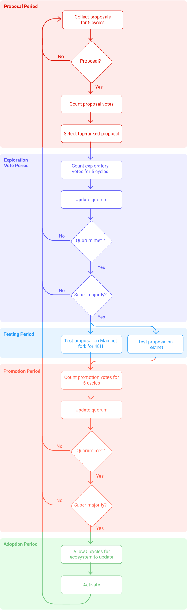

Tezos is a self-amending blockchain network that incorporates an on-chain mechanism for proposing, selecting, testing, and activating protocol upgrades *without hard forks* [[1]](/tezos-basics/governance-on-chain#references).

## What is self-amendment?
Tezos is a blockchain that can improve itself over time by using a formalized process to upgrade its protocol. In practice, it is similar to the structure of a corporation, where shareholders get to vote on the future direction.

Many other blockchains do not have this type of formal governance structure. Consequently, the direction of these projects is often decided by a small group and imposed on the whole ecosystem. If not, the process results in many _hard forks_ by participants that did not agree with the decisions. Thus, two or more chains can co-exist and split the community. Self-amendment aims to avoid this scenario, and Tezos *has had no hard fork so far*.


<small className="figure">FIGURE 1: Bitcoin hard-forks vs. Tezos hard-forks</small>

## Definitions of main concepts 

* **Baking**: The creation of new blocks on the Tezos blockchain by its validator nodes (aka _bakers_), who receive compensation for each block produced.

* **Endorsement**: Each baked block is validated by other bakers who have not baked the block. These are known as endorsers of the block, and they receive compensation for this.

* **Delegation**: All holders of the XTZ crypto-currency can delegate their baking and voting rights to a baker called a _delegate_, while still maintaining control of their funds.

* **Roll**: An amount of XTZ which is used as the unit of measure for baking and voting rights. Weight in the baking and voting process is indexed to an integral number of rolls. At present, one roll is equal to 8,000 XTZ.

* **Cycle**: The time required for 4,096 blocks' creation on Tezos (around 2 days, 20 hours, and 16 minutes (1 minute per block, if all bakers cooperate effectively)).

* **Proposal**: A request for addition, adjustment, or removal of a protocol's feature.

## How does it work?
Five (5) periods split the self-amendment process:

1. _Proposal Period_
2. _Exploration Vote Period_
3. _Testing Period_
4. _Promotion Vote Period_
5. _Adoption Period_

Each of these five periods lasts five baking cycles (i.e. 20,480 blocks or roughly 14 days), taking almost two months from the proposal to activation. The latest and current self-amendments are available at [tezosagora.org](https://www.tezosagora.org).

Should there be any failure in a given period, the whole process reverts back to the _Proposal Period_, effectively aborting and restarting the process.

## Super-majority, Voter Turnout and Quorum
The _Exploration Vote Period_ and _Promotion Vote Period_ work the same way. During a vote, each delegate has to use a single ballot: `Yea` (For), `Nay` (Against) or `Pass` (Neutral). A vote is successful if there is a _Super-majority_ and if the participation has reaches the current quorum [[2]](/tezos-basics/governance-on-chain#references).

### Super-majority
In Tezos, having the _Super-majority_ means that _Yea_ represents more than 80% of the total of _Yeas_ + _Nays_ votes. 

Example: With 90 votes = 75 _Yeas_ + 10 _Nays_ + 5 _Pass_, the total of _Yeas_ + _Nays_ is 85. 

The number of _Yeas_ required for the validation is 85 * 80% = 68 votes.

The number of _Yeas_ is then high enough to validate the vote (68 < 75 _Yeas_).

### Voter Turnout
_Voter Turnout_ represents the percentage of bakers that have voted compared to the total number of bakers with active rolls.

Example: With 90 votes = 75 _Yeas_ + 10 _Nays_ + 5 _Pass_ out of 100 active rolls, the _Voter Turnout_ is 90 / 100 = 90%. 

### Quorum
A _Quorum_ is the minimum number of voters required to deliberate. When the Tezos Mainnet was launched, the Quorum was set at 80% and updated at the end of each vote which was successfully approved, based on the _Voter Turnout_.

The _Carthage_ amendment introduced two major changes to the calculation of the _Quorum_:

* The calculation now takes into account the exponential moving average (EMA) of the _Voter Turnout_. At time _t_, the EMA is represented as `EMA(t)`.
  
* The Quorum is now bounded between 30% and 70%. The following formula is used to calculate the Quorum:

```
Quorum = 0.3 + EMA(t) * (0.7 - 0.3)
```

The following formula is then used to update the moving average for the next vote:

```
EMA(t+1)= 0.8 * EMA(t) + 0.2 * Voter Turnout
```

Note that delegates' votes are weighted proportionally to the number of rolls in their staking balance.

## Phase 1: Proposal period
The Tezos amendment process begins with the _Proposal Period_, during which delegates can submit proposals on-chain. The delegates submit the proposal by submitting the hash of the source code.

In each _Proposal Period_, delegates can submit up to 20 proposals. A proposal submission also counts as a vote, which is equivalent to the number of rolls in his staking balance when the period starts. Other delegates can then vote on the proposal up to 20 times during the _Proposal Period_. 

During this period a minimum of 5% of the bakers must vote for it to be validated to the next stage. 

At the end of the _Proposal Period_, the network counts proposal votes and the most-upvoted proposal proceeds to the Exploration Vote Period. If no proposal has been submitted, if there is a tie between proposals or if less than 5% have voted, a new _Proposal Period_ begins.

## Phase 2: Exploration vote period

In the _Exploration Vote Period_, delegates may vote for the top-ranked proposal from the previous _Proposal Period_. Delegates get to vote either _Yea_, _Nay_ or _Pass_ on a specific proposal. Voting rules are explained in the _Super-majority_ and _Quorum_ section. If the voting participation fails to achieve the _Quorum_ or the 80% _Super-Majority_, the amendment process restarts from the beginning of the _Proposal Period_.

## Phase 3: Testing period
If the proposal is approved in the _Exploration Vote Period_, the _Testing Period_ begins with a testnet fork that runs in parallel with the main network for 48 hours. These forks have access to the standard library but are sandboxed. 

The purpose of this fork is simply to verify that the migration from the old protocol to the new one work's correctly. This 48-hour parallel fork has been set conservatively to reduce the risk of the network perceiving the testnet-fork as the main chain. However, 48 hours of testing is too short to determine whether a proposal is a worthwhile and safe amendment, or not. To find any security vulnerabilities, a testnet matching the amendment proposal is likely to run off-chain during the remaining ~7.3 cycles of the _Testing Period_, allowing stakeholders to evaluate and discuss the amendment as they gain better knowledge of its properties.

## Phase 4: Promotion vote period
At the end of the _Testing Period_, the _Promotion Vote Period_ begins. In this period, the network decides whether to adopt the amendment based on off-chain discussions and its behaviour during the _Testing Period_. The voting rules are identical to the exploration voting period and are explained in the _Super-Majority_ and _Quorum_ section.

At the end of the _Promotion Vote Period_, the network counts the number of votes. If the participation rate reaches the minimum quorum and an 80% _Super-Majority_ of non-passing delegates vote _Yea_ then proceeds to the Adoption period. If not, the process reverts back to the _Proposal Period_. The minimum vote participation rate is set based on past participation rates.

In exchange for their work on the proposal, some delegates can put a symbolic self-reward into the protocol. If the protocol is accepted, they will receive the reward. 


## Phase 5: Adoption period

_Adoption period_ is designed to provide enough time to enable the ecosystem and dev tooling to be updated.

After this period the proposal is activated in the new mainnet.

As of (March 2021), 43 periods have passed. A total of 8 proposals have been made and 6 have been validated. 

This diagram sums up the self-amendment process :


<small className="figure">FIGURE 2: Self-amendment process</small>


## Voting examples

Let's illustrate this process:

### Example 1
Let us assume a total of 100 active rolls managed by bakers and a _Voter Turnout_ EMA of 75%, and then 90 votes (Yay, Nay and Pass) during the _Exploration Period_.

```
Yays : 75
Nays : 10
Pass : 5
```

In this case, we have:
```
Voter Turnout = (75 + 10 + 5) / 100 = 90%

Quorum = 0.3 + 75% * (0.7 - 0.3) = 60%
(Therefore 90% Voter Turnout > 60% Quorum, we can continue)

Positive Voter Turnout = 75 / ( 75 + 10 ) = 88%
```

As 88% _Positive Voter Turnout_ > 80% _Super-majority_, the amendement proposal can move to the next period.

PS: Let's not forget to update the EMA for the next proposal:

```
EMA(t+1) = 0.8 * 75% + 0.2 * 88% = 78%
(considering EMA(t) = 75%)
```

### Example 2
Let us assume a total of 100 active rolls managed by bakers and a _Voter Turnout_ EMA of 75%, and then 55 votes (Yay, Nay and Pass) during the _Exploration Period_.

```
Yays : 45
Nays : 10
Pass : 0
```

In this case, we have:
```
Voter Turnout = (45 + 10 + 0) / 100 = 55%

Quorum = 0.3 + 75% * (0.7 - 0.3) = 60%
(Therefore 55% Voter Turnout < 60% Quorum, proposal rejected)

Positive Voter Turnout = 45 / ( 45 + 10 ) = 81%
```

Although the 81% _Positive Voter Turnout_ > 80% _Super-majority_, the amendement proposal is rejected as the Quorum has not been reached. We must therefore go back to the initial proposals stage.

PS: Let's not forget to update the EMA for the next proposal :

```
EMA(t+1) = 0.8 * 75% + 0.2 * 55% = 71%
(considering EMA(t) = 75%)
```

## Operations
### Proposal
A proposal operation can only be submitted during a _Proposal Period_.
```
Proposals : {
  source: Signature.Public_key_hash.t ;
  period: Voting_period_repr.t ;
  proposals: Protocol_hash.t list ; 
}
```
`source` is the delegate's public key hash

`period` is the unique identifier of each voting period

`proposals` is a non-empty list of maximum 20 protocol hashes.

This operation [[3]](/tezos-basics/governance-on-chain#references) can be submitted more than once but only if the cumulative number of active proposals is less than 20. Each time a delegate duplicates a proposal, a vote is counted with the 20 vote maximum applying.

### Ballot
A ballot operation can only be submitted during the _Promotion Vote Period_ or the _Exploration Vote Period_, and only once per period.
```
Ballot : {
  source: Signature.Public_key_hash.t ;
  period: Voting_period_repr.t ;
  proposal: Protocol_hash.t ;
  ballot: Vote_repr.ballot ; 
}
```
`source` is the delegate's public key hash

`period` is the unique identifier of each voting period

`proposal` is the selected protocol hash.

`ballot` is one of the possible ballot response: `Yea`, `Nay` or `Pass`


## Send a proposal
To send a proposal or a ballot, please refer to [CLI chapter](/tezos-basics/introduction_to_cli_and_rpc)

## Learn more
To learn more about the amendement process on Tezos, please refer to the [official documentation](https://gitlab.com/tezos-paris-hub/tezos-on-chain-governance/-/blob/master/Documentations/Amendements_Tezos_en.pdf).

## References
[1] https://medium.com/tezos/amending-tezos-b77949d97e1e

[2] https://tezos.gitlab.io/007/voting.html#super-majority-and-quorum

[3] https://tezos.gitlab.io/007/voting.html#operations

[4] https://www.tezosagora.org

[5] https://www.tezosagora.org/learn

[6] https://blog.octo.com/tezos-une-blockchain-auto-evolutive-partie-1-3/

[7] https://gitlab.com/tezos-paris-hub/tezos-on-chain-governance/-/blob/master/Documentations/Amendements_Tezos_en.pdf