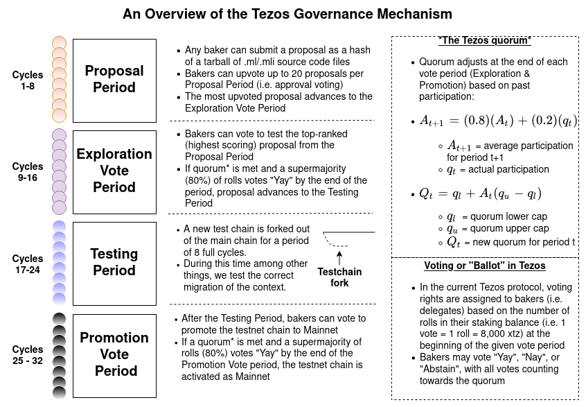
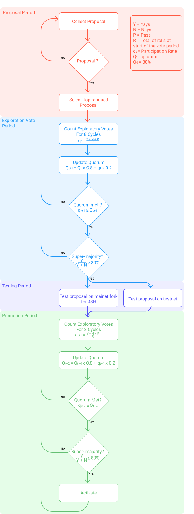

## What is self amendment?
Tezos is a self-amending blockchain network which incorporates an on-chain mechanism for proposing, selecting, testing, and activating protocol upgrades without having to hard fork.

In simple terms, this means that Tezos is a blockchain that can improve itself over time by having a formalized process for protocol upgrades. In practice, this is similar to the structure of a corporation, where shareholders get to vote on the future direction of the company.

Many other blockchains do not have this type of formal governance structure. Consequently, the direction of these projects are often decided by a small group of developers or by a foundation, which may or may not represent all stakeholders fairly.

## How does it work?
The self amendment process is split into 4 periods: the Proposal Period, the Exploration Vote Period, the Testing Period and the Promotion Vote Period. Each of these four periods lasts eight baking cycles (i.e. 32,768 blocks or roughly 22 days and 18 hours), comprising almost exactly three months from proposal to activation. Please refer to this link for the information about the current and last self amendment process: https://www.tezosagora.org

Should there be any failure to proceed for a period, the whole process reverts to the Proposal Period, effectively restarting the whole process.


<small className="figure">FIGURE 1: Updated for 2020: Diagram updated for post-Babylon (Credit to Pietro Abate for the update)</small>

## Super-majority and Quorum
Exploration Vote Period and Promotion Vote Period work the same way. During a vote a delegate can use a single ballot: `Yea`, `Nay` or `Pass`. A vote is successful if it has the super-majority and if the participation reaches the current quorum [1](https://opentezos.com/tezos-basics/governance_on-chain#Reference).

In Tezos, having the Super-majority means that `Yea` represents more than 80% of the total of `Yeas`+`Nays` votes. 

E.g. With 90 votes = 75Yeas + 10 Nays + 5 Pass, the total of `Yeas`+`Nays` is 85. 

The number of Yea required for the validation is 85 * 80% = 68 votes.

The number of Yea is high enough to validate the vote ( 68 < 75 Yeas ).

A quorum is the minimum number of voters required to deliberate. At the Tezos Mainnet launch, the defined quorum was 80%. The participation is the ratio of all received votes, including Pass votes. The quorum evolves over time with the following coefficients:
```
new quorum = old Quorum * 8/10 + current participation * 2/10
```
E.g new Quorum = 80% * 80% +  90% * 20% = 82%, With old Quorum = 80%  and current participation ratio = 90%.

Delegates’ votes are weighted proportionally to the number of rolls in their staking balance.

##Phase 1: Proposal period
The Tezos amendment process begins with the Proposal Period, during which delegates can submit proposals on-chain. The delegate submits the proposal by submitting the hash of the source code.

In each Proposal Period, delegates can submit up to 20 proposals. A proposal submission also counts as a vote, which is equivalent to the number of rolls in his staking balance when the period starts. Other delegates can then vote on the proposal up to 20 times during the Proposal Period. 

During this period a minimum of 5% of the bakers must vote for it to be validated. 

At the end of the Proposal Period, the network counts proposal votes and the most-upvoted proposal proceeds to the Exploration Vote Period. If no proposal has been submitted, if there is a tie between proposals or if less than 5% have voted, a new Proposal Period begins.

## Phase 2: Exploration vote period

In the Exploration Vote Period, delegates may vote for the top-ranked proposal from the previous Proposal Period. Delegates get to vote either "Yea", "Nay", or "Pass" on a specific proposal. Voting rules are explained in the Super-majority and Quorum section. If the voting participation fails to achieve the Quorum or the 80% supermajority, the amendment process restarts from the beginning of the Proposal Period

## Phase 3: Testing period
If the proposal is approved in the Exploration Vote Period, the Testing Period begins with a testnet fork that runs in parallel of the main network for 48 hours. These forks have access to the standard library, but are sandboxed. 

The purpose of this fork is simply to verify that the migration from the old protocol to the new one works correctly. This 48 hour constant has been set conservatively in order to reduce the network risk to perceive the testnet fork as the main chain. However, 48 hours of testing is too short to determine whether a proposal would be a worthwhile and safe amendment or not. To find any security vulnerabilities, a testnet matching the amendment proposal is likely to run off-chain during the remaining ~7.3 cycles of the Testing Period, allowing stakeholders to evaluate and discuss the amendment as they gain better knowledge of its properties.

## Phase 4: Promotion vote period
At the end of the Testing Period, the Promotion Vote Period begins. In this period, the network decides whether to adopt the amendment based on off-chain discussions and its behavior during the Testing Period or not. The voting rules are identical to the exploration voting period and are explained in the Super Majority and Quorum section.

At the end of the Promotion Vote Period, the network counts the number of votes. If the participation rate reaches the minimum quorum and an 80% supermajority of non-Passing delegates votes “Yea,” then the proposal is activated as the new mainnet. Otherwise, the process once more reverts back to the Proposal Period. The minimum vote participation rate is set based on past participation rates.

In return for their work on the proposal, some delegates put a symbolic self reward in the protocol. If the protocol is accepted, they will take it back. 

At the writing moment of this chapter, 42 periods have elapsed. A total of 6 proposals have been made and 5 have been validated. 

This Uml diagram resume the Self Amendment process :


<small className="figure">FIGURE 2: Self amendment process</small>

## Operations
### Proposal
A proposal operation can only be submitted during a proposal period.
```
Proposals : {
  source: Signature.Public_key_hash.t ;
  period: Voting_period_repr.t ;
  proposals: Protocol_hash.t list ; 
}
```
`source` is the delegate’s public key hash

`period` is the unique identifier of each voting period

`proposals` is a non-empty list of maximum 20 protocol hashes.

The operation [2](https://opentezos.com/tezos-basics/governance_on-chain#Reference) can be submitted more than once but only as long as the cumulative length of the proposals lists is less than 20. Duplicate proposals from the same delegate are counted for the maximum number of proposals for that delegate. However, duplicates from the same delegate are not tallied at the end of the proposal period.

### Ballot
A ballot operation can only be submitted during the Promotion Vote Period or the Exploration Vote Period, and only once per period.
```
Ballot : {
  source: Signature.Public_key_hash.t ;
  period: Voting_period_repr.t ;
  proposal: Protocol_hash.t ;
  ballot: Vote_repr.ballot ; 
}
```
`source` is the delegate’s public key hash

`period` is the unique identifier of each voting period

`proposal` is the selected protocol hash.

`ballot` is one of the possible ballot response: `Yea`, `Nay` or `Pass`

To know how to send a proposal or a ballot,please refer to CLI chapter 

## Reference
[1] https://tezos.gitlab.io/007/voting.html#super-majority-and-quorum
[2] https://tezos.gitlab.io/007/voting.html#operations

Sources: 
https://medium.com/tezos/amending-tezos-b77949d97e1e
https://www.tezosagora.org
https://www.tezosagora.org/learn
https://blog.octo.com/tezos-une-blockchain-auto-evolutive-partie-1-3/
