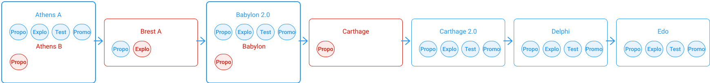

As presented in the [Governance on-chain chapter](/tezos-basics/governance-on-chain), the Tezos blockchain is constantly evolving through new amendments. In this chapter, we will go over a history of past proposals both approved and refused, and look at why.

<small className="figure">FIGURE 1: History of Tezos amendments</small>

## [Athens](https://www.tezosagora.org/proposal/1) (Pt24m4xiP)
`Athens` was the first proposed protocol-amendment for Tezos. Two proposals - [Athens A](https://www.tezosagora.org/proposal/1) and [Athens B](https://forum.tezosagora.org/t/athens-b-psd1ynubh/33) were proposed by [Nomadic Labs](https://blog.nomadic-labs.com/athens-our-proposals-for-the-first-voted-amendment.html) in February 2019.

Of the two proposals, _Athens A_ sought to increase the gas limit and reduce the roll size required for baking from 10,000 tez to 8,000 tez. _Athens B_ just sought to increase the gas limit. Athens A was voted with _Super-majority_ and was autonomously [activated](https://twitter.com/TezosAgoraBot/status/1133901612790034432?s=20) into the protocol in May 2019.

For a full list of changes, be sure to read the corresponding blog [post](https://blog.nomadic-labs.com/athens-proposals-injected.html) from Nomadic Labs and [reflections](https://medium.com/tqtezos/reflecting-on-athens-the-first-self-amendment-of-tezos-4791ab3b1de1) by Jacob Arluck. 

## [Brest A](https://www.tezosagora.org/proposal/3) (PtdRxBHv)

`Brest A` was the first amendment proposed to be rejected during the _Exploration Period_. It was proposed in June 2019 and received only 0.35% of the votes during the _Proposal Period_. But as it had no competition, it was promoted. The amendment was then rejected in the _Exploration Period_ with only 0.26% of the votes in favour. The 80% _Super-majority_ was not reached and neither was the minimum _Quorum_ to validate the vote.

This proposal would have allowed to fix a security breach linked to issues pertaining to the rehashing push during the _Athens_ protocol change. Moreover, it would have facilitated amendment-invoice tracking. But the invoice for this proposal, 8,000 tez, was much higher than the usual cost.

## [Babylon](https://www.tezosagora.org/proposal/5) (PsBABY5nk)

The `Babylon` proposal was composed of two proposals made in July/August 2019. [Babylon](https://www.tezosagora.org/proposal/4) and [Babylon 2](https://www.tezosagora.org/proposal/5) built by Nomadic Labs, Cryptium Labs (Metastate), and Marigold made after receiving feedback on the _Babylon_ proposal, the teams proposed a new tweaked version in the same proposal period: _Babylon 2_.

Notable changes included a new variant of the consensus algorithm (`Emmy+`), in addition to new Michelson features to aid smart contract developers, an account rehaul that enabled clearer distinction between _tz_ and _kt_ accounts, as well as refinements to the quorum formula and the addition of a 5% proposed quorum threshold.

Babylon was autonomously [activated](https://twitter.com/adrian_brink/status/1185137422432161792?s=20) into the protocol in October 2019.

For a full list of changes be sure to read the corresponding blog posts from [Nomadic Labs](https://blog.nomadic-labs.com/babylon-proposal-injected.html, and [Cryptium Labs](https://medium.com/metastatedev/on-babylon2-0-1-58058d9d2106) (Metastate). 

## [Carthage](https://www.tezosagora.org/proposal/6) (PtCarthav)

Was the first implementation of a proposal to be rejected during the _Proposal Period_ in november 2019. As since the _Babylon_ change, it now took a minimum of 5% to move to the _Exploration Period_ and _Carthage_ obtained 3.5% of the votes.

The purpose of this proposal was to increase the gas limit per block and per operation by 30% to improve the accuracy of the existing formula used for calculating baking, endorsing rewards and fix various small issues.

## [Carthage 2.0](https://www.tezosagora.org/proposal/7) (PtCarthav)
Carthage 2.0 was then proposed and it was overwhelmingly accepted in December 2019 due partly to contributions by Nomadic Labs and Cryptium Labs (Metastate).

Notable changes included increasing the gas limit per block and per operation by 30%, improving the accuracy of the formula used to calculate baking and endorsing rewards, as well as several minor improvements to Michelson. The main difference with _Carthage 1_ was its new, more secure formula to calculate rewards.

Carthage 2 was autonomously [activated](https://twitter.com/tezos/status/1235590757416751105?s=20) onto the protocol in March 2020.

For a full list of changes be sure to read the corresponding [changelog](https://tezos.gitlab.io/protocols/006_carthage.html#changelog) and blog posts from [Nomadic Labs](https://blog.nomadic-labs.com/carthage-changelog-and-testnet.html) and [Cryptium Labs](https://medium.com/metastatedev/updating-the-potential-carthage-proposal-and-resetting-the-carthagenet-test-network-f413a792571f) (Metastate). 

## [Delphi](https://www.tezosagora.org/proposal/8) (PsDELPH1K)
The Delphi proposal was a contribution from Nomadic Labs, Metastate, and Gabriel Alfour, adopted in September 2020.

Notable changes included improving the performance of the Michelson interpreter, improving gas costs by adjusting the gas model, reducing storage costs by 4x, and various other small fixes.

Delphi was autonomously [activated](https://twitter.com/tezos/status/1326877616322859009?s=20) into the protocol in November 2020.

For a full list of changes be sure to read the corresponding [changelog](https://blog.nomadic-labs.com/delphi-changelog.html#007-delphi-changelog) and blog post from [Nomadic Labs](https://blog.nomadic-labs.com/delphi-official-release.html).

## [Edo](https://www.tezosagora.org/proposal/9) (PtEdoTezd)
The `Edo` proposal was in turn adopted in November 2020 with contributions by Nomadic Labs, Metastate, and Gabriel Alfour.

Edo added two major features to Tezos smart contracts:

* Sapling and BLS12-381 to enable privacy-preserving smart contracts

* Tickets for native on-chain permissions and asset issuance.

Among other features, Edo also updates the Tezos amendment process by lowering period length to 5 cycles and by adding a 5th Adoption Period. A full changelog is available [here](https://tezos.gitlab.io/protocols/008_edo.html).

## [Florence](https://www.tezosagora.org/proposal/11) (PsFLorena)
The `Florence` proposal was a joint effort from Nomadic Labs, Marigold, DaiLambda, and Tarides.

Florence's notable bug fixes and improvements are:

* Increasing maximum operation size

* Improved gas consumption for the execution of more complex smart contracts

* Changing inter-contract calls to a depth-first ordering, as opposed to breadth-first

* The elimination of the test chain activation
  
Baking Accounts were also included in the feature set, however, ongoing testing uncovered some important and previously undocumented breaking changes in the Baking Account proposal. Postponing Baking Accounts until a thorough audit of functionality is complete, or an alternative implementation is produced. The version of Florence without Baking Accounts having been considered a safer choice.

## References 

[1] https://wiki.tezosagora.org/learn/governance/past-tezos-amendments
