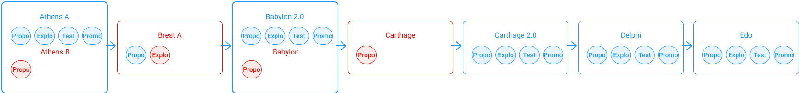

<small className="figure">FIGURE 1: History of Tezos amendements</small>

## [Athens](https://www.tezosagora.org/proposal/1) (Pt24m4xiP)
Athens was the first proposed protocol amendment for Tezos. Two proposals - “[Athens A](https://www.tezosagora.org/proposal/1)” and “[Athens B](https://forum.tezosagora.org/t/athens-b-psd1ynubh/33)” were injected by the development team, [Nomadic Labs](https://blog.nomadic-labs.com/athens-our-proposals-for-the-first-voted-amendment.html) in February 2019.

Of the two proposals, Athens A sought to increase the gas limit and reduce the roll size required to bake from 10,000 tez to 8,000 tez. Athens B sought to just increase the gas limit. Athens A was autonomously [activated](https://twitter.com/TezosAgoraBot/status/1133901612790034432?s=20) onto the protocol in May 2019.

For a full list of changes, be sure to read the corresponding blog [post](https://blog.nomadic-labs.com/athens-proposals-injected.html) from Nomadic Labs and [reflection](https://medium.com/tqtezos/reflecting-on-athens-the-first-self-amendment-of-tezos-4791ab3b1de1) by Jacob Arluck. 

## [Brest A](https://www.tezosagora.org/proposal/3) (PtdRxBHv)

Brest A was the first proposed amendment to be rejected during the exploration period. It was proposed in June 2019 and received only 0.35% of the votes during the proposal period. As it did not have any competition, it was promoted. The amendment was rejected during the exploration period with only 0.26% of the votes in favour. The 80% supermajority was not reached and neither was the minimum quorum to validate the vote.

This proposal would have allowed to fix a security breach linked to issues pertaining to the rehashing push during the Athens protocol change. Moreover, it allows to make the amendment invoice tracking easier. The invoice for this proposal was 8000 tez. This is a much higher invoice than the usual one.

## [Babylon](https://www.tezosagora.org/proposal/5) (PsBABY5nk)

The Babylon proposal is composed of two proposals made in july/August 2019. [Babylon 1](https://www.tezosagora.org/proposal/4) and [Babylon 2](https://www.tezosagora.org/proposal/5) are contributions made by development teams: Nomadic Labs, Cryptium Labs (Metastate), and Marigold. After receiving the feedback on the Babylon 1 proposal the teams proposed a new tweaked version in the same proposal period: Babylon 2.

Notable changes included a new consensus algorithm variant (Emmy+), in addition to new Michelson features to aid smart contract developers, an account rehaul that enabled clearer
distinction between tz and kt accounts, as well as refinements to the quorum formula and addition of a 5% proposed quorum threshold.

Babylon was autonomously [activated](https://twitter.com/adrian_brink/status/1185137422432161792?s=20) onto the protocol in October 2019.

For a full list of changes be sure to read the corresponding blog posts from [Nomadic Labs](https://blog.nomadic-labs.com/babylon-proposal-injected.html, and [Cryptium Labs](https://medium.com/metastatedev/on-babylon2-0-1-58058d9d2106) (Metastate). 

## [Carthage](https://www.tezosagora.org/proposal/6) (PtCarthav)

The first implementation of the proposal was rejected during the proposal period in november 2019. Since the Babylon change, it takes a minimum of 5% to move to the exploration period and Carthage obtains 3.5%.

The purpose of this proposal was to increase the gas limit per block and per operation by 30% in order to improve the accuracy of the formula used for calculating baking and endorsing rewards and fix various small issues.

## [Carthage 2.0](https://www.tezosagora.org/proposal/7) (PtCarthav)
The Carthage 2.0 is the second proposal and it was injected in December 2019 with contributions by development teams Nomadic Labs and Cryptium Labs (Metastate).

Notable changes included increasing the gas limit per block and per operation by 30%, improving the accuracy of the formula used to calculate baking and endorsing rewards, as well as several minor improvements to Michelson. The main difference with carthage 1 is its new, more secure formula to calculate rewards.

Carthage was autonomously [activated](https://twitter.com/tezos/status/1235590757416751105?s=20) onto the protocol in March 2020.

For a full list of changes be sure to read the corresponding [changelog](https://tezos.gitlab.io/protocols/006_carthage.html#changelog) and blog posts from [Nomadic Labs](https://blog.nomadic-labs.com/carthage-changelog-and-testnet.html) and [Cryptium Labs](https://medium.com/metastatedev/updating-the-potential-carthage-proposal-and-resetting-the-carthagenet-test-network-f413a792571f) (Metastate). 

## [Delphi](https://www.tezosagora.org/proposal/8) (PsDELPH1K)
The Delphi proposal was injected in September 2020 with contributions by development teams Nomadic Labs, Metastate, and Gabriel Alfour.

Notable changes included improving the performance of the Michelson interpreter, improving gas costs by adjusting the gas model, reducing storage costs by 4x, and various other small fixes.

Delphi was autonomously [activated](https://twitter.com/tezos/status/1326877616322859009?s=20) onto the protocol in November 2020.

For a full list of changes be sure to read the corresponding [changelog](https://blog.nomadic-labs.com/delphi-changelog.html#007-delphi-changelog) and blog post from [Nomadic Labs](https://blog.nomadic-labs.com/delphi-official-release.html).

## [Edo](https://www.tezosagora.org/proposal/9) (PtEdoTezd)
The Edo proposal was injected in November 2020 with contributions by Nomadic Labs, Metastate, and Gabriel Alfour.

Edo adds two major features for Tezos smart contracts

* Sapling and BLS12-381 to enable privacy-preserving smart contracts

* Tickets for native on-chain permissions and asset issurance

Among other features, Edo also updates the Tezos amendment process by lowering period length to 5 cycles and by adding a 5th Adoption Period. A full changelog is available [here](https://tezos.gitlab.io/protocols/008_edo.html).

