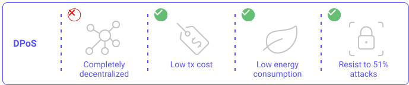

## Intro
A blockchain network is composed of millions of users. In order to maintain network availability and prevent Sybil attacks [[1]](/tezos-basics/liquid-proof-of-stake#reference) (attacks with the creation of multiple fake accounts in a network), a blockchain needs a consensus mechanism. A consensus mechanism allows the network to agree on the validity of a transaction, the creation of a new block, a protocol update, etc. The main objective of a consensus mechanism is to maintain the same version of the history of the chain throughout the whole network.

Since the creation of Bitcoin, many kinds of consensus have appeared. To understand the Tezos consensus, this chapter will first focus on the classical Proof-of-work (e.g. Bitcoin, Ethereum 1.0), then the delegated-proof-of-stake (e.g EOS, Lisk, Tron, Bitshare) and finally the liquid Proof-of-stake from Tezos [[2]](/tezos-basics/liquid-proof-of-stake#reference).

In a word, Proof-of-work is based on computation power and Proof-of-stake is based on token capitalisation.

All these consensus have the same goal: select a user who will be responsible for creating a new block, by selecting, verifying and inserting transactions into a potential new block. This user will then receive a reward if his block is validated. This reward is usually a fixed amount of coins created by the blockchain protocol or collected from transactions’ cost.

## Proof-of-Work (PoW)
The Proof-of-work is the first blockchain consensus ever created [[3]](/tezos-basics/liquid-proof-of-stake#reference). It relies solely on its users, or miners. A miner uses his computation power to solve an arbitrary mathematical problem. The difficulty of this mathematical problem is adapted according to the resolution time of the previous blocks. The difficulty increases if the resolution time decreases. The first miner who solves this problem earns the right to write a transaction into a new block. If several branches are available, he must choose the right one, otherwise he will lose his reward. This way of building the blockchain ensures the network security.
For more information about _PoW_, please refer to the [consensus chapter](/blockchain-basics/consensus). 

This consensus has two major defaults. The first is its energy consumption due to the power required to solve the mathematical problem and the competition between miners (all miners compete for the next block). Consequently, the transaction costs are very high because the network needs to reward the miner for his job (and electricity bill).

The second default is the lack of security in small networks. In a blockchain such as Bitcoin or Ethereum that has a lot of miners, the problem is less important because the strength of _PoW_ is based on the number of miners. However, in small networks, the number of miners might not be high enough to prevent a 51% attack [[4]](/tezos-basics/liquid-proof-of-stake#reference) (when a user can get more than half of the mining power on a blockchain ). With the current simplicity of buying short-term computation power [[5]](/tezos-basics/liquid-proof-of-stake#reference), it is really easy to achieve this kind of attack on a small network.


<small className="figure">FIGURE 1: PoW</small>

## Proof-of-Stake (PoS)
In _Proof-of-Stake_, the miner is replaced by a validator. A validator gathers transactions and creates blocks. Several methods exist to select a validator, which will be reviewed in the next chapter (i.e. Delegated-proof-of-stake, Liquid-proof-of-stake). In this consensus, they must invest their own funds to have a chance to be selected as a validator, which makes it Sybil resilient. This mechanism represents a very low energy cost compared to _PoW_. Moreover, a 51% attack would not be profitable for a hacker, as validators bet their own money [[6]](/tezos-basics/liquid-proof-of-stake#reference) and risk losing it if detected. Validators will not find any benefit in taking a decision against the general opinion of the network . In addition, holding 51% of the token would demand enormous amounts of liquidity. Thus, this scenario is unlikely.

## Delegated Proof-of-Stake (DPoS)
In the Delegated-proof-of-stake, the users of this consensus delegate their votes to a validator. These voters are called delegates. The number of eligible validators is fixed, usually between 20 and 100. If a validator is selected to forge a block, he receives a reward which is then shared with all his delegates [[7]](/tezos-basics/liquid-proof-of-stake#reference).

To be selected, validators must be elected by the network. They are chosen according to their long-term reputation and efficiency. A new user is therefore unlikely to become a validator and cannot participate in the life of the network. Consequently, these validators are often the same ones. This creates a barrier to entry to new users to take part in the consensus mechanism.


<small className="figure">FIGURE 1: DPoS</small>

## Liquid Proof-of-Stake (LPoS)
### An evolution from _DPoS_
Tezos has developed _Liquid Proof-of-Stake_ which is an evolution from the _Delegated Proof-of-Stake_. The current version of the Tezos consensus is called Emmy+ [[8]](/tezos-basics/liquid-proof-of-stake#reference).

In _Liquid Proof-of-Stake_, a miner or validator is called a _baker_. As opposed to _DPoS_, any user can become a baker if he has enough tokens or delegate his token if he doesn't have enough.

A baker only needs to have 8,000ꜩ (Tezos tokens) to take part in the consensus (soon to be lowered to 2,000ꜩ [[9]](/tezos-basics/liquid-proof-of-stake#reference)). As in _Delegated Proof-of-Stake_, the probability to win the bake is proportional to the invested amount, but any user owning 8,000ꜩ has the opportunity to bake alone. The baking time is organized in cycles and the tokens are frozen during this process.

### Consensus mechanism
#### Roll
A roll represents 8,000ꜩ delegated to a given key. The more rolls someone has, the higher his chance of being given the rights to bake the next block. If there are 10 rolls activated at some point in time, and a baker owns 2/10 of these rolls, the baker has a 20% chance of being selected and to create the next block. This means that whether the baker has 8,000 ꜩ or 15,999 ꜩ, he has the same chances.

Baking rights are set in terms of priorities. For example, if there are 10 rolls activated, the protocol could randomly select a priority list as follows:

```
 Priority1 = Roll 6
 Priority2 = Roll 9
 Priority3 = Roll 4
 Priority4 = Roll 3
 .
 .
 .
 Priority10 = Roll 7
```

Consequently the person who owns the roll 6 will have priority to propose the new block. If he does not create and broadcast a block within a certain period, the baker who owns the roll number 9 may take over. Note that a baker may have several rolls selected and therefor receive several priorities.

#### Cycle
The Tezos consensus is organized in cycles. One cycle corresponds to 4096 blocks (≈ 2.8 days). It takes 7 cycles to accumulate rewards. It then takes another 5 cycles before the delegation service receives them and can transfer those rewards. Finally, the tokens are frozen during several weeks.

#### Rolls selection
At each cycle _n_, a random seed is created. This seed is used to randomly select a roll snapshot from cycle _n-2_ and to randomly select rolls in the selected snapshot. The selected rolls determine the baking and endorsing rights in the next cycles.

### Security
The forgery of a block (e.g. transaction fraud) is avoided by preventing a baker from proceeding to the next cycle while his roll is being verified.

The security of Tezos is also insured by endorsers: they control the baker's transaction during the baking process. If endorsers find a security breach, they will cancel the baking and the baker will lose his tokens. Endorsers are rewarded for each verification with some ꜩ (more detail in the [Economics and reward chapter](/tezos-basics/economics-and-reward)).

The "liquid" implementation allows greater decentralization and this process is more censorship-resistant than _DPoS_. Contrary to the DPoS, all the stakeholders can participate actively in the making of the block without depending on a small group of selected validators.


<small className="figure">FIGURE 1: LPoS</small>

This table highlights the differences between the liquid-proof-of-stake and the delegated-proof-of-stake [[7]](/tezos-basics/liquid-proof-of-stake#reference)):

|                          | Liquid-proof-of-stake                                                | Delegated-proof-of-stake                                                                                 |
| ------------------------ | -------------------------------------------------------------------- | -------------------------------------------------------------------------------------------------------- |
| **Delegation (Purpose)** | Optional (minimizes dilution of small token holders).                | Requires to elect block producers (enables greater scalability.                                          |
| **Barrier to Entry**     | 8000ꜩ and modest computing power and reliable internet connection.   | Professionalized operations with significant computing infrastructure. Competition from other delegates. |
| **Validator Set**        | Dynamic (size not fixed). Up to 80,000 bakers (limited by roll size) | Fixed size. Between 21 (EOS) and 101 (Lisk).                                                             |
| **Design Priorities**    | Decentralization, accountable governance, and security               | Scalability and usable consumer applications                                                             |

To conclude, the Liquid Proof-of-stake consensus takes the best from _PoW_ and _DPoS_ with a fully decentralized consensus and low barrier on entry but without the high costs and high energy requirements.

## Reference

[1] https://en.wikipedia.org/wiki/Sybil_attack

[2] https://wiki.tezosagora.org/learn/proofofstake

[3] https://opentezos.com/blockchain-basics/consensus 

[4] https://www.crypto51.app

[5] https://en.bitcoinwiki.org/wiki/51%25_attack

[6] https://medium.com/@V.academy/can-pos-prevent-51-attack-2449d45039d2

[7] https://medium.com/tezos/liquid-proof-of-stake-aec2f7ef1da7

[8] https://blog.nomadic-labs.com/analysis-of-emmy.html

[9] https://tezos.gitlab.io/007/proof_of_stake.html