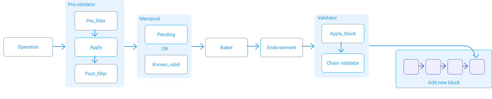

This chapter introduces the notion of _Operations_ on Tezos, more commonly known as _Transactions_ on other blockchains. 

## Implicit accounts and smart contracts
Let's start by talking about the two types of addresses in Tezos [[1]](/tezos-basics/intro_to_operation#referencess): 

* Implicit accounts are accounts that are linked to a public key. Their addresses start with _tz1_, _tz2_, and _tz3_ (depending on the chosen signature scheme) and the hash of the public key. They are created by a transfer operation to the account public key hash. Only implicit accounts can be registered as delegates and participate in baking.
  
* Smart contracts are also called `Originated accounts` and are created with an origination operation. Their addresses start with _KT1_. They don't have a corresponding secret key. They run their Michelson code each time they receive an operation.

## Tezos operations
An operation is a message sent from one address to another. The message is represented as:
```js
type operation = {
  amount: amount; (* amount being sent *)
  parameters: data list; (* parameters passed to the script *)
  (* counter (invoice id) to avoid repeat attacks *)
  counter: int;
  destination: contract hash;
}
```

Example of an entrypoint call:
```json
{
  "branch": "BMXRpSqjJ9HnEeaSXj3YzM9jqB4kqDZemtJBGGqn5Sa9MepV1k7",
  "contents": [
	{
  	"kind": "transaction",
  	"source": "tz1YWK1gDPQx9N1Jh4JnmVre7xN6xhGGM4uC",
  	"fee": "6678",
  	"counter": "942780",
  	"gas_limit": "63669",
  	"storage_limit": "75",
  	"amount": "0",
  	"destination": "KT1S5hgipNSTFehZo7v81gq6fcLChbRwptqy",
  	"parameters": {
    	"entrypoint": "sellLand",
    	"value": {
      	"prim": "Pair",
      	"args": [
        	{
          	"int": "100000000"
        	},
        	{
          	"int": "11"
        	}
      	]
    	}
  	}
	}
  ]
}
```
Example of a transaction between two implicit accounts:

```json
{
  "branch": "BKkwBsr6hfvj2MfaEydByALrASfCPzFBFSCs3iY7XaBLKRtwWj7",
  "contents": [
	{
  	"kind": "transaction",
  	"source": "tz1VAugX5LBcF4Anq1gEFr12LmsjqsCgsnPs",
  	"fee": "444",
  	"counter": "855452",
  	"gas_limit": "1527",
  	"storage_limit": "0",
  	"amount": "100000000",
  	"destination": "tz1YWK1gDPQx9N1Jh4JnmVre7xN6xhGGM4uC"
	}
  ]
}
```

Such an operation can be sent from an implicit account (if signed using the manager's key) or programmatically by contract code execution. When the operation is received, the amount received is added to the destination contract's balance and the destination contract's code is executed. This code can make use of the parameters passed on to it. It can read and write the contract's storage, change the signature key, and post operations to other contracts.

As the example shows, there is also a _counter_ field, whose purpose is to prevent replay attacks. An operation is only valid if the contract's _counter_ is equal to the operation's _counter_. Once an operation is applied, the _counter_ increases by one, preventing the operation from being reused.

The operation also includes the block hash of a recent block that the client considers valid. If an attacker ever succeeds in forcing a long reorganization with a fork, he will be unable to include this operation making the fork obviously fake. This last line of defense is named `TAPOS` which is a statistical detection of long term attacks based on the fraction of coins being moved. This kind of system prevents long reorganizations but are not efficient with short term double spending.

Currently the Tezos network can process 40 TPS (operations per second) and has an operation time of 30 minutes [[2]](/tezos-basics/intro_to_operation#referencess). This speed may vary with future protocols. Operation time is the time it takes for an operation to be considered secure. As a comparison, _Bitcoin_ can process 7 TPS and has an operation time of 60 minutes. 

Note that Tezos operations are limited to a maximum size of 512kB.

## Operation Flow 

The diagram below represents the life cycle of an operation.

<small className="figure">FIGURE 1: Life cycle of an operation</small>

Operations are received by nodes from a client via RPC or from a network peer (i.e. another node).

### Pre-validator
The *Pre-validator* [[3]](/tezos-basics/intro_to_operation#referencess) step runs the validation subsystem and is responsible for deciding which operations will be added to the mempool (memory pool). 

The *Pre_filter* step checks that enough gas for the execution has been passed and that the sender address has enough funds to pay.

The *Apply* step checks whether the operation is in adequacy with the current state of the Tezos chain.

The *Post_filter* decides to add the operation to the mempool. The result is broadcasted.

If an error is triggered in any of these steps, the operation is not added to the mempool and not broadcasted.

### Mempool
The node maintains a memory pool (aka mempool) to keep track of `not-invalid-for-sure` operations. The mempool keeps track of two different kinds of operations:

* `Known_valid`: A list of valid operations ready to be pulled in a block if requested by a baker.

* `Pending`: A bounded set of operations which are known, for certain, to not be invalid and are eligible to be broadcasted to peers. This set contains two sub-kinds of operations:

    * `branch_refused`: an operation which could be valid in a different branch.

    * `branch_delayed`: an operation which has come too soon (i.e. there's a gap in the account counter)

Operations in the mempool are broadcasted to peers whenever the mempool is updated. The _Peer Node_ fetches the operation from the remote peer, using the operation hash in the advertisement (this is another way for a new operation to enter in a node). All operations pass through the validation subsystem. When an operation is received by a peer, the peer node is notified of the validation result.

A valid operation lives in the mempool until it is added to a valid block of the chain, which the node considers to be canonical. If the operation is not added during its _time-to-live_ duration, the operation is removed from the mempool.

As long as a transaction is in the mempool, the sender address cannot issue another one. However, it is possible to send multiple transactions at the same time (in  batch). Notice that sending in batch is different than sending transactions one after the other.

### Baking and endorsement 
Bakers are free to select operations from the mempool, but they usually use a minimum fee filter. After a block creation, endorsers check its validity. At the end of the allotted time, the selected baker collects endorsers' opinions and adds them to the block then forges it.

### Validator
The selected baker sends the created block to a node. Once received, the node starts the block validation by calling the *Apply_block* function. This function validates the block header by using protocol parameters, and verifies all the operations.

The block validation checks for errors such as too many operations, oversized operations, incorrect protocol versions, unauthorized validation passes, invalid fitness, unavailable protocols, errors while applying the operation, and more [[4]](/tezos-basics/intro_to_operation#referencess).

Once a block is validated and is a candidate for the new head of the chain, it is passed to the chain validator, which checks if the fitness score [[5]](/tezos-basics/intro_to_operation#referencess) of the new head is higher than the fitness score of the current head. If it is not, the block is ignored. If it is, then this block replaces the current head. The chain validator then calls the pre-validator in order to flush the mempool. Finally, the new block head is advertised to the peers using the *distributed_db's Advertise module*. Of course, this block only becomes part of the canonical chain if future bakers decide to bake on top of it.

## References
[1] https://tezos.gitlab.io/introduction/howtouse.html#implicit-accounts-and-smart-contracts

[2] https://alephzero.org/blog/what-is-the-fastest-blockchain-and-why-analysis-of-43-blockchains/

[3] https://medium.com/tqtezos/lifecycle-of-an-operation-in-tezos-248c51038ec2

[4] https://gitlab.com/tezos/tezos/blob/mainnet/src/lib_shell_services/block_validator_errors.ml

[5] https://tezos.gitlab.io/alpha/glossary.html?highlight=fitness#tezos

