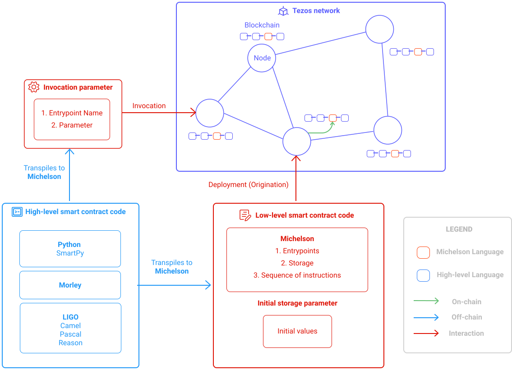
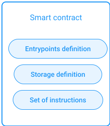

## General definition of a smart contract

A smart contract is a code stored in the blockchain which executes a set of pre-defined instructions. Once deployed it becomes `irrevocable`. The user can trigger the execution of the code but cannot modify it. 

Smart contracts can achieve different kind of operations with tokens/cryptocurrencies and other smart contracts. They can be compared to old signed paper contracts. Similarly they permit to secure an agreement between two or more parties thanks to the transparency and immutability of the blockchain. In this context, the concept of "code is law" from _Lawrence Lessig_ is very appropriate.

In many cases, smart contracts remove middle-men and drastically reduce intermediate costs compared to classic contracts.

Notice that a smart contract can only run on the Tezos network and send transactions to other accounts or to smart contracts but cannot interact with the internet. That's where decentralized applications (_Dapps_) come into play.

To deploy your own Dapp, please refer to the [Dapp Module](/dapp).

## Lifecycle of a Tezos smart contract

A smart contract can only be deployed once but can be invoked many times.

<small className="figure">FIGURE 1: Deployment and invocation of smart contracts in Tezos.</small>

### Deployment of the smart contract

The Tezos network implements a transactional system (called _UTXO_). A smart contract is born from a transaction and describes how the smart contract behaves.

Transactions are then broadcasted over the Tezos network and validated by bakers. Once validated, transactions are executed and modifications are applied to the blockchain.

A transaction can contain transfers of a certain amount of XTZ to an account but can also can contain a set of pre-defined instructions (i.e. **smart contracts**) that will be stored in the blockchain. Once this transaction is executed, the smart contract is considered as deployed. An _address_ and a persistent memory space (called *storage*) are associated to this smart contract.

Once deployed the smart contract can be invoked by anyone via a transaction to the contract address. This triggers the execution of the set of pre-defined instructions.

The CLI command `tezos-client originate` is provided for deploying a contract. It expects the 3 mentioned information as argument and returns the address associated with the newly deployed contract. More detail in the [CLI chapter](/tezos-basics/introduction_to_cli_and_rpc).
// TODO : What 3 mentioned information ???

These pre-defined instructions are written in Michelson which is part of the protocol of the Tezos blockchain. More detail in [Michelson module](/michelson).

### Evolution of a deployed smart contract

Once deployed, the code of smart contract is not meant to be modified, only the storage of the smart contract can be.

However we can forecast some possible evolutions of a smart contract and thus implement it in a way that some features can be upgraded.

* For data model extension, the `map` data structures can be used.

* For changing the business logic of a smart contract, the "lambda" pattern can be used (i.e. the business logic of the smart contract can be coded in a lambda function inside the storage). This way the business logic can be upgraded with a regular invocation of the smart contract to modify the lambda function in storage (this invocation must obviously specify the new business logic).

## Technical definition of a Tezos smart contract

The implementation of a smart contract must specify its:
* possibles invocations (called **entrypoints**)
* storage data structure definition 
* sequence of Michelson instructions

<small className="figure">FIGURE 2: Content of a Tezos smart contract</small>

### Code of a smart contract

The code of a smart contract is a sequence of Michelson instructions which is executed when the smart contract is invoked. 
This sequence of instructions is defined at deployment phase (called **origination**) and cannot be changed afterwards. 

The execution of this sequence of instructions results in a modification of the storage state. The sequence of instructions defines how the storage is modified.

The full description of the language Michelson is detailed in the [Michelson module](/michelson).

// TODO : Add a diagram of a smart contract storage being modified by an operation.

### Storage of a smart contract

// TODO : Repetition avec le point precedent.

During the origination (deployment phase), a persistent memory space (called **storage**) is allocated to the smart contract. The initial state of the storage must be specified during the origination of the smart contract.

The storage can be changed by invoking the smart contract which will apply its sequence of instructions.

One can use the CLI provided by tezos to inspect the storage state of a smart contract. The only required parameter is the address of the smart contract.

The growth of the storage (i.e. memory allocation of extra space) is paid as fees when the smart contract is invoked.

For more details, checkout the [Fees and reward chapter](/tezos-basics/economics_and_reward).

### Invocation of a smart contract

A smart contract can be invoked by a person (implicit account) which address starts with _tz1_ or by a smart contract which address starts with a _KT1_.

The invocation of a smart contract is a transaction sent to the address of a smart contract. This transaction specifies which entrypoint is called and its related arguments. 

The invocation of an entrypoint triggers the execution of the sequence of Michelson instructions which results in modifying the storage and potentially generating other transactions.

One can use the CLI provided by Tezos to interact with a node. The client application `tezos-client` allows anyone to deploy and invoke smart contracts.

The Remote Procedure Call (RPC) also provides a way to send a request via HTTP to a Teozs node. 

More detail in the [RPC and CLI chapter](/tezos-basics/introduction_to_cli_and_rpc).

## High-level languages for Tezos smart contract implementation

Because Michelson is a low-level stack-based language, adoption to common developer is not easy. To solve this difficulty many Michelson transpilers have been developed. These high-level languages are close to the languages developers are more used to work with : [SmartPy](/smartpy) close to Python, [LIGO](/ligo) close to Camel and Pascal, and finally Morley.

