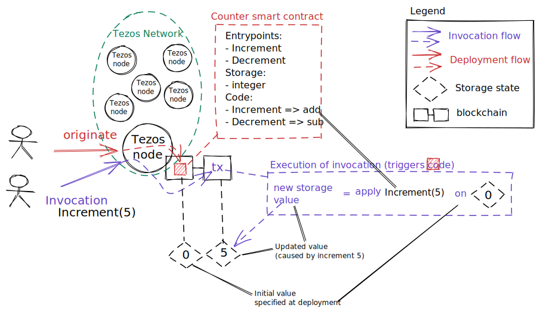
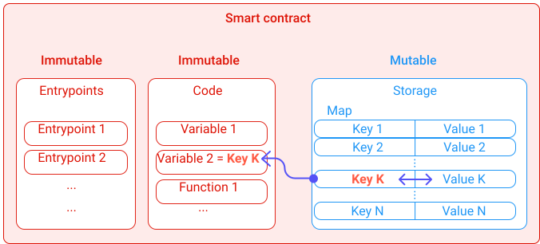
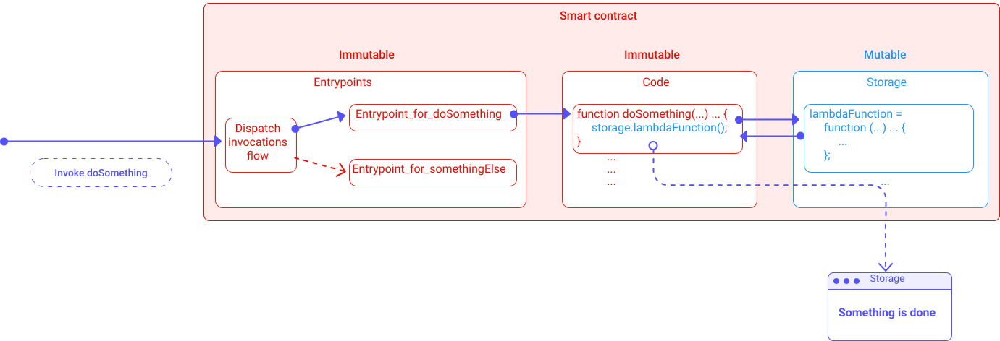
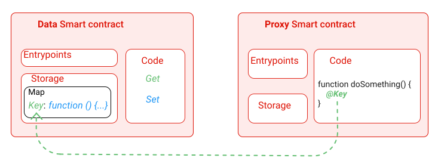

In this chapter, you will learn the Tezos smart contracts basics. Their components and the workflow to record and use them on the Tezos *blockchain*.

## General definition of a Tezos smart contract
A smart contract is a code stored inside the *blockchain* which executes a set of pre-defined instructions (promises). Once deployed (stored), it becomes **immutable**. A smart contract is deployed using a **transaction**, so we embed spending conditions inside it, which are **immutable**. Though for smart contracts, the key difference is a user *can trigger the execution of the code without modifying it, and without moving it to another transaction or block*. It stays where it has been stored **forever**. Tezos doesn't use an [UTXO model](https://en.wikipedia.org/wiki/Unspent_transaction_output) (no "*vaults*", see *Blockchain Basics*) but a **stateful accounts** one.

Like in Ethereum, Tezos uses 2 types of accounts:
1. Classic accounts with a primary address, simply storing tez (ꜩ) coins
2. Smart contract accounts with an address, storing code and  tez (ꜩ) coins

In Tezos vocabulary though, "*contracts*" refers to both types in general. So, actually, each *contract* has a "**_manager_**". Precisely, a classic account has an "**_owner_**". If a contract is flagged as "*spendable*", the manager is the entity allowed to spend funds from it.

Smart contracts can achieve different kinds of operations with coins and *other smart contracts*. They're comparable to *automatic* **sealed** food and drink dispensers from the same company:  
Each machine has a contract saying "*Give me cryptocurrency and I give you food or drink*". Each machine can have a different smart contract for different foods or drinks, and there could be another smart contract gathering the cryptocurrency total for the company. Each machine doesn't operate until enough currency is delivered (*Gas*). Note that the **quantities** of foods or drinks change while their **types** can't (ever).

Of course, smart contracts like the Tezos ones go beyond this metaphor. Thanks to *transparency* and *immutability*, they allow an **agreement** to be secured between two or more parties. In this context, the concept of "[Code is Law](https://en.wikipedia.org/wiki/Lawrence_Lessig#%22Code_is_law%22)" from [_Lawrence Lessig_](https://en.wikipedia.org/wiki/Lawrence_Lessig) is very appropriate.

For example, it is common to create financial instruments like various *tokens* (usually worth a fraction of the blockchain's *coin*) with different usability and characteristics inside a multiple smart contracts system. Other more or less complex projects can propose *lending*, *stablecoins*, or *crowdfundings*.

In most cases, smart contracts remove *intermediate* and drastically reduce costs compared to classic paper contracts and their validations.

Notice that like any other, a Tezos smart contract can only run on and interact with the blockchain it's stored in (Bitcoin's smart contracts are exceptions here). It can't interact with the outside world. That's where *decentralized applications* or "_Dapps_" come in, because they provide interfaces for the outside world.

To build your own Dapp, please refer to the [*Build a Dapp*](/dapp) module.

## Lifecycle of a Tezos smart contract
As we saw, a smart contract can only be deployed once but can be called many times. The Tezos smart contract lifecycle steps are basically two:

1. Deployment
2. Interactions through calls

### Deployment of a Tezos smart contract
The deployment of a Tezos smart contract is named "**origination**".

When a smart contract is deployed, an **address** and a corresponding *persistent space* called **storage** are allocated to this smart contract. The smart contract's address is like its *identity* and *where* it lives on the ledger, while its storage is its *usable space* inside itself. The smart contract is inside the blockchain. The storage is inside the smart contract.

A smart contract deployment also defines its *entrypoints*. These are special functions used to dispatch invocations of the smart contract. Each entrypoint is in charge of triggering an instruction (see below "*Call of a Tezos smart contract*").

Once deployed, the smart contract can be called by anyone or *anything* (e.g. other contracts) with a transaction sent to its address and entrypoints. This triggers the execution of the set of pre-defined instructions (promises).

The origination of a Tezos smart contract must define its:
* **Entrypoints** (functions where it receives calls)
* **Storage**
* **Set of instructions** in the low-level *Michelson* language


<small className="figure">FIGURE 1: Content of a Tezos smart contract</small>

### Code of a Tezos smart contract
The code of a smart contract is a sequence of Michelson instructions that are executed when the smart contract is called.

The execution of this sequence of instructions results in a modification of the *storage* content, or storage "**state**". The sequence defines how this state can be modified.

The full description of the Michelson language can be found in the [Michelson module](/michelson).

### Storage of a Tezos smart contract
During the origination, the **initial state** of the storage must be specified.
If needed for operations, the allocation of extra storage space is paid with calling transactions fees.

For more details, check out the ["*Fees and Rewards*"](/tezos-basics/economics_and_reward) chapter.

### Call of a Tezos smart contract
A smart contract can be called by a classic account whose address starts with "**tz1**", or by a smart contract's account whose address starts with "**KT1**". The transaction specifies *arguments* to use, and to which *entrypoint* they are sent.


<small className="figure">FIGURE 2: Call of a smart contract triggering its code and modifying its storage's state</small>

One can use the Command Line Interface (CLI) provided by Tezos to interact with a node and make calls. The "`tezos-client`" application allows anyone to deploy and call Tezos smart contracts.

The Remote Procedure Call (RPC) also provides ways to send requests to a Tezos node via HTTP (more details in ["*RPC and CLI*"](/tezos-basics/introduction_to_cli_and_rpc) chapter).

The CLI command "`tezos-client originate`" is used to deploy a Tezos smart contract. Arguments are the following:
- Name of the smart contract
- Michelson script containing: 
    - Entrypoints
    - Storage type
    - Set of instructions
- Initial storage value
- Amount of tez sent to the smart contract
- (optional) Address of a delegate

The command returns the newly deployed contract's address (more detail in the ["*RPC and CLI*"](/tezos-basics/introduction_to_cli_and_rpc) chapter).

## High-level languages for Tezos smart contracts implementations
Michelson is a low-level stack-based language. Therefore its adoption is quite limited because most developers won't take time to learn it. To avoid this friction, many Michelson *compilers* have been developed and led to many high-level languages closer to developers habits: [*SmartPy*](/smartpy) (inspired by *Python*); [*LIGO*](/ligo) (inspired by *Camel* and *Pascal*); or [*Morley*](https://serokell.io/project-morley) (framework).


<small className="figure">FIGURE 3: Deployment and call of a Tezos smart contract with high-level languages.</small>

## Smart contracts versioning
You need to remember the code of a smart contract is **immutable**. Only evolve the storage's size and state. Hence, to handle smart contracts versioning, you should keep in mind **implementations structures** allowing transfers of informations **from old contracts to new contracts**.

Hopefully, the above high-level languages make this kind of complex implementations easier. We will present you here three patterns to build evolutive smart contracts or *Dapps*.

### Map pattern
The idea of this pattern is making a smart contract's storage more dynamic by putting key informations inside a table or "data mapping". This mapping or "map" makes a classic "Key / Value" association between two data types. What's interesting here, like in an *array*, is that it's evolutive, even in the storage. Of course, the data types are fixed, but it is possible to add or remove pairs, or change a *value* associated with the same *key*.

For example, it is common to define a *map* of users in a DAO, so the users list can change following various organization's rules. The same users aren't carved in stone forever.

Note that, even if a value or an association is deleted from a map, the blockchain ledger keep the complete history of its state.  
In the DAO example, a user would be able to quit, but exploring the past blocks, you'd still find his trace.

  
<small className="figure">FIGURE 4: *Map pattern* illustration.</small>

### Lambda pattern
The Lambda pattern is based on *lambda functions*. These anonymous functions only have a mandatory *type* (function!); non-mandatory *parameters*; and non-mandatory *return values*. The idea is to exchange the **body** of a classic function with a **lambda function**. While the classic function is immutable, the lambda function is stored in the storage, therefore mutable.

Instead of simply sealing the classic function's body as an immutable structure, you make it a mutable *variable* of the storage.  
In an **imaginary** high-level language syntax:

- *An entrypoint*

```d
Entrypoint_for_doSomething(p1, ... , pP) {
    doSomething(p1, ... , pP);
}
```
- *The corresponding immutable function*

```d
function doSomething(p1, ... , pP) return (v1, ... , vR) {
    storage.lambdaFunction();
}
```
- *The lambda function in the storage as a variable*

```d
lambdaFunction = function (p1, ... , pP) return (v1, ... , vR) {
    actual_instructions;
};
```

**Warnings**:  
In this algorithmic example, almost all types are implicit to limit syntax length. Furthermore the syntax isn't as functional as in real languages used for Tezos smart contracts (e.g. *LIGO*).

  
<small className="figure">FIGURE 5: *Lambda pattern* illustration.</small>

You could use a *map pattern* aswell. Inside the map, you can store each lambda function as a *value*. To execute instructions, the code would find the correct lambda function at the corresponding *key*.

Later, in an upgrading process, it would be possible to **modify the lambda function** in **just changing** the **_value_** in the *map* for the **_same key_**. It would also be possible to **batch changes on the whole *map***.

### Data-Proxy pattern //TODO rework this pattern completely

//TODO "proxy" not clear at all

We are not forced to use the above patterns all in the same smart contract's storage. It would actually be an even better idea to use [modular programming](https://en.wikipedia.org/wiki/Modular_programming). In a "*Data-Proxy pattern*", the idea is to separate the data (*Data*) from the rules (via a *Proxy*). So, you would basicaly have a smart contract containing data and the rules in another one (functions...).

Once the Data-Proxy architecture is in place, we can make the Data smart contract more dynamic with a Map pattern, and the Proxy smart contract upgradable with a Lambda pattern:

  
<small className="figure">FIGURE 6: *Data-Proxy* pattern illustration.</small>

As you can deduce, what really immutable here are:
- The "*Get*" and "*Set*" functions of the Data smart contract. These are *functions* to **read** and **write** data in the storage's map.  
  Note that these functions are asynchrone in a [Continuation-Passing Style (CPS)](https://en.wikipedia.org/wiki/Continuation-passing_style) way. They are nor direct, nor public, and still have to be called through **entrypoints**.
- The named functions in the Proxy smart contract (you could actually change the names with a *map pattern* here too...)

This pattern isn't limited to 2 smart contracts only. You can imagine various architectures, combining various patterns. For instance, you can imagine a central Data smart contract, and multiple upgradable other smart contracts revolving around it. This example implies a single point of failure in the Data smart contract, but there are other questions you should keep in mind, like access rights (getters, setters...).

These patterns aren't magical, they just allow more flexibility. You still need to think about the best architecture for your *dapp*. Notably, patterns can increase the deployment and using *gaz* fees.

## What have we learned so far?
In this chapter, we discribed the Tezos smart contract's main components and properties and how they live themselves in its lifecycle. We also discribed how to construct Tezos smart contracts using different patterns to make evolving *dapps* and handle efficient *versioning*.

In next chapter, we will detail the Tezos consensus "*Liquid Proof-of-Stake*".