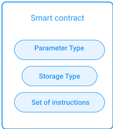
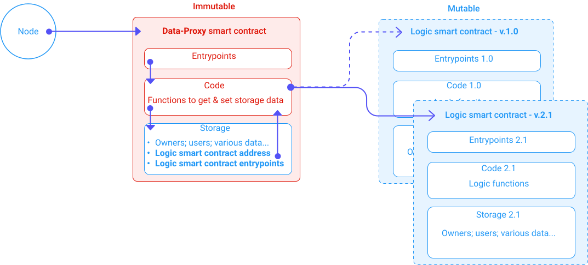

In this chapter, you will learn the basis of Tezos smart contracts. Their components and the workflow to record and use them on the Tezos *blockchain*.

## General definition of a Tezos smart contract
A smart contract is a code stored inside the *blockchain*. It executes a set of pre-defined instructions ([promises](/blockchain-basics/smart-contracts#definition-of-a-smart-contract)). Once deployed (stored), it becomes **immutable**. A smart contract is deployed using a **transaction**, so we embed the spending conditions inside it, which are thereafter **immutable**. Though for smart contracts, the key difference is a user *can trigger the execution of the code without modifying it. Therefore without moving it to another transaction or block*. It stays where it was stored **forever**. Tezos doesn't use an [UTXO model](https://en.wikipedia.org/wiki/Unspent_transaction_output) (no "*vaults*", see *Blockchain Basics*) but a **stateful accounts** one.

Like in Ethereum, Tezos uses 2 types of accounts:
1. Classic accounts with a primary address, to store tez (ꜩ) coins
2. Smart contract accounts with an address, storing code and tez (ꜩ) coins

Though in Tezos vocabulary, "*contracts*" refers to both types in general. Actually each *contract* has a "**_manager_**". Precisely, a classic account has an "**_owner_**". If a contract has the "*spendable*" property, the manager is the entity allowed to spend funds from it.

Smart contracts can achieve different kinds of operations with coins and *other smart contracts*. They're comparable to *automatic* **sealed** food and drink dispensers from the same company:  
Each machine has a contract saying "*Give me cryptocurrency, then I give you food or drink*". Each machine can have a different smart contract for various foods or drinks, and then there could be another smart contract gathering the cryptocurrency total for the company. Each machine doesn't operate until enough currency is delivered (*Gas*). Note that the **quantities** of foods or drinks changes while their **types** can't (ever).

Of course, smart contracts like the Tezos ones go beyond this metaphor. Thanks to *transparency* and *immutability*, they allow an **agreement** to be secured between two or more parties. In this context, the concept of "[Code is Law](https://en.wikipedia.org/wiki/Lawrence_Lessig#%22Code_is_law%22)" from [_Lawrence Lessig_](https://en.wikipedia.org/wiki/Lawrence_Lessig) is very appropriate.

For example, it is common to create financial instruments like various *tokens* (usually worth a fraction of the blockchain's *coin*) with different usability and characteristics inside a multiple smart contracts system. Other more or less complex projects can propose *lending*, *stablecoins*, or *crowdfundings*.

In most cases, smart contracts remove *intermediate* and drastically reduce costs compared to classic paper contracts and their validations.

Notice that like any other, a Tezos smart contract can only run and interact with the blockchain it's stored in (Bitcoin's smart contracts are exceptions here). It can't interact with the outside world. That's where *decentralized applications* or "_Dapps_" come in because they provide interfaces for the outside world.

To build your own Dapp, please refer to the [*Build a Dapp*](/dapp) module.

## Lifecycle of a Tezos smart contract
As we saw, a smart contract can only be deployed once but can be called many times. The Tezos smart contract lifecycle steps are two:

1. Deployment
2. Interactions through calls

### Deployment of a Tezos smart contract
The deployment of a Tezos smart contract is named "**origination**".

When a smart contract is deployed, an **address** and a corresponding *persistent space* called "**storage**" are allocated to this smart contract. The smart contract address is like its *identity* and *where* it lives on the ledger. Its storage is its *usable space* inside itself. The smart contract is inside the blockchain. The storage is inside the smart contract.

Once deployed, anyone or *anything* can call the smart contract (e.g. other contracts) with an *operation* (in Tezos vocabulary, *transactions* are a sub-type of *operations*; see more about them in the [*Operations*](/tezos-basics/operations) chapter) sent to its address with arguments. This call triggers the execution of the set of pre-defined instructions (promises).

The origination of a Tezos smart contract must define:
* A complex **Parameter Type** in the low-level *Michelson* language  
  List or tuple of each parameter type (see more below with high-level languages)
* **Storage Type**
* **Set of instructions** in the low-level *Michelson* language


<small className="figure">FIGURE 1: Content of a Tezos smart contract</small>

The CLI command "`tezos-client originate`" can be used to deploy a Tezos smart contract. Arguments are the following:
- Name of the smart contract
- Michelson script containing: 
    - Parameter Type
    - Storage Type
    - Set of instructions
- Initial storage value
- Amount of tez sent to the smart contract
- An optional address of a delegate

The command returns the newly deployed contract's address (more detail in the ["*CLI and RPC*"](/tezos-basics/cli-and-rpc) chapter).

### Code of a Tezos smart contract
The code of a smart contract is a sequence of Michelson instructions. Calls to the smart contract execute these instructions.

The execution of this sequence of instructions results in a modification of the *storage* content, or storage "**state**". The sequence defines how to modify this state. The instructions may also lead to other operations, including originations of other smart contracts, and of course, transactions.

You can find the full description of the Michelson language in the [Michelson module](/michelson).

### Storage of a Tezos smart contract
During the origination, the process must specify the storage **initial state** (and type).
If needed for operations, calling transactions' fees pays for the allocation of extra storage space.

For more details, check out the ["*Fees and Rewards*"](/tezos-basics/economics-and-rewards) chapter.

### Call of a Tezos smart contract
A smart contract can be called by a classic account whose address starts with "**tz1**" or by a smart contract's account whose address begins with "**KT1**". The operation or transaction specifies *arguments*, that are ordered types. In the below example, we increase or decrease a value in the storage:


<small className="figure">FIGURE 2: Call of a smart contract triggering its code and modifying its storage's state</small>

One can use the Command Line Interface (CLI) provided by Tezos to interact with a node and make calls. The "`tezos-client`" application allows anyone to deploy and call Tezos smart contracts.

The Remote Procedure Call (RPC) also provides ways to send requests to a Tezos node via HTTP (more details in ["*CLI and RPC*"](/tezos-basics/cli-and-rpc) chapter).

## High-level languages for Tezos smart contracts implementations
Michelson is a low-level stack-based language. Therefore its adoption is quite limited because most developers won't take time to learn it. Many Michelson *compilers* have been developed to avoid this friction and led to many high-level languages closer to developers habits: [*SmartPy*](/smartpy) (inspired by *Python*); [*LIGO*](/ligo) (inspired by *Camel* and *Pascal*); or [*Morley*](https://serokell.io/project-morley) (framework).

Depending on the high-level language used, a smart contract deployment also defines its *entrypoints* using the complex **Parameter Type**. These are special functions used to dispatch invocations of the smart contract. Each entrypoint is in charge of triggering an instruction. Below is the same example as before, abstracting the complex Parameter Type:


<small className="figure">FIGURE 3: Call of a smart contract triggering its entrypoints, code, and modifying its storage's state</small>

Each type and position of a parameter in the list (or tupple) allows you to define an entrypoint (a function). For instance, in our example, there are two parameters, hence two types. Both types are integers (to increase or decrease a value). Because the type is the same, its position (left, right, or index number) determines which entrypoint is correct.  
It could be:
- Left type: "Increment" entrypoint
- Right type: "Decrement" entrypoint

Below is another illustration of this process:


<small className="figure">FIGURE 4: Deployment and call of a Tezos smart contract with high-level languages.</small>

## Smart contracts versioning
You need to remember the code of a smart contract is **immutable**. Only evolve the storage size and state. Hence, to handle smart contracts [versioning](https://en.wikipedia.org/wiki/Software_versioning) (handle new developments and versions of the smart contracts), you should keep in mind **implementations structures** allowing transfer of information **from old contracts to new contracts**.

Hopefully, the above high-level languages make this kind of complex implementation easier. We will present to you two patterns to build evolutive smart contracts or *Dapps*.

### Lambda pattern
The Lambda pattern is based on *lambda functions*. These anonymous functions only have a mandatory *type* (function!); non-mandatory *parameters*; and non-mandatory *return values*. The idea is to exchange the **body** of a classic function with a **lambda function**. While the classic function is immutable, the lambda function is stored in the storage, therefore mutable.

Instead of simply sealing the classic function's body as an immutable structure, you make it a mutable *data* of the storage.  
In an **imaginary** high-level language syntax:

- *An entrypoint*

```d
Entrypoint_for_doSomething(p1, ... , pP) {
    doSomething(p1, ... , pP);
}
```
- *The corresponding immutable function*

```d
function doSomething(p1, ... , pP) return (v1, ... , vR) {
    storage.lambdaFunction();
}
```
- *The lambda function in the storage as a variable*

```d
lambdaFunction = function (p1, ... , pP) return (v1, ... , vR) {
    actual_instructions;
};
```

**Warnings**:  
>In this algorithmic example, almost all types are implicit, which limits syntax length. Furthermore, the syntax isn't as functional as in languages used for Tezos smart contracts (e.g. *LIGO*).

  
<small className="figure">FIGURE 5: <i>Lambda pattern</i> illustration.</small>

### Data-Proxy pattern

The idea of the "*Data-Proxy*" pattern is pretty simple: separate the logic from the data into different smart contracts. Instead of duplicating and transferring the data into a new smart contract, we only update the logic smart contract.

The first smart contract is the Data smart contract. It stores important data, including the address and entrypoints of the Logic smart contract. It also plays a proxy role as any request always goes through it first. It usually doesn't have a lot of functions. The mandatory functions set and retrieve its storage data (including new addresses for the new logic smart contracts).

When you need to update the logic (e.g. new features; corrections...) you only deploy a new logic smart contract and update the Data smart contract storage with the new address. See below fig. 6 for an update of the Logic smart contract from version 1.0 to 2.1.:

  
<small className="figure">FIGURE 6: <i>Data-Proxy</i> pattern illustration.</small>

Once the Data-Proxy architecture is in place, we can make the Data smart contract more dynamic with a Map structure and the Logic smart contract upgradable with a Lambda pattern.

#### Map structure
The idea is to make the Data smart contract storage more dynamic. We put key data inside a table or "data mapping". This mapping or "map" makes a classic "Key / Value" association between two data types. What's interesting here, like in an *array*, is that it's evolutive, even in the storage. Of course, the data types are fixed, but it is possible to add or remove pairs or change a *value* associated with the same *key*.

For example, in our Data smart contract, we can define a Map with versions' numbers as keys and logic smart contracts addresses as values:

  
<small className="figure">FIGURE 4: Map structure example.</small>

Note that even if a value or pair is deleted from a map, the blockchain ledger keeps the complete history of its state.  
In the versions' example, you can still see all versions' history (and addresses) using a block explorer.

The idea we described in this Data-Proxy pattern is actually a basic form of [modular programming](https://en.wikipedia.org/wiki/Modular_programming).

This pattern isn't limited to 2 smart contracts only. You can imagine various architectures combining various patterns. For instance, you can imagine a central Data smart contract and multiple upgradable other smart contracts revolving around it. This example implies a single point of failure in the Data smart contract, but there are other questions you should keep in mind, like access rights (to get and set data, to upgrade logic, etc.).

These patterns aren't magical and just allow more flexibility. You still need to think about the best architecture for your *dapp*. Patterns can still notably increase the deployment and *gaz* using fees.

## What have we learned so far?
In this chapter, we described the Tezos smart contract's main components and properties. We also described its lifecycle. We explained how to construct Tezos smart contracts using different patterns to make evolving *dapps* and handle efficient *versioning*.

In the next chapter, we will detail the Tezos consensus mechanism "*Liquid Proof-of-Stake*".